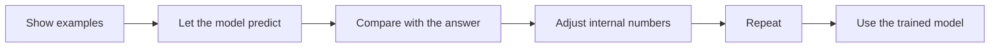

# Open LLM Engineering

**A prerequisite-free, source-backed, executable guide to how language models work—from the first next-word guess to training and production systems.**

[](https://coltmercer.github.io/open-llm-engineering/)
[](https://github.com/ColtMercer/open-llm-engineering/actions/workflows/quality.yml)
[](https://github.com/ColtMercer/open-llm-engineering/actions/workflows/docs.yml)
[](LICENSE)

Most explanations of LLMs either stay at the analogy level or begin halfway up the technical ladder. This book starts with ordinary language, defines every concept before relying on it, and eventually connects each idea to the data record, equation, tensor shape, training loop, source file, and production trade-off behind it.

New readers should begin with the [Introduction](docs/start-here.md), which states the course goal, learning outcomes, method, model and dataset coverage, labs, and boundaries before the first lesson.



## What makes this different

- **A real zero-to-expert sequence.** Concrete example first, plain-language idea second, technical name third, and mathematics or code only after the mechanism is clear.
- **Three depths without prerequisite jumps.** Start with intuition, then inspect the math, then follow the implementation.
- **Primary sources first.** Claims link to original papers, official dataset cards, model reports, and source repositories.
- **Executable concepts.** The `open_llm_lab` package contains small, tested programs for turning text into pieces, letting earlier text affect later predictions, training a model, and exploring an advanced routed design.
- **Honest boundaries.** “Open weights,” “open code,” “open data,” and reproducible training are kept distinct. Published facts are separated from inference and advice.
- **Systems, not magic.** After the foundations, the course reaches data governance, multi-computer training, fast generation, evaluation, safety, prompting, tools, and agents in one end-to-end map.

## Start here

1. Read the [Introduction](docs/start-here.md) to understand the goal, learning method, model coverage, dataset coverage, labs, and complete journey.
2. Begin [Lesson 0: Before the jargon](docs/01-foundations/00-before-the-jargon.md).
3. Follow the [canonical curriculum](docs/learning-paths.md#the-canonical-zero-to-expert-course).
4. Set up the [labs](docs/labs/setup.md) when the course first calls for one.
5. Use the [concept ladder](docs/reference/concept-ladder.md), [dataset atlas](docs/reference/datasets.md), and [source-code map](docs/reference/code-map.md) as references.

## Run the labs

```bash
python -m venv .venv
source .venv/bin/activate
python -m pip install -e '.[dev,docs]'
pytest
python labs/01_tokenizer.py
python labs/04_tiny_moe.py
mkdocs serve
```

With [uv](https://docs.astral.sh/uv/), the checked-in lock file can reproduce the resolved environment:

```bash
uv sync --extra dev --extra docs
uv run pytest
```

The labs intentionally use small collections of numbers and tiny text samples. They teach mechanics; they are not recipes for training a competitive model or a substitute for a data, security, or safety review.

## Repository map

```text
docs/                  the book and its diagrams
labs/                  runnable chapter companions
src/open_llm_lab/      compact reference implementations
tests/                 behavioral and shape-contract tests
research/              claim ledgers and primary-source trails
scripts/               documentation and repository checks
```

## Scope and source policy

This project explains public information. It does not claim access to undisclosed training corpora, private model internals, or hidden “expert personalities.” A link is not an endorsement, and a downloadable corpus is not automatically safe or lawful for every use. See the [research methodology](docs/about/methodology.md) and [data governance chapter](docs/03-data/04-governance-licensing.md).

Contributions that make a claim more precise, reproducible, or teachable are welcome. Read [CONTRIBUTING.md](CONTRIBUTING.md) before opening a pull request.
