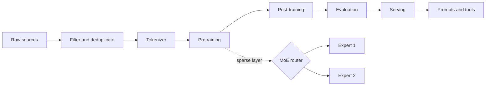

# Open LLM Engineering

**A source-backed, executable guide to how language models are built—from raw documents to routed experts to production inference.**

[](https://coltmercer.github.io/open-llm-engineering/)
[](https://github.com/ColtMercer/open-llm-engineering/actions/workflows/quality.yml)
[](https://github.com/ColtMercer/open-llm-engineering/actions/workflows/docs.yml)
[](LICENSE)


Most explanations of LLMs stop at a block diagram. This book connects each box to the data record, equation, tensor shape, training loop, distributed-system primitive, source file, and operational trade-off behind it.



## What makes this different

- **Three depths at once.** Start with intuition, then inspect the math, then follow the implementation.
- **Primary sources first.** Claims link to original papers, official dataset cards, model reports, and source repositories.
- **Executable concepts.** The `open_llm_lab` package contains a small tokenizer, causal attention, a decoder-only Transformer, and a sparse MoE layer with tests.
- **Honest boundaries.** “Open weights,” “open code,” “open data,” and reproducible training are kept distinct. Published facts are separated from inference and advice.
- **Systems, not magic.** Data governance, distributed training, load balancing, KV caches, batching, quantization, evaluation, safety, prompting, and agents live in one end-to-end map.

## Start here

1. Read the [Start Here](docs/start-here.md) page.
2. Pick a [learning path](docs/learning-paths.md).
3. Set up the [labs](docs/labs/setup.md).
4. Use the [dataset atlas](docs/reference/datasets.md) and [source-code map](docs/reference/code-map.md) while reading.

## Run the labs

```bash
python -m venv .venv
source .venv/bin/activate
python -m pip install -e '.[dev,docs]'
pytest
python labs/01_tokenizer.py
python labs/04_tiny_moe.py
mkdocs serve
```

With [uv](https://docs.astral.sh/uv/), the checked-in lock file can reproduce the resolved environment:

```bash
uv sync --extra dev --extra docs
uv run pytest
```

The labs intentionally use tiny tensors and text samples. They teach mechanics; they are not recipes for training a competitive model or a substitute for a data, security, or safety review.

## Repository map

```text
docs/                  the book and its diagrams
labs/                  runnable chapter companions
src/open_llm_lab/      compact reference implementations
tests/                 behavioral and shape-contract tests
research/              claim ledgers and primary-source trails
scripts/               documentation and repository checks
```

## Scope and source policy

This project explains public information. It does not claim access to undisclosed training corpora, private model internals, or hidden “expert personalities.” A link is not an endorsement, and a downloadable corpus is not automatically safe or lawful for every use. See the [research methodology](docs/about/methodology.md) and [data governance chapter](docs/03-data/04-governance-licensing.md).

Contributions that make a claim more precise, reproducible, or teachable are welcome. Read [CONTRIBUTING.md](CONTRIBUTING.md) before opening a pull request.
