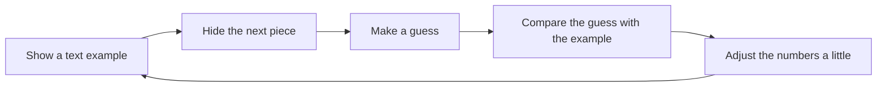

# Before the jargon: one next-word guessing game

**Level:** First step · **Time:** 20 minutes · **Prerequisite:** none

You do not need to know programming. You do not need advanced math. If you understand that 70% means “about 70 times out of 100,” you know enough to begin.

We will build every idea in this lesson from one small game:

> Read some text, cover the next word, and guess what the covered word is.

For example:

> The cat sat on the ___

You might guess **mat**. You might also guess **rug**, **chair**, or **floor**. More than one answer can make sense. The goal is not to read the writer's mind perfectly. The goal is to make a reasonable guess from the words already visible.

That simple game is the doorway into language models.

## 1. An example, then data

Start with a complete sentence:

> The cat sat on the mat.

We can turn it into a practice item by hiding its final word:

| Text shown | Word that was hidden |
|---|---|
| The cat sat on the | mat |

One practice item is an **example**. A collection of examples is **data**.

Here is a tiny collection:

| Text shown | Word that was hidden |
|---|---|
| The cat sat on the | mat |
| The dog slept on the | rug |
| The book rested on the | shelf |
| The cup stood on the | table |

In real projects, the collection can be enormous. The idea stays the same: it is made of individual examples.

The hidden word is the answer found in that particular example. It is not the only sentence anyone could have written. “The cat sat on the chair” is also valid English, even if **mat** was the word in our example.

## 2. A pattern

A **pattern** is something that appears repeatedly or predictably in the examples.

In our tiny collection, the words before the blank give clues:

- **cat** and **sat** make a place such as **mat** or **chair** seem reasonable;
- **book** and **rested** make **shelf** or **table** seem reasonable;
- a word such as **banana** is possible in a silly story, but it is less common in these situations.

A pattern is not necessarily a perfect rule. It is a tendency: some continuations fit the earlier words more often than others.

## 3. A model

A **model** is a mechanism that has learned patterns from examples and uses them to make guesses about new examples.

Imagine showing it our collection and then giving it a new sentence:

> The kitten sat on the ___

The model has never needed to see that exact sentence. It can use patterns from earlier examples to prefer words such as **mat**, **rug**, or **chair** over words that fit less often.

The model is not a list containing every finished sentence it will ever say. It is a reusable guessing mechanism.

## 4. Input and output

The **input** is what we give the model.

> The kitten sat on the

The **output** is what the model gives back.

> mat

The two words simply describe direction:

```text
input:  information goes into the model
output: information comes out of the model
```

## 5. A prediction

A **prediction** is the model's guess about what comes next.

If the model receives “The kitten sat on the” and chooses **mat**, then **mat** is its prediction.

“Prediction” does not mean the model knows the future. It means the model is choosing a likely continuation based on patterns it learned.

## 6. A score or chance

The model can consider several possible next words instead of treating one answer as certain. Imagine it reports:

| Possible next word | Imagined chance |
|---|---:|
| mat | 45% |
| rug | 30% |
| chair | 15% |
| banana | 10% |

These made-up percentages are only for explaining the idea. They total 100%, and they say how strongly the model prefers each option in this moment.

A **score** is a number that says how strongly an option is preferred. A **chance** puts that preference into an easier form, such as 45 out of 100. A high chance is still not a promise. Even the 10% option can sometimes be selected, and the writer's actual next word can be missing from our four-row illustration.

## 7. Adjustable numbers, called parameters

How does the model change what it prefers? Inside it are many adjustable numbers. These numbers influence its guesses.

Think of a simple sound system with knobs for bass, treble, and volume. Turning one knob changes what you hear. A model has adjustable numbers that act a little like a vast collection of tiny knobs. Changing them changes the scores it gives possible continuations.

An adjustable number inside a model is called a **parameter**.

The people building a model do not type a complete rule for every sentence. Instead, a learning process adjusts the parameters so the model becomes better at the guessing game across many examples.

## 8. Training

**Training** is the repeated process of showing examples, checking guesses, and adjusting the model's parameters so future guesses improve.

For our game, one round looks like this:

1. Show “The cat sat on the”.
2. Ask the model for its guess.
3. Reveal that the example continued with **mat**.
4. Check how far the model's preference was from that observed answer.
5. Adjust its parameters a little.

Then repeat with another example, and another, and another.



The adjustments are small because one example should not erase everything learned from earlier examples. Improvement comes from repeating the loop across a large and varied collection.

Training does not require every guess to become perfect. It aims to make good continuations receive stronger scores more often.

## 9. Using a trained model: inference

After training, we can give the model new text and ask it to continue. Using a trained model to produce an answer is called **inference**.

The difference is simple:

| Activity | What happens |
|---|---|
| Training | The model practices on examples and its adjustable numbers change. |
| Inference | The trained model receives new input and produces output. Its adjustable numbers normally stay as they are. |

When you type a message into a chat tool and receive a reply, you are usually seeing inference. Your message gives the trained model something new to respond to; that ordinary exchange does not normally retrain the model.

## 10. Text pieces, called tokens

Our game has said “next word” because words are familiar. Real language models usually work with smaller or differently sized **text pieces**.

A text piece used by a model is called a **token**.

A token might be:

- a whole short word;
- part of a longer word;
- punctuation such as `?` or `!`;
- a space joined with nearby letters.

For illustration, “unhelpful!” might be separated into pieces resembling:

```text
un | help | ful | !
```

That exact split is not universal. Different models can divide the same text differently.

So the more precise version of our game is:

> Read the tokens so far, score possible next tokens, choose one, add it to the text, and repeat.

Several chosen tokens can form a word. Several words can form a sentence. Repeating the simple next-piece game can therefore produce a long response.

## An everyday analogy—and where it stops helping

Imagine a student practicing with sentence cards. The front says “The cat sat on the ___,” and the back says “mat.” The student guesses, flips the card, notices the answer, and changes what they are likely to guess next time. After many cards, the student can handle a new sentence card.

This analogy is useful because it separates **practice** from **use** and shows how examples can shape future guesses.

It also has limits. A person brings a body, lived experience, intentions, and an understanding of the classroom. The model described here learns by adjusting numbers from examples. The card game also hides the huge number and variety of examples used for modern models. Treat the analogy as a first foothold, not a complete description of a mind or a machine.

## The whole lesson in one trace

Follow one sentence through the new vocabulary:

1. “The cat sat on the mat” is one **example**; many examples form **data**.
2. Repeated relationships in that data are **patterns**.
3. A **model** uses learned patterns to make guesses.
4. “The kitten sat on the” is the **input**; the returned continuation is the **output**.
5. A guessed continuation is a **prediction**.
6. A **score** or **chance** says how strongly the model prefers each possible continuation.
7. **Parameters** are the adjustable numbers that shape those scores.
8. **Training** uses examples to adjust the parameters.
9. **Inference** uses the trained model without normally changing those parameters.
10. The model works with text pieces called **tokens**, so “next word” is really “next token.”

## Knowledge check

Try answering without looking back.

1. In “The kitten sat on the” → “mat,” which part is the input and which part is the output?
2. What is the difference between one example and data?
3. Does a 70% chance mean the model is guaranteed to choose that option?
4. What changes during training that normally stays unchanged during inference?
5. Must every token be a complete word?
6. Why is “prediction” not the same as knowing the future?

### Answers

1. “The kitten sat on the” is the input. “mat” is the output.
2. One example is one practice item. Data is a collection of examples.
3. No. It means about 70 out of 100 in the imagined situation, not 100 out of 100.
4. The model's adjustable numbers, called parameters.
5. No. A token can be a whole word, part of a word, punctuation, or another text piece.
6. The model is ranking likely continuations from learned patterns; it does not have certain knowledge of what someone will write.

## You are ready for the next lesson when

- [ ] You can explain the guessing game in your own words.
- [ ] You can point to the input and output in one example.
- [ ] You know that a model can rank several reasonable continuations.
- [ ] You can distinguish training from using a trained model.
- [ ] You know that parameters are adjustable numbers, not stored sentences.
- [ ] You know that models usually process tokens rather than always processing whole words.
- [ ] You feel comfortable saying “I do not know the machinery yet, but I understand the job it is doing.”

Continue to [What a large language model is—and is not](01-what-is-an-llm.md). The next lesson gives more precise language for the same guessing process you now understand.
