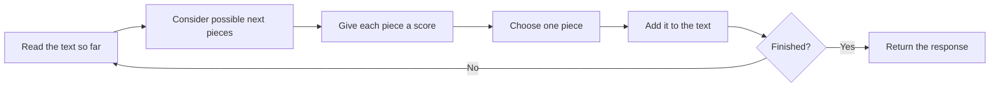

# What an LLM is—and is not

**Level:** First steps · **Time:** 30 minutes · **Prerequisite:** none

Imagine typing this on your phone:

> The cat sat on the …

Your phone might suggest **mat**, **floor**, or **bed**. It has seen enough writing to know that some continuations fit better than others.

Now imagine a much larger system that can do the same thing with stories, questions, computer code, summaries, and conversations. It chooses a small piece of text, adds that piece to what it has already seen, and chooses again. Repeating that simple cycle can produce a complete response.

That is the first useful mental model of a **large language model**, usually shortened to **LLM**.

## Begin with one job: continue the text

A **language model** is a system that learns patterns in language so it can judge which continuations fit the text seen so far.

The word **large** tells us that the system learned from a great deal of data and contains many adjustable numbers. Large does not have one official size threshold.

The model does not write a whole answer at once. A simplified generation loop looks like this:

A **score** is just a number the model uses to rank one possible continuation against another. A higher score means “this continuation fits better according to the patterns I learned.” Later, we will turn these scores into more precise mathematical quantities.

The “small pieces” are called **tokens**. A token can be a word, part of a word, punctuation, or another frequently occurring text fragment. A later section explains exactly how text becomes tokens. For now, “small piece of text” is enough.

### Watch one response grow

Suppose the text so far is:

> The capital of France is

The model may rank possible next pieces like this:

| Possible next piece | How well it fits |
|---|---|
| ` Paris` | very well |
| ` Lyon` | less well |
| ` green` | poorly |

If it chooses ` Paris`, the text becomes:

> The capital of France is Paris

The model runs the same process again. It might choose a period next, then a signal that says the response is complete.

This repeated use of earlier output is called **autoregressive generation**: each newly generated piece becomes part of the text used to choose the following piece. You do not need to memorize that label yet; remember the loop.

### Knowledge check

1. Does an LLM normally create an entire paragraph in one step?
2. In this chapter, what does a score tell us?

Check your answers

1. No. It repeatedly chooses and appends one small text piece.
2. It tells us how well one possible next piece fits compared with the alternatives.

## Where do the useful patterns come from?

Before the model can continue text well, it goes through **training**. Training means showing a system many examples and adjusting its internal numbers when its guesses could be better.

Those adjustable internal numbers are called **parameters**. You may also hear many of them called **weights**. One parameter by itself does not contain a sentence or a fact. Parameters work together across many calculation steps.

During training, the model encounters recurring forms such as:

- a question followed by an answer;
- a function description followed by computer code;
- evidence followed by a summary;
- a claim followed by supporting reasons;
- dialogue in which one message responds to another.

The model can later continue those forms in new situations. This is why “choose the next piece” can support much richer behavior than phone autocomplete.

Training can also cause a model to reproduce text it saw before, especially when that text appeared many times. **Memorization** means retaining a specific example closely. **Generalization** means using a learned pattern successfully on an example that was not in the training data. Real models do some of both.

The next chapter follows the training process from a guess to a small improvement.

### Knowledge check

Which statement is more accurate?

A. One parameter stores one fact.

B. Many parameters work together to represent patterns that can affect many different responses.

Check your answer

**B.** A parameter is one adjustable number inside a much larger calculation. Facts and capabilities are generally not stored as one readable entry in one location.

## A model is not a library search

It is tempting to picture a model looking through shelves of stored paragraphs. That picture is misleading.

A search system keeps documents and tries to retrieve matching ones. An LLM uses learned numerical patterns to construct a continuation. An application can combine both approaches: it can search for relevant documents, give those documents to an LLM, and ask the LLM to answer from them. In that combined system, searching and generating are still different jobs.

This distinction explains two important limitations:

- A fluent answer can be wrong. The model is choosing a continuation that fits learned patterns; it is not automatically checking a trusted source.
- Exact recall can be unreliable. Information represented through many interacting parameters is not the same as a stored record with a guaranteed lookup key.

When a model produces unsupported or invented information, people often call it a **hallucination**. The word is imperfect, but the practical lesson is simple: important claims need evidence outside the generated wording itself.

### Knowledge check

An application searches a company handbook, places two matching paragraphs beside the user's question, and asks an LLM to answer. Which part searched, and which part generated the answer?

Check your answer

The search component found the paragraphs. The LLM generated the answer using the question and supplied paragraphs.

## The same model can appear in different products

Three layers are often mixed together:

1. The **architecture** is the model's calculation blueprint: which kinds of operations exist and how they connect.
2. A **checkpoint** is a saved set of parameter values produced during training.
3. A **product** is the complete application a person uses. It may add instructions, search, tools, safety rules, conversation history, and a user interface around a checkpoint.

An everyday analogy helps:

| LLM term | Cookbook analogy |
|---|---|
| Architecture | The recipe and required steps |
| Checkpoint | One prepared batch made by following and refining the recipe |
| Product | The restaurant experience around the finished food |

Two checkpoints can use the same architecture but learn different patterns because they were trained differently. Two products can use the same checkpoint but behave differently because they supply different instructions or tools.

A **prompt** is the input that asks the model to do something. The **context** is all the text and other supported information available to the model for the current response. The prompt is part of the context; product instructions, earlier messages, and retrieved documents may also be part of it.

Ordinary prompting changes the context. It does not rewrite the checkpoint's saved parameters.

## Why the name “generative pre-trained Transformer”?

These three labels describe different parts of the story:

- **Generative** means the model can produce a new sequence rather than only assign an existing item to a category.
- **Pre-trained** means it first completes broad, general training before it is adapted for a more specific use such as conversation or coding assistance.
- **Transformer** is the name of the architecture family used by most modern LLMs.

A Transformer includes a mechanism called **attention**. Attention lets the calculation for one text piece use information from other relevant pieces in the available context. Later chapters build attention from a plain-language trace before introducing its mathematics.

The Transformer architecture was introduced in the primary paper [“Attention Is All You Need” by Vaswani and colleagues](https://arxiv.org/abs/1706.03762). The original system translated text using two major halves. Most modern text-generating LLMs use a later, generation-focused version of the architecture.

## What an LLM is not

- **Not a guaranteed source of truth.** A plausible continuation may still be false.
- **Not a person.** Human-like language does not prove human experience, intentions, or understanding.
- **Not a complete application.** Search, tools, memory, interfaces, and safety controls are separate system parts.
- **Not always repeatable.** A product may deliberately choose among several good continuations, so the same prompt can produce different wording.
- **Not reproducible from downloadable parameters alone.** Here, reproducible means that someone else can recreate the same result. Doing that may also require the training data, software, settings, and computing setup.

### Foundation checkpoint

Explain each answer in your own words:

1. What simple repeated action lets an LLM produce a long response?
2. Why is an LLM not the same thing as a search index?
3. How can two products built on the same checkpoint behave differently?
4. What changes when you revise a prompt: the saved parameters or the current context?

Suggested answers

1. It chooses a small next piece, appends it, and repeats.
2. A search index retrieves stored records; an LLM constructs a continuation from learned patterns.
3. Products can supply different instructions, context, search results, tools, and ways of choosing each next piece.
4. The current context changes. Ordinary prompting leaves the saved parameters unchanged.

---

## When you are ready: the precise prediction contract

Everything below restates the opening example in more formal language. You can continue to the next chapter without mastering it.

A computer represents each token with a **token ID**, a whole number that names one entry in the model's fixed token list. That full list is the **vocabulary**.

For every vocabulary entry, the model produces a **logit**. A logit is the raw score mentioned earlier; it can be positive or negative. A calculation called **softmax** converts all logits into **probabilities**. A probability is a number from 0 to 1, and the probabilities for all possible next tokens add up to 1.

Let:

- \(x_{1:t}\) mean the token IDs available through position \(t\);
- \(\theta\) mean all learned parameters;
- \(z_{t+1}\) mean the list of next-token logits;
- \(V\) mean the vocabulary.

Then the model's calculation can be written as:

\[
f_\theta(x_{1:t}) \rightarrow z_{t+1}
\]

For candidate token \(i\), softmax gives:

\[
p(x_{t+1}=i \mid x_{1:t})=
\frac{e^{z_i}}{\sum_{j=1}^{|V|}e^{z_j}}
\]

Here, \(p\) means probability and \(e\) is a mathematical constant used by softmax. The **denominator**, or bottom part of the fraction, adds the converted scores for every vocabulary entry. The result is the precise version of “rank possible next pieces.”

A **decoding rule** is the procedure that selects a token from these probabilities. Some rules always take the highest-probability token. Others allow controlled variation among plausible candidates. The rule changes which learned continuation is selected; it does not add new knowledge to the checkpoint.

## Continue in order

Next: [Learning from examples](02-learning-from-data.md) — see how a guess becomes a small parameter adjustment, without assuming calculus or programming knowledge.
