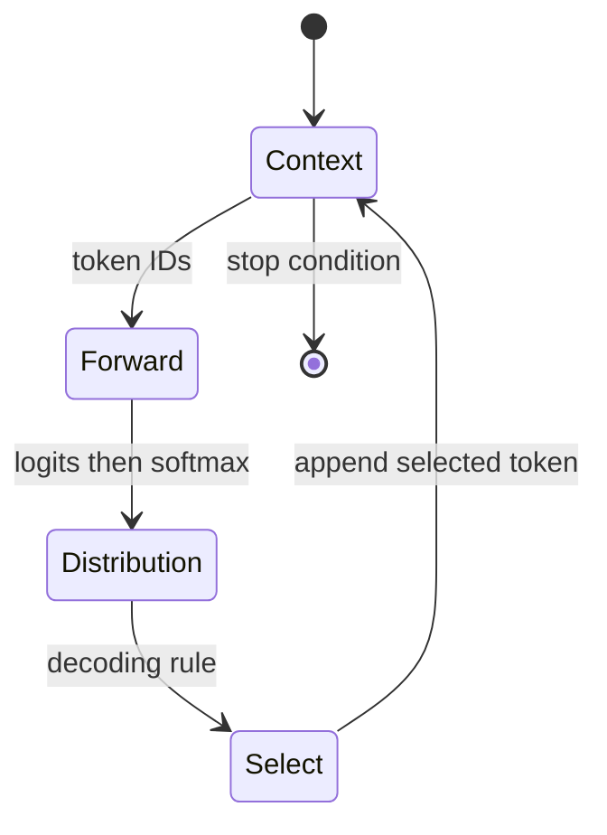
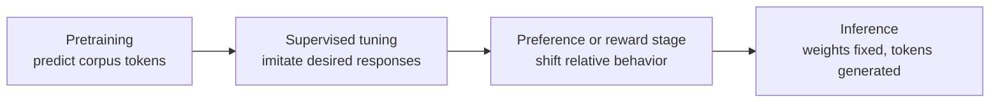

# What an LLM is—and is not

**Level:** Foundation · **Time:** 25 minutes · **Prerequisite:** none

An LLM is a parameterized function that maps a sequence of token IDs to scores for possible next tokens. The striking behaviors come from the structure of that function, the examples and feedback used to fit it, its scale, and the system around it—not from a database of prewritten answers.

## Start with the contract

For an autoregressive model:

\[
f_\theta(x_{1:t}) \rightarrow z_{t+1} \in \mathbb{R}^{|V|}
\]

- \(x_{1:t}\): token IDs seen so far;
- \(\theta\): learned parameters;
- \(z_{t+1}\): one **logit** per vocabulary item;
- \(|V|\): vocabulary size.

Softmax turns logits into a probability distribution:

\[
p(x_{t+1}=i \mid x_{1:t})=\frac{e^{z_i}}{\sum_{j=1}^{|V|}e^{z_j}}
\]

The model does not emit a sentence in one step. It predicts, selects, appends, and repeats.

## Model, checkpoint, and product

| Layer | Contains | Example question |
|---|---|---|
| Architecture | Operations and shapes | Is the FFN dense, gated, or MoE? |
| Checkpoint | Learned tensors | Which parameter values were fitted? |
| Inference runtime | Kernels, memory, scheduling | How are requests batched and cached? |
| Behavior layer | Templates, policies, tools, retrieval | Which instructions and evidence reach the model? |
| Product | Identity, state, UI, billing, monitoring | What happens around the model call? |

Two products can use the same checkpoint and behave differently. Two checkpoints can share an architecture and know different patterns. An inference implementation can be readable without revealing the training run.

## What is stored in the weights?

Training compresses statistical regularities into parameter values. A weight tensor is not a folder of facts. It participates in many computations, and a concept is usually distributed across many activations and parameters. Models can reproduce memorized strings, interpolate patterns, compose learned procedures, or fail inconsistently. “It memorized everything” and “it reasons like a person” are both inadequate universal explanations.

!!! note "Capability is conditional"
    A model's observed capability depends on the prompt, tokenizer, context, decoding settings, tools, available compute, and evaluation procedure. A benchmark score is a property of a tested system configuration, not an eternal property of a model name.

## Generative, pre-trained, Transformer

- **Generative:** produces sequences by modeling a probability distribution.
- **Pre-trained:** first learns broadly from a large corpus before task-specific adaptation.
- **Transformer:** uses attention and feed-forward sublayers connected by residual paths. The original architecture was introduced by [Vaswani et al.](https://arxiv.org/abs/1706.03762); most chat LLMs use a decoder-only descendant, not the original encoder-decoder layout.

“Large” has no permanent threshold. Parameter count is only one scale axis; training tokens, data quality, context length, activated parameters, and compute matter too.

## Three phases people conflate

Pretraining usually creates broad capability. Post-training makes the capability easier to elicit and shapes response behavior. Inference applies the result; ordinary prompting does not update the model's base weights.

## What an LLM is not

- **Not a search index.** It can be combined with retrieval, but next-token prediction is not document lookup.
- **Not deterministic by default.** Sampling and nondeterministic kernels can produce different outputs.
- **Not guaranteed to be calibrated.** Fluent probability mass is not the same as factual confidence.
- **Not inherently an agent.** An agent loop adds goals, tools, observations, state, and stop logic.
- **Not made transparent by open weights alone.** Reproducing the checkpoint may require unavailable data and run details.

## Checkpoint

Explain why each statement is wrong or incomplete:

1. “The model searches its weights for the paragraph.”
2. “The same weights mean the same product behavior.”
3. “An MoE model has one expert for math that I can call by name.”
4. “A lower temperature makes a model more knowledgeable.”

Answers: weights are distributed numerical parameters; products add different context and systems; hidden routers select learned FFN paths per token and generally expose no semantic expert API; temperature changes selection from the existing distribution, not the stored parameters.

## Go deeper

- [Text becomes tokens](../02-tokenization/01-text-becomes-tokens.md)
- [Transformer mental model](../04-transformer/01-transformer-mental-model.md)
- [Prompting and hidden experts](../05-moe/06-prompting-and-experts.md)

