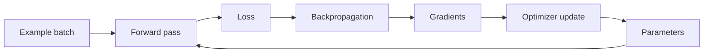

# Learning from examples

**Level:** Foundation → Builder · **Time:** 35 minutes

Training is a feedback loop. The model makes a differentiable prediction, a loss measures the mismatch, backpropagation assigns responsibility through the computation graph, and an optimizer changes parameters.

## A one-parameter learner

Imagine \(\hat y = wx\). For one example \(x=3\), \(y=12\), start with \(w=2\):

1. Predict: \(\hat y = 2\cdot3=6\).
2. Squared loss: \(L=(6-12)^2=36\).
3. Gradient: \(\frac{\partial L}{\partial w}=2(wx-y)x=2(6-12)3=-36\).
4. Update with learning rate \(0.01\): \(w \leftarrow 2-0.01(-36)=2.36\).

The negative gradient says increasing \(w\) would reduce loss locally. A neural network repeats this logic for millions or billions of interacting parameters and many examples at once.



## Language modeling creates many labels from one sequence

For tokens `[A, B, C, D]`:

```text
input:  [A, B, C]
target: [B, C, D]
```

The loss averages or sums the negative log-probability of each target:

\[
\mathcal{L}_{\text{NLL}}=-\frac{1}{T}\sum_{t=1}^{T}\log p_\theta(x_t\mid x_{<t})
\]

If the correct next token receives probability \(0.8\), its contribution is \(-\log 0.8\approx0.223\). At \(0.01\), it is \(4.605\). Confidently wrong predictions are expensive.

## Gradient descent is not database insertion

One update changes parameters that affect many contexts. Examples interfere, reinforce one another, and are revisited through batches. The optimizer sees gradients, not prose-level facts. This explains why training can:

- generalize a shared pattern to an unseen sequence;
- memorize rare or repeated strings;
- improve one behavior while degrading another;
- encode correlations that are hard to localize to a single parameter.

## Epochs, steps, batches, and tokens

| Term | Meaning |
|---|---|
| Sample | A training unit before packing, often a document or example |
| Sequence | Fixed or bounded token window consumed by the model |
| Microbatch | Sequences processed in one device forward/backward pass |
| Global batch | All tokens contributing to one optimizer step across devices and accumulation |
| Step | Usually one optimizer update; verify each codebase's convention |
| Epoch | One pass over a finite dataset; less intuitive for sampled mixtures |

If 64 devices each process 4 sequences of length 2,048 and gradients accumulate for 8 microsteps, one optimizer step covers:

\[
64\times4\times2{,}048\times8=4{,}194{,}304\text{ tokens}
\]

This derived number assumes every position contributes and no sequence padding is excluded.

## Validation is a separate question

Training loss asks, “How well do current parameters fit sampled training targets?” Validation loss asks the same objective on held-out data. Task evaluations ask different questions—coding tests, factuality, preference, safety, latency—and can move differently.

!!! warning "A benchmark is not the loss"
    A model can reduce next-token validation loss while a downstream benchmark plateaus. Conversely, a post-training stage can improve instruction-following scores while slightly changing general language-modeling loss.

## Minimal training pseudocode

```python
for token_batch in loader:
    inputs = token_batch[:, :-1]
    targets = token_batch[:, 1:]
    logits = model(inputs)
    loss = cross_entropy(logits.reshape(-1, vocab_size), targets.reshape(-1))
    loss.backward()
    clip_grad_norm_(model.parameters(), max_norm=1.0)
    optimizer.step()
    optimizer.zero_grad(set_to_none=True)
```

Real training adds distributed synchronization, mixed precision, loss scaling, schedules, checkpointing, fault recovery, logging, and data-state restoration.

## Exercises

1. Recompute the global tokens per step for 32 devices, microbatch 2, sequence length 4,096, and accumulation 4.
2. Why can a duplicated document have more influence than a unique document?
3. What information must a checkpoint include to resume exactly beyond model weights?

<details><summary>Answers</summary>

1. \(32\times2\times4096\times4=1{,}048{,}576\) tokens.
2. It can be sampled repeatedly and contribute repeated, correlated gradients.
3. At least optimizer and schedule state, step counters, random-number-generator state, data sampler/loader state, and distributed configuration—subject to implementation details.

</details>

