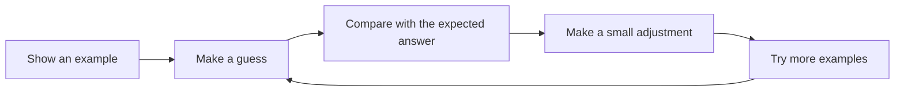
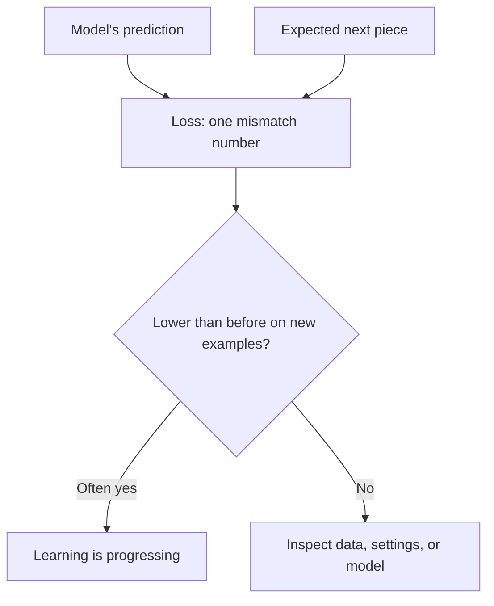
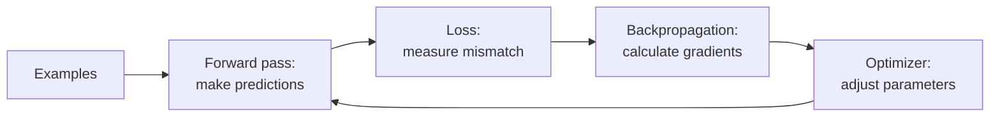
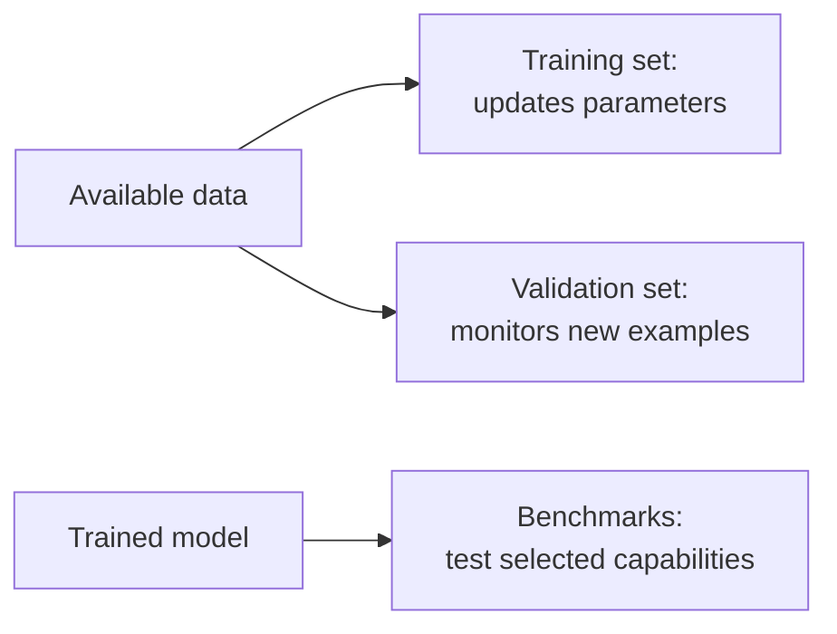
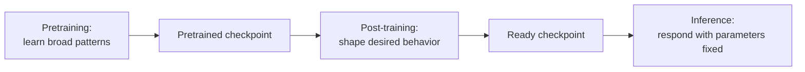

# Learning from examples

**Level:** First steps → Builder · **Time:** 40 minutes · **Prerequisite:** [What an LLM is—and is not](01-what-is-an-llm.md)

Imagine helping someone learn to finish familiar phrases.

You show:

> peanut butter and …

They guess:

> toast

You reveal the example's actual ending:

> jelly

The learner now has three useful pieces of information: what they saw, what they guessed, and what the example said should come next. If they adjust their future guesses a little, then repeat this process with many examples, they can improve.

An LLM learns through that same broad loop:



**Training** is this repeated process of making guesses, measuring how they could improve, and adjusting the model's parameters—the adjustable numbers introduced in the previous chapter. A **training example** is one piece of data used in that process.

## One sentence provides several practice questions

Consider this sentence:

> Birds can fly.

It can provide a sequence of small continuation exercises:

| Text shown to the model | Expected next piece |
|---|---|
| `Birds` | ` can` |
| `Birds can` | ` fly` |
| `Birds can fly` | `.` |

The expected next piece is called the **target**. A target is the answer supplied by the training example, not a claim that the answer is universally true in every context.

The model first makes a **prediction**, meaning its scored set of possible next pieces. The training system compares that prediction with the target.

Real models use smaller text pieces rather than the neat whole words shown here. A **token** is one of those small text pieces, represented by a whole number inside the computer. The next chapter shows why `Birds`, ` can`, and ` fly` may or may not each be one token. The whole-word version is only a teaching example.

This way of learning is often called **self-supervised learning**. “Self-supervised” means the original text supplies its own targets: hide the next piece from the model, then use the actual next piece as the answer. People do not need to write the correct answer beside every sentence.

### Knowledge check

For the text `Water freezes at zero degrees`, write one possible “text shown” and “expected next piece” pair.

<details markdown><summary>Check your answer</summary>

One valid pair is text shown: `Water freezes at zero`; expected next piece: ` degrees`. Exact token boundaries may differ, but the text-so-far and next-piece relationship is what matters.

</details>

## Turning “wrong” into a useful signal

Saying only “wrong” is not enough. The training system needs a number that tells it how poorly the prediction matched the target.

That number is called the **loss**. Lower loss means the model gave the expected target a better score. Higher loss means it gave the expected target a worse score.

Loss is a training measurement, not an emotion, and it is not a complete measure of usefulness. A model can become better at predicting typical text while still giving factually wrong, unsafe, or unhelpful answers in some situations.



Training software also needs to know which way to adjust each parameter. A **gradient** is a calculated direction: it tells us how a tiny change to a parameter would change the loss near the model's current state.

The model can contain billions of parameters connected through many calculation steps. **Backpropagation** is the efficient method used to work backward through those steps and calculate their gradients.

Finally, an **optimizer** is the update rule that uses gradients to change the parameters. It usually makes many small updates rather than one enormous correction.

A **forward pass** is the set of calculations from the input to the model's prediction. Nothing is updated during that pass. The update happens after backpropagation provides gradients to the optimizer.

The complete loop now has names:



This basic training method developed across many decades of research. Useful primary sources include the early learned language-model paper by [Bengio and colleagues](https://www.jmlr.org/papers/v3/bengio03a.html), the backpropagation paper by [Rumelhart, Hinton, and Williams](https://doi.org/10.1038/323533a0), and the widely used Adam optimizer by [Kingma and Ba](https://arxiv.org/abs/1412.6980).

### Knowledge check

Match each term to its job:

1. Loss
2. Backpropagation
3. Optimizer

A. Changes parameters using the calculated directions

B. Measures the mismatch with the target

C. Calculates how each parameter contributed to that mismatch

<details markdown><summary>Check your answer</summary>

1 → B, 2 → C, 3 → A.

</details>

## Why training is not saving facts as separate records

Suppose one example says:

> A robin is a bird.

The optimizer does not create a separate saved entry named `robin`. Its update changes shared parameters that also participate in many other predictions. Later examples may strengthen, weaken, or redirect some of the same patterns.

Because many predictions share the same parameters, one update can affect several behaviors:

- Similar examples can reinforce a general pattern.
- A rare sentence can be learned weakly or forgotten among many updates.
- A repeated sentence can have too much influence.
- Improving one kind of prediction can sometimes worsen another.
- A model can apply a pattern to a new example it never saw verbatim.

The collection of material used for training is a **dataset**. A dataset can contain web pages, books, code, academic papers, conversations, images described as data, and other permitted sources. Its mixture, quality, repetition, and omissions shape what the model can learn.

Training data can also carry errors and unfair associations. **Filtering** means selecting which material to keep or remove. Filtering helps, but it is itself a set of choices. A project that aims to be open about its process should document where its data came from, what was removed, what legal permissions apply, and which limitations remain.

### Knowledge check

Why might copying the same document into a dataset one hundred times change the model more than including it once?

<details markdown><summary>Check your answer</summary>

The repeated document can be presented to the model many more times, so its patterns can contribute to many more parameter updates.

</details>

## Practiced examples and new examples ask different questions

If you let a student practice with the exact questions on the final exam, a high score does not prove that the student learned a general skill. Measuring a model's performance—called **evaluation**—has the same problem.

The **training set** is the portion of data used to update parameters. A separate **validation set** contains examples used to monitor progress without updating parameters from those examples. Holding examples back helps answer, “Does the model also improve on material it did not practice directly?”

A **benchmark** is a defined test used to measure a particular capability, such as answering science questions or completing code. Benchmark results can be useful, but one score does not describe every capability. A result can also be misleading if benchmark examples accidentally appeared in the training set.

**Overfitting** occurs when a model improves on its training examples without improving as much on new examples. It is similar to memorizing practice answers without learning the underlying lesson.



### Knowledge check

Why should validation examples be kept out of parameter updates?

<details markdown><summary>Check your answer</summary>

They provide a cleaner test of whether learning transfers to examples the model did not practice directly.

</details>

## How large training jobs organize the work

The following terms describe organization, not new kinds of learning. Each one adds a single layer:

- A **sample** is one training item before it is combined with others. It might be a document, a conversation, or part of one.
- A **sequence** is the ordered run of tokens presented to the model for one calculation.
- A **batch** is a group of sequences processed together before an update. Grouping work makes computing hardware more efficient and combines evidence from several examples.
- A **step** usually means one optimizer update. Always check a project's documentation because some logs use the word differently.
- An **epoch** is one pass through a dataset that has a fixed ending. Very large training jobs often mix data or draw some examples again, so “one epoch” may be less useful than counting steps or processed tokens.

One update therefore summarizes evidence from many next-token targets, not only one word in one sentence.

## The three broad stages of model development

The word “training” can hide several stages:

1. **Pretraining** teaches broad language patterns by predicting pieces across a large, varied dataset.
2. **Post-training** continues from the pretrained checkpoint using more focused examples or feedback to shape behaviors such as following instructions. “Post” means after pretraining; it can contain several different methods.
3. **Inference** uses the finished checkpoint to respond. During ordinary inference, the saved parameters stay fixed.



Prompting happens during inference. It supplies new context, but it is not another optimizer step.

### Foundation checkpoint

Answer without using equations:

1. How can ordinary text provide its own training targets?
2. What is loss for?
3. How do backpropagation and an optimizer have different jobs?
4. Why is lower training loss not enough to prove that a model is useful in every way?
5. What stays fixed during ordinary inference?

<details markdown><summary>Suggested answers</summary>

1. Show the model the beginning of a text and use the actual next piece as the target.
2. Loss turns the prediction–target mismatch into a number training can reduce.
3. Backpropagation calculates parameter directions; the optimizer uses those directions to update parameters.
4. Training loss measures prediction on training targets, not every concern such as truthfulness, safety, reasoning, or performance on new tasks.
5. The checkpoint's saved parameter values.

</details>

---

## When you are ready: a one-parameter learner

This optional section makes “small adjustment” precise with one adjustable number. It assumes basic algebra, but not calculus.

Suppose a toy system predicts an output by multiplying an input by a learned **weight**. Here:

- \(x\) is the input;
- \(w\) is the adjustable weight;
- \(\hat y\), read “y-hat,” is the prediction;
- \(y\) is the target.

The rule is:

\[
\hat y = wx
\]

For one example, let \(x=3\), \(y=12\), and start with \(w=2\):

1. Prediction: \(\hat y=2\times3=6\).
2. The prediction is 6 below the target.
3. Increasing \(w\) would increase the prediction, so the update should move \(w\) upward.

One possible loss is **squared error**, which squares the difference between prediction and target:

\[
L=(\hat y-y)^2=(6-12)^2=36
\]

The gradient of this loss with respect to the weight is:

\[
\frac{\partial L}{\partial w}=2(wx-y)x=2(6-12)3=-36
\]

The symbol \(\frac{\partial L}{\partial w}\) means “how the loss changes when the weight changes slightly.” Its negative value says that increasing \(w\) will reduce the loss nearby.

A **learning rate** controls the size of an optimizer update. With learning rate \(0.01\):

\[
w \leftarrow 2-0.01(-36)=2.36
\]

The arrow means “replace the old value with the new value.” A **neural network** is a model built from connected layers of adjustable numerical operations. A real neural network performs this style of calculation for many interacting parameters and examples.

## When you are ready: next-token loss

For model training, the common loss rewards a higher probability for the target token.

Here a **probability** is a number from 0 to 1 that represents how strongly the model favors one possible next token. A **logarithm** is a mathematical operation used here to spread out very small probability values. **Likelihood** here means the probability that the model assigned to the target. **Negative log-likelihood**, shortened to **NLL**, applies the logarithm to that probability and reverses its sign so that better target predictions produce lower loss.

Let:

- \(T\) be the number of target positions;
- \(x_t\) be the target token at position \(t\);
- \(x_{<t}\) be all earlier tokens;
- \(p_\theta(x_t\mid x_{<t})\) be the probability the model assigns to the target, using parameters \(\theta\).

The average NLL is:

\[
\mathcal{L}_{\text{NLL}}=-\frac{1}{T}\sum_{t=1}^{T}\log p_\theta(x_t\mid x_{<t})
\]

This form makes a confident wrong prediction much more costly than a mildly uncertain one. If the model gives the target probability \(0.8\), that position contributes about \(0.223\). If it gives the target probability \(0.01\), the contribution is about \(4.605\).

## When you are ready: minimal training code

**Cross-entropy** is the software's usual implementation of the next-token loss described above. The following optional code outline compresses the named loop into Python-like operations:

```python
for token_batch in loader:
    inputs = token_batch[:, :-1]       # every token except the last
    targets = token_batch[:, 1:]       # every token except the first
    scores = model(inputs)             # forward pass
    loss = cross_entropy(scores, targets)
    loss.backward()                    # backpropagation
    optimizer.step()                   # update parameters
    optimizer.zero_grad()              # prepare for the next step
```

Real training code also coordinates many computing chips, chooses how precisely numbers are stored, changes the learning rate over time, saves checkpoints, recovers from failures, records progress, and remembers the exact position in the dataset.

## Continue in order

Next: [Text becomes tokens](../02-tokenization/01-text-becomes-tokens.md) — inspect the pieces the model actually receives, why word boundaries are not enough, and how token choices affect training and inference.
