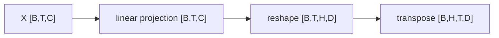

# Math with shapes

**Level:** Foundation → Engineer · **Time:** 45 minutes

You can understand most Transformer math by treating equations as typed programs. Track four things: the object, its indices, its shape, and the axis an operation changes.

## The shape alphabet

| Symbol | Meaning | Typical example |
|---|---|---:|
| \(B\) | batch size | 8 sequences |
| \(T\) | sequence length | 2,048 tokens |
| \(C\) or \(d_{model}\) | residual width | 4,096 features |
| \(H\) | attention heads | 32 heads |
| \(D\) | features per head, usually \(C/H\) | 128 |
| \(V\) | vocabulary size | 50,000–250,000 |
| \(E\) | number of experts | 8, 64, 256... |
| \(K\) | experts selected per token | 1, 2, 4... |

An activation \(X\in\mathbb{R}^{B\times T\times C}\) means every token position in every sequence has a vector of \(C\) numbers.

## Matrix multiplication as feature conversion

If \(X\) is `[B,T,C]` and \(W_Q\) is `[C,C]`, then:

\[
Q=XW_Q
\]

has shape `[B,T,C]`. Matrix multiplication contracts the matching `C` axis and creates the output axis from the second dimension of \(W_Q\).

```text
[B, T, C] @ [C, C_out] -> [B, T, C_out]
```

The batch and time dimensions behave like independent rows.

## Reshaping into heads

Attention usually reshapes `[B,T,C]` to `[B,H,T,D]`, where \(C=H\cdot D\). No values change during a valid reshape; only the indexing view changes. A transpose moves the head axis before time so each head's `[T,D]` matrix can attend independently.



## Broadcasting

Broadcasting virtually repeats dimensions of size 1. Adding a bias `[C]` to `[B,T,C]` applies the same bias to every token. A causal mask `[T,T]` can be applied to attention scores `[B,H,T,T]` across all batches and heads.

Danger: code can broadcast successfully while expressing the wrong intent. Comment the expected shapes at important operations.

## Softmax chooses an axis

For a vector \(z\):

\[
\operatorname{softmax}(z_i)=\frac{e^{z_i-m}}{\sum_j e^{z_j-m}},\qquad m=\max_j z_j
\]

Subtracting \(m\) improves numerical stability and does not change the normalized result. The axis matters:

- attention softmax over **key positions** makes each query distribute weight across allowed keys;
- vocabulary softmax over **vocabulary entries** makes a next-token distribution;
- router softmax over **experts** creates routing scores for each token.

## Dot products measure aligned features

For two vectors of length \(D\):

\[
q\cdot k=\sum_{i=1}^{D}q_i k_i
\]

Attention computes every query/key dot product. With `[B,H,T,D]` queries and keys:

```text
Q @ K.transpose(-2, -1) -> [B,H,T,T]
```

The \(\sqrt D\) scale in [scaled dot-product attention](https://arxiv.org/abs/1706.03762) prevents dot-product magnitude from growing with head width under common initialization assumptions.

## Gradients are shape-matched responsibility signals

If parameter \(W\) has shape `[C,4C]`, its gradient has the same shape. Each element estimates the local rate at which the scalar loss changes with that element. Backpropagation applies the chain rule through every differentiable operation that led to the loss.

## Memory arithmetic

A tensor's raw bytes are:

\[
\text{elements}\times\text{bytes per element}
\]

An activation `[8,2048,4096]` in bfloat16 uses:

\[
8\times2048\times4096\times2=134{,}217{,}728\text{ bytes}\approx128\text{ MiB}
\]

That is one tensor, not total training memory. Gradients, optimizer states, saved activations, temporary buffers, fragmentation, and communication workspaces add substantial cost.

## Shape debugging checklist

1. Write the intended semantic axes.
2. Print or assert shapes immediately before the failing operation.
3. Identify which axes contract, normalize, broadcast, or reorder.
4. Check contiguity assumptions after transposes.
5. Test with unequal small dimensions so accidental swaps are visible.
6. Verify the mask's polarity and dtype; “true means keep” and “true means block” both exist across APIs.

## Exercises

1. If \(C=768\) and \(H=12\), what is \(D\)?
2. What is the score shape for \(Q,K\in\mathbb{R}^{2\times8\times128\times64}\)?
3. A router sees `[B,T,C]` and has weight `[C,E]`. What is the logit shape?
4. Why is a test with `B=T=4` poor at catching swapped batch/time axes?

Answers: 64; `[2,8,128,128]`; `[B,T,E]`; equal dimensions hide the swap.

