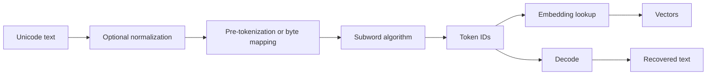

# Text becomes tokens

**Level:** Foundation · **Time:** 30 minutes

A Transformer does not receive characters or words. It receives integers from a fixed vocabulary. Tokenization is the reversible protocol between external text and that integer sequence.

## The contract



For a tokenizer \(\tau\):

\[
\tau(\text{text})=[x_1,\ldots,x_T],\qquad x_t\in\{0,\ldots,|V|-1\}
\]

A decoder maps the IDs back to text. “Reversible” requires care around normalization, invalid byte sequences, special tokens, and APIs that clean spaces during decoding.

## Why not one token per word?

A word vocabulary has an unbounded out-of-vocabulary problem, treats related forms separately, and handles writing systems and code poorly. One token per character or byte is robust but makes sequences longer. Subword tokenizers learn reusable chunks that balance vocabulary size and sequence length.

Example only—actual output depends on the tokenizer:

```text
"unbelievable" -> ["un", "believ", "able"]
"tokenization" -> ["token", "ization"]
```

Do not infer semantic understanding from pleasing token boundaries. Merge algorithms optimize corpus statistics or likelihood objectives, not a linguistic ontology.

## Tokens are not characters

The same visible idea can use very different token counts due to:

- language and script representation in the training corpus;
- whitespace and punctuation conventions;
- Unicode normalization and combining marks;
- domain strings such as code, DNA, or identifiers;
- vocabulary size and training mixture;
- byte fallback behavior.

This affects context capacity, latency, cost, and representation equity. A context window measured in tokens does not hold a fixed number of words across languages or domains.

## Embedding lookup

Given embedding table \(W_E\in\mathbb{R}^{V\times C}\), each integer selects a row:

\[
X_{b,t,:}=W_E[x_{b,t}]
\]

For token IDs `[B,T]`, the output is `[B,T,C]`. The rows are learned during model training. The tokenizer's mapping is normally fixed before pretraining because changing IDs would change which rows every training example addresses.

## Special tokens are control-plane data

Common roles include:

- beginning or end of sequence;
- padding;
- conversation role boundaries;
- document separators;
- tool call delimiters;
- fill-in-the-middle markers.

The string, ID, chat template, and training usage must agree. Adding a token to the tokenizer without resizing and training the corresponding embedding does not grant the model a new reliable capability.

!!! danger "Prompt text and special-token IDs are not interchangeable"
    Typing a string that looks like `<|assistant|>` may tokenize differently from inserting the registered special token. Conversely, allowing untrusted text to create control tokens can change message boundaries.

## Chat templates come before model tokens

An API conversation may look structured:

```json
{"role": "user", "content": "Explain rainbows."}
```

The model usually sees a serialized template containing role markers and separators. Different templates with identical visible messages can produce different token sequences and behavior. Inspect the model's official tokenizer configuration or chat template rather than guessing.

## Worked comparison protocol

To compare tokenizers fairly:

1. freeze exact tokenizer versions;
2. choose a balanced, disclosed sample by language and domain;
3. count encoded tokens and original Unicode code points or UTF-8 bytes;
4. test round trips and special-token handling;
5. report distributions, not one clever sentence;
6. avoid claiming a shorter encoding is universally better—vocabulary and model learning trade off.

## Checkpoint

Why can you not safely replace a trained model's tokenizer with one that produces fewer tokens? Because the checkpoint learned an embedding/output association for the original IDs and segmentation. A new mapping changes the input language of the numerical function.

## Primary trails

- [SentencePiece paper](https://arxiv.org/abs/1808.06226) and [official repository](https://github.com/google/sentencepiece)
- [OpenAI GPT-2 byte-level BPE encoder](https://github.com/openai/gpt-2/blob/master/src/encoder.py)
- [Hugging Face Tokenizers documentation](https://huggingface.co/docs/tokenizers/index)

