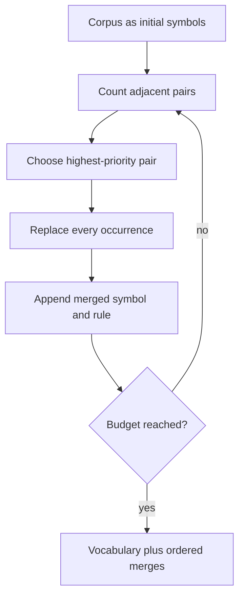

# Byte-pair encoding by hand

**Level:** Builder · **Time:** 40 minutes

Byte-pair encoding (BPE) builds a vocabulary by repeatedly merging frequent adjacent symbols. The neural-machine-translation adaptation by [Sennrich, Haddow, and Birch](https://arxiv.org/abs/1508.07909) made subword segmentation a practical open-vocabulary method. Modern tokenizers add important preprocessing and byte-level variants, but the merge loop remains teachable.

## A tiny corpus

Use words with counts and an end marker `·`:

```text
low·       x 5
lower·     x 2
newest·    x 6
widest·    x 3
```

Start as characters:

```text
l o w ·
l o w e r ·
n e w e s t ·
w i d e s t ·
```

Count adjacent pairs weighted by word frequency. One possible first high-frequency pair is `e s`, occurring in `newest` six times and `widest` three times. Merge it everywhere:

```text
n e w es t ·
w i d es t ·
```

Recount, choose another maximum, append that merge rule, and repeat until reaching the merge budget or vocabulary target.



## Encoding a new string

Encoding must apply learned merge priorities consistently. A simple implementation can begin with base symbols and repeatedly apply the highest-ranked merge present. Efficient libraries use specialized data structures, but the result must match the learned rule order and preprocessing contract.

The companion `BytePairTokenizer` learns merges over UTF-8 byte IDs. This guarantees a base representation for any text expressible as bytes and makes decoding exact for valid input.

```python
from open_llm_lab.tokenizer import BytePairTokenizer

tokenizer = BytePairTokenizer.train(["low lower newest widest"], vocab_size=280)
ids = tokenizer.encode("lower")
assert tokenizer.decode(ids) == "lower"
```

## Why byte-level BPE?

Unicode contains many code points, normalization forms, and unseen strings. Starting from 256 byte values gives a fixed base alphabet. GPT-2's released [`encoder.py`](https://github.com/openai/gpt-2/blob/master/src/encoder.py) uses a reversible mapping from bytes to visible Unicode symbols before applying BPE; other implementations can operate on integers directly.

Byte-level robustness does not mean equal efficiency. Rare scripts may be represented by multiple byte tokens until useful merges are learned.

## Ties and determinism

Two pairs can have the same count. A training implementation needs a deterministic tie rule or recorded randomness. Corpus order, normalization, pre-tokenization, minimum frequency, and merge budget all influence the result.

The teaching implementation sorts tied pairs lexicographically. A production tokenizer may use another stable convention. Models and tokenizer artifacts should ship together; “BPE with vocabulary size 50k” is not enough to reproduce the vocabulary.

## BPE versus Unigram

| Property | BPE | Unigram language model |
|---|---|---|
| Construction | Add frequent pair merges | Start large, remove pieces that least hurt likelihood |
| Encoding | Apply merge priority | Find likely segmentation, often with dynamic programming |
| Subword regularization | Not inherent | Natural probabilistic segmentations |
| Implemented by SentencePiece | Yes | Yes |

[SentencePiece](https://github.com/google/sentencepiece) is a tokenizer toolkit supporting both; it is not synonymous with one algorithm.

## Failure modes to inspect

- training data overrepresents one language or domain;
- normalization erases distinctions the application needs;
- identifiers or numbers fragment into long sequences;
- reserved tokens collide with ordinary input;
- decoder cleanup breaks exact byte round trips;
- a serialized merge list and vocabulary disagree;
- evaluation corpus leaked into tokenizer training—usually a smaller issue than weight training contamination, but still part of provenance.

## Exercises

1. Compute weighted pair counts for the tiny corpus before the first merge.
2. Construct two tied pairs and define a deterministic tie rule.
3. Explain why learning a token for a frequent whole URL can shorten sequences but increase memorization and brittleness risks.
4. Run `python labs/01_tokenizer.py --text 'naïve 🌧️ network'` and inspect bytes, IDs, and pieces.

