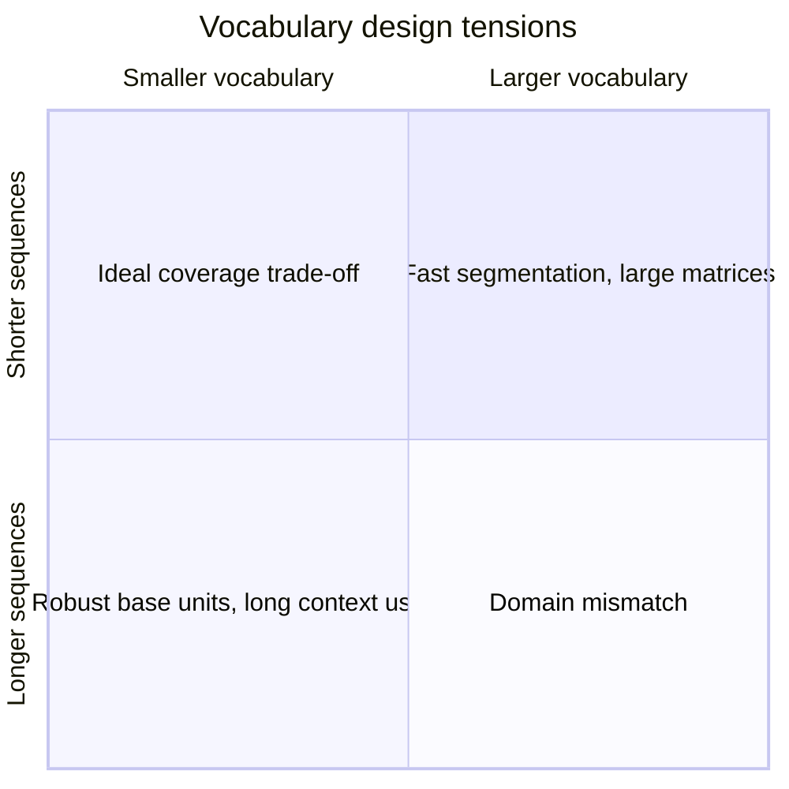

# Vocabulary trade-offs

**Level:** Engineer · **Time:** 30 minutes

Vocabulary design moves cost between sequence length, embedding/output matrices, data coverage, and the difficulty of learning useful representations.

## The competing costs

Increasing vocabulary size can shorten sequences because more spans become single tokens. It also enlarges:

- the input embedding table \(V\times C\);
- the output projection or language-model head, unless weights are tied;
- the final vocabulary logits and softmax work;
- tokenizer artifact and sampling complexity.

If \(V=100{,}000\), \(C=4{,}096\), and embeddings are stored in bfloat16, one untied embedding matrix alone contains 409.6 million parameters and about 781 MiB of raw values. The calculation excludes optimizer states and sharding.

## Sequence length changes more than memory

For ordinary full attention, score work grows roughly with \(T^2\) while many projections grow with \(T\). Halving token count for the same text can substantially change attention work. But a larger vocabulary does not guarantee that reduction across all languages and domains.

## Coverage is a distribution question

A tokenizer trained mostly on English web text can encode another language losslessly through bytes while consuming many more tokens. That reduces effective context and increases inference steps for speakers of the underrepresented language. Measure:

\[
\text{fertility}=\frac{\text{tokens}}{\text{words, characters, or bytes}}
\]

State the denominator and language segmentation method. “Tokens per word” is difficult to compare across scripts without a disclosed word-boundary procedure; tokens per UTF-8 byte is mechanical but less intuitive.

## Numbers, code, and structured text

Token boundaries affect what patterns are easy to learn:

- splitting every digit can help algorithmic reuse but lengthen numbers;
- whole-number chunks are compact but create irregular arithmetic units;
- whitespace-sensitive code tokens preserve formatting patterns;
- domain vocabularies shorten common identifiers but may waste capacity elsewhere.

Tokenizer behavior alone does not determine capability. Training examples, model size, architecture, and objectives interact with it.

## Weight tying

The input embedding maps token IDs to residual vectors. The output projection maps residual vectors to vocabulary logits. Some models reuse the same matrix transpose:

\[
\text{logits}=XW_E^\top
\]

This reduces parameters and couples input/output representations. Whether a specific model ties weights is a configuration fact; inspect its official config and implementation.

## Extending a vocabulary after pretraining

Adding tokens requires at least:

1. changing tokenizer artifacts without reassigning existing IDs;
2. resizing embeddings and output head;
3. initializing new rows;
4. training enough examples for the rows and surrounding network to learn them;
5. retesting old behavior, serialization, templates, and deployment runtimes.

It can be useful for a domain adaptation, but it is not a free compression patch.

## Decision worksheet

For a new tokenizer, report:

| Decision | Evidence |
|---|---|
| Training sample | languages, domains, dates, sampling weights |
| Normalization | exact Unicode and whitespace policy |
| Base alphabet | bytes, characters, or required characters |
| Algorithm | BPE, Unigram, WordPiece, other |
| Vocabulary | total, reserved, byte fallback, unused slots |
| Tests | round-trip, fertility, adversarial Unicode, control tokens |
| Model coupling | embedding size, weight tying, chat template |

## Exercises

1. Derive embedding parameter count for \(V=64{,}000,C=2{,}048\), tied and untied.
2. Design a balanced fertility benchmark for English, Spanish, Hindi, Arabic, Mandarin, Python, and JSON.
3. Explain why fitting the tokenizer on “all available data” can create governance and reproducibility problems even before model training.

