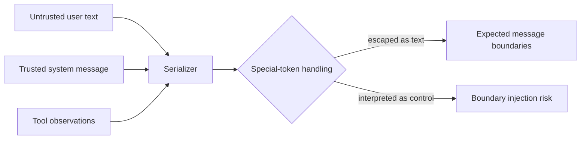

# Tokenizer engineering

**Level:** Engineer · **Time:** 40 minutes

A production tokenizer is a versioned protocol. Treat its files and templates with the same discipline as a database schema or network wire format.

## Artifact bundle

A release may need:

- normalization configuration;
- pre-tokenizer rules;
- base vocabulary and token-to-ID mapping;
- ordered BPE merges or Unigram scores;
- special-token mapping;
- post-processing rules;
- chat template;
- maximum-length defaults and truncation side;
- decoder configuration;
- provenance, license, checksum, and compatibility version.

File names vary by ecosystem. The semantic bundle matters more than one conventional filename.

## Round-trip and invariance tests

```python
cases = [
    "plain ASCII",
    "naïve café",
    "مرحبا بالعالم",
    "नमस्ते दुनिया",
    "👩🏽‍💻\n\t",
    "x = {'key': [1, 2, 3]}",
]
for text in cases:
    assert decode(encode(text)) == text
```

If normalization is intentionally lossy, test the documented normalized result instead. Add cases for null bytes if supported, invalid UTF-8 handling at the API boundary, very long repeated strings, control-like strings, and every registered special token.

## Control-token threat model



Define which caller is allowed to insert special IDs. A safe message serializer distinguishes data from control structure and tests adversarial strings. Tokenizer configuration is part of the security boundary, not merely preprocessing.

## Truncation is a product policy

When input exceeds context capacity, libraries may drop tokens on the left or right, reject the request, or truncate individual fields. Each choice can remove a system instruction, user question, citation, or tool schema. The application should allocate a budget intentionally:

```text
system + conversation + retrieved evidence + tools + output reserve <= context window
```

The maximum generated output also consumes positions. A model's advertised context limit does not mean every server configuration accepts or efficiently handles that length.

## Streaming decode

Byte-level tokens can end mid-character. A streaming client should accumulate enough bytes to form valid text rather than displaying replacement characters. It should also separate visible text from structured tool-call payloads and stop sequences.

## Tokenizer/data co-design

Train candidate tokenizers on a documented sample of the intended mixture, then evaluate on held-out slices. Useful measurements include:

- token count distribution by source and language;
- maximum and tail fertility;
- fraction represented by byte fallback or unknown tokens;
- compression on code, math, and structured formats;
- stability under whitespace and Unicode variations;
- throughput and memory;
- effect on small controlled model training, not just compression.

The best compression candidate may not train the best model. Make tokenizer selection an experiment with a model-level proxy when budget permits.

## Releasing a tokenizer

Publish the full bundle, a checksum, training code or exact command, corpus sampling description, vocabulary analysis, test vectors, and the model compatibility matrix. Never silently alter a tokenizer behind an existing model identifier.

## Source-code trail

- [SentencePiece source](https://github.com/google/sentencepiece)
- [Hugging Face Tokenizers source](https://github.com/huggingface/tokenizers)
- [Hugging Face Transformers chat templating docs](https://huggingface.co/docs/transformers/chat_templating)
- [OpenAI GPT-2 encoder](https://github.com/openai/gpt-2/blob/master/src/encoder.py)

## Exercises

1. Write a test showing that plain text resembling a special token remains data.
2. Specify a truncation policy for a RAG application with citations and tool schemas.
3. Explain why a tokenizer checksum belongs in a model evaluation report.

