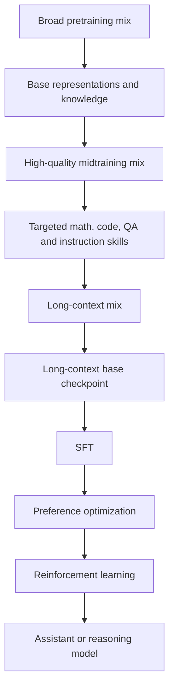

# Data Is the Model—Almost

> **Level:** beginner → advanced  
> **Goal:** understand how documents become learned behavior, why corpus composition matters as much as architecture, and what “reproducible” really requires.

The title is deliberately provocative. An LLM is not a database compressed into neural-network weights, and its training data is not the only thing that determines behavior. Architecture, tokenizer, objective, optimizer, schedule, randomness, numerical precision, post-training and inference settings all matter. But pretraining data defines the experience from which the model learns its statistical world. Change that experience, and the same code can produce a meaningfully different model.

## 1. The beginner picture: learning by prediction

A causal language model repeatedly receives tokens and predicts the next one:

```text
Input:  The capital of France is
Target: Paris
```

The trainer does not attach a fact named `capital_of_france` to a database row. It computes a probability distribution over the vocabulary, measures how much probability the model assigned to the observed next token, and adjusts millions or billions of numeric parameters to make that token more likely in similar contexts.

For tokens (x_1, x_2, \ldots, x_T), the usual objective minimizes negative log-likelihood:

\[
\mathcal{L}(\theta) = -\sum_{t=1}^{T}\log p_\theta(x_t \mid x_{<t})
\]

Read it in plain English:

1. Show the model all tokens before position (t).
2. Ask for a probability for the real token at (t).
3. Penalize low probability.
4. Nudge parameters (\theta) in the direction that reduces the penalty.
5. Repeat across an enormous sequence of training examples.


The loop explains why data problems become model problems. If duplicated boilerplate appears ten thousand times, it receives ten thousand opportunities to move the weights. If one language has almost no tokens, its patterns receive correspondingly few updates. If benchmark answers leak into training, evaluation no longer measures clean generalization.

## 2. Documents, tokens and examples are different units

A frequent source of confusion is treating every published size as directly comparable.

| Unit | What it measures | Why it can mislead |
|---|---|---|
| Compressed bytes | Storage after compression | Compression ratios vary by language, format and repetition. |
| Uncompressed bytes | Serialized text and metadata | Schemas and whitespace differ. |
| Documents | The pipeline’s chosen record boundary | One “document” may be a sentence, web page, book or repository. |
| Tokens | Units emitted by a tokenizer | The same text produces different counts with different tokenizers. |
| Training tokens | Tokens actually sampled during a run | Upsampling can show the model the same corpus more than once. |
| Unique tokens | Usually a project-specific estimate | “Unique” can mean deduplicated documents, substrings or token sequences. |

For that reason, this book never silently compares a GPT-2-tokenizer count with an OLMo-tokenizer count. The maintained [FineWeb card](https://huggingface.co/datasets/HuggingFaceFW/fineweb), for example, explicitly reports counts using the GPT-2 tokenizer, while [Dolma’s card](https://huggingface.co/datasets/allenai/dolma) reports OLMo-tokenizer statistics for its mixes.

### Tokenization changes what the model can learn efficiently

Suppose a tokenizer represents a common word as one token in language A but six byte-like pieces in language B. A fixed token budget then carries fewer words, sentences and semantic events from language B. Tokenizer fertility—roughly, tokens per word or character—is therefore part of data allocation, not merely an implementation detail.

## 3. What corpus choices teach

The relationship is not one-to-one, but corpus choices exert pressure on predictable dimensions:

| Corpus decision | Likely learning pressure | Failure mode to watch |
|---|---|---|
| More source code | Syntax, APIs, repository patterns | License obligations, secrets, vulnerable code, generated-code loops |
| More mathematics | Symbol manipulation and mathematical language | Narrow notation, answer leakage, synthetic-solution artifacts |
| More multilingual text | Cross-lingual coverage | Dominant-language imbalance, tokenizer inefficiency, bad language ID |
| More conversational text | Dialogue patterns and informal registers | PII, harassment, platform-specific quirks |
| More scientific documents | Technical vocabulary and structured reasoning | PDF extraction errors, equations lost during linearization |
| Strong quality classifier | Higher score under the classifier’s proxy | Flattened dialects, topics or styles the proxy underrates |
| Aggressive deduplication | More distinct information per training token | Accidental deletion of legitimate repeated forms or minority sources |

These are hypotheses to test, not guarantees. A high-level source label such as “books” tells you less than the exact versions, rights, extraction pipeline, deduplication policy and sampling weight.

## 4. Mixtures: the curriculum hidden inside a corpus

Most serious pretraining runs use a mixture of sources rather than concatenating everything once. Let source (i) contain (N_i) available tokens and receive a sampling weight (w_i), where (\sum_i w_i=1). For a run budget of (B) tokens, the expected tokens drawn from source (i) are:

\[
E_i = B \cdot w_i
\]

The effective number of passes over that source is approximately:

\[
\text{epochs}_i = \frac{E_i}{N_i}
\]

### Worked example

Imagine a 10-billion-token run:

| Source | Available tokens | Sampling weight | Expected training tokens | Approximate passes |
|---|---:|---:|---:|---:|
| Filtered web | 20B | 60% | 6B | 0.30 |
| Code | 2B | 20% | 2B | 1.00 |
| Math | 0.5B | 10% | 1B | 2.00 |
| Encyclopedic | 1B | 10% | 1B | 1.00 |

The math source is only 2.1% of available tokens but supplies 10% of training. It is seen about twice. That may be intentional; it also increases memorization risk and makes exact deduplication and held-out evaluation especially important.

### Temperature sampling

Multilingual and multi-domain projects often smooth raw source proportions. One generic form is:

\[
w_i = \frac{N_i^{\alpha}}{\sum_j N_j^{\alpha}}
\]

- (\alpha=1): sample in proportion to size.
- (0<\alpha<1): upweight smaller sources relative to their raw size.
- (\alpha=0): give every source equal weight, regardless of size.

There is no universally correct (\alpha). It encodes whose language, domain and style receive compute.

## 5. Staged data is a training program

Modern open projects increasingly make curriculum stages explicit. [OLMo 3](https://allenai.org/blog/olmo3) is a useful case study:

1. **Pretraining:** a broad 5.9T-token Dolma 3 Mix sampled from a roughly 9.3T-token pool.
2. **Midtraining:** a 100B-token Dolmino mix emphasizing math, science, code, question answering, instruction following and thinking data.
3. **Long-context training:** about 50B tokens drawn from long documents and midtraining data.
4. **Post-training:** separate supervised fine-tuning, preference and reinforcement-learning datasets.

The final model is therefore not “trained on Dolma 3” in one undifferentiated step. It follows a sequence of experiences. Later stages are smaller but can strongly reshape observable behavior because they are closer to the final checkpoint and target specific capabilities.



## 6. Data quality is a vector, not a score

“High quality” is incomplete unless the speaker names the objective. Useful dimensions include:

- extractability: did the parser recover the intended text?
- coherence: are paragraphs and document boundaries intact?
- language confidence: is the language label plausible?
- information density: how much boilerplate or repetition remains?
- provenance: can a record be traced to source, snapshot and transformation?
- rights metadata: can obligations be evaluated and attribution preserved?
- privacy risk: does the record expose personal or sensitive information?
- safety: does it contain malware, exploitation material or dangerous operational detail?
- diversity: which languages, dialects, genres, communities and viewpoints survive filtering?
- evaluation cleanliness: has overlap with benchmarks been measured and removed?

One scalar classifier score may help rank web pages, but it cannot collapse these dimensions without encoding trade-offs. FineWeb-Edu’s card is unusually clear that its educational classifier was trained from annotations generated by another model; that makes the selection rule inspectable, not neutral. See the [FineWeb-Edu card](https://huggingface.co/datasets/HuggingFaceFW/fineweb-edu) and [paper](https://arxiv.org/abs/2406.17557).

## 7. Deduplication changes both learning and evaluation

Duplicate text causes at least three problems:

1. it spends compute relearning the same sequence;
2. it increases memorization and extraction risk;
3. it lets near-identical material cross train/validation/test boundaries.

Lee et al. found substantial near-duplication and repetitive substrings in standard language-model corpora, and released both the [ACL paper](https://aclanthology.org/2022.acl-long.577/) and [deduplication code](https://github.com/google-research/deduplicate-text-datasets). The important lesson is not a single threshold. It is that exact-document, fuzzy-document and substring deduplication catch different phenomena.

Deduplication is also order-dependent. If two near-identical documents collide, the pipeline needs a survivor policy. “Keep the first” quietly makes crawl ordering a quality rule. A better policy might preserve the version with clearer provenance, a more permissive license, better extraction, higher quality score or earlier publication date.

## 8. The reproducibility ladder

“The weights are downloadable” answers only one question. Use this ladder to audit an LLM project:

| Level | Released artifact | What it enables |
|---:|---|---|
| 0 | API only | Behavioral observation |
| 1 | Final weights and inference code | Local inference and some fine-tuning |
| 2 | Architecture and tokenizer artifacts | Structural inspection and compatible derivatives |
| 3 | Training code, exact configuration and software environment | Reimplementation of the optimizer/trainer |
| 4 | Data description and source list | Approximate corpus reconstruction |
| 5 | Processed data, mix weights and data order | Much closer training replay and causal data studies |
| 6 | Intermediate checkpoints, optimizer states and logs | Training-dynamics and failure analysis |
| 7 | Evaluation code, benchmark versions and decontamination records | Auditable claims and cleaner comparison |

The [OSI Open Source AI Definition 1.0](https://opensource.org/ai/open-source-ai-definition) requires detailed data information, complete training/run code and parameters in the preferred form for modification. It allows detailed disclosure where data cannot legally be redistributed; it does not claim that disclosure yields bit-for-bit reproducibility.

### Projects worth studying end to end

| Project | Strongest transparency feature | Limitation to remember |
|---|---|---|
| [OLMo 3](https://huggingface.co/allenai/Olmo-3-1125-32B) | Versioned data curricula, training/post-training/eval code and intermediate checkpoints | Enormous compute; the 7B reproduction mix documents some post-run redactions |
| [Pythia](https://github.com/EleutherAI/pythia) | Same data order across sizes and 154 checkpoints per main run | Inherits The Pile’s component-rights and availability caveats; project errata matter |
| [Amber](https://huggingface.co/LLM360/Amber) | Full data sequence and 360 checkpoints for a 6.7B run | Upstream corpus rights remain source-specific |
| [BLOOM](https://huggingface.co/bigscience/bloom) | ROOTS governance, training chronicles, logs and intermediate checkpoints at 176B scale | BLOOM RAIL license and heterogeneous ROOTS terms are not a simple permissive stack |
| [OpenLLaMA](https://github.com/openlm-research/open_llama) | Apache-2.0 EasyLM training framework and open-data replacement for LLaMA-style runs | Less complete data-order/log/optimizer audit trail than the projects above |

No row means “easy to reproduce.” Replaying a 32B or 176B run requires cluster hardware, distributed systems skill and a large budget. Openness makes investigation possible; it does not eliminate physics or cost.

## 9. Source-code trail

Follow one document through real implementations:

1. **Read and represent documents:** DataTrove’s [`Document`](https://github.com/huggingface/datatrove#datatrove-document) uses `text`, `id` and a metadata dictionary.
2. **Tag and filter:** the [Dolma toolkit](https://github.com/allenai/dolma) exposes tagging, deduplication, mixing, statistics and tokenization stages.
3. **Compute inspectable quality signals:** [RedPajama v2](https://huggingface.co/datasets/togethercomputer/RedPajama-Data-V2#quality-annotations) stores span-level scores for language, repetition, natural-language heuristics and MinHash signatures.
4. **Build a published web corpus:** DataTrove’s [FineWeb reproduction pipeline](https://github.com/huggingface/datatrove/blob/main/examples/fineweb.py) composes extraction, filtering and deduplication blocks.
5. **Feed ordered tokens to a trainer:** Pythia’s [reproduction instructions](https://github.com/EleutherAI/pythia#reproducing-training) publish the pretokenized memory maps and reconstruction procedure.
6. **Inspect a modern staged run:** OLMo-core’s [`src/scripts/official/OLMo3`](https://github.com/allenai/OLMo-core/tree/main/src/scripts/official/OLMo3) contains official pretraining, midtraining and long-context scripts.

The goal is not to memorize each repository. It is to learn the contract between stages: every transformation should preserve an identifier, provenance and enough metadata to explain why a record survived.

## 10. Exercises

### Beginner

1. A corpus contains 8B English tokens and 2B Spanish tokens. If sampled proportionally, what fraction of updates are Spanish? What additional information would you need to estimate words seen per language?
2. Explain in one paragraph why “1 trillion tokens” is incomplete without a tokenizer and sampling policy.
3. Label each artifact as data, code, parameter or documentation: tokenizer vocabulary, final checkpoint, WARC file, training YAML, dataset card.

### Intermediate

1. Design a 20B-token mixture over web, code, math and reference text. Compute expected passes over each source and identify the highest memorization risk.
2. Compare [FineWeb’s schema](https://huggingface.co/datasets/HuggingFaceFW/fineweb#data-fields) with [RedPajama v2’s schema](https://huggingface.co/datasets/togethercomputer/RedPajama-Data-V2#dataset-structure). Which supports better provenance? Which exposes more filter signals?
3. Pick one “quality” rule and describe a language variety it might unfairly remove.

### Advanced

1. Specify an experiment that changes only the data mixture while holding architecture, token order within sources, optimizer and training tokens constant.
2. Define a deduplication survivor policy that considers provenance, rights and text quality. Explain how you would make tie-breaking deterministic.
3. Audit one project against the reproducibility ladder. Cite the exact artifact for every level you award and write down what remains unavailable.

## Takeaways

- Pretraining is repeated next-token prediction, so frequency, order and selection directly shape gradient updates.
- A dataset is not described by size alone; schema, tokenizer, mix, epochs, provenance and filters are part of the model recipe.
- “Quality” is multi-dimensional and every filter encodes values and trade-offs.
- Deduplication protects compute, evaluation validity and privacy, but survivor selection needs an explicit policy.
- Serious reproducibility requires data information, code, configurations, ordered tokens, checkpoints, logs and evaluation records—not only final weights.

Next: [Open Dataset Atlas](./02-open-dataset-atlas.md).
