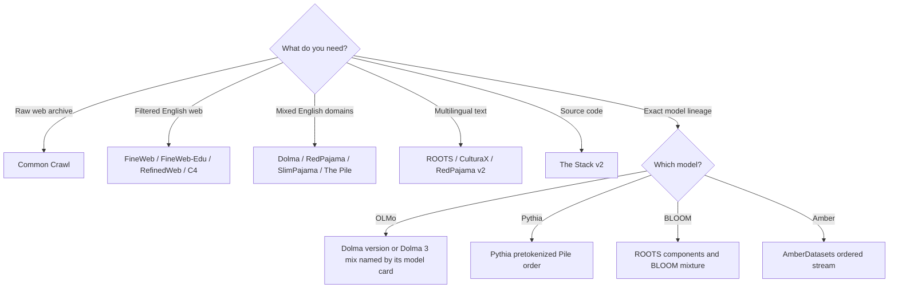

# Open Pretraining Dataset Atlas

> **Status:** links and access notes reviewed 2026-07-12  
> **Scope:** major public or inspectable text/code corpora used in LLM research. This is a technical map, not legal advice or a recommendation to train on every entry.

“Open dataset” can mean at least four different things:

1. the files are publicly downloadable;
2. the database arrangement has an open license;
3. the individual works have reusable licenses;
4. the exact processed stream used in a training run is available.

Those properties do not imply one another. The atlas records them separately.

## Choose by research question



Do not choose by headline token count. Choose the corpus whose provenance, language/domain coverage, rights state, filtering code and reproducibility level match the experiment.

## At-a-glance map

Token counts below use each publisher’s tokenizer or estimate; they are not normalized across rows.

| Corpus | Published scale | Primary use | Access shape | Rights/access warning |
|---|---:|---|---|---|
| [Common Crawl](https://commoncrawl.org/get-started) | June 2026 archive: 2.10B pages, 354.59 TiB uncompressed | Raw web substrate | Public WARC/WAT/WET and indexes | Common Crawl ToU plus rights/terms in crawled content |
| [C4](https://www.tensorflow.org/datasets/catalog/c4) | English TFDS: 806.87 GiB, 364.6M train rows | Cleaned English web baseline | Rebuild via TFDS; mirrors exist | Web-derived; check Common Crawl and distribution-endpoint terms |
| [The Pile](https://arxiv.org/abs/2101.00027) | 825 GiB, 22 components | Historical multi-domain English mix | Replication code; original hosting is brittle | No uniform component license; Books3 availability/rightsholder risk |
| [RedPajama v1](https://huggingface.co/datasets/togethercomputer/RedPajama-Data-1T) | About 1.2T tokens | LLaMA-1-style source mix | Hub dataset and preparation branch | Upstream terms vary by component |
| [RedPajama v2](https://huggingface.co/datasets/togethercomputer/RedPajama-Data-V2) | 20.8B deduped head/middle docs; ~30.4T estimated tokens | Five-language web with quality signals | Sample loader, URL lists, raw/signals/dedup artifacts | Data follows Common Crawl ToU; code is Apache-2.0 |
| [SlimPajama](https://huggingface.co/datasets/cerebras/SlimPajama-627B) | 627B tokens; ~895 GB compressed | Deduplicated RedPajama v1 mix | 59,166 JSONL files | Card directs users to every subset’s license |
| [RefinedWeb](https://huggingface.co/datasets/tiiuae/falcon-refinedweb) | Public extract: ~500–650B tokens, tokenizer-dependent | Filtered English web | 968M Parquet rows | ODC-By 1.0 plus Common Crawl ToU; individual-content rights remain |
| [FineWeb](https://huggingface.co/datasets/HuggingFaceFW/fineweb) | More than 18.5T GPT-2-tokenizer tokens | Reproducible filtered English web | Per-crawl and bounded sample configs; streaming | ODC-By 1.0 plus Common Crawl ToU |
| [FineWeb-Edu](https://huggingface.co/datasets/HuggingFaceFW/fineweb-edu) | 1.3T default; 5.4T score-2 variant | Educationally scored web | Per-crawl/sample configs; streaming | Same web-rights caveat; selection comes from a learned classifier |
| [Dolma v1](https://huggingface.co/datasets/allenai/dolma) | v1.5 ~3T; v1.7 2.3085T OLMo tokens | OLMo 1 / broad research mix | Versioned URL manifests; 10B-token v1.6 sample | ODC-By for database; underlying works may have other rights |
| [Dolma 3](https://github.com/allenai/dolma3) | ~9.3T pool; 5.9T pretraining mix | OLMo 3 staged training | Versioned mixes from billions to trillions of tokens | ODC-By data; one 7B reproduction mix documents redactions |
| [The Stack v2](https://huggingface.co/datasets/bigcode/the-stack-v2) | 67.5 TB; 3.28B unique files | Code pretraining | Hub contains identifiers; content in Software Heritage | Gate/agreement, per-file licenses, attribution, removals |
| [ROOTS](https://arxiv.org/abs/2303.03915) | 1.6 TB, 498 datasets, 59 languages | Governed multilingual mix for BLOOM | Component repositories behind Ethical Charter | Each component has its own license and access state |
| [CulturaX](https://huggingface.co/datasets/uonlp/CulturaX) | 6.3T tokens, 167 languages, 16 TB Parquet | Large multilingual web | Gated per-language Parquet | Terms follow both mC4 and OSCAR; sensitive data may remain |

## Inspect before downloading

The first operation should retrieve repository metadata, not a data shard:

```python
from huggingface_hub import HfApi

repo_id = "HuggingFaceFW/fineweb"
info = HfApi().dataset_info(repo_id, files_metadata=False)
print(info.id, info.sha, info.card_data.get("license"))
print("files:", len(info.siblings))
```

When the card documents streaming, bind the configuration and record limit:

```python
from datasets import load_dataset

rows = load_dataset(
    "HuggingFaceFW/fineweb",
    name="sample-10BT",
    split="train",
    streaming=True,
)

for row in rows.take(3):
    print(row["id"], row["url"], len(row["text"]))
```

`streaming=True` prevents materializing the entire corpus; it does not waive terms, guarantee a tiny first shard, or make arbitrary loader code safe. Inspect a repository’s loading script before permitting remote code execution.

---

## 1. Common Crawl: the raw substrate

Common Crawl is a recurring web archive, not an LLM-ready corpus. Its [June 2026 release](https://commoncrawl.org/blog/june-2026-crawl-archive-now-available) contains 2.10B page captures and 354.59 TiB of uncompressed content at `crawl-data/CC-MAIN-2026-25/`. Each release includes:

- **WARC:** raw crawl requests, responses and crawl metadata;
- **WAT:** derived metadata about WARC records;
- **WET:** extracted plain text;
- **URL indexes:** locations and offsets for records.

The official [format guide](https://commoncrawl.org/blog/navigating-the-warc-file-format) explains the distinctions. A WET file is convenient, but its extraction is not necessarily the extraction you want for tables, code, navigation or multilingual documents.

### Safe first query

Query an index for metadata before retrieving a ranged WARC record:

```bash
curl 'https://index.commoncrawl.org/CC-MAIN-2026-25-index?url=example.org&output=json'
```

See the official [URL Index documentation](https://commoncrawl.org/url-index). A production pipeline should pin the crawl ID and store the URL, WARC filename, byte offset, length, digest, MIME type and fetch timestamp.

### Caveats

Common Crawl’s [Terms of Use](https://commoncrawl.org/terms-of-use) say crawled content can be subject to separate terms and third-party rights. The terms also impose conditions on use, including AI-system use. Raw archives may include PII, unsafe content, spam, malware, duplicated pages and extraction failures. “Publicly fetched” does not mean “cleared for redistribution.”

**Source-code trail:** [Common Crawl notebooks](https://github.com/commoncrawl/cc-notebooks), [DataTrove Common Crawl example](https://github.com/huggingface/datatrove/blob/main/examples/process_common_crawl_dump.py).

---

## 2. C4: an influential cleaned-web baseline

C4—Colossal Clean Crawled Corpus—was created for T5 from Common Crawl. The official [TensorFlow Datasets card](https://www.tensorflow.org/datasets/catalog/c4) reports for `c4/en`:

- 806.87 GiB;
- 364,613,570 training examples and 364,724 validation examples;
- `text`, `url`, `content-type`, `content-length` and `timestamp` fields.

The [T5 repository](https://github.com/google-research/text-to-text-transfer-transformer#c4) says generating C4 from the raw crawl requires roughly 7 TB of input and substantial preprocessing compute, and recommends distributed preparation. This is a warning against treating a dataset-building script as an inexpensive reproduction.

### Bounded preview through the AI2 mirror

The [`allenai/c4` mirror](https://huggingface.co/datasets/allenai/c4) is marked ODC-By. Inspect its card and revision, then stream only a few rows:

```python
from datasets import load_dataset

rows = load_dataset("allenai/c4", "en", split="train", streaming=True)
for row in rows.take(3):
    print(row["url"], row["text"][:120])
```

The mirror’s license metadata does not erase rights in source pages. Preserve source URLs and review both the mirror terms and Common Crawl ToU.

**Source-code trail:** [TFDS C4 utilities](https://github.com/tensorflow/datasets/blob/master/tensorflow_datasets/text/c4_utils.py), [T5 code](https://github.com/google-research/text-to-text-transfer-transformer).

---

## 3. English web: RefinedWeb, FineWeb and FineWeb-Edu

### RefinedWeb

The RefinedWeb paper describes a five-trillion-token internal English web corpus and releases a smaller extract. The [dataset card](https://huggingface.co/datasets/tiiuae/falcon-refinedweb) describes the public extract as approximately 500–650B tokens depending on tokenizer, 968M pages, roughly 500 GB to download and about 2.8 TB unpacked.

Verified fields:

```text
content, url, timestamp, dump, segment, image_urls
```

The last field stores image URL/alt-text pairs; it does not mean image bytes are included. There is no canonical train/validation split.

```python
from datasets import load_dataset

rows = load_dataset(
    "tiiuae/falcon-refinedweb", split="train", streaming=True
)
for row in rows.take(3):
    print(row["url"], row["dump"], len(row["content"]))
```

The public extract is [ODC-By 1.0](https://opendatacommons.org/licenses/by/1-0/) and remains subject to Common Crawl’s ToU. The paper explains the method, but the card does not link a complete public curation repository equivalent to FineWeb’s reproduction pipeline.

### FineWeb

FineWeb is useful when pipeline inspectability matters. Its maintained [dataset card](https://huggingface.co/datasets/HuggingFaceFW/fineweb) now describes more than 18.5T GPT-2-tokenizer tokens and exposes per-crawl plus bounded sample configurations. The card links the full [DataTrove reproduction pipeline](https://github.com/huggingface/datatrove/blob/main/examples/fineweb.py), ablation checkpoints and evaluation results.

Verified schema:

```json
{
  "text": "...",
  "id": "<Common Crawl URN>",
  "dump": "CC-MAIN-...",
  "url": "https://...",
  "date": "...",
  "file_path": "s3://commoncrawl/...warc.gz",
  "language": "en",
  "language_score": 0.0,
  "token_count": 0
}
```

This is a strong provenance shape: a processed row can be traced to crawl, WARC path and URL. The card states ODC-By 1.0 and Common Crawl ToU both apply.

### FineWeb-Edu

FineWeb-Edu filters FineWeb with an educational-quality classifier. The [card](https://huggingface.co/datasets/HuggingFaceFW/fineweb-edu) reports 1.3T tokens for the default higher-score subset and 5.4T for the score-2 variant. It adds `score` and `int_score` to the FineWeb fields.

```python
from datasets import load_dataset

rows = load_dataset(
    "HuggingFaceFW/fineweb-edu",
    name="sample-10BT",
    split="train",
    streaming=True,
)
for row in rows.take(3):
    print(row["int_score"], row["url"])
```

The classifier used annotations generated by Llama 3 70B Instruct, as documented in the [paper](https://arxiv.org/abs/2406.17557) and [annotation dataset](https://huggingface.co/datasets/HuggingFaceFW/fineweb-edu-llama3-annotations). That is valuable transparency: “educational” is an operationalized model judgment that should be audited across topics, dialects and languages.

---

## 4. Dolma and Dolma 3: data attached to a model lineage

### Dolma v1 family

Dolma combines web pages, scientific papers, code, books, encyclopedic text and other sources. Its [versioned card](https://huggingface.co/datasets/allenai/dolma) distinguishes:

- v1.5: roughly 3T tokens;
- v1.6-sample: roughly 10B tokens, 16.4 GB compressed;
- v1.7: 2.3085T OLMo tokens in the available corpus, with a 1.715T-token sampled training mix for OLMo 7B v1.7.

The [paper and datasheet](https://arxiv.org/abs/2402.00159) document source-specific processing, PII handling, deduplication and decontamination. The [Dolma toolkit](https://github.com/allenai/dolma) provides tag, dedupe, mix, statistics and tokenization commands.

Dolma is ODC-By; the toolkit is Apache-2.0. ODC-By licenses database rights, not every independent work inside it. Use the version URL manifest and checksum it rather than referring only to mutable `main`.

### Dolma 3

Dolma 3 is the curriculum for OLMo 3. The [OLMo 3 release](https://allenai.org/blog/olmo3) reports:

- a roughly 9.3T-token source pool;
- a 5.9T-token pretraining mix;
- a 100B-token Dolmino midtraining mix;
- a 50B-token Longmino long-context mix.

The [reconstruction repository](https://github.com/allenai/dolma3) contains dataset descriptions and procedures. It also states that some configuration paths point to internal Ai2 S3 buckets, with a helper for mapping to the closest Hub artifact.

The [7B reproduction mix card](https://huggingface.co/datasets/allenai/dolma3_mix-6T-1025-7B) documents this schema:

```text
id, text, metadata, source, version, created, added, doc, attributes
```

It also warns that some olmOCR science-PDF text was redacted after the 7B run, so that artifact cannot replay the original stream exactly. The card directs new training to the primary [Dolma 3 Mix 6T](https://huggingface.co/datasets/allenai/dolma3_mix-6T) and identifies a complete 32B-oriented mix for closer reproduction.

For a no-data first step, inspect only the card and revision:

```bash
hf download allenai/dolma3_mix-6T README.md --repo-type dataset
```

**Source-code trail:** [Dolma 3 procedures](https://github.com/allenai/dolma3/tree/main/procedures), [OLMo 3 training scripts](https://github.com/allenai/OLMo-core/tree/main/src/scripts/official/OLMo3).

---

## 5. RedPajama v1, RedPajama v2 and SlimPajama

### RedPajama v1

RedPajama v1 assembled approximately 1.2T tokens across Common Crawl, C4, GitHub, books, arXiv, Wikipedia and Stack Exchange, using categories intended to resemble those described for LLaMA 1. The [dataset card](https://huggingface.co/datasets/togethercomputer/RedPajama-Data-1T) and [`rp_v1` code branch](https://github.com/togethercomputer/RedPajama-Data/tree/rp_v1) are the primary trail.

The project’s code license does not create a uniform license for every source. A user must follow the licenses/terms of each component, especially books, web text, code and forum content.

### RedPajama v2

RedPajama v2 is structurally different: a five-language Common Crawl collection with inspectable quality signals. Its [card](https://huggingface.co/datasets/togethercomputer/RedPajama-Data-V2) reports over 100B raw documents from 84 snapshots; 30B have quality annotations, and the deduplicated head/middle portion is estimated at 20.8B documents and 30.4T tokens.

Four artifact families share stable path keys:

```text
documents/<snapshot>/<shard>/<language_bucket>.json.gz
quality_signals/<same key>.signals.json.gz
duplicates/<same key>.duplicates.parquet
minhash/<same key>.minhash.parquet
```

A document contains URL, download date, digest, lengths, domain, title, raw content, Common Crawl segment, line IDs, language score, perplexity and head/middle/tail bucket. Quality signals are span triples `(start, end, score)`, making it possible to reproduce custom filters instead of accepting one baked corpus.

The official small sample avoids a full-snapshot download:

```python
from datasets import load_dataset

# The repository uses a custom loading script. Inspect and pin it first.
sample = load_dataset(
    "togethercomputer/RedPajama-Data-V2", name="sample"
)
print(sample)
```

The card warns that requesting a full snapshot can require about 1 TB per snapshot. It says data use follows Common Crawl ToU and processing code is Apache-2.0.

### SlimPajama

SlimPajama applies cleaning and MinHashLSH deduplication to RedPajama v1. The [card](https://huggingface.co/datasets/cerebras/SlimPajama-627B) reports:

- 627B tokens after removing 49.6% of bytes;
- 59,166 JSONL files and about 895 GB compressed;
- separate 500M-token validation and test sets decontaminated against training.

Verified row shape:

```json
{
  "text": "...",
  "meta": {
    "redpajama_set_name": "RedPajamaCommonCrawl"
  }
}
```

```python
from datasets import load_dataset

rows = load_dataset(
    "cerebras/SlimPajama-627B", split="validation", streaming=True
)
for row in rows.take(3):
    print(row["meta"]["redpajama_set_name"], len(row["text"]))
```

Read the card’s license section, not just the headline metadata: it points to the separate terms for Common Crawl, C4, GitHub code, books, arXiv, Wikipedia and Stack Exchange.

**Source-code trail:** [SlimPajama preprocessing code](https://github.com/Cerebras/modelzoo/tree/main/src/cerebras/modelzoo/data_preparation/nlp/slimpajama).

---

## 6. The Pile: historically important, legally heterogeneous

The Pile combined 22 English sources into an 825 GiB corpus. The [paper](https://arxiv.org/abs/2101.00027) and [replication repository](https://github.com/EleutherAI/the-pile) document weights/epochs for sources such as Pile-CC, PubMed, arXiv, GitHub, Stack Exchange, legal text, books and forums.

Its packaged records are conceptually simple—text plus a component label—but the component boundary is crucial for auditing. Two samples with the same JSON schema can have entirely different provenance and rights.

### Current-use warning

The replication repository explicitly says its MIT license covers the code and that Books3 requires a manual download that is currently unavailable. Original data hosts have also been brittle. Do not silently substitute an unknown mirror and call the result “The Pile.” Record the mirror, hashes, missing components and any changes.

For research that needs Pythia’s exact order, follow Pythia’s [published pretokenized-data instructions](https://github.com/EleutherAI/pythia#reproducing-training) rather than rebuilding an approximate Pile. For new production use, evaluate newer corpora with clearer removal, provenance and rights processes.

---

## 7. Multilingual corpora: ROOTS and CulturaX

### ROOTS

ROOTS was created for BLOOM through a community sourcing and governance process. The [ROOTS paper](https://arxiv.org/abs/2303.03915) reports 1.6 TB, 498 constituent datasets and 59 languages: 46 natural languages plus 13 programming languages.

It is not one uniform download or license. A large subset appears as individual repositories in the [BigScience Data organization](https://huggingface.co/bigscience-data), and access requires accepting the [BigScience Ethical Charter](https://huggingface.co/spaces/bigscience/ethical-charter). Each component card records its own source, processing and license.

Example after reviewing and accepting the charter for that component:

```python
from datasets import load_dataset

rows = load_dataset(
    "bigscience-data/roots_en_wikipedia",
    split="train",
    streaming=True,
    token=True,
)
for row in rows.take(3):
    print(row.keys())
```

Do not assume every ROOTS component has the same schema. The unit of governance is the constituent dataset. The [data-preparation repository](https://github.com/bigscience-workshop/data-preparation) contains source-specific cleaning code.

### CulturaX

CulturaX combines mC4 and OSCAR, then applies language identification, URL filtering, metric-based cleaning, refinement and document-level MinHash deduplication. The [official card](https://huggingface.co/datasets/uonlp/CulturaX) and [paper](https://aclanthology.org/2024.lrec-main.377/) report 6.3T tokens, 167 languages and 16 TB in Parquet (about 27 TB unpacked).

Verified schema:

```json
{
  "text": "...",
  "timestamp": "...",
  "url": "...",
  "source": "mc4 or OSCAR version"
}
```

After accepting the Hub gate:

```python
from datasets import load_dataset

rows = load_dataset(
    "uonlp/CulturaX",
    "en",
    split="train",
    streaming=True,
    token=True,
)
for row in rows.take(3):
    print(row["source"], row["url"])
```

The card says licensing follows both mC4 and OSCAR and warns that personal or sensitive information may remain. It also reports extreme language imbalance: English is about 45% of published tokens, while many languages have tiny document counts. “167 languages” therefore does not mean equal coverage.

---

## 8. The Stack v2: source code with provenance identifiers

The Stack v2 derives from the Software Heritage archive. Its [dataset card](https://huggingface.co/datasets/bigcode/the-stack-v2) reports:

- 67.5 TB before near-deduplication;
- 3.28B unique files from 104.2M GitHub repositories;
- 658 programming and markup languages;
- about 900B tokens in the full training subset.

The Hub datasets primarily contain Software Heritage IDs and metadata, not file content. Important fields include:

```text
blob_id, directory_id, path, content_id, detected_licenses,
license_type, repo_name, snapshot_id, revision_id, branch_name,
visit_date, revision_date, committer_date, src_encoding,
language, is_vendor, is_generated
```

This ID-first design preserves provenance and lets Software Heritage enact content controls. Bulk file-content access requires an agreement with Software Heritage and Inria. Users must follow original licenses, including attribution clauses, and update local copies when validated removal requests are applied.

After accepting the gate, inspect identifiers without fetching code contents:

```python
from datasets import load_dataset

ids = load_dataset(
    "bigcode/the-stack-v2",
    "Python",
    split="train",
    streaming=True,
    token=True,
)
for row in ids.take(3):
    print(row["content_id"], row["repo_name"], row["detected_licenses"])
```

License detection is evidence, not certainty. The card notes that most repositories lacked repository-level license metadata and therefore required file-path propagation from ScanCode-detected license files. No-license code is not automatically reusable code.

**Source-code trail:** [curation repository](https://github.com/bigcode-project/the-stack-v2), [technical report](https://arxiv.org/abs/2402.19173), [BigCode governance card](https://huggingface.co/datasets/bigcode/governance-card).

## A selection rubric

Score a candidate corpus from 0–2 on each dimension before touching the files:

| Dimension | 0 | 1 | 2 |
|---|---|---|---|
| Provenance | source lost | source class known | record-level trace |
| Rights | unknown | corpus-level terms only | record/component terms preserved |
| Reproduction | description only | code or data | code + versioned data/order |
| Removal | none documented | request channel | versioned removal propagation |
| Privacy | unassessed | generic warning | documented detection/redaction audit |
| Deduplication | none/unknown | method named | artifacts, threshold and survivor rule |
| Evaluation hygiene | unknown | benchmark names | versioned decontamination artifacts |
| Sampling | unknown | source proportions | exact ordered stream or deterministic recipe |

A high score does not declare the content lawful or unbiased. It tells you whether the project gives you enough evidence to investigate.

## Exercises

1. Compare FineWeb and RefinedWeb on artifact openness, not benchmark score. Which pipeline stages can you inspect and rerun?
2. Compare RedPajama v2 and SlimPajama. Why is one a signal-rich web collection while the other is a baked multi-source mixture?
3. Pick three The Pile components and build a separate rights/provenance table for each. Do not use “The Pile license” as a field.
4. For ROOTS or CulturaX, calculate the ratio of English tokens to one lower-resource language. Propose a mixture rule and describe its trade-off.
5. Inspect The Stack v2’s schema. Design an attribution store that survives packing, tokenization and model training.

Next: [The Curation Pipeline](./03-curation-pipeline.md).
