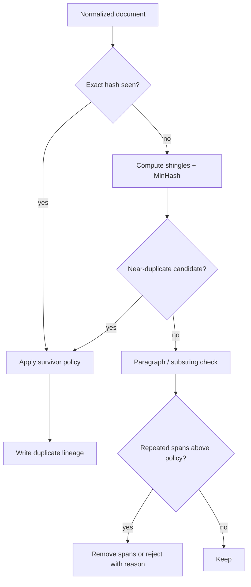

# The Curation Pipeline: From Raw Records to Training Tokens

> **Level:** beginner → expert  
> **Outcome:** design a deterministic, inspectable pipeline that can explain where every training sequence came from and why it survived.

A corpus is not a folder of text files. It is the result of decisions: what to collect, how to extract it, which records to remove, which near-duplicates to keep, how to allocate tokens and how to prevent evaluation leakage. A defensible pipeline turns those decisions into versioned code and evidence.

## 1. Start with a data contract

Before choosing filters, define the canonical document record. A useful minimum is:

```json
{
  "id": "stable-content-or-source-id",
  "text": "normalized text",
  "source": "fineweb",
  "source_record_id": "upstream-id",
  "source_url": "https://...",
  "snapshot": "CC-MAIN-2025-26",
  "retrieved_at": "2026-07-12T00:00:00Z",
  "content_sha256": "...",
  "language": "en",
  "rights": {
    "dataset_terms": "ODC-BY-1.0",
    "content_license": null,
    "evidence": "dataset-card-url"
  },
  "lineage": ["extract:v1.3", "normalize:v2", "dedupe:v4"],
  "quality": {},
  "split": null
}
```

Not every upstream source supplies every field. Unknown is a valid value; silently discarding the question is not. Separate source identity from content hashes:

- `source_record_id` lets you trace the publisher’s record.
- `content_sha256` tells you whether normalized content changed.
- a corpus-specific `id` lets your pipeline maintain stable joins across stages.

DataTrove uses a compact `text`, `id`, `metadata` contract for pipeline blocks, documented in its [repository](https://github.com/huggingface/datatrove#datatrove-document). Dolma-compatible records add source/version/attributes fields; a concrete example is the object built in [olmOCR’s pipeline](https://github.com/allenai/olmocr/blob/main/olmocr/pipeline.py).

## 2. Use immutable zones

Treat each stage like a build artifact:

```mermaid
flowchart LR
    A["00 source manifests"] --> B["10 raw immutable"]
    B --> C["20 extracted"]
    C --> D["30 normalized"]
    D --> E["40 filtered + reason logs"]
    E --> F["50 deduplicated"]
    F --> G["60 decontaminated"]
    G --> H["70 mixed + split"]
    H --> I["80 tokenized"]
    I --> J["90 packed training shards"]
    J --> K["manifest + dataset card"]
```



Each output directory should be content-addressed or versioned and accompanied by:

- input manifest hash;
- code commit;
- container/environment digest;
- exact configuration;
- start/end time;
- input, kept, rejected and failed counts;
- byte, document and token totals by source/language;
- a machine-readable rejection histogram;
- output shard hashes.

Never overwrite raw input with cleaned text. If a policy or parser changes, you need to replay from the prior immutable stage and compare deltas.

## 3. Acquisition: pin what you actually received

### Manifest first

For every upstream artifact, record:

```text
publisher, dataset ID, immutable revision, file path, byte size,
cryptographic hash, retrieval time, terms URL, card URL, expected schema
```

A mutable name such as `main`, `latest` or `default` is a convenience pointer, not a reproducible input. Resolve it to a commit or release. For Common Crawl, pin a crawl ID such as `CC-MAIN-2026-25`, plus WARC path, offset and length. For a Hub dataset, record the repository commit returned by `HfApi.dataset_info(...).sha`.

### Validate before parsing

Reject or quarantine:

- checksum mismatches;
- decompression failures;
- malformed encodings;
- unexpected columns or types;
- missing required provenance;
- records exceeding explicit size limits;
- executable archives or unsafe paths.

Count failures. “Skipped 17 corrupt shards” is part of the dataset version, not a line to hide in a worker log.

## 4. Extraction: recover structure, not only characters

Extraction is source-specific:

| Source | Useful structure | Common damage |
|---|---|---|
| HTML | title, headings, paragraphs, lists, tables, links, alt text | navigation, cookie banners, repeated templates, hidden text |
| PDF | page order, sections, equations, tables, captions | scrambled columns, lost math, headers inserted mid-sentence |
| Code repository | path, repository, revision, license, language | vendored/generated code, minified files, secrets, duplicate forks |
| Forum | thread, author pseudonym, timestamp, quote/reply relation | PII, quote duplication, deleted-content drift |
| Book | title, edition, chapter boundaries, page order | OCR noise, licensing ambiguity, repeated front matter |

The decision to flatten a table into lines or drop it altogether changes what the model can learn. Store parser version and, where feasible, character spans back to source. The [ROOTS paper](https://arxiv.org/abs/2303.03915) and [data-preparation repository](https://github.com/bigscience-workshop/data-preparation) are useful examples of source-specific rather than one-size-fits-all cleaning. For difficult PDFs, [olmOCR](https://github.com/allenai/olmocr) demonstrates a pipeline that preserves page spans and extraction metadata in Dolma records.

## 5. Normalization: make equivalence explicit

Normalization should be conservative and versioned. Common operations include:

- decode to Unicode and record decoding failures;
- normalize line endings;
- repair known mojibake only when confidence is high;
- normalize selected Unicode forms;
- remove control characters that cannot carry intended text;
- standardize whitespace without destroying code indentation or tables;
- preserve document and paragraph boundaries.

Keep two representations when needs conflict:

1. **display text**, retaining useful formatting;
2. **dedupe text**, lowercased or whitespace-normalized for comparison.

Do not use destructive normalization to “improve” deduplication and then train on that altered form. Hash both representations and document the transform.

## 6. Language identification is a measurement

Language ID models return estimates, not truth. A robust pipeline stores:

- predicted language;
- confidence score;
- model name/version;
- text span evaluated;
- script statistics;
- fallback/unknown state.

Document-level labeling fails on multilingual pages. Paragraph-level labels retain mixed-language material but can fragment code-switching. Thresholds should be calibrated per language and document length; a universal confidence cutoff can disproportionately remove short or lower-resource-language documents.

CulturaX publishes per-language counts and its Wikipedia-trained KenLM artifacts on the [dataset card](https://huggingface.co/datasets/uonlp/CulturaX) and [model repository](https://huggingface.co/uonlp/kenlm), making parts of its language-quality process inspectable.

## 7. Filter with reasons, not a Boolean black box

A filter should return a decision plus evidence:

```python
from dataclasses import dataclass

@dataclass(frozen=True)
class Decision:
    keep: bool
    reasons: tuple[str, ...]
    scores: dict[str, float]

def quality_decision(text: str) -> Decision:
    words = text.split()
    scores = {
        "chars": float(len(text)),
        "words": float(len(words)),
        "unique_word_ratio": len(set(words)) / max(1, len(words)),
    }
    reasons = []
    if scores["words"] < 50:
        reasons.append("too_short")
    if scores["unique_word_ratio"] < 0.1:
        reasons.append("high_repetition")
    return Decision(not reasons, tuple(reasons), scores)
```

At scale, store compact scores and rejection codes instead of every intermediate string. RedPajama v2’s [quality annotation schema](https://huggingface.co/datasets/togethercomputer/RedPajama-Data-V2#quality-annotations) is instructive: it records natural-language, repetition, language-model and MinHash signals as character-span triples. Users can change the policy without recomputing every feature.

### Heuristics

Useful signals can include:

- document/line length;
- alphabetic, numeric and symbol ratios;
- repeated n-gram fractions;
- stop-word fraction;
- terminal-punctuation patterns;
- boilerplate/template fingerprints;
- markup/code ratios;
- language confidence;
- domain allow/block evidence.

Heuristics are fast and explainable, but language- and genre-specific. Poetry, source code, chat, mathematics and tables legitimately violate many prose rules.

### Learned quality classifiers

A classifier can rank documents by similarity to a reference distribution or an annotated quality rubric. Record:

- model hash and training data;
- label instructions and annotator/model identity;
- calibration set and per-group error rates;
- score threshold;
- selection rate by language, domain and source.

FineWeb-Edu explicitly publishes its model-generated annotation set and classifier methodology in its [card](https://huggingface.co/datasets/HuggingFaceFW/fineweb-edu) and [paper](https://arxiv.org/abs/2406.17557). That enables the right question: which educational styles did the classifier learn to prefer?

### Sensitive and unsafe content

Separate detectors for:

- personal and sensitive information;
- credentials and private keys;
- child sexual abuse material and exploitation indicators;
- malware or exploit code;
- hate/harassment and extreme graphic content;
- regulated or contractually excluded sources.

Automated detectors have false positives and negatives. Maintain a restricted quarantine, reviewer protocol, removal channel and deletion propagation process. Never print suspected secrets or sensitive content into ordinary logs.

## 8. Deduplicate in layers

### Layer 1: exact document deduplication

Normalize a comparison view and hash it:

\[
h(d) = \mathrm{SHA256}(\mathrm{normalize}(d))
\]

This catches byte-equivalent or normalization-equivalent records efficiently. It does not catch one paragraph copied into a longer page.

### Layer 2: fuzzy document deduplication

Represent documents as token shingles, approximate Jaccard similarity with MinHash and use locality-sensitive hashing to generate candidate pairs. For shingle sets (A) and (B):

\[
J(A,B) = \frac{|A \cap B|}{|A \cup B|}
\]

The threshold, shingle length, number of hash functions, LSH banding and normalization all belong in the manifest. RedPajama v2 publishes MinHash signatures at several target similarities on its [dataset card](https://huggingface.co/datasets/togethercomputer/RedPajama-Data-V2#quality-annotations). SlimPajama publishes its [MinHashLSH implementation](https://github.com/Cerebras/modelzoo/tree/main/src/cerebras/modelzoo/data_preparation/nlp/slimpajama).

### Layer 3: paragraph or substring deduplication

Templates, quotations, licenses, navigation and syndicated passages can remain even after whole-document deduplication. Paragraph Bloom filters or suffix-array-style substring methods catch repeated spans.

The primary study [Deduplicating Training Data Makes Language Models Better](https://aclanthology.org/2022.acl-long.577/) reports reduced memorized output and cleaner evaluation after deduplication; its [code](https://github.com/google-research/deduplicate-text-datasets) is available.

### Survivor policy

When records collide, do not let worker timing pick the winner. Define a deterministic ranking, for example:

1. explicit reusable content license over unknown license;
2. direct/original source over mirror or quotation;
3. stronger provenance over weaker provenance;
4. better extraction score;
5. earlier publication or canonical revision;
6. lexicographic stable ID as final tie-break.

Log `duplicate_id → survivor_id`, similarity, method and policy version. This map is also necessary to honor later removal requests.



## 9. Decontaminate before final splits

Evaluation contamination occurs when benchmark material—or close transformations of it—appears in training. Exact-string removal is insufficient for multiple-choice questions with reordered options, translated variants, code solutions or copied explanations.

A practical process:

1. pin benchmark dataset, revision and split;
2. build normalized exact hashes and n-gram/shingle indexes;
3. search all candidate training text before final packing;
4. remove or quarantine matches using documented thresholds;
5. publish aggregate counts by benchmark and source;
6. keep benchmark text itself access-controlled when required;
7. rerun when benchmarks or corpus versions change.

Avoid using test data to tune general quality filters. Decontamination is a boundary check, not a way to optimize against the test set.

For instruction-tuning data, AI2’s [Open Instruct repository](https://github.com/allenai/open-instruct/tree/main/decontamination) includes overlap-measurement scripts. Dolma’s [paper/datasheet](https://arxiv.org/abs/2402.00159) documents decontamination of its subsets against its evaluation suite.

## 10. Split by group, then mix

Random row splitting leaks related material across splits. Split at the strongest available group:

- web: registered domain, URL family or dedupe cluster;
- code: repository or fork cluster;
- papers/books: work or edition;
- forum: thread;
- multilingual parallel data: translation group.

Perform deduplication across all candidate splits, then assign entire clusters. Freeze validation/test before experimenting with mixture weights.

### Mixture manifest

For every source, publish:

```yaml
source: fineweb
revision: <immutable revision>
eligible_tokens: 123456789
sampling_weight: 0.60
max_epochs: 0.8
seed: 42
filter_policy: web-en-v4
dedupe_policy: global-minhash-v2
```

Validate that weights sum to one, expected source tokens fit the budget, and no source exceeds its maximum intended passes. Emit the ordered source/shard schedule if exact replay matters.

## 11. Tokenize, concatenate and pack deliberately

Pin the complete tokenizer artifact:

- vocabulary/model file hashes;
- pre-tokenizer and normalization configuration;
- special tokens and IDs;
- library and version;
- added tokens;
- maximum sequence length.

Measure fertility by language/domain before committing. A tokenizer that is efficient on English prose may waste context on code, math or other scripts.

### Packing choices

Common strategies:

- **truncate:** simple, but discards long-document tails;
- **pad each document:** preserves boundaries but wastes tokens;
- **concatenate with EOS:** efficient, but examples can cross documents;
- **best-fit packing:** reduces padding while retaining boundaries/masks;
- **repository/book-aware packing:** preserves long-range structure at higher complexity.

Store for every packed sequence either a source-span map or enough document IDs and offsets to reconstruct it:

```json
{
  "sequence_id": "shard-0042:000019",
  "token_count": 4096,
  "documents": [
    {"id": "doc-a", "token_start": 0, "token_end": 900},
    {"id": "doc-b", "token_start": 901, "token_end": 4095}
  ]
}
```

Without this map, later removal, attribution and data influence analysis become much harder.

Amber’s [data-preparation repository](https://github.com/LLM360/amber-data-prep) is a readable real-world example: it tokenizes source datasets, concatenates to 2,049-token training records (input plus shifted target), and distributes data into 360 chunks corresponding to its published checkpoint sequence.

## 12. Quality assurance gates

Before training, generate a signed report with at least:

| Gate | What to measure |
|---|---|
| Integrity | expected files, checksums, parse failures, schema drift |
| Scale | bytes, documents, words/tokens by stage and source |
| Language | counts, confidence and tokenizer fertility per language |
| Filtering | keep/reject rates and top reasons by source/language |
| Deduplication | exact/fuzzy/substr removal, cluster size distribution |
| Safety/privacy | detector counts, review samples, unresolved quarantines |
| Rights | unknown-license share, source terms, attribution completeness |
| Decontamination | matches by benchmark, method and threshold |
| Mixture | expected training tokens and passes per source |
| Packing | utilization, truncation rate, cross-document sequence rate |
| Spot checks | stratified human review with written rubric |

Set fail thresholds before seeing final results. Otherwise a surprising metric is easy to rationalize after an expensive build.

## 13. The reproducibility bundle

A release should contain:

```text
dataset-card.md
source-manifest.jsonl
schema.json
pipeline-config.yaml
environment.lock / container digest
filter-policy.yaml
dedupe-clusters.parquet or reproducible equivalent
decontamination-report.json
mixture-manifest.yaml
tokenizer/ with hashes
shard-manifest.jsonl
checksums.sha256
known-issues.md
removal-policy.md
```

The [Hugging Face dataset-card guide](https://huggingface.co/docs/hub/datasets-cards) covers Hub metadata; [Datasheets for Datasets](https://arxiv.org/abs/1803.09010) gives the broader documentation questions. Neither replaces the machine-readable lineage artifacts above.

## 14. Source-code reading trail

Read these in increasing scale:

1. [Dolma’s small Wikipedia tutorial](https://github.com/allenai/dolma/blob/main/docs/getting-started.md): tag → dedupe → mix → tokenize.
2. [DataTrove quickstart](https://github.com/huggingface/datatrove#quickstart): readers, filters, writers and executors.
3. [FineWeb reproduction](https://github.com/huggingface/datatrove/blob/main/examples/fineweb.py): a full web pipeline assembled from reusable blocks.
4. [RedPajama v2](https://github.com/togethercomputer/RedPajama-Data): artifact preparation, quality signals, Bloom-filter exact deduplication and LSH.
5. [ROOTS data preparation](https://github.com/bigscience-workshop/data-preparation): multilingual source-specific processing.
6. [The Stack v2 curation](https://github.com/bigcode-project/the-stack-v2): repository/code-specific metadata, filtering and deduplication.
7. [Dolma 3 reconstruction](https://github.com/allenai/dolma3): a modern staged model curriculum.

## Exercises

### Beginner

1. Add three fields to the canonical record that would help honor a deletion request.
2. Explain why `keep: true` is less auditable than `keep: true, scores: {...}, policy: v3`.
3. Give one example where prose whitespace normalization would damage source code.

### Intermediate

1. Design a deterministic survivor ranking for duplicated news articles and syndicated copies.
2. Pick one language and audit how a 50-word minimum changes its retained-document distribution.
3. Write a mixture manifest for a 5B-token run and calculate expected passes per source.

### Advanced

1. Propose a decontamination method robust to reordered multiple-choice options and paraphrased questions.
2. Design a deletion propagation graph from source record through dedupe cluster, tokenized document and packed sequence.
3. Compare exact, MinHash and substring deduplication on compute, memory, false positives, false negatives and explainability.

Next: [Governance, Licensing and Responsible Release](./04-governance-licensing.md).
