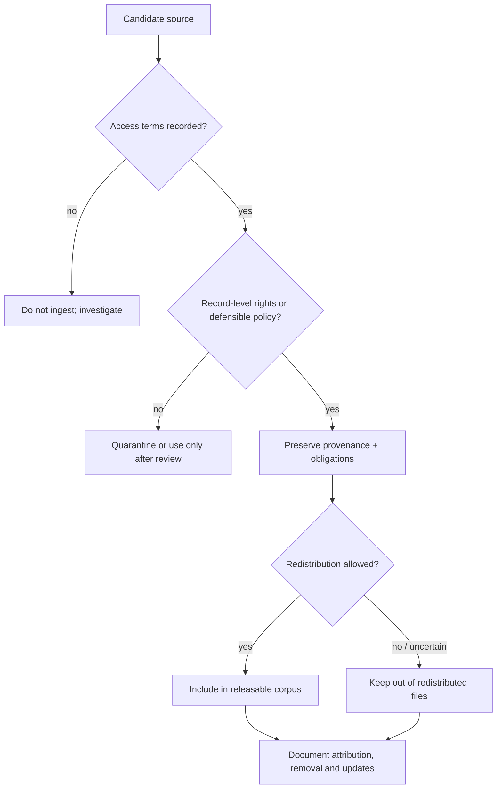
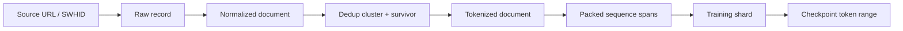
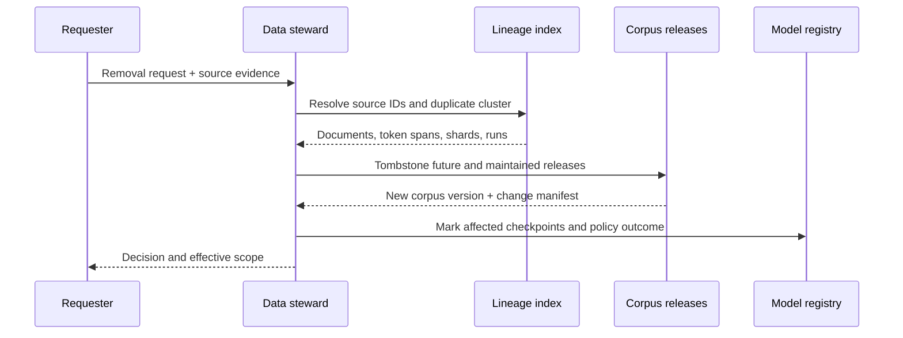

# Governance, Licensing and Responsible Release

> **Level:** beginner → expert  
> **Important:** this chapter is a technical governance framework, not legal advice. Copyright, privacy, contract, database and text-and-data-mining rules vary by source, use and jurisdiction. Obtain qualified advice for a real release.

The most dangerous sentence in dataset work is: “It says Apache on the repository.” Which artifact says Apache—the downloader, the dataset arrangement, the individual documents, or the model weights? Those can have different owners and terms.

## 1. The six-layer rights stack

Audit each layer independently:

| Layer | Example artifact | Question |
|---|---|---|
| Source content | article, book, code file, forum post | Who owns or controls this work, and under what terms can it be copied, transformed, trained on or redistributed? |
| Acquisition/access | crawl service, API, website, archive | What terms governed access? Are there contractual use restrictions, robots rules or rate limits? |
| Database | selected and arranged corpus | Does a database license apply? What attribution/share conditions attach to the collection? |
| Processing code | crawler, extractor, filter, tokenizer | Which software license governs use and modification of the pipeline? |
| Model artifacts | configuration, weights, checkpoints | Which terms govern use, modification and redistribution of the trained artifact? |
| Deployment/output | service, generated text/code | What product rules, attribution duties, safety controls and downstream rights issues apply? |

An Apache-2.0 pipeline can read an ODC-By database containing works with separate copyrights. An Apache-2.0 model card does not retroactively license its training documents.



## 2. What ODC-By does—and does not do

FineWeb, Dolma and RefinedWeb use the [Open Data Commons Attribution License 1.0](https://opendatacommons.org/licenses/by/1-0/index.html). It grants broad rights to use, share and adapt the **database**, subject to attribution requirements.

The critical boundary is section 2.4: individual contents can be covered by copyright, privacy, personality or other rights, and ODC-By does not grant those independent rights. The license itself advises that another license may be needed for contents.

Therefore this statement is defensible:

> “The FineWeb database is offered under ODC-By 1.0, and its card says Common Crawl’s Terms of Use also apply.”

This one is not:

> “Every page in FineWeb is open-licensed text.”

ODC-By also has attribution and notice requirements for publicly conveying the database or publicly using a produced work. Use the [official summary](https://opendatacommons.org/licenses/by/summary/) for orientation and the full text for actual terms.

## 3. Publicly accessible is not public domain

A page can be readable without a login and still carry copyright, privacy interests and site terms. Common Crawl makes a copy of fetched web content available, but its [Terms of Use](https://commoncrawl.org/terms-of-use) state that crawled content may be subject to separate terms and third-party rights. They also place conditions and risk on users of crawled content, including AI uses.

For Common-Crawl-derived corpora, retain at least:

- URL and registered domain;
- crawl ID, segment, WARC path, offset/length and content digest;
- fetch date;
- extractor and filter versions;
- database and access-terms URLs;
- any known source license or rights signal;
- opt-out/removal status and effective date.

Robots exclusion affects crawling behavior; it is not a universal copyright license. Likewise, an opt-out signal and a legal right are distinct concepts. A governance policy may honor signals beyond the minimum a jurisdiction requires.

## 4. Source code requires file-level reasoning

Code corpora add license compatibility, attribution and security concerns. A repository can contain files under different licenses, vendored dependencies, generated code, copied snippets and files with no license.

The Stack v2’s [dataset card](https://huggingface.co/datasets/bigcode/the-stack-v2) preserves Software Heritage IDs, repository/revision data and detected SPDX licenses. It also states:

- bulk content access requires an agreement with Software Heritage and Inria;
- users must follow original source licenses, including attribution clauses;
- validated removal requests are propagated through updated dataset releases;
- license detection is limited by source metadata and ScanCode accuracy.

The [BigCode governance card](https://huggingface.co/datasets/bigcode/governance-card) and [Software Heritage principles for language-model training](https://www.softwareheritage.org/2023/10/19/swh-statement-on-llm-for-code/) document the governance model.

### Practical code-data classes

| Class | Default handling |
|---|---|
| Explicit permissive license with retained notice | Eligible after policy review; preserve exact license/provenance |
| Copyleft license | Separate review for training, redistribution, attribution and downstream obligations |
| Conflicting repository/file signals | Quarantine until resolved |
| No detected license | Treat as no permission granted for redistribution; do not relabel as permissive |
| Generated/vendor/minified code | Usually remove or separate for quality, duplication and provenance reasons |
| Credentials, private keys or personal data | Remove, quarantine securely and establish notification/remediation policy |
| Malware/exploit content | Segregate or exclude according to threat model and access controls |

This table is a conservative engineering policy, not a legal conclusion about model training or outputs.

## 5. Mixed corpora do not have one meaningful license label

### The Pile

The Pile combines 22 sources. Its [replication repository](https://github.com/EleutherAI/the-pile) is MIT-licensed code, but the component data has varied terms; the repository also notes that the manual Books3 download is unavailable. A badge saying `MIT` cannot summarize the corpus. Track source component on every record.

### SlimPajama and RedPajama

SlimPajama’s [license section](https://huggingface.co/datasets/cerebras/SlimPajama-627B#license) points users to separate terms for Common Crawl, C4, GitHub code, books, arXiv, Wikipedia and Stack Exchange. RedPajama v2’s [card](https://huggingface.co/datasets/togethercomputer/RedPajama-Data-V2#license) says Common Crawl terms govern the data while Apache-2.0 governs loader/processing code.

### ROOTS

ROOTS is released as constituent datasets through the [BigScience Data organization](https://huggingface.co/bigscience-data), behind the [BigScience Ethical Charter](https://huggingface.co/spaces/bigscience/ethical-charter). Each component card carries its own licensing and processing information. Governance is deliberately component-aware.

### CulturaX

CulturaX’s [card](https://huggingface.co/datasets/uonlp/CulturaX#license-information) says terms follow both mC4 and OSCAR. It is additionally gated by Hub access conditions. A consumer must satisfy all applicable layers, not choose the most permissive-looking one.

## 6. Open source AI does not mean “every raw byte is redistributable”

The [OSI Open Source AI Definition 1.0](https://opensource.org/ai/open-source-ai-definition) defines a preferred form for modification with three categories:

1. detailed **data information** sufficient for a skilled person to build a substantially equivalent system;
2. complete **code** for data processing, training, validation, inference and related configuration;
3. model **parameters**, potentially including intermediate checkpoints and optimizer state.

The OSI [FAQ](https://opensource.org/ai/faq) distinguishes open training data, publicly inspectable data, obtainable third-party data and legitimately unshareable nonpublic data. It requires detailed disclosure and the sharing of legally shareable open data, but it does not require a project to redistribute data it cannot legally share.

This definition is about freedom to study, use, modify and share an AI system. It is not a certification that a particular corpus is lawful, unbiased, safe or exactly reproducible.

## 7. Build a rights and provenance ledger

Store rights as evidence, not one guessed string:

```json
{
  "document_id": "doc-123",
  "source": {
    "dataset": "bigcode/the-stack-v2",
    "revision": "7408bfb...",
    "record_id": "swh:1:cnt:...",
    "url": "https://archive.softwareheritage.org/..."
  },
  "rights": {
    "database_license": "other",
    "content_license_candidates": ["MIT"],
    "detection_tool": "ScanCode <version>",
    "detection_confidence": null,
    "access_terms": ["https://.../terms"],
    "attribution_required": true,
    "commercial_use_reviewed": false,
    "redistribution_status": "pending-review"
  },
  "evidence": [
    {"kind": "license-file", "path": "LICENSE", "hash": "..."},
    {"kind": "dataset-card", "url": "https://..."}
  ],
  "review": {
    "policy_version": "code-rights-v3",
    "reviewed_at": "2026-07-12T00:00:00Z",
    "reviewer_role": "data-steward"
  }
}
```

Why candidates rather than `license: MIT`? Automated detection can be wrong, multiple licenses can apply, and a license file may cover only a subdirectory. Preserve the evidence that led to the classification.

## 8. Attribution must survive tokenization

If provenance disappears when documents are packed into sequences, attribution and removal become expensive reconstruction projects. Maintain a lineage graph:



For every packed sequence, store document IDs and token offsets. For each released corpus version, publish an attribution manifest where source terms permit it. For code, keep repository, revision, path and license evidence. For web pages, keep URL, crawl and content digest even if the released training file contains only text.

## 9. Privacy and personal data are separate from copyright

Permission to copy a work does not settle whether it is appropriate or lawful to process personal or sensitive information. A corpus can contain:

- email addresses, phone numbers, home addresses and account identifiers;
- medical, financial, biometric or precise-location information;
- private conversations copied into public dumps;
- information about minors;
- secrets embedded in code or logs;
- dossiers assembled from individually public fragments.

Your program needs:

1. a documented purpose and data-minimization rule;
2. source-specific PII detection and redaction;
3. secure quarantine rather than ordinary debug logs;
4. false-positive/negative testing across languages;
5. a removal request channel;
6. an escalation process for sensitive findings;
7. retention and deletion schedules;
8. a record of what was trained before a deletion.

Dolma’s [dataset card](https://huggingface.co/datasets/allenai/dolma) links a personal-data removal form and its [paper/datasheet](https://arxiv.org/abs/2402.00159) documents PII masking/removal choices. CulturaX’s [card](https://huggingface.co/datasets/uonlp/CulturaX#considerations-for-using-the-data) warns that personal and sensitive information may remain. These are disclosure mechanisms, not claims of zero risk.

## 10. Removal is an ongoing system, not a launch-day form

A useful removal system needs:

- authenticated intake without demanding unnecessary personal data;
- sufficient source identifiers or search assistance;
- triage categories: privacy, copyright, contractual, safety, correction;
- decision record and appeal/escalation path;
- source-to-duplicate-cluster mapping;
- propagation to processed documents, token shards and future mixes;
- versioned tombstone list;
- updated manifests and release notes;
- policy for already-trained checkpoints.



Do not promise to “untrain” a deployed model unless you have a validated mechanism and can define what success means. Clearly distinguish removal from future data releases, suppression in retrieval systems, checkpoint retirement and machine-unlearning research.

## 11. Data security and supply-chain controls

Public datasets are untrusted input. Threats include:

- archive path traversal and decompression bombs;
- malicious PDFs, HTML or media parser exploits;
- serialized objects or custom Hub loaders executing code;
- poisoned records designed to trigger learned behavior;
- secrets copied from repositories;
- malware and exploit payloads;
- mutable upstream files replaced after review.

Controls:

- run parsers in isolated, least-privilege workers with no secrets;
- prefer declarative formats such as Parquet/JSONL over executable loaders;
- pin revisions and verify hashes;
- cap record, archive and decompressed sizes;
- disable outbound network access during parsing where feasible;
- scan code and archives with appropriate security tooling;
- separate quarantine from normal storage;
- sign release manifests and preserve software bills of materials.

The Hub warning that RedPajama v2 uses an arbitrary-code loading script is a useful example: inspect and pin the loader before executing it. A convenient `load_dataset(...)` call is still software supply chain.

## 12. Governance roles and decision records

At minimum, assign:

| Role | Responsibility |
|---|---|
| Data steward | provenance, cards, access decisions, removal operations |
| Pipeline owner | deterministic implementation, manifests, security and QA |
| Rights/privacy reviewer | policy interpretation and escalations |
| Domain/language reviewers | filter impact and representative sampling |
| Safety/security reviewer | harmful content, malware, credentials and restricted access |
| Model owner | mixture approval, affected-checkpoint registry, downstream disclosure |

Record decisions as short, versioned documents:

```text
Decision: include source X in research-only mix v2
Evidence: terms snapshot, counsel/policy review, sample audit
Constraints: no redistribution; access-controlled workers; 90-day raw retention
Alternatives considered: exclude; replace with source Y
Owner: data steward
Review date: YYYY-MM-DD
Triggers for re-review: terms change, complaint, new jurisdiction, new release type
```

## 13. Release checklist

### Before ingestion

- [ ] Source identity, version and access terms are pinned.
- [ ] Intended use and release form are defined.
- [ ] Rights/privacy/security review owner is named.
- [ ] Raw retention and quarantine policy exists.

### Before training

- [ ] Record-level provenance survives every pipeline stage.
- [ ] Unknown and conflicting rights are measured, not hidden.
- [ ] PII/secrets/safety detectors have stratified error checks.
- [ ] Deduplication and survivor policy are deterministic.
- [ ] Evaluation decontamination is versioned.
- [ ] Mixture approval includes per-source passes and obligations.
- [ ] Deletion propagation has been tested on a synthetic request.

### Before public release

- [ ] Dataset card follows the [Hub guide](https://huggingface.co/docs/hub/datasets-cards) and the broader questions in [Datasheets for Datasets](https://arxiv.org/abs/1803.09010).
- [ ] Database, content, access, code and model terms are labeled separately.
- [ ] Attribution and source manifests are included where permitted.
- [ ] Known gaps, redactions and unavailable components are explicit.
- [ ] Contact/removal channel is staffed.
- [ ] Checksums, immutable revisions and release notes are published.
- [ ] No claim says “copyright free,” “fully safe” or “bias free.”

## 14. Exercises

### Beginner

1. For FineWeb, identify the database license, access terms and unresolved source-content layer.
2. Explain why “GitHub is public” is not a license statement.
3. List the minimum provenance needed to remove one Common Crawl page later.

### Intermediate

1. Create a rights-stack table for SlimPajama’s seven source classes.
2. Design a policy for code files with a permissive repository license but a conflicting file header.
3. Write a release note for a corpus version that removed 400 documents after validated requests.

### Advanced

1. Design an attribution manifest that supports both public transparency and restricted source metadata.
2. Threat-model a custom dataset loading script running on a training cluster with cloud credentials.
3. Define how your model registry would represent a checkpoint trained before a later corpus deletion.

Next: [Build a Small, Auditable Corpus](./05-build-a-small-corpus.md).
