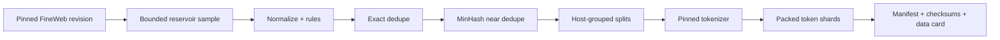

# Lab: Build a Small, Auditable Pretraining Corpus

> **Level:** beginner-friendly implementation with expert-grade lineage  
> **Result:** a bounded sample of real FineWeb records, filtered and deduplicated into deterministic splits, then tokenized and packed with document-span provenance.

This lab processes at most **10,000 streamed records** and keeps at most **1,000** by default. It does not download FineWeb’s full sample configuration. It is intentionally small enough to inspect, rerun and delete.

The goal is not to produce a competitive model corpus. The goal is to practice the mechanics correctly.

## 0. What you will build



Final layout:

```text
mini-corpus/
├── README.md
├── src/
│   ├── acquire.py
│   ├── curate.py
│   └── pack.py
├── data/
│   ├── raw/sample.jsonl
│   ├── curated/documents.jsonl
│   ├── curated/rejects.jsonl
│   ├── curated/duplicates.jsonl
│   └── packed/{train,validation,test}.jsonl
└── manifests/
    ├── acquisition.json
    ├── curation.json
    ├── tokenizer.json
    └── checksums.sha256
```

## 1. Read the terms before the data

FineWeb’s [dataset card](https://huggingface.co/datasets/HuggingFaceFW/fineweb) states that the database is released under ODC-By 1.0 and that Common Crawl’s Terms of Use also apply. ODC-By’s [full text](https://opendatacommons.org/licenses/by/1-0/index.html) does not grant all independent rights in each contained web page. Read [Common Crawl’s Terms of Use](https://commoncrawl.org/terms-of-use) as well.

For this research lab:

- do not publish the sampled text automatically;
- retain URL/crawl provenance;
- do not log raw text;
- delete a record when its source is validated for removal;
- obtain separate review before any public redistribution or commercial use.

## 2. Create an isolated environment

```bash
mkdir -p mini-corpus/src mini-corpus/data/raw mini-corpus/data/curated
mkdir -p mini-corpus/data/packed mini-corpus/manifests
cd mini-corpus

python3 -m venv .venv
source .venv/bin/activate
python -m pip install --upgrade pip
python -m pip install datasets huggingface_hub datasketch transformers
python -m pip freeze > manifests/environment.txt
```

The resolved versions in `environment.txt` are part of the artifact. For a durable project, build a lock file and container image as well.

## 3. Acquire a deterministic bounded sample

Save as `src/acquire.py`:

```python
from __future__ import annotations

import hashlib
import itertools
import json
import random
from datetime import datetime, timezone
from pathlib import Path

from datasets import load_dataset
from huggingface_hub import HfApi

REPO = "HuggingFaceFW/fineweb"
CONFIG = "sample-10BT"
SCAN_LIMIT = 10_000
KEEP = 1_000
SEED = 42

ROOT = Path(__file__).resolve().parents[1]
OUT = ROOT / "data/raw/sample.jsonl"
MANIFEST = ROOT / "manifests/acquisition.json"


def sha256_text(text: str) -> str:
    return hashlib.sha256(text.encode("utf-8")).hexdigest()


def main() -> None:
    info = HfApi().dataset_info(REPO, files_metadata=False)
    revision = info.sha

    stream = load_dataset(
        REPO,
        name=CONFIG,
        split="train",
        streaming=True,
        revision=revision,
    )

    # Deterministic reservoir over a bounded prefix. This scans no more than
    # SCAN_LIMIT records and avoids materializing the dataset.
    rng = random.Random(SEED)
    reservoir: list[dict] = []
    scanned = 0
    for index, row in enumerate(itertools.islice(stream, SCAN_LIMIT)):
        scanned += 1
        item = {
            "id": row["id"],
            "text": row["text"],
            "source": REPO,
            "source_revision": revision,
            "source_config": CONFIG,
            "url": row["url"],
            "dump": row["dump"],
            "crawl_date": row["date"],
            "warc_path": row["file_path"],
            "language": row["language"],
            "language_score": row["language_score"],
            "upstream_token_count": row["token_count"],
            "raw_sha256": sha256_text(row["text"]),
        }
        if index < KEEP:
            reservoir.append(item)
        else:
            target = rng.randint(0, index)
            if target < KEEP:
                reservoir[target] = item

    reservoir.sort(key=lambda row: row["id"])
    OUT.parent.mkdir(parents=True, exist_ok=True)
    with OUT.open("w", encoding="utf-8") as handle:
        for row in reservoir:
            handle.write(json.dumps(row, ensure_ascii=False) + "\n")

    manifest = {
        "created_at": datetime.now(timezone.utc).isoformat(),
        "dataset": REPO,
        "revision": revision,
        "config": CONFIG,
        "scan_limit": SCAN_LIMIT,
        "scanned": scanned,
        "kept": len(reservoir),
        "reservoir_seed": SEED,
        "selection_warning": (
            "Reservoir sample from the first bounded stream prefix; not a "
            "representative sample of all FineWeb."
        ),
        "database_license": "ODC-By-1.0",
        "dataset_card": f"https://huggingface.co/datasets/{REPO}",
        "common_crawl_terms": "https://commoncrawl.org/terms-of-use",
    }
    MANIFEST.write_text(json.dumps(manifest, indent=2) + "\n", encoding="utf-8")


if __name__ == "__main__":
    main()
```

Run it:

```bash
python src/acquire.py
wc -l data/raw/sample.jsonl
python -m json.tool manifests/acquisition.json
```

### What this code gets right

- It resolves `main` to an immutable Hub commit before reading.
- It sets a hard scan limit.
- It records selection bias rather than claiming representativeness.
- It keeps FineWeb’s URL, crawl, WARC and language metadata.
- It hashes the raw text and never prints it.

### What it does not prove

- that 1,000 records represent FineWeb;
- that every document is lawful for your intended use;
- that FineWeb’s upstream contents will remain unchanged elsewhere;
- that the first bounded stream prefix covers every crawl/domain evenly.

For a scientific sample, stratify by crawl, language score, domain and document length, then publish the sampling frame.

## 4. Normalize, filter and deduplicate

The thresholds below are lab choices, not universal quality rules:

- at least 50 whitespace-delimited words;
- no more than 50,000 characters;
- English language score at least 0.80;
- at least 20% unique lowercased words;
- near-duplicate Jaccard target of 0.85 over five-word shingles.

Save as `src/curate.py`:

```python
from __future__ import annotations

import hashlib
import json
import re
import unicodedata
from collections import Counter
from pathlib import Path
from urllib.parse import urlsplit

from datasketch import MinHash, MinHashLSH

ROOT = Path(__file__).resolve().parents[1]
RAW = ROOT / "data/raw/sample.jsonl"
DOCS = ROOT / "data/curated/documents.jsonl"
REJECTS = ROOT / "data/curated/rejects.jsonl"
DUPES = ROOT / "data/curated/duplicates.jsonl"
MANIFEST = ROOT / "manifests/curation.json"

MIN_WORDS = 50
MAX_CHARS = 50_000
MIN_LANGUAGE_SCORE = 0.80
MIN_UNIQUE_WORD_RATIO = 0.20
SHINGLE_SIZE = 5
MINHASH_PERMUTATIONS = 128
NEAR_DUP_THRESHOLD = 0.85
MINHASH_SEED = 42

WORD_RE = re.compile(r"\w+", re.UNICODE)
HORIZONTAL_SPACE_RE = re.compile(r"[\t\f\v ]+")
EXCESS_BLANKS_RE = re.compile(r"\n{3,}")


def read_jsonl(path: Path) -> list[dict]:
    with path.open(encoding="utf-8") as handle:
        return [json.loads(line) for line in handle if line.strip()]


def write_jsonl(path: Path, rows: list[dict]) -> None:
    path.parent.mkdir(parents=True, exist_ok=True)
    with path.open("w", encoding="utf-8") as handle:
        for row in rows:
            handle.write(json.dumps(row, ensure_ascii=False) + "\n")


def normalize(text: str) -> str:
    text = unicodedata.normalize("NFC", text).replace("\x00", "")
    lines = [HORIZONTAL_SPACE_RE.sub(" ", line).strip() for line in text.splitlines()]
    return EXCESS_BLANKS_RE.sub("\n\n", "\n".join(lines)).strip()


def sha256_text(text: str) -> str:
    return hashlib.sha256(text.encode("utf-8")).hexdigest()


def words(text: str) -> list[str]:
    return [match.group(0).lower() for match in WORD_RE.finditer(text)]


def quality(text: str, language_score: float) -> tuple[list[str], dict]:
    tokens = words(text)
    unique_ratio = len(set(tokens)) / max(1, len(tokens))
    scores = {
        "chars": len(text),
        "words": len(tokens),
        "unique_word_ratio": unique_ratio,
        "language_score": language_score,
    }
    reasons = []
    if len(tokens) < MIN_WORDS:
        reasons.append("too_short")
    if len(text) > MAX_CHARS:
        reasons.append("too_long")
    if language_score < MIN_LANGUAGE_SCORE:
        reasons.append("low_language_score")
    if unique_ratio < MIN_UNIQUE_WORD_RATIO:
        reasons.append("high_repetition")
    return reasons, scores


def minhash(text: str) -> MinHash:
    tokens = words(text)
    shingles = {
        " ".join(tokens[index:index + SHINGLE_SIZE])
        for index in range(max(1, len(tokens) - SHINGLE_SIZE + 1))
    }
    signature = MinHash(num_perm=MINHASH_PERMUTATIONS, seed=MINHASH_SEED)
    for shingle in sorted(shingles):
        signature.update(shingle.encode("utf-8"))
    return signature


def split_group(row: dict) -> str:
    host = (urlsplit(row.get("url", "")).hostname or "").lower()
    return f"host:{host}" if host else f"missing-host:{row['id']}"


def assign_split(group: str) -> str:
    # Exact host grouping is adequate for the lab. Production web splits should
    # pin a Public Suffix List and group by registrable domain or dedupe cluster.
    bucket = hashlib.sha256(group.encode("utf-8")).digest()[0]
    if bucket < 230:
        return "train"
    if bucket < 243:
        return "validation"
    return "test"


def main() -> None:
    staged = []
    rejects = []
    duplicates = []
    exact_survivor: dict[str, str] = {}
    counts = Counter()

    for row in read_jsonl(RAW):
        row["text"] = normalize(row["text"])
        row["content_sha256"] = sha256_text(row["text"])
        reasons, scores = quality(row["text"], float(row["language_score"]))
        row["quality"] = scores
        if reasons:
            rejects.append({"id": row["id"], "reasons": reasons, "quality": scores})
            counts.update(reasons)
            continue

        prior = exact_survivor.get(row["content_sha256"])
        if prior:
            duplicates.append({
                "duplicate_id": row["id"],
                "survivor_id": prior,
                "method": "normalized_sha256",
                "similarity": 1.0,
            })
            counts["exact_duplicate"] += 1
            continue
        exact_survivor[row["content_sha256"]] = row["id"]
        staged.append(row)

    # Best-looking deterministic survivors enter the LSH index first.
    staged.sort(key=lambda row: (
        -float(row["language_score"]),
        -len(row["text"]),
        row["id"],
    ))
    lsh = MinHashLSH(
        threshold=NEAR_DUP_THRESHOLD,
        num_perm=MINHASH_PERMUTATIONS,
    )
    kept = []
    for row in staged:
        signature = minhash(row["text"])
        matches = sorted(lsh.query(signature))
        if matches:
            duplicates.append({
                "duplicate_id": row["id"],
                "survivor_id": matches[0],
                "method": "minhash_lsh",
                "similarity": f">={NEAR_DUP_THRESHOLD}",
            })
            counts["near_duplicate"] += 1
            continue
        lsh.insert(row["id"], signature)
        group = split_group(row)
        row["split_group"] = group
        row["split"] = assign_split(group)
        row["lineage"] = ["normalize:nfc-v1", "rules:lab-v1", "dedupe:minhash-v1"]
        kept.append(row)

    kept.sort(key=lambda row: row["id"])
    rejects.sort(key=lambda row: row["id"])
    duplicates.sort(key=lambda row: row["duplicate_id"])
    write_jsonl(DOCS, kept)
    write_jsonl(REJECTS, rejects)
    write_jsonl(DUPES, duplicates)

    manifest = {
        "input": str(RAW.relative_to(ROOT)),
        "input_rows": len(staged) + len(rejects) + counts["exact_duplicate"],
        "kept_rows": len(kept),
        "rejected_rows": len(rejects),
        "duplicate_rows": len(duplicates),
        "reasons": dict(sorted(counts.items())),
        "policy": {
            "min_words": MIN_WORDS,
            "max_chars": MAX_CHARS,
            "min_language_score": MIN_LANGUAGE_SCORE,
            "min_unique_word_ratio": MIN_UNIQUE_WORD_RATIO,
            "shingle_size": SHINGLE_SIZE,
            "minhash_permutations": MINHASH_PERMUTATIONS,
            "near_duplicate_threshold": NEAR_DUP_THRESHOLD,
            "minhash_seed": MINHASH_SEED,
            "split_policy": "sha256(exact-host), byte buckets 230/13/13",
        },
    }
    MANIFEST.write_text(json.dumps(manifest, indent=2) + "\n", encoding="utf-8")


if __name__ == "__main__":
    main()
```

Run it:

```bash
python src/curate.py
wc -l data/curated/*.jsonl
python -m json.tool manifests/curation.json
```

### Why this order matters

1. Cheap deterministic rules run before expensive MinHash.
2. Exact deduplication removes obvious collisions.
3. Near-duplicate candidates are processed in a deterministic survivor order.
4. Splits are assigned after deduplication, and an exact host stays in one split.

### Known lab limitations

- Exact hostname grouping does not combine `www.example.com` with `news.example.com`.
- LSH is approximate and the threshold is not a verified exact Jaccard score.
- The quality rules favor English prose and may reject poetry, tables, code and unusual dialects.
- One thousand records is too small to estimate tail behavior.
- No PII, malware, secret or content-safety detector has been added; do not publish the text.
- No evaluation suite has been selected, so decontamination remains incomplete.

## 5. Add evaluation decontamination before training

Create a local, versioned `eval_examples.jsonl` with IDs and text for the exact evaluation splits you will use. Do not download a benchmark implicitly during the training job. At minimum:

1. normalize evaluation text with the same comparison transform;
2. remove exact content-hash matches;
3. compare word shingles for partial overlap;
4. record benchmark revision, threshold and matched training IDs;
5. rerun deduplication if removals break a duplicate cluster.

For production, handle reordered choices, solutions, translations and benchmark discussions. The [Google deduplication code](https://github.com/google-research/deduplicate-text-datasets) and AI2 Open Instruct’s [decontamination scripts](https://github.com/allenai/open-instruct/tree/main/decontamination) are concrete starting points.

## 6. Tokenize and pack with provenance

This lab uses the public GPT-NeoX tokenizer because Dolma’s own [getting-started tutorial](https://github.com/allenai/dolma/blob/main/docs/getting-started.md) uses it in a worked example. The tokenizer choice is not a quality recommendation. Pin its Hub revision and inspect its license/card for your use.

Save as `src/pack.py`:

```python
from __future__ import annotations

import json
from pathlib import Path

from huggingface_hub import HfApi
from transformers import AutoTokenizer

ROOT = Path(__file__).resolve().parents[1]
DOCS = ROOT / "data/curated/documents.jsonl"
OUT = ROOT / "data/packed"
MANIFEST = ROOT / "manifests/tokenizer.json"

TOKENIZER_ID = "EleutherAI/gpt-neox-20b"
SEQUENCE_LENGTH = 1_024


def documents(split: str):
    with DOCS.open(encoding="utf-8") as handle:
        for line in handle:
            row = json.loads(line)
            if row["split"] == split:
                yield row


def pack_split(split: str, tokenizer) -> dict:
    OUT.mkdir(parents=True, exist_ok=True)
    path = OUT / f"{split}.jsonl"
    sequence_id = 0
    buffer: list[int] = []
    spans: list[dict] = []
    document_count = 0
    token_count = 0

    with path.open("w", encoding="utf-8") as output:
        for row in documents(split):
            document_count += 1
            ids = tokenizer.encode(row["text"], add_special_tokens=False)
            ids.append(tokenizer.eos_token_id)
            source_offset = 0
            token_count += len(ids)

            while source_offset < len(ids):
                room = SEQUENCE_LENGTH - len(buffer)
                take = min(room, len(ids) - source_offset)
                start = len(buffer)
                buffer.extend(ids[source_offset:source_offset + take])
                spans.append({
                    "document_id": row["id"],
                    "sequence_token_start": start,
                    "sequence_token_end": start + take,
                    "document_token_start": source_offset,
                    "document_token_end": source_offset + take,
                })
                source_offset += take

                if len(buffer) == SEQUENCE_LENGTH:
                    output.write(json.dumps({
                        "sequence_id": f"{split}:{sequence_id:08d}",
                        "input_ids": buffer,
                        "document_spans": spans,
                    }) + "\n")
                    sequence_id += 1
                    buffer = []
                    spans = []

        # Keep a short final sequence for inspection. A trainer may pad it or
        # choose to drop it; that decision must be explicit.
        if buffer:
            output.write(json.dumps({
                "sequence_id": f"{split}:{sequence_id:08d}",
                "input_ids": buffer,
                "document_spans": spans,
            }) + "\n")
            sequence_id += 1

    return {
        "split": split,
        "documents": document_count,
        "tokens_with_eos": token_count,
        "sequences": sequence_id,
        "output": str(path.relative_to(ROOT)),
    }


def main() -> None:
    revision = HfApi().model_info(TOKENIZER_ID).sha
    tokenizer = AutoTokenizer.from_pretrained(TOKENIZER_ID, revision=revision)
    if tokenizer.eos_token_id is None:
        raise RuntimeError("Tokenizer must define an EOS token")

    splits = [pack_split(name, tokenizer) for name in ("train", "validation", "test")]
    manifest = {
        "tokenizer": TOKENIZER_ID,
        "revision": revision,
        "sequence_length": SEQUENCE_LENGTH,
        "eos_token_id": tokenizer.eos_token_id,
        "vocab_size": len(tokenizer),
        "splits": splits,
        "packing": "concatenate documents with EOS and retain token-span lineage",
    }
    MANIFEST.write_text(json.dumps(manifest, indent=2) + "\n", encoding="utf-8")


if __name__ == "__main__":
    main()
```

Run it:

```bash
python src/pack.py
wc -l data/packed/*.jsonl
python -m json.tool manifests/tokenizer.json
```

Never publish `input_ids` without publishing the exact tokenizer revision. Token IDs have no stable meaning outside that tokenizer.

## 7. Audit the artifact

### Basic invariants

```bash
python - <<'PY'
import json
from collections import Counter
from pathlib import Path

root = Path("data/curated")
rows = [json.loads(line) for line in (root / "documents.jsonl").open()]

assert len({row["id"] for row in rows}) == len(rows)
assert len({row["content_sha256"] for row in rows}) == len(rows)
assert all(row["text"].strip() == row["text"] for row in rows)
assert all(row["split"] in {"train", "validation", "test"} for row in rows)

groups = {}
for row in rows:
    prior = groups.setdefault(row["split_group"], row["split"])
    assert prior == row["split"]

print("splits", Counter(row["split"] for row in rows))
print("sources", Counter(row["source"] for row in rows))
PY
```

### Checksums

```bash
find data manifests -type f ! -name checksums.sha256 -print0 \
  | sort -z \
  | xargs -0 shasum -a 256 \
  > manifests/checksums.sha256

shasum -a 256 -c manifests/checksums.sha256
```

Run the pipeline twice from a clean output directory. `created_at` will differ unless you use a build timestamp, but normalized documents, duplicate maps, split assignments and packed sequences should hash identically when revisions, environment and inputs are fixed.

## 8. Write the data card

Your `README.md` should include:

```markdown
# Mini FineWeb Audit Corpus

## Purpose
Teaching artifact for bounded streaming, provenance, filtering,
deduplication, split grouping and token packing. Not representative of FineWeb.

## Source
- Dataset: HuggingFaceFW/fineweb
- Immutable revision: <from acquisition manifest>
- Configuration: sample-10BT
- Retrieval date: <timestamp>

## Sampling
Reservoir sample of 1,000 records from a bounded prefix of 10,000 streamed
records, seed 42. This is biased by upstream stream order.

## Processing
NFC normalization, documented prose rules, normalized SHA-256 exact dedupe,
five-word-shingle MinHashLSH at target threshold 0.85, exact-host split grouping.

## Schema
Document schema and packed-sequence schema, including document-span lineage.

## Rights and access
FineWeb database: ODC-By 1.0. Common Crawl Terms of Use also apply.
Individual source-content rights are not granted wholesale by ODC-By.

## Known limitations
Small biased sample; English-prose filters; no complete PII/safety/license review;
exact-host grouping rather than registrable-domain grouping; no benchmark
decontamination until an evaluation suite is pinned.

## Removal
Contact <maintained address>. Source URL, FineWeb ID or content hash can be used
to resolve the record and its packed token spans.
```

The [Hugging Face dataset-card guide](https://huggingface.co/docs/hub/datasets-cards) describes metadata syntax. Use [Datasheets for Datasets](https://arxiv.org/abs/1803.09010) to expand motivation, composition, collection, use and maintenance sections.

## 9. Scale only after answering these questions

- Are source terms and redistribution policy approved for the intended release?
- Are sampling strata representative of the target languages/domains?
- Have filter error rates been measured per stratum?
- Are PII, credentials, malware and restricted content handled?
- Is the dedupe survivor policy rights-aware and deterministic?
- Is the evaluation suite pinned and decontaminated?
- Does lineage survive packed sequences?
- Can one source record be removed from maintained releases?
- Are token counts and storage/compute forecasts based on measured samples?
- Can another researcher reconstruct the exact ordered stream?

Scaling an unclear policy creates a larger unclear policy. Run this lab, inspect every output, then replace each toy assumption deliberately.

## Exercises

### Beginner

1. Change `KEEP` to 100 and explain why the corpus is still not a random sample of all FineWeb.
2. Pick five rejected records by reason and review them safely. Which rule has the most false positives?
3. Decode one packed sequence and use `document_spans` to recover its source IDs.

### Intermediate

1. Add a pinned Public Suffix List and group splits by registrable domain.
2. Add an exact evaluation-hash decontamination stage and a report manifest.
3. Replace the prose-only rules with source-specific policies for code and mathematics.

### Advanced

1. Implement a deterministic, disk-backed MinHash candidate index and verify exact Jaccard similarity before removal.
2. Add a tombstone command that removes a source ID from curated documents and every packed sequence, then regenerates checksums.
3. Build a stratified sample by crawl, domain, language score and length. Publish inclusion probabilities so estimates can be weighted correctly.

Reference: [Dataset and Open-Stack Links](../reference/datasets.md).
