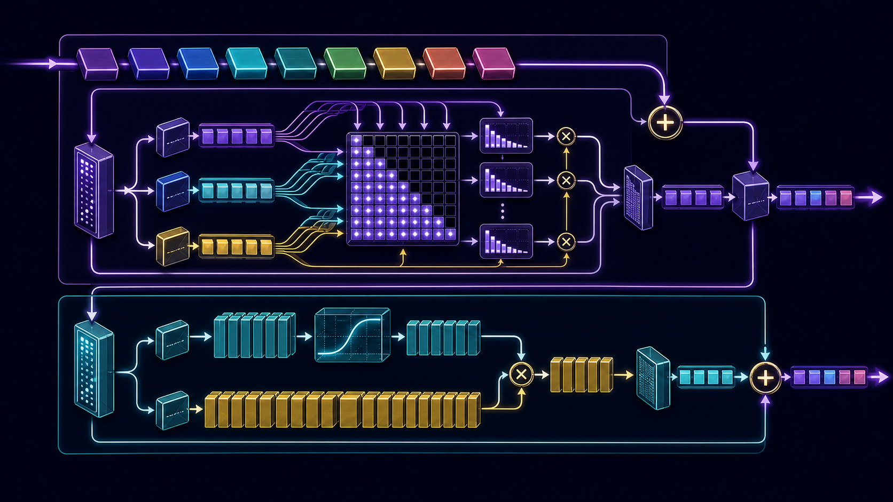
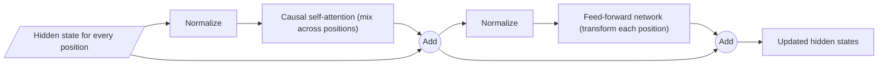
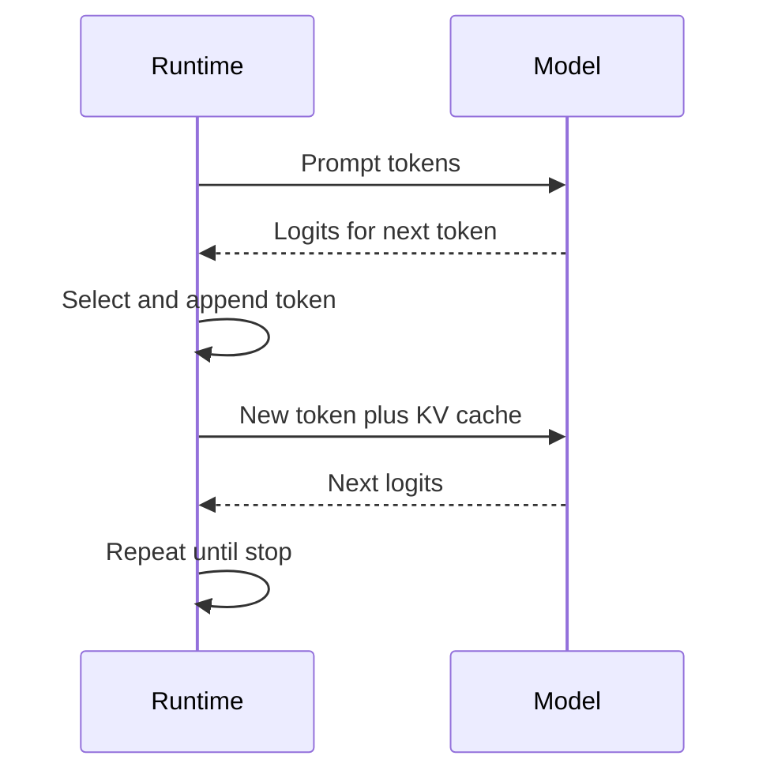

# The Transformer mental model

An LLM is a function that repeatedly answers one narrow question:

> Given the tokens visible so far, what probability should I assign to every
> possible next token?

Everything else - prose, code, tool calls, apparent planning - emerges from
training that next-token function and then sampling or selecting from its
output. The Transformer is the circuit that turns context tokens into the next
distribution.

This chapter builds a reliable map before the later chapters open each box.

<figure markdown>
  { loading=lazy }
  <figcaption>Generated conceptual plate. The Mermaid diagrams, tensor shapes, and equations below are the precise reference.</figcaption>
</figure>

## The whole path in one picture

```mermaid
flowchart LR
    textInput[/Input text/]
    tokenizer[Tokenizer]
    tokenIds[Token IDs]
    embeddings[Token vectors]
    blockOne[Transformer block 1]
    blockMany[Transformer blocks 2 to L]
    finalNorm[Final normalization]
    vocabulary["Vocabulary logits (one score per token)"]
    probabilities[Next-token probabilities]
    chosenToken([Chosen token])

    textInput --> tokenizer
    tokenizer --> tokenIds
    tokenIds --> embeddings
    embeddings --> blockOne
    blockOne --> blockMany
    blockMany --> finalNorm
    finalNorm --> vocabulary
    vocabulary --> probabilities
    probabilities --> chosenToken
    chosenToken -.->|"Append and repeat"| tokenIds
```



For a decoder-only language model, the major tensors are:

| Stage | Typical shape | Meaning |
|---|---:|---|
| Token IDs | `(batch, sequence)` | Integer vocabulary indexes |
| Hidden states | `(batch, sequence, d_model)` | One contextual vector per token position |
| Attention queries | `(batch, heads, sequence, d_head)` | What each position seeks |
| Attention scores | `(batch, heads, sequence, sequence)` | Pairwise compatibility before/after masking |
| Vocabulary logits | `(batch, sequence, vocab_size)` | Unnormalized next-token scores |

The exact dimension order varies by implementation. Track the *named axes*, not
just the tuple.

## What a Transformer block does

The 2017 Transformer paired attention with a position-wise feed-forward network
and wrapped both in residual connections and normalization. Modern decoder-only
models preserve that division even when they change the details
([original paper, Section 3](https://arxiv.org/abs/1706.03762)).



That gives the most useful first distinction:

- **Attention moves information between token positions.** A pronoun can pull
  information from a preceding name; a closing brace can attend to earlier
  structure.
- **The FFN transforms each position independently.** The same learned function
  is applied to every position. In a sparse MoE block, a router chooses which
  subset of FFNs processes each position.
- **Residual paths preserve a running stream.** Each sublayer writes an update
  into the existing hidden state instead of replacing it wholesale.

Meta's released Llama 3 inference code makes this modern pre-normalized form
especially readable: the entire block forward pass is two residual additions
([source lines 222-248](https://github.com/meta-llama/llama3/blob/a0940f9cf7065d45bb6675660f80d305c041a754/llama/model.py#L222-L248)).

## A concrete one-token trace

Suppose the current text is:

```text
The capital of France is
```

The real tokenizer may split leading spaces and words differently, but imagine
the conceptual token IDs are:

```text
[The, capital, of, France, is]
```

1. The embedding table retrieves a vector for each ID.
2. Positional information distinguishes the first token from the fifth.
3. In each block, causal attention lets position 5 read positions 1 through 5,
   never the unseen answer.
4. The FFN transforms the newly contextualized vector at each position.
5. The final vector at position 5 is projected to one logit per vocabulary
   token.
6. Softmax converts the logits to probabilities. A trained model may assign a
   high probability to a token representing a leading-space form of `Paris`.
7. Decoding selects a token. The runtime appends it and performs another step.

The model does **not** retrieve an English sentence from an internal database.
It computes the next-token distribution from learned weights and the current
context. Retrieval-augmented systems can place database results *into the
context*, but the Transformer still processes them as tokens.

## Training and generation use the same causal model differently

### During pretraining

One sequence supplies many supervised positions at once:

```text
Input positions:   The | capital | of | France | is
Targets:       capital | of      | France | is | Paris
```

A causal mask prevents each position from reading a later target. Because all
positions are already known during training, their losses can be calculated in
parallel. This is called *teacher forcing*: the input prefix uses the real
previous tokens, not tokens sampled by the model.

### During autoregressive generation

Only the newest position needs a new prediction. Previously computed keys and
values can be retained in a KV cache. Generation is still sequential over
newly produced tokens: token `t+1` cannot be selected until token `t` is known.



## Encoder, decoder, and decoder-only models

The original Transformer is an encoder-decoder model for translation
([Vaswani et al.](https://arxiv.org/abs/1706.03762)):

- the **encoder** reads the full source sequence with bidirectional attention;
- the **decoder** uses causal self-attention over generated target tokens;
- decoder cross-attention reads encoder outputs.

Most general-purpose generative LLMs discussed in this book are
**decoder-only**: they stack causal blocks and predict the next token. Do not
look for a separate encoder inside a decoder-only checkpoint just because the
word "Transformer" appears in both designs.

## Parameters, activations, and context are different things

These concepts are often blended together:

| Concept | Exists for how long? | Example |
|---|---|---|
| Parameters | Stored with the model | Attention projection weights |
| Activations | One forward/backward pass | Current token hidden states |
| Optimizer state | Training only | Adam moments |
| KV cache | A generation request | Prior keys and values per layer |
| Context tokens | The request | System message, prompt, generated prefix |

A 7B-parameter model does not have a seven-billion-token context. A longer
context increases activation and KV-cache work; it does not add learned
parameters.

## Five mental models to reject

### "Attention is a database lookup"

Attention produces a weighted mixture of value vectors from visible positions.
It can behave like retrieval in some heads, but the weights are continuous,
contextual, and recalculated in every layer.

### "Each attention head has a permanent English-language job"

Heads can show interpretable patterns, but assigning permanent human labels is
an analysis claim that requires measurement. The architecture only defines
projections and weighted combinations.

### "More parameters run for every token"

True for a dense layer, but not for a sparse MoE layer. An MoE can store many
expert FFNs while activating only a subset per token. Attention, embeddings,
normalization, and other shared components still run.

### "An MoE expert is a complete mini-LLM"

In Mixtral, DeepSeekMoE, Qwen MoE, DBRX, and OLMoE, experts replace FFN
sub-blocks. They are not independently prompted agents with their own complete
attention stacks.

### "The model thinks once, then writes"

The model updates its computation after every selected token. Apparent plans
may be represented in the context and hidden states, but the external operation
remains repeated next-token prediction.

## Read released code with this map

When opening a model implementation, locate these in order:

1. model configuration: `d_model`, layer count, heads, vocabulary;
2. token embedding and final vocabulary projection;
3. one block's `forward` method;
4. attention projections and mask;
5. dense FFN or MoE router and experts;
6. top-level loop over blocks;
7. cache update and generation wrapper.

For a compact real trail, see Meta's released Llama 3
[`model.py`](https://github.com/meta-llama/llama3/blob/a0940f9cf7065d45bb6675660f80d305c041a754/llama/model.py).
The file contains RMSNorm, RoPE, grouped-query attention, SwiGLU, the block, and
the top-level decoder in that order.

## Check your understanding

You should now be able to answer:

1. Which sublayer mixes information across token positions?
2. Which axis does the vocabulary projection create?
3. Why can training score all positions in parallel while generation cannot
   choose all future tokens in parallel?
4. What survives through a residual connection when a sublayer writes a small
   update?
5. In a standard Transformer MoE, which sub-block is usually replaced by
   experts?

Next: [embeddings and position](02-embeddings-and-position.md).
