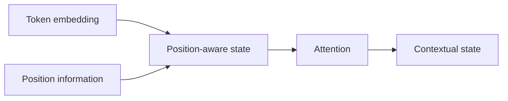
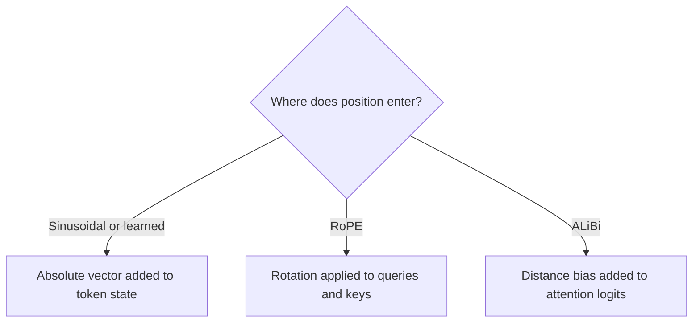

# Embeddings and position

A Transformer cannot consume text. It consumes integer token IDs, looks up a
vector for each ID, and gives the model a way to distinguish where those vectors
occur.

Those are separate jobs:

- **token embeddings** answer "which vocabulary item is this?";
- **position mechanisms** answer "where is it, or how far apart are two
  positions?";
- **attention and FFNs** turn those initial vectors into contextual states.

## From an ID to a vector

Let the vocabulary contain `V` tokens and the model width be `d`. The embedding
table is a learned matrix

$$
E \in \mathbb{R}^{V \times d}.
$$

For token ID $t$, lookup returns row $E_t$. This is an indexed read, not a
one-hot matrix multiplication in an efficient implementation, although it is
mathematically equivalent to multiplying a one-hot vector by $E$.

```python
import torch
from torch import nn

vocab_size = 32_000
d_model = 512
embedding = nn.Embedding(vocab_size, d_model)

token_ids = torch.tensor([[41, 9, 9, 2]])  # (batch=1, sequence=4)
x = embedding(token_ids)
assert x.shape == (1, 4, 512)
```

Two occurrences of token ID `9` begin with the same embedding row. They become
different hidden states after position information and surrounding context are
applied.

## Embeddings are learned coordinates, not dictionary definitions

An embedding dimension does not normally correspond to a named human feature
such as "plural" or "France." Training adjusts the coordinates so the full
network can reduce next-token loss. Relations can be distributed across many
dimensions and transformed at every layer.

Similarly, an embedding row is not the model's complete knowledge about its
token. It is only the starting state. Facts and behaviors depend on the entire
stack of learned parameters.

## The output side: hidden state to vocabulary logits

After the final block and normalization, a language-model head maps hidden
state $h_t \in \mathbb{R}^d$ to `V` logits:

$$
\ell_t = W_{\text{vocab}} h_t, \qquad
W_{\text{vocab}} \in \mathbb{R}^{V \times d}.
$$

Some architectures tie $W_{\text{vocab}}$ to the input embedding matrix. The
original Transformer shared embedding and pre-softmax weights and scaled input
embeddings by $\sqrt{d}$
([Section 3.4](https://arxiv.org/abs/1706.03762)). Weight tying is a model
configuration choice, not a law of Transformers.

## Why order must be introduced

Attention without a position mechanism is permutation-equivariant: reordering
the input reorders the outputs, but the operation has no inherent concept that
one token came first. Language needs order:

```text
dog bites person
person bites dog
```

The vocabulary items are the same; their relations are not.



There are several ways to inject order. Do not collapse them into the generic
word "positional embedding."

## Absolute sinusoidal positions

The original Transformer adds a deterministic vector to each token embedding.
For position $p$ and coordinate pair indexed by $i$:

$$
PE_{p,2i} = \sin\left(p / 10000^{2i/d}\right),
$$

$$
PE_{p,2i+1} = \cos\left(p / 10000^{2i/d}\right).
$$

Different coordinate pairs rotate at different frequencies. Nearby positions
have related patterns, while the collection of frequencies can distinguish a
wide range of positions
([Section 3.5](https://arxiv.org/abs/1706.03762)).

```python
import torch


def sinusoidal_positions(length: int, d_model: int) -> torch.Tensor:
    if d_model % 2:
        raise ValueError("This compact implementation requires even d_model")
    position = torch.arange(length, dtype=torch.float32)[:, None]
    coordinate = torch.arange(0, d_model, 2, dtype=torch.float32)
    inv_frequency = 1.0 / (10_000 ** (coordinate / d_model))
    angles = position * inv_frequency[None, :]

    table = torch.empty(length, d_model)
    table[:, 0::2] = angles.sin()
    table[:, 1::2] = angles.cos()
    return table


pe = sinusoidal_positions(length=128, d_model=512)
assert pe.shape == (128, 512)
```

Learned absolute position embeddings use a trainable lookup table instead. Both
approaches attach an absolute-position signal to the stream before or within
the stack.

## RoPE: rotate queries and keys

Rotary position embedding (RoPE) takes a different route. It rotates pairs of
coordinates in queries and keys according to position before their dot product
is computed ([RoFormer](https://arxiv.org/abs/2104.09864)).

For one 2D coordinate pair and angular frequency $\theta$:

$$
R(p\theta) =
\begin{bmatrix}
\cos(p\theta) & -\sin(p\theta) \\
\sin(p\theta) & \cos(p\theta)
\end{bmatrix}.
$$

The position-aware query and key are

$$
q_p' = R(p\theta)q_p, \qquad k_s' = R(s\theta)k_s.
$$

Their dot product contains a relative-position identity:

$$
(q_p')^T k_s'
= q_p^T R(p\theta)^T R(s\theta) k_s
= q_p^T R((s-p)\theta) k_s.
$$

The absolute rotations combine so the attention compatibility depends on the
relative offset $s-p$. The full method applies a bank of frequencies across
the head dimension.

```python
import torch


def rotate_pairs(x: torch.Tensor) -> torch.Tensor:
    """Rotate (x0, x1) to (-x1, x0) in every adjacent pair."""
    even = x[..., 0::2]
    odd = x[..., 1::2]
    return torch.stack((-odd, even), dim=-1).flatten(-2)


def apply_rope(
    q: torch.Tensor,
    k: torch.Tensor,
    positions: torch.Tensor,
    base: float = 10_000.0,
) -> tuple[torch.Tensor, torch.Tensor]:
    """Apply RoPE to q and k shaped (batch, heads, sequence, head_dim)."""
    head_dim = q.shape[-1]
    if q.shape != k.shape or head_dim % 2:
        raise ValueError("q and k must match and have an even head dimension")

    pair_coordinates = torch.arange(0, head_dim, 2, device=q.device)
    inv_frequency = 1.0 / (base ** (pair_coordinates.float() / head_dim))
    angles = positions.float()[:, None] * inv_frequency[None, :]
    cos = angles.cos().repeat_interleave(2, dim=-1)[None, None, :, :]
    sin = angles.sin().repeat_interleave(2, dim=-1)[None, None, :, :]

    return q * cos + rotate_pairs(q) * sin, k * cos + rotate_pairs(k) * sin


q = torch.randn(2, 8, 16, 64)
k = torch.randn_like(q)
q_rotated, k_rotated = apply_rope(q, k, torch.arange(16))
assert q_rotated.shape == q.shape == k_rotated.shape
```

For a real released implementation, follow Meta's Llama 3
[`precompute_freqs_cis` and `apply_rotary_emb`](https://github.com/meta-llama/llama3/blob/a0940f9cf7065d45bb6675660f80d305c041a754/llama/model.py#L49-L76).
That implementation represents each coordinate pair as a complex number;
complex multiplication performs the rotation.

## ALiBi: bias attention by distance

Attention with Linear Biases (ALiBi) does not add position vectors or rotate
queries and keys. It adds a head-specific penalty proportional to query-key
distance directly to attention logits
([Press et al.](https://arxiv.org/abs/2108.12409)). Conceptually:

$$
\text{score}_{h,p,s}
= \frac{q_{h,p} k_{h,s}^T}{\sqrt{d_h}}
- m_h(p-s), \qquad s \le p.
$$

The causal condition $s \le p$ still comes from the mask. The linear term says
how a head's score changes with distance.



## Position limits: configured length is not proven quality

A checkpoint's context limit involves more than whether code can allocate a
larger tensor. It can depend on:

- lengths and packing used during training;
- the positional method and its frequencies or biases;
- attention masks and cache implementation;
- memory available for activations and KV cache;
- empirical quality at the target distance.

Changing `max_position_embeddings` can make a runtime accept longer inputs
without proving that the checkpoint will use the extra region well. Techniques
that rescale or interpolate RoPE likewise need model-specific evaluation.

## A debugging checklist

When position handling is wrong, look for:

1. **off-by-one cache positions** - new tokens reuse or skip a RoPE index;
2. **padding treated as content** - masks allow attention into pad positions;
3. **left-padding position IDs** - IDs do not match the runtime's convention;
4. **double application** - position information is added or rotated twice;
5. **dimension mismatch** - RoPE is applied over the wrong head subdimension;
6. **unsupported extension** - the runtime accepts a length the checkpoint was
   not validated to handle.

## Check your understanding

1. Why do two identical token IDs start with equal token vectors but later
   acquire different hidden states?
2. Where does RoPE operate: token embeddings, Q/K, V, or logits?
3. Which identity makes relative offset appear in a RoPE dot product?
4. Why is increasing a configuration length not evidence of long-context
   quality?
5. How does ALiBi's insertion point differ from RoPE's?

Next: [attention from scratch](03-attention-from-scratch.md).
