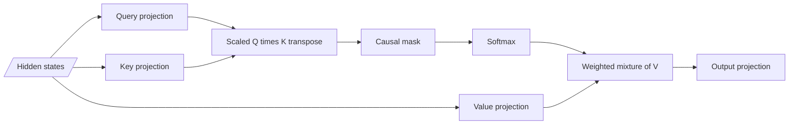
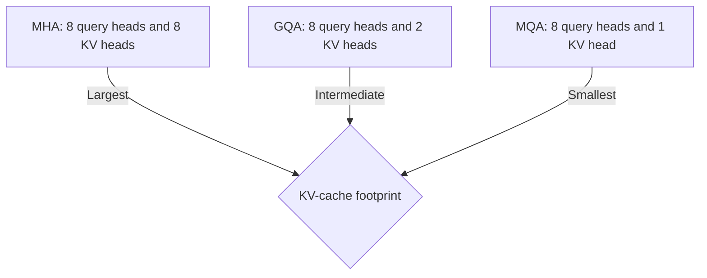

# Attention from scratch

Self-attention lets every visible token position build a new vector by taking a
weighted mixture of information from other visible positions.

For causal language modeling, "visible" means the current position and the
prefix to its left. The future is masked.

## The three projections

For hidden states $X \in \mathbb{R}^{S \times d}$, learned projections create
queries, keys, and values:

$$
Q = XW_Q, \qquad K = XW_K, \qquad V = XW_V.
$$

A useful interpretation is:

- **query**: what information does this position seek?
- **key**: what kind of information does this position advertise?
- **value**: what information should be copied if this position is selected?

These are metaphors for learned vectors, not hand-authored database fields.



## Scaled dot-product attention

The original Transformer defines

$$
\operatorname{Attention}(Q,K,V)
= \operatorname{softmax}\left(\frac{QK^T}{\sqrt{d_k}} + M\right)V,
$$

where $M$ is a mask containing zero for allowed pairs and a large negative
value (conceptually $-\infty$) for forbidden pairs
([Vaswani et al., Section 3.2.1](https://arxiv.org/abs/1706.03762)).

Read it left to right:

1. $QK^T$ computes one compatibility score for each query-key pair.
2. dividing by $\sqrt{d_k}$ keeps score magnitudes controlled;
3. the mask removes forbidden positions before normalization;
4. softmax makes each allowed query row sum to one;
5. multiplying by $V$ forms a weighted mixture of value vectors.

### Why divide by the square root of the head dimension?

If query and key components are roughly independent, zero-mean, and unit
variance, their dot product sums $d_k$ products and has variance proportional to
$d_k$. Its standard deviation therefore grows like $\sqrt{d_k}$. Dividing by
$\sqrt{d_k}$ keeps logits in a range where softmax is less likely to saturate.

The assumptions are approximate; the scaling argument explains the design, not
an invariant that activations always satisfy.

## The causal mask

For sequence length 5, an allowed causal pattern is:

```text
key position ->    0  1  2  3  4
query position 0   Y  .  .  .  .
query position 1   Y  Y  .  .  .
query position 2   Y  Y  Y  .  .
query position 3   Y  Y  Y  Y  .
query position 4   Y  Y  Y  Y  Y
```

Masking must happen **before** softmax. Zeroing forbidden probabilities after
softmax without re-normalizing gives the remaining positions a sum below one.

Padding is a separate concern. A batch may need both:

- a causal mask to block future tokens;
- a padding mask to block non-content pad positions.

## A complete readable implementation

This implementation favors clarity over fused-kernel performance. It uses
multi-head causal self-attention with the same number of query, key, and value
heads.

```python
import math

import torch
from torch import nn


def split_heads(x: torch.Tensor, n_heads: int) -> torch.Tensor:
    """(B, S, D) -> (B, H, S, D/H)."""
    batch, sequence, d_model = x.shape
    if d_model % n_heads:
        raise ValueError("d_model must be divisible by n_heads")
    d_head = d_model // n_heads
    return x.view(batch, sequence, n_heads, d_head).transpose(1, 2)


class ReadableCausalAttention(nn.Module):
    def __init__(self, d_model: int, n_heads: int):
        super().__init__()
        if d_model % n_heads:
            raise ValueError("d_model must be divisible by n_heads")
        self.n_heads = n_heads
        self.q_proj = nn.Linear(d_model, d_model, bias=False)
        self.k_proj = nn.Linear(d_model, d_model, bias=False)
        self.v_proj = nn.Linear(d_model, d_model, bias=False)
        self.out_proj = nn.Linear(d_model, d_model, bias=False)

    def forward(
        self,
        x: torch.Tensor,
    ) -> tuple[torch.Tensor, torch.Tensor]:
        batch, sequence, d_model = x.shape
        q = split_heads(self.q_proj(x), self.n_heads)
        k = split_heads(self.k_proj(x), self.n_heads)
        v = split_heads(self.v_proj(x), self.n_heads)
        d_head = q.shape[-1]

        scores = q @ k.transpose(-2, -1)
        scores = scores / math.sqrt(d_head)

        allowed = torch.ones(
            sequence,
            sequence,
            device=x.device,
            dtype=torch.bool,
        ).tril()
        scores = scores.masked_fill(~allowed, float("-inf"))

        # The float32 softmax is useful when model activations use lower precision.
        weights = torch.softmax(scores.float(), dim=-1).to(q.dtype)
        mixed = weights @ v
        mixed = mixed.transpose(1, 2).contiguous().view(batch, sequence, d_model)
        return self.out_proj(mixed), weights


torch.manual_seed(7)
layer = ReadableCausalAttention(d_model=64, n_heads=4)
x = torch.randn(2, 10, 64)
y, weights = layer(x)

assert y.shape == (2, 10, 64)
assert weights.shape == (2, 4, 10, 10)
assert torch.allclose(weights.sum(dim=-1), torch.ones(2, 4, 10))
assert weights[..., 0, 1:].count_nonzero() == 0
```

Production kernels fuse, tile, and reorder these operations, but the semantic
result remains the scaled, masked mixture. Compare the code above with Meta's
released Llama 3 attention
([lines 90-190](https://github.com/meta-llama/llama3/blob/a0940f9cf7065d45bb6675660f80d305c041a754/llama/model.py#L90-L190))
and PyTorch's `scaled_dot_product_attention` call in torchtitan
([lines 342-403](https://github.com/pytorch/torchtitan/blob/51c197c86d7c703da96f666d5a7dbd5432b4afbf/torchtitan/models/common/attention.py#L342-L403)).

## Multi-head attention

Instead of one large query/key/value operation, multi-head attention uses
separate learned projections into $H$ subspaces:

$$
\text{head}_h
= \operatorname{Attention}(XW_Q^{(h)}, XW_K^{(h)}, XW_V^{(h)}),
$$

$$
\operatorname{MHA}(X)
= \operatorname{Concat}(\text{head}_1, \ldots, \text{head}_H)W_O.
$$

Each head has width $d_h = d/H$ in the common case. Heads can learn different
patterns, but the architecture does not assign them human labels. The output
projection mixes all head outputs back into the model-width stream.

## MHA, MQA, and GQA

During autoregressive decoding, a runtime stores previous keys and values for
every layer. Reducing the number of key/value heads reduces this KV cache and
the bandwidth needed to read it.

| Variant | Query heads | KV heads | Head sharing |
|---|---:|---:|---|
| MHA | `H` | `H` | One K/V head per query head |
| MQA | `H` | `1` | All query heads share one K/V head |
| GQA | `H` | `G`, where `1 < G < H` | Groups of query heads share K/V heads |

Multi-query attention was introduced for faster decoding by sharing keys and
values across heads
([Shazeer](https://arxiv.org/abs/1911.02150)). Grouped-query attention provides
an intermediate point and describes uptraining MHA checkpoints into GQA
([Ainslie et al.](https://arxiv.org/abs/2305.13245)).

Suppose there are 32 query heads and 8 KV heads. Each KV head is reused by 4
query heads. Implementations often repeat a *view* or logically broadcast K/V
for the attention computation; they do not need 32 separately learned KV
projections.



Fewer KV heads do not change causal attention's worst-case dependence on the
number of query-key pairs. They target cache size and memory traffic.

## Prefill, decode, and the KV cache

### Prefill

The model processes all prompt positions. For full attention at sequence length
$S$, each head conceptually forms an $S \times S$ score pattern. Causality masks
its upper triangle, but straightforward dense computation is still quadratic.

### Decode

For one new token, the model creates one new query and one new key/value pair.
The query attends to cached keys for the entire prefix. Per-layer attention work
for that newest query grows linearly with the current prefix length, while
generation remains sequential across output tokens.

The cache is an optimization. It should not change logits except for expected
numeric differences. A strong runtime test compares cached versus non-cached
generation for the same prefix and decoding settings.

## Compute and memory

For dense full attention, the pairwise score work scales roughly as
$O(S^2d)$, and a naive implementation materializes $O(S^2)$ attention data per
head. The projection work also matters and scales with the model width.

FlashAttention is an IO-aware exact algorithm that tiles the computation so it
does not write the full attention matrix to high-bandwidth memory. It reduces
memory traffic and intermediate storage while preserving the mathematical
attention result
([Dao et al.](https://arxiv.org/abs/2205.14135)). It is not a learned sparse
attention pattern and does not make the exact arithmetic linear in $S$.

## Attention weights are not automatically explanations

An attention matrix shows how one head mixed values at one layer for one input.
It does not by itself establish:

- a causal explanation for the final output;
- what information the value vectors contained;
- how later heads and FFNs transformed the mixture;
- whether another attention pattern would yield the same prediction.

Use attention visualization as a diagnostic measurement, not as a complete
model explanation.

## Common implementation failures

### Wrong scaling dimension

Divide by $\sqrt{d_{head}}$, not $\sqrt{d_{model}}$ when each head's dot product
has `d_head` components.

### Masking after softmax

Apply the causal/padding mask to logits before softmax.

### Softmax over the wrong axis

Normalize each query across key positions, which is normally the last score
axis.

### Silent transpose errors

Annotate tensors with names such as `(B, H, S, D_head)`. A multiplication that
runs is not necessarily the intended multiplication.

### KV cache position drift

New keys/values and positional indexes must refer to the same absolute token
position. A cache can have correct shapes and still produce wrong logits.

### Treating GQA repetition as new parameters

Logical repetition of KV states for query groups is sharing, not additional
learned KV heads.

## Exercises

1. Set every query and key vector to zero. What are the causal attention weights
   for each row?
2. Add a padding mask to `ReadableCausalAttention` and test left- and
   right-padded batches.
3. Compare the readable implementation with
   `torch.nn.functional.scaled_dot_product_attention` using identical Q/K/V.
4. Change the number of heads while holding `d_model` fixed. Which tensor axes
   change?
5. Estimate KV-cache elements per layer for MHA, GQA, and MQA using batch `B`,
   sequence `S`, KV heads `H_kv`, and head width `D_h`.

Next: [the Transformer block](04-the-transformer-block.md).
