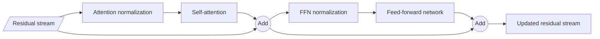
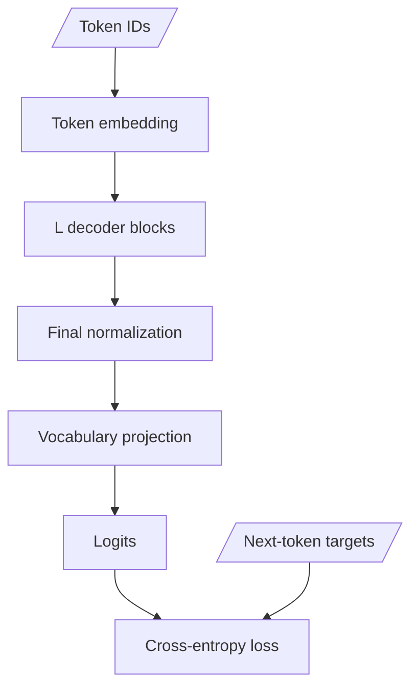

# The Transformer block

A decoder-only Transformer is mostly one block repeated many times. Understanding
that block is more valuable than memorizing a list of model names.

The two learned sublayers have complementary roles:

1. causal self-attention mixes information across visible positions;
2. a feed-forward network transforms each position independently.

Normalization and residual connections make the deep stack trainable.

## Original post-norm and modern pre-norm

The original 2017 architecture normalizes after adding each sublayer update:

$$
y = \operatorname{LayerNorm}(x + \operatorname{Attention}(x)),
$$

$$
z = \operatorname{LayerNorm}(y + \operatorname{FFN}(y)).
$$

This is commonly called **post-norm**. Many modern LLMs normalize the sublayer
input instead:

$$
y = x + \operatorname{Attention}(\operatorname{Norm}(x)),
$$

$$
z = y + \operatorname{FFN}(\operatorname{Norm}(y)).
$$

This is **pre-norm**. Research analyzing the two placements connects pre-norm
to better-behaved gradients at initialization
([Xiong et al.](https://arxiv.org/abs/2002.04745)). It is still possible to
train post-norm models with appropriate methods; "pre-norm" is a placement,
not a guarantee of quality.



## The residual stream

It is useful to imagine a model-width vector at every token position flowing
through the stack. Attention and the FFN each compute an update to that stream:

$$
x_{l+1} = x_l + \Delta_l(x_l).
$$

The identity path matters for optimization. Its local derivative includes an
identity term:

$$
\frac{\partial x_{l+1}}{\partial x_l}
= I + \frac{\partial \Delta_l}{\partial x_l}.
$$

This does not mean information is perfectly preserved; later updates and
normalizations can transform it substantially. The point is that every layer
does not have to reconstruct the entire representation from zero.

## The position-wise FFN

The original Transformer uses two affine transformations with a nonlinearity:

$$
\operatorname{FFN}(x)
= W_2\,\sigma(W_1x + b_1) + b_2.
$$

If the model width is $d$ and intermediate width is $d_{ff}$, the two large
weight matrices contain roughly $2dd_{ff}$ parameters. The same FFN weights are
applied to each sequence position, independently within this sublayer.

That is why the FFN is a natural place for conditional computation: replace
one dense FFN with several expert FFNs, then route each token position to a
small subset. Attention can remain shared.

## RMSNorm and SwiGLU

RMSNorm scales by root-mean-square magnitude without LayerNorm's mean
subtraction
([Zhang and Sennrich](https://arxiv.org/abs/1910.07467)):

$$
\operatorname{RMSNorm}(x)
= g \odot \frac{x}{\sqrt{\frac{1}{d}\sum_{j=1}^{d}x_j^2 + \epsilon}}.
$$

SwiGLU uses a multiplicative gate
([Shazeer](https://arxiv.org/abs/2002.05202)):

$$
\operatorname{SwiGLU}(x)
= W_{down}\left(\operatorname{SiLU}(W_{gate}x)
\odot W_{up}x\right).
$$

Because it has three major matrices, model designers often adjust its
intermediate width when comparing parameter or FLOP budgets with a two-matrix
FFN.

## Build a compact decoder block

The code below is a complete pre-norm block using PyTorch's causal scaled
dot-product attention. It intentionally omits RoPE, GQA, dropout, cache logic,
and distributed sharding so the block structure remains visible.

```python
import torch
import torch.nn.functional as F
from torch import nn


class RMSNorm(nn.Module):
    def __init__(self, width: int, eps: float = 1e-6):
        super().__init__()
        self.eps = eps
        self.scale = nn.Parameter(torch.ones(width))

    def forward(self, x: torch.Tensor) -> torch.Tensor:
        normalized = x.float() * torch.rsqrt(
            x.float().pow(2).mean(dim=-1, keepdim=True) + self.eps
        )
        return normalized.to(x.dtype) * self.scale


class CausalSelfAttention(nn.Module):
    def __init__(self, d_model: int, n_heads: int):
        super().__init__()
        if d_model % n_heads:
            raise ValueError("d_model must be divisible by n_heads")
        self.n_heads = n_heads
        self.d_head = d_model // n_heads
        self.qkv = nn.Linear(d_model, 3 * d_model, bias=False)
        self.out = nn.Linear(d_model, d_model, bias=False)

    def forward(self, x: torch.Tensor) -> torch.Tensor:
        batch, sequence, d_model = x.shape
        q, k, v = self.qkv(x).chunk(3, dim=-1)

        def to_heads(tensor: torch.Tensor) -> torch.Tensor:
            return tensor.view(
                batch,
                sequence,
                self.n_heads,
                self.d_head,
            ).transpose(1, 2)

        q, k, v = map(to_heads, (q, k, v))
        mixed = F.scaled_dot_product_attention(q, k, v, is_causal=True)
        mixed = mixed.transpose(1, 2).contiguous().view(batch, sequence, d_model)
        return self.out(mixed)


class SwiGLU(nn.Module):
    def __init__(self, d_model: int, d_ff: int):
        super().__init__()
        self.gate = nn.Linear(d_model, d_ff, bias=False)
        self.up = nn.Linear(d_model, d_ff, bias=False)
        self.down = nn.Linear(d_ff, d_model, bias=False)

    def forward(self, x: torch.Tensor) -> torch.Tensor:
        return self.down(F.silu(self.gate(x)) * self.up(x))


class DecoderBlock(nn.Module):
    def __init__(self, d_model: int, n_heads: int, d_ff: int):
        super().__init__()
        self.attention_norm = RMSNorm(d_model)
        self.attention = CausalSelfAttention(d_model, n_heads)
        self.ffn_norm = RMSNorm(d_model)
        self.ffn = SwiGLU(d_model, d_ff)

    def forward(self, x: torch.Tensor) -> torch.Tensor:
        x = x + self.attention(self.attention_norm(x))
        x = x + self.ffn(self.ffn_norm(x))
        return x


torch.manual_seed(11)
block = DecoderBlock(d_model=128, n_heads=8, d_ff=352)
x = torch.randn(4, 32, 128, requires_grad=True)
y = block(x)
loss = y.square().mean()
loss.backward()

assert y.shape == x.shape
assert x.grad is not None
```

The corresponding released Llama 3 block is only two forward statements
([lines 222-248](https://github.com/meta-llama/llama3/blob/a0940f9cf7065d45bb6675660f80d305c041a754/llama/model.py#L222-L248)).
Its separate implementations show
[RMSNorm](https://github.com/meta-llama/llama3/blob/a0940f9cf7065d45bb6675660f80d305c041a754/llama/model.py#L35-L46),
[attention](https://github.com/meta-llama/llama3/blob/a0940f9cf7065d45bb6675660f80d305c041a754/llama/model.py#L90-L190),
and
[SwiGLU](https://github.com/meta-llama/llama3/blob/a0940f9cf7065d45bb6675660f80d305c041a754/llama/model.py#L193-L219).

## From one block to a language model

A minimal decoder-only LM stacks the pieces:



For input IDs $t_1,\ldots,t_S$, training compares the logits at position $p$
with target $t_{p+1}$. In code this usually appears as shifted slices:

```python
# logits: (batch, sequence, vocab)
# token_ids: (batch, sequence)
prediction_logits = logits[:, :-1, :].contiguous()
next_token_targets = token_ids[:, 1:].contiguous()

loss = F.cross_entropy(
    prediction_logits.view(-1, prediction_logits.shape[-1]),
    next_token_targets.view(-1),
)
```

Production code must also ignore padding or document-boundary positions that
should not contribute to loss.

## Parameter accounting without double-counting

For one dense pre-norm block, the largest learned matrices are approximately:

| Component | Parameter scale for MHA + SwiGLU |
|---|---:|
| Q, K, V, output projections | `4 * d_model^2` |
| SwiGLU gate, up, down | `3 * d_model * d_ff` |
| Two norm scales | `2 * d_model` |

This is a teaching approximation. GQA changes K/V projection sizes, biases may
be absent, tensor-parallel layouts do not change global parameter count, and
embedding/head tying changes the model total.

For a sparse MoE block, replace the single SwiGLU parameter term with stored
expert parameters plus router/shared-expert parameters. Only selected routed
experts perform their FFN work for a given token.

## What changes during inference?

The learned block is the same, but the runtime adds:

- a KV cache per layer;
- position tracking for new tokens;
- a query length of one during ordinary decode;
- sampling or search after the language-model head;
- optional quantized/fused kernels and parallel collectives.

Do not put sampling temperature inside the Transformer block. Temperature
modifies output logits during decoding; it is not a learned sublayer.

## Common confusions

### The FFN does not mix positions

Its batched matrix multiplication touches every position, but it applies the
same function independently along the sequence axis. Attention performs the
cross-position mixture.

### Normalization is not a probability normalization

RMSNorm and LayerNorm scale hidden features. Softmax normalizes attention or
vocabulary scores. They solve different problems.

### "Width" has several meanings

Keep these separate:

- `d_model`: residual-stream width;
- `d_head`: one attention head's width;
- `d_ff`: dense or expert intermediate width;
- vocabulary size: number of output logits.

### Repetition does not imply shared weights

The block *structure* repeats, but ordinary Transformer layers have distinct
parameters unless a model explicitly shares them.

## Exercises

1. Replace pre-norm with post-norm in the compact block. Write both equations
   beside the code before running it.
2. Count the exact parameters in `DecoderBlock` and compare with the table's
   approximation.
3. Replace SwiGLU with a ReLU two-matrix FFN while matching parameter count as
   closely as possible.
4. Stack four blocks, add an embedding and LM head, and verify the shifted loss.
5. Replace the FFN with the tiny MoE built in
   [Build a tiny MoE](../05-moe/07-build-a-tiny-moe.md).

Next: [modern block variants](05-modern-block-variants.md).
