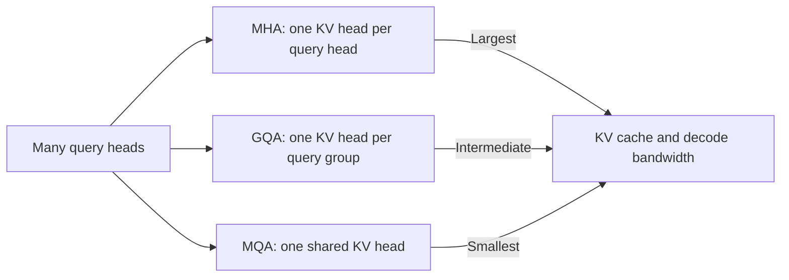

# Modern Transformer block variants

"Transformer" names a family, not one frozen block. Current LLMs often replace
the original normalization placement, position method, attention head layout,
FFN activation, and sometimes the dense FFN itself.

The safest way to describe a model is to name each choice explicitly.

## A comparison at a glance

| Axis | Original Transformer | Common modern decoder choice | Primary motivation |
|---|---|---|---|
| Model shape | Encoder-decoder | Decoder-only | Autoregressive language modeling |
| Norm placement | Post-norm | Pre-norm | Optimization stability |
| Normalization | LayerNorm | RMSNorm | Simpler RMS scaling |
| Position | Added sinusoidal vector | RoPE on Q/K | Relative-position structure |
| Attention heads | MHA | GQA or MQA | Smaller KV cache and less decode bandwidth |
| FFN | ReLU, two matrices | SwiGLU, three matrices | Gated nonlinear transformation |
| Attention kernel | Materialized score path | Flash/SDPA kernels | Lower memory traffic |
| FFN activation | All FFN weights | Dense or sparse top-k experts | Capacity/compute trade-off |

"Common" is descriptive, not prescriptive. A controlled experiment on the
target model and training budget matters more than architectural fashion.

## Normalization variants

### Pre-norm versus post-norm

Pre-norm applies normalization before the sublayer:

$$
x \leftarrow x + F(\operatorname{Norm}(x)).
$$

Post-norm normalizes the residual sum:

$$
x \leftarrow \operatorname{Norm}(x + F(x)).
$$

The original Transformer used post-norm. Analysis by
[Xiong et al.](https://arxiv.org/abs/2002.04745) connects pre-norm's placement
to better-behaved gradients at initialization. A released Llama 3 block shows
the modern pre-norm pattern directly
([source](https://github.com/meta-llama/llama3/blob/a0940f9cf7065d45bb6675660f80d305c041a754/llama/model.py#L222-L248)).

### LayerNorm versus RMSNorm

LayerNorm re-centers and re-scales features. RMSNorm omits mean subtraction and
uses the root mean square
([paper](https://arxiv.org/abs/1910.07467)). Both retain learned per-feature
scales in their usual forms.

Do not describe RMSNorm as "LayerNorm without parameters" or "just divide by
the norm." Epsilon handling, float precision, and the learned scale are part of
the implementation. Meta's compact
[RMSNorm code](https://github.com/meta-llama/llama3/blob/a0940f9cf7065d45bb6675660f80d305c041a754/llama/model.py#L35-L46)
upcasts the reduction to float32 and casts back.

### QK normalization

Some models additionally normalize projected queries and keys. Qwen3 reports
QK-Norm as one of its architecture changes for stable training, alongside
pre-normalized RMSNorm, RoPE, GQA, and SwiGLU
([Qwen3 Technical Report, Section 2](https://arxiv.org/abs/2505.09388)).
This is separate from normalizing the residual stream: it acts inside the
attention path on Q/K representations.

## FFN variants

### ReLU and GELU

A conventional FFN expands, applies a nonlinearity, and contracts:

$$
W_{down}\,\sigma(W_{up}x).
$$

The original Transformer used ReLU. Many later models used GELU.

### GLU-family gates and SwiGLU

GLU variants multiply two projected branches. SwiGLU uses SiLU on the gate
branch:

$$
W_{down}\left(\operatorname{SiLU}(W_{gate}x) \odot W_{up}x\right).
$$

The GLU-variants paper reports quality improvements in its tested Transformer
settings ([Shazeer](https://arxiv.org/abs/2002.05202)). A readable released
implementation is Llama 3's single-line
[SwiGLU forward](https://github.com/meta-llama/llama3/blob/a0940f9cf7065d45bb6675660f80d305c041a754/llama/model.py#L193-L219).

Parameter-matched comparisons must account for the third matrix. Reusing the
same `d_ff` from a two-matrix FFN increases parameters and work.

### Dense versus sparse FFNs

A dense FFN applies the same parameters to every token. A sparse MoE stores
multiple FFNs and routes each token to a subset. The rest of the block -
attention, residual stream, and normalization - can remain dense and shared.

Mixtral replaces every FFN with an 8-expert top-2 MoE
([paper, Section 2.1](https://arxiv.org/abs/2401.04088)). DeepSeek-V3 instead
keeps its first three FFNs dense, then uses one shared plus 256 routed experts
with 8 routed experts selected per token
([technical report](https://arxiv.org/abs/2412.19437)). "MoE model" therefore
does not tell you which layers are sparse.

## Attention-head layouts



- **MHA** learns the same number of Q, K, and V heads.
- **MQA** keeps many Q heads but shares one K/V head
  ([Shazeer](https://arxiv.org/abs/1911.02150)).
- **GQA** uses an intermediate number of K/V heads shared by query groups
  ([Ainslie et al.](https://arxiv.org/abs/2305.13245)).

These variants primarily alter K/V parameterization, cache storage, and memory
traffic. They do not remove the pairwise causal attention relation.

## Position mechanisms

### Added absolute positions

Learned or sinusoidal position vectors are added to the token stream. The 2017
paper's sinusoidal construction is deterministic
([Section 3.5](https://arxiv.org/abs/1706.03762)).

### RoPE

RoPE rotates query and key pairs, making their dot product encode relative
offset structure
([RoFormer](https://arxiv.org/abs/2104.09864)). It appears in Llama, Mistral,
Qwen, and many other released families, but base frequency and extension
methods differ. "Uses RoPE" is not a complete long-context specification.

### ALiBi

ALiBi adds head-dependent linear distance biases to attention logits rather than
adding vectors or rotating Q/K
([Press et al.](https://arxiv.org/abs/2108.12409)).

## Algorithm versus architecture: FlashAttention

FlashAttention is an exact, IO-aware attention algorithm. It tiles work so less
intermediate data moves between high-bandwidth memory and on-chip SRAM
([Dao et al.](https://arxiv.org/abs/2205.14135)).

It is important to classify changes correctly:

| Technique | Changes learned function? | Changes execution? | Exact full attention? |
|---|---:|---:|---:|
| RoPE | Yes, position enters Q/K | Yes | Yes |
| GQA | Yes, KV projections are shared | Yes | Yes |
| Sliding-window attention | Yes, mask removes distant pairs | Yes | No, restricted pattern |
| FlashAttention | No, for the same attention inputs | Yes | Yes |
| Quantization | Ideally approximates same function | Yes | Numerically approximate |

Calling all of these "attention optimizations" hides which checkpoint weights
and outputs can remain compatible.

## Full versus restricted attention

Full causal attention allows each position to attend to every earlier position.
A sliding window restricts direct attention to a recent range. This reduces
pairwise work but changes the connectivity graph; information can still travel
farther through multiple layers, but not through one direct edge.

The Mixtral paper explicitly says it uses a fully dense 32K context while
retaining other Mistral-family modifications
([Section 2](https://arxiv.org/abs/2401.04088)). Always check the named
checkpoint rather than inferring its mask from a family resemblance.

## Four real architecture snapshots

### The 2017 Transformer

- encoder-decoder;
- post-LayerNorm;
- sinusoidal absolute positions;
- multi-head attention;
- two-matrix ReLU FFN;
- dense layers.

Source: [Attention Is All You Need](https://arxiv.org/abs/1706.03762).

### Released Llama 3 inference block

- decoder-only causal stack;
- pre-RMSNorm;
- RoPE;
- grouped-query attention when `n_kv_heads < n_heads`;
- SwiGLU dense FFN.

Source: model-owner
[`llama/model.py`](https://github.com/meta-llama/llama3/blob/a0940f9cf7065d45bb6675660f80d305c041a754/llama/model.py).
This is inference/model code, not Meta's full pretraining pipeline.

### Mixtral 8x7B

- decoder-only;
- Mistral-family attention/block choices;
- every FFN replaced by 8 SwiGLU experts;
- top-2 weighted expert combination for every token and layer;
- fully dense 32K attention context in the paper.

Source: [Mixtral of Experts](https://arxiv.org/abs/2401.04088) and Mistral's
[released MoE layer](https://github.com/mistralai/mistral-inference/blob/9eaeb91c17450e09021b6065a1d5cc69876507c8/src/mistral_inference/moe.py#L16-L32).

### Qwen3 MoE

- same base block family as Qwen3 dense models: GQA, SwiGLU, RoPE, pre-RMSNorm,
  and QK-Norm;
- 128 fine-grained experts, 8 activated per token;
- no shared experts;
- global-batch load-balancing loss.

Source: [Qwen3 Technical Report, Section 2](https://arxiv.org/abs/2505.09388).

## How to read a model configuration

Translate configuration fields into a sentence before estimating memory or
compute:

```text
48 decoder layers, model width 2048,
32 query heads, 4 KV heads,
RoPE, pre-RMSNorm, SwiGLU,
128 experts per MoE layer, top 8,
no always-on shared expert.
```

Then verify the implementation:

1. Does every layer use the same block type?
2. Is `intermediate_size` dense, expert-local, or both?
3. Does top-k probability get re-normalized after selection?
4. Is the position method applied to all or part of each head?
5. Does the runtime use full, windowed, or hybrid attention?
6. Are input embeddings and the LM head tied?
7. Does "active parameters" include attention and shared experts?

Qwen3-30B-A3B's owner-published
[`config.json`](https://huggingface.co/Qwen/Qwen3-30B-A3B/blob/ad44e777bcd18fa416d9da3bd8f70d33ebb85d39/config.json),
for example, exposes 48 layers, 32 query heads, 4 KV heads, 128 experts, and
8 experts per token. The technical report provides the training/design context
that a configuration alone cannot.

## Architecture is not a benchmark result

Two models with the same block diagram can differ because of:

- training tokens and data mixture;
- tokenizer and vocabulary;
- parameter scale and depth/width allocation;
- optimizer, schedule, precision, and stability methods;
- post-training and inference settings;
- kernel and hardware efficiency.

Likewise, a theoretically lower active parameter count is not a measured
latency. The Mixtral paper explicitly notes memory cost from total parameters
and routing/hardware-utilization overhead even while relating active parameters
to inference compute
([Section 3](https://arxiv.org/abs/2401.04088)).

## Exercises

1. Choose a released checkpoint and fill in every axis in the comparison table
   using its paper, model card, configuration, and code.
2. Compute KV-cache element counts for its Q/KV-head layout.
3. Parameter-match a ReLU FFN and SwiGLU FFN at fixed `d_model`.
4. Identify whether its long-context technique changes the mask, RoPE
   frequencies, execution kernel, or more than one.
5. If it is an MoE, identify exactly which layers are sparse and whether shared
   experts are always active.

Continue to [why sparse models](../05-moe/01-why-sparse-models.md).
