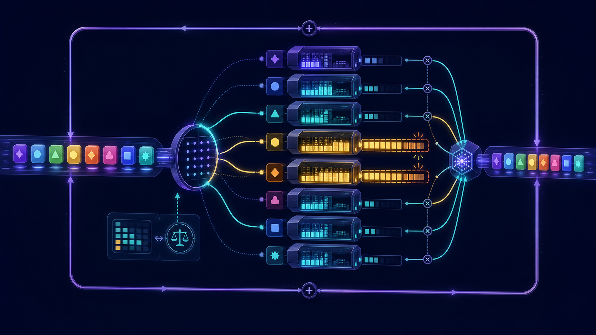
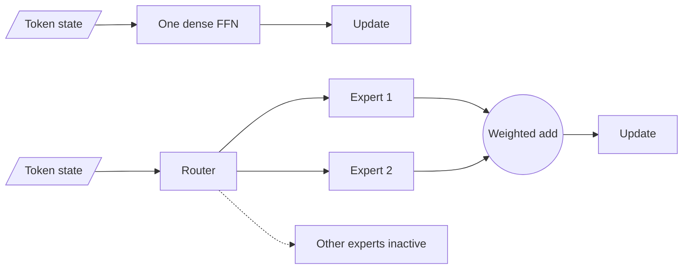

# Why sparse models?

A dense Transformer applies the same FFN parameters to every token. A sparse
mixture-of-experts (MoE) layer stores many FFNs but activates only a small
subset for each token.

The goal is **conditional capacity**: grow the number of learned parameters
without making every token multiply through all of them.

<figure markdown>
  { loading=lazy }
  <figcaption>Generated conceptual plate. Expert numbers are learned route IDs, not user-addressable professions.</figcaption>
</figure>

## Dense and sparse FFNs

For one dense FFN $F$:

$$
y_t = F(x_t).
$$

For $E$ experts and a sparse gate with at most $k$ nonzero weights:

$$
y_t = \sum_{i=1}^{E} g_{t,i}F_i(x_t),
\qquad \|g_t\|_0 \le k \ll E.
$$

In the compared language models, an expert is normally a gated or ordinary FFN
inside one Transformer layer. It is not a complete model with its own tokenizer,
attention stack, conversation, or system prompt.

## The parameter/compute idea

Let one expert contain approximately $P_{expert}$ parameters. Ignoring the
small router for a moment:

$$
P_{stored,experts} \approx E P_{expert},
$$

$$
P_{active,experts\ per\ token} \approx k P_{expert}.
$$

If $E=64$ and $k=8$, the layer stores eight times as many expert parameters as
it activates per token. Attention, normalization, embeddings, shared experts,
and the LM head are still active, so the entire model's total-to-active ratio
is less dramatic.

This idea traces to sparsely gated conditional computation
([Shazeer et al.](https://arxiv.org/abs/1701.06538)) and was adapted to large
Transformers by GShard and Switch
([GShard](https://arxiv.org/abs/2006.16668),
[Switch](https://arxiv.org/abs/2101.03961)).

## "Active parameters" is not a latency unit

An active-parameter count is useful but incomplete. Wall-clock performance also
depends on:

- loading and storing the **total** expert weights;
- batch size and how many tokens each expert receives;
- routing, permutation, and weighted-combine kernels;
- all-to-all communication when experts live on different devices;
- padding or block alignment;
- arithmetic intensity, precision, and quantization;
- whether expert work overlaps communication.

The Mixtral paper reports 47B total and 13B active parameters, then explicitly
notes total-weight memory and routing/hardware-utilization overhead
([Sections 2.1 and 3](https://arxiv.org/abs/2401.04088)). It says MoE is better
suited to batched workloads where arithmetic intensity can be high. Therefore:

> "13B active" does not mean "identical latency and memory to a dense 13B
> model."

## Why extra conditional capacity can help

### More stored transformations

Different tokens can update through different parameter subsets. The model can
store more FFN transformations without applying every transformation every
time.

### Reduced interference is possible

If routing and training produce useful specialization, gradients for unrelated
patterns need not update exactly the same expert parameters. This is a
possibility, not a guarantee.

### Finer combinations

DeepSeekMoE and OLMoE investigate splitting large experts into more, smaller
experts while activating more of them at similar expert compute. The number of
possible expert subsets grows combinatorially:

$$
\text{possible unordered top-k sets} = {E \choose k}.
$$

For 8 choose 2, there are 28 subsets. For 64 choose 8, there are over 4.4
billion subsets. This count measures routing combinations, not guaranteed
independent skills. OLMoE reports diminishing returns in its granularity study
even as the combination count grows
([Section 4.1.2](https://arxiv.org/abs/2409.02060)).

## Specialization is learned, not declared

The architecture does not create a built-in "math expert" or "French expert."
The training data, router objective, initialization, load-balancing method, and
optimization dynamics determine what emerges.

Primary results differ:

- Mixtral's authors report no obvious topic-based assignment across tested Pile
  domains and observe stronger syntactic patterns
  ([Section 5](https://arxiv.org/abs/2401.04088)).
- OLMoE's authors report stronger domain and vocabulary specialization in their
  checkpoint and little domain specialization in their Mixtral comparison
  ([Sections 5.3-5.4](https://arxiv.org/abs/2409.02060)).

Both can be true for the measured checkpoints. "MoE experts specialize by
domain" is not a universal architectural fact.

## Shared experts

Some architectures add one or more always-active FFNs:

$$
y_t = \sum_{s=1}^{S} F_s^{shared}(x_t)
+ \sum_{i=1}^{E} g_{t,i}F_i^{routed}(x_t).
$$

DeepSeekMoE motivates shared experts as a place for common knowledge, reducing
redundancy in routed experts
([paper](https://arxiv.org/abs/2401.06066)). DeepSeek-V3 uses one shared expert.

This is a design choice, not settled law. OLMoE reports that its controlled
shared-expert variant performed slightly worse, so its final model has no
shared expert
([Section 4.1.3](https://arxiv.org/abs/2409.02060)). Qwen3 likewise explicitly
excludes shared experts
([technical report](https://arxiv.org/abs/2505.09388)).

## The costs sparsity introduces

### Routing can collapse

Many tokens may select a few experts, leaving others undertrained and creating
device hotspots. Load-balancing methods address this, sometimes at a cost to
the main language-model objective.

### Fixed capacity can drop work

In Switch and GShard, each expert has finite capacity. Overflow tokens bypass
expert computation through the residual path. Dropping saves bounded buffers
but creates uneven treatment across tokens.

### Dropless execution is irregular

Dropless systems process variable token counts instead of discarding overflow.
They need grouped/block-sparse kernels and must still handle imbalance. OLMoE
uses dropless token-choice routing and MegaBlocks-style execution
([OLMoE](https://arxiv.org/abs/2409.02060),
[MegaBlocks](https://arxiv.org/abs/2211.15841)).

### Expert parallelism communicates activations

If an expert is stored on another accelerator, token states must travel to that
device and the results must return. Two all-to-all phases can become a major
bottleneck.

### Fine-tuning touches uneven parameters

An expert only receives main-task gradients when selected. A narrow or small
fine-tuning dataset can update expert and router distributions unevenly.
Load-balancing choices during pretraining do not automatically transfer to
post-training.

## Dense versus sparse is a system decision

Prefer a dense model when:

- the model fits easily and simple deployment matters;
- batch sizes are small and weight bandwidth dominates;
- distributed all-to-all would be expensive or unavailable;
- predictable fine-tuning and serving are more important than stored capacity.

Consider an MoE when:

- additional parameter capacity improves the quality/compute frontier;
- hardware can hold or shard all expert weights;
- batches are large enough for efficient grouped expert work;
- the network and runtime support expert parallelism well;
- routing balance and observability are first-class engineering concerns.

## Three numbers to demand

Do not accept a model label such as "8x7B" as a specification. Ask for:

1. **total parameters** - storage and weight-memory scale;
2. **active parameters per token** - approximate learned work touched;
3. **measured throughput and latency** for the actual batch, precision,
   context, output length, hardware, and runtime.

Also ask how active parameters were counted. Shared attention and embeddings
matter.

## Check your understanding

1. Which part of a conventional Transformer block becomes an expert pool?
2. Why can total parameters grow with $E$ while expert FFN work grows with $k$?
3. Why does the ratio $E/k$ not equal an end-to-end speedup?
4. What empirical disagreement between Mixtral and OLMoE prevents a universal
   "domain expert" claim?
5. What new system operation appears when selected experts live on remote GPUs?

Next: [router math](02-router-math.md).
