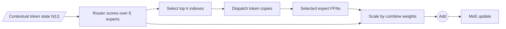

# Router math: from hidden state to experts

The router is a small learned function that scores experts for each token state.
Top-k selection turns those scores into sparse assignments; selected expert
outputs are scaled and added.

Routing is repeated at every MoE layer. There is usually no one global expert
choice for an entire prompt.

## Notation and shapes

Let:

- `B`: batch size;
- `S`: sequence length;
- `T = B * S`: token positions after flattening;
- `d`: model width;
- `E`: number of routed experts in this layer;
- `k`: experts selected per token.

The router input is a contextual hidden state
$X \in \mathbb{R}^{T \times d}$. A linear router has weights
$W_r \in \mathbb{R}^{E \times d}$ and produces:

$$
Z = XW_r^T, \qquad Z \in \mathbb{R}^{T \times E}.
$$

Row $z_t$ contains one logit or affinity input per expert for token position
$t$.



The notation $h_{t,l}$ is a reminder that the same token position can choose
different experts at different layers.

## Softmax top-k routing

A common form computes probabilities over all experts:

$$
p_{t,i} = \frac{\exp(z_{t,i})}
{\sum_{j=1}^{E}\exp(z_{t,j})}.
$$

Let $I_t = \operatorname{TopK}(p_t,k)$ be the selected expert indexes. A
normalized combine weight is:

$$
g_{t,i} =
\begin{cases}
\dfrac{p_{t,i}}{\sum_{j \in I_t}p_{t,j}} & i \in I_t, \\
0 & i \notin I_t.
\end{cases}
$$

Then:

$$
y_t = \sum_{i \in I_t} g_{t,i}F_i(x_t).
$$

Selecting the largest logits and applying softmax only across those selected
logits gives the same relative weights as selecting softmax probabilities and
re-normalizing them. Mistral's released MoE code is a compact example: compute
gate logits, take top-k, softmax selected scores, run selected experts, and add
weighted outputs
([lines 16-32](https://github.com/mistralai/mistral-inference/blob/9eaeb91c17450e09021b6065a1d5cc69876507c8/src/mistral_inference/moe.py#L16-L32)).

## A worked top-2 example

Suppose four router logits for one token are:

$$
z = [2.0,\ 1.0,\ 0.0,\ -1.0].
$$

Top-2 selects experts 0 and 1. Softmax over those selected logits gives:

$$
g_0 = \frac{e^2}{e^2 + e^1} \approx 0.731,
\qquad
g_1 = \frac{e^1}{e^2 + e^1} \approx 0.269.
$$

If their outputs are $F_0(x)$ and $F_1(x)$:

$$
y \approx 0.731F_0(x) + 0.269F_1(x).
$$

The unselected experts do no FFN work for this token and receive no main-loss
gradient through an expert output for it.

```python
import torch

logits = torch.tensor([[2.0, 1.0, 0.0, -1.0]])
selected_logits, selected_ids = logits.topk(k=2, dim=-1)
combine_weights = selected_logits.softmax(dim=-1)

assert selected_ids.tolist() == [[0, 1]]
assert torch.allclose(
    combine_weights,
    torch.tensor([[0.7311, 0.2689]]),
    atol=1e-4,
)
```

## Top-1 has an important weighting choice

If top-1's selected score is re-normalized over a set of size one, its combine
weight becomes exactly 1. The main output then has no smooth dependence on that
weight away from selection boundaries.

Switch Transformer instead retains the selected router probability as the gate
value, which gives a differentiable path for the selected router score
([Sections 2.1-2.2 and Appendix F](https://arxiv.org/abs/2101.03961)).

When reading "top-1," inspect whether the selected probability is retained,
re-normalized to one, or handled with another estimator. Top-k count alone is
not the full routing equation.

## DeepSeek-V3's sigmoid and biased selection

DeepSeek-V3 reports sigmoid affinities rather than a softmax across all routed
experts:

$$
s_{t,i} = \operatorname{sigmoid}(h_t^T e_i).
$$

During selection, it adds a learned/updated load-balancing bias $b_i$:

$$
I_t = \operatorname{TopK}(s_t + b, k).
$$

Crucially, the combine weights use the original $s_{t,i}$, normalized across
selected experts; the bias only changes which experts are selected. The paper
states this explicitly
([DeepSeek-V3, Section 2.1.2](https://arxiv.org/abs/2412.19437)), and the
released implementation preserves original scores before adding the bias
([lines 576-598](https://github.com/deepseek-ai/DeepSeek-V3/blob/9b4e9788e4a3a731f7567338ed15d3ec549ce03b/inference/model.py#L576-L598)).

This separation prevents the load-control signal from directly becoming the
expert output's mixture coefficient.

## Group-limited routing

When experts span nodes, unconstrained top-k can send one token to many nodes.
Group-limited routing first selects a subset of expert groups, masks all other
groups, then applies expert top-k within the survivors.

Conceptually:

1. partition $E$ experts into $G$ groups;
2. compute a group score from its strongest expert scores;
3. retain the top $G_{active}$ groups;
4. set other expert scores to $-\infty$ for selection;
5. select top-k routed experts.

DeepSeek-V3 uses node-limited routing and reports at most four nodes per token
([technical report](https://arxiv.org/abs/2412.19437)). Its released 671B
configuration has 8 expert groups, 4 limited groups, 256 routed experts, and
top-8 activation
([config](https://github.com/deepseek-ai/DeepSeek-V3/blob/9b4e9788e4a3a731f7567338ed15d3ec549ce03b/inference/configs/config_671B.json)).

PyTorch torchtitan provides a readable current implementation of this pattern
([lines 223-317](https://github.com/pytorch/torchtitan/blob/51c197c86d7c703da96f666d5a7dbd5432b4afbf/torchtitan/models/common/moe.py#L223-L317)).

## How does a hard top-k router learn?

Top-k index selection is discrete. A small logit change that does not cross the
selection boundary leaves expert IDs unchanged. Training still has gradient
paths:

- selected combine weights depend smoothly on selected logits;
- selected expert outputs affect the main language-model loss;
- auxiliary balance or stability losses can depend on full soft scores;
- noise or jitter can explore alternate assignments during training.

But unselected expert functions do not receive main-loss gradient for that
token. This creates a feedback loop:

1. a token selects an expert;
2. that expert learns from the token;
3. its output may become more useful for similar states;
4. the router may continue to select it.

The same loop can create useful specialization or collapse. Load balancing and
initialization matter.

## A minimal router with explicit shapes

```python
import torch
from torch import nn


class TopKRouter(nn.Module):
    def __init__(self, d_model: int, n_experts: int, top_k: int):
        super().__init__()
        if not 1 <= top_k <= n_experts:
            raise ValueError("top_k must be in [1, n_experts]")
        self.gate = nn.Linear(d_model, n_experts, bias=False)
        self.top_k = top_k

    def forward(
        self,
        x: torch.Tensor,
    ) -> tuple[torch.Tensor, torch.Tensor, torch.Tensor]:
        # x: (B, S, D); float32 router math improves numerical stability.
        logits = self.gate(x).float()                  # (B, S, E)
        probabilities = logits.softmax(dim=-1)        # (B, S, E)
        weights, expert_ids = probabilities.topk(
            self.top_k,
            dim=-1,
        )                                             # both (B, S, K)
        weights = weights / weights.sum(dim=-1, keepdim=True)
        return weights.to(x.dtype), expert_ids, logits


router = TopKRouter(d_model=128, n_experts=16, top_k=2)
x = torch.randn(3, 20, 128)
weights, expert_ids, logits = router(x)

assert weights.shape == expert_ids.shape == (3, 20, 2)
assert logits.shape == (3, 20, 16)
assert torch.allclose(weights.sum(-1), torch.ones(3, 20))
```

This only chooses and weights experts. Efficient dispatch, expert computation,
load balancing, and combine are separate system steps.

## Router measurements worth logging

Average loss alone can hide broken routing. Log per layer:

- assignment count per expert;
- mean soft probability per expert;
- maximum/minimum load ratio and coefficient of variation;
- fraction of tokens dropped or rerouted;
- router entropy before top-k;
- top-k margin, such as score `k` minus score `k+1`;
- expert co-activation frequencies for `k > 1`;
- assignment turnover between checkpoints;
- load by data domain, sequence position, and token ID.

These are measurements, not proof of semantic expertise. OLMoE formalizes
router saturation, co-activation, domain specialization, and vocabulary
specialization on released checkpoints
([Section 5](https://arxiv.org/abs/2409.02060)).

## Common errors

### Softmax over tokens instead of experts

Token-choice routing normally normalizes along the expert axis. Expert-choice
routing is a different algorithm.

### Combining with selection-biased scores

If an architecture specifies that a bias only affects selection, do not use the
biased values as combine weights. DeepSeek-V3 is the key example.

### Losing duplicate token copies

For top-k, each token is dispatched to `k` experts and its `k` results must be
weighted and accumulated back to the same token index.

### Running router softmax in low precision

Large logits and exponentials can destabilize routing. Many implementations
compute router scores/softmax in float32 even when expert matmuls use BF16 or
FP8.

### Treating expert IDs as globally meaningful

Expert 7 in layer 3 is unrelated by definition to expert 7 in layer 20 or in a
different checkpoint.

## Exercises

1. Recalculate the worked example with temperature $\tau$ in
   `softmax(z / tau)`. Which assignments change, and which weights change?
2. Implement sigmoid top-k plus selected-score normalization.
3. Add group-limited routing with 16 experts in 4 groups, retaining 2 groups.
4. Compare router gradient norms for top-1 re-normalized to one versus top-1
   retaining its selected probability.
5. Plot assignment counts and entropy while training the tiny MoE in
   [Build a tiny MoE](07-build-a-tiny-moe.md).

Next: [capacity and load balancing](03-capacity-load-balancing.md).
