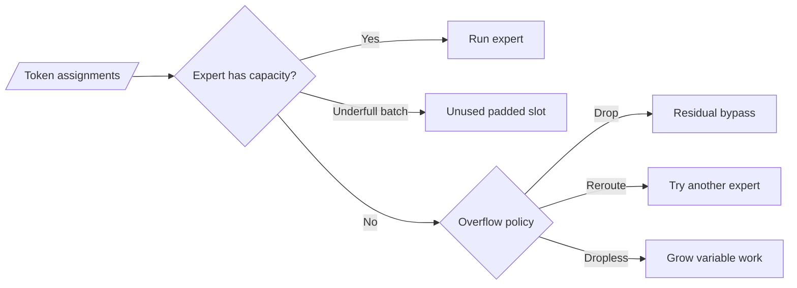

# Capacity, load balancing, and routing failure modes

Sparse routing creates a systems problem: tokens choose experts dynamically,
but accelerators prefer regular, balanced batches. A good MoE must reconcile
the learned choices with finite compute, memory, and network capacity.

## Fixed expert capacity

Switch Transformer defines per-expert capacity as:

$$
C = \left(\frac{T}{E}\right) \times \text{capacity factor},
$$

where $T$ is the number of tokens in the routing group and $E$ is the number of
experts
([Section 2.2](https://arxiv.org/abs/2101.03961)). Implementations round to an
integer suitable for their buffers.

For a generalized top-k system with $T k$ expert assignments, a common planning
formula is:

$$
C = \left\lceil
\text{capacity factor} \times \frac{Tk}{E}
\right\rceil.
$$

The second equation is a useful engineering generalization, not the exact
top-1 equation printed in the Switch paper. Always inspect whether a codebase
defines capacity per token, assignment, group, device, or sequence.



### Capacity-factor trade-off

- Larger factor: fewer overflows, more padding, memory, and communication.
- Smaller factor: better packed utilization if balanced, more overflow risk.

Switch reports that a larger capacity factor creates buffer for imbalance but
increases compute and communication from padded slots. Its experiments usually
kept dropped-token rates below 1% with balancing, but that is a reported result
for those settings, not a universal bound.

## Overflow policies

### Drop expert computation

GShard and Switch describe overflow tokens as bypassing the MoE computation and
continuing through the residual connection
([GShard, Section 2.2](https://arxiv.org/abs/2006.16668),
[Switch, Section 2.2](https://arxiv.org/abs/2101.03961)). "Drop" here does not
delete the token from the sequence; it drops that layer's expert update.

This preserves static buffer shapes but means different tokens receive
different amounts of computation.

### Reroute

One can try a lower-ranked expert when a preferred expert is full. GShard's
group-level top-2 gate also dispatches to the second expert with probability
proportional to its gate, conserving capacity when the second weight is small.
Rerouting changes the executed routing policy and can add control-flow cost.

### Dropless execution

Dropless MoE processes every routed assignment with variable expert batch
sizes. MegaBlocks casts uneven expert work into block-sparse operations
([paper](https://arxiv.org/abs/2211.15841)). OLMoE reports dropless top-8
token-choice routing
([paper](https://arxiv.org/abs/2409.02060)).

Dropless does not mean balance is irrelevant. A hotspot expert can still slow
the entire synchronized step or overload a device's memory.

### No dropping through balance and deployment

DeepSeek-V3 reports no token dropping during training or inference. It credits
effective balancing during training and dedicated inference deployment
strategies
([Section 2.1.2](https://arxiv.org/abs/2412.19437)). This is a fact about that
reported system, not a property of sigmoid routing in general.

## The Switch auxiliary balance loss

For $E$ experts and a batch/group of $T$ tokens, define:

$$
f_i = \frac{1}{T}\sum_{t=1}^{T}
\mathbb{1}\{\operatorname{argmax}(p_t)=i\},
$$

the fraction of tokens dispatched to expert $i$, and

$$
P_i = \frac{1}{T}\sum_{t=1}^{T}p_{t,i},
$$

the mean soft router probability allocated to expert $i$. Switch adds:

$$
\mathcal{L}_{balance}
= \alpha E \sum_{i=1}^{E} f_i P_i.
$$

The hard count $f_i$ is not differentiable, but $P_i$ is. Their dot product
penalizes agreement between high hard load and high soft probability and
encourages a uniform distribution. Switch reports using $\alpha=10^{-2}$ in
its experiments
([Equations 4-6](https://arxiv.org/abs/2101.03961)).

For top-k routing, implementations differ in whether $f_i$ counts any
selection, divides by `T`, divides by `T*k`, or aggregates across layers.
Copying a coefficient without copying the definition changes the effective
loss.

```python
import torch
import torch.nn.functional as F


def topk_balance_loss(
    router_logits: torch.Tensor,
    selected_experts: torch.Tensor,
) -> torch.Tensor:
    """
    router_logits: (T, E)
    selected_experts: (T, K)
    Returns E * sum_i(f_i * P_i), with f normalized over T*K assignments.
    """
    probabilities = F.softmax(router_logits.float(), dim=-1)
    n_experts = probabilities.shape[-1]
    counts = torch.bincount(
        selected_experts.reshape(-1),
        minlength=n_experts,
    ).float()
    fractions = counts / selected_experts.numel()
    mean_probabilities = probabilities.mean(dim=0)
    return n_experts * torch.sum(fractions * mean_probabilities)
```

The returned value is 1 under perfectly uniform hard assignments and soft
probabilities. Multiply it by the chosen coefficient before adding it to the
main loss.

## Router z-loss: stability, not balance

ST-MoE introduces a router z-loss that penalizes large router log-partition
values. For router logits $z_t$:

$$
\mathcal{L}_{z}
= \frac{1}{T}\sum_{t=1}^{T}
\left(\log\sum_{i=1}^{E}\exp(z_{t,i})\right)^2.
$$

Large router logits can create numerical problems. The z-loss controls their
magnitude; it does **not** directly require equal expert counts
([ST-MoE](https://arxiv.org/abs/2202.08906)). OLMoE reports using z-loss weight
0.001 and balance-loss weight 0.01 during pretraining
([Sections 4.1.6-4.1.7](https://arxiv.org/abs/2409.02060)).

```python
def router_z_loss(router_logits: torch.Tensor) -> torch.Tensor:
    log_partition = torch.logsumexp(router_logits.float(), dim=-1)
    return log_partition.square().mean()
```

Keep these objectives conceptually separate:

| Objective | Direct target |
|---|---|
| Language-model loss | Correct next-token distribution |
| Load-balance loss | Expert usage distribution |
| Router z-loss | Router logit magnitude/stability |

## DeepSeek-V3's auxiliary-loss-free balancing

DeepSeek-V3 separates the selection-control signal from combine weights. For
each expert, a bias $b_i$ is added only when choosing top-k:

$$
I_t = \operatorname{TopK}(s_t + b, k).
$$

The original affinity $s_{t,i}$ still supplies the selected expert's combine
weight. At the end of a training step, the report says to:

- decrease $b_i$ by update speed $\gamma$ if expert $i$ is overloaded;
- increase $b_i$ by $\gamma$ if expert $i$ is underloaded.

This feedback controller balances batch-level counts without adding its main
balance signal to the differentiable language-model objective
([Section 2.1.2](https://arxiv.org/abs/2412.19437)).

### The terminology trap

DeepSeek-V3 also reports a **complementary sequence-wise auxiliary balance
loss** with an extremely small coefficient, intended to prevent extreme
imbalance within a single sequence.

Therefore the precise statement is:

> DeepSeek-V3's main batch-level balancing strategy is auxiliary-loss-free; the
> reported training objective still includes a very small sequence-wise routing
> auxiliary loss.

"DeepSeek-V3 uses no auxiliary routing loss" is false.

## Scope matters: sequence, microbatch, global batch

Balance can be measured over different token populations:

- **sequence-wise**: protects each sequence from extreme imbalance but may
  discourage useful domain specialization;
- **microbatch-wise**: matches the work actually visible to a local dispatch;
- **global-batch-wise**: uses more diverse tokens and can preserve more local
  variation, but requires distributed statistics or a specialized estimator;
- **running bias/state**: balances over time rather than adding a per-example
  differentiable objective.

Qwen reports a global-batch load-balancing method motivated by allowing expert
specialization while controlling global imbalance
([Qwen Team](https://qwenlm.github.io/blog/global-load-balance/)). Qwen3's
technical report says its MoE models adopt that global-batch loss
([Section 2](https://arxiv.org/abs/2505.09388)).

## Failure modes and signatures

| Failure | What you observe | Likely consequence |
|---|---|---|
| Routing collapse | A few experts receive most assignments | Dead experts, hotspots, wasted weights |
| Capacity overflow | Nonzero drop/bypass rate | Uneven computation and possible quality loss |
| Excess capacity | Many padded expert slots | Wasted memory and FLOPs |
| Large router logits | Rising z-loss, NaN/Inf risk | Training instability |
| Weak specialization | Near-identical experts or routing | Stored capacity used redundantly |
| Excess specialization | Domain shift overloads a few experts | Inference hotspots and brittle behavior |
| Route churn | Assignments change rapidly across checkpoints | Experts chase moving token distributions |
| Position-biased dropping | Later/particular positions drop more | Sequence-task degradation |
| Device skew | One EP rank has far more tokens | Step time set by slowest rank |

### Balance is not the same as health

Perfectly equal counts can coexist with redundant experts. Unequal counts can
be legitimate if some patterns are more common, but become a systems problem
when they create idle devices or overflow. Evaluate:

- main-task quality;
- routing balance;
- expert diversity/specialization;
- measured throughput;
- worst-rank load;
- robustness to domain and sequence-length shifts.

## A capacity simulator

Use a small simulator before building distributed buffers:

```python
import math

import torch


def capacity_report(
    selected_experts: torch.Tensor,
    n_experts: int,
    capacity_factor: float,
) -> dict[str, torch.Tensor | int]:
    assignments = selected_experts.numel()
    capacity = math.ceil(capacity_factor * assignments / n_experts)
    counts = torch.bincount(
        selected_experts.reshape(-1),
        minlength=n_experts,
    )
    overflow = (counts - capacity).clamp_min(0)
    padding = (capacity - counts).clamp_min(0)
    return {
        "capacity_per_expert": capacity,
        "counts": counts,
        "overflow_assignments": overflow.sum(),
        "padded_slots": padding.sum(),
    }


assignments = torch.tensor([[0, 1], [0, 2], [0, 3], [0, 1]])
report = capacity_report(assignments, n_experts=4, capacity_factor=1.0)
assert report["capacity_per_expert"] == 2
assert int(report["overflow_assignments"]) == 2
```

The simulator counts assignments, not network traffic or quality. Its purpose
is to make capacity semantics explicit.

## Production acceptance checks

Before calling a routing setup healthy, test:

1. no NaN/Inf router scores across a sustained run;
2. stable per-layer assignment distributions;
3. bounded worst-rank token load;
4. documented overflow/drop policy and measured rate;
5. capacity-factor sensitivity;
6. main-loss sensitivity to balance coefficients;
7. domain-shift and long-sequence routing;
8. throughput with real batch/context distributions;
9. cached inference and training parity where applicable;
10. checkpoint/resume preservation of router bias or other balancing state.

## Exercises

1. Sweep capacity factor in the simulator and plot overflow versus padding.
2. Construct a collapsed router and verify that balance loss exceeds its
   uniform value.
3. Show that z-loss can be large even with perfectly balanced assignments.
4. Add a DeepSeek-style non-gradient expert bias to the tiny MoE and update it
   from assignment counts.
5. Compare sequence-wise and global-batch counts on batches containing two
   distinct synthetic domains.

Next: [distributed expert parallelism](04-distributed-expert-parallelism.md).
