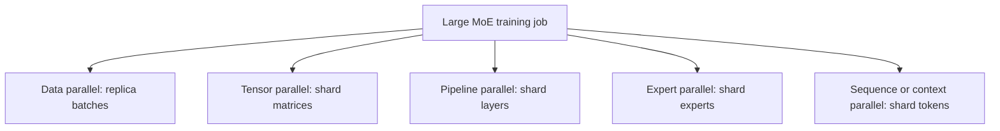

# Distributed expert parallelism

An MoE may have enough total expert weights that no single accelerator can hold
or efficiently execute them. Expert parallelism (EP) assigns different experts
to different ranks, routes token activations to their owners, computes locally,
and returns the results.

The weights stay put. The token activations move.

## The dispatch-compute-combine lifecycle


For token-choice top-k routing:

1. each local token selects `k` expert IDs;
2. the token is copied `k` times conceptually;
3. copies are sorted by destination rank/expert;
4. ranks exchange counts so variable receive buffers can be sized;
5. all-to-all sends each copy to its expert owner;
6. local experts run grouped matrix multiplications;
7. a reverse all-to-all returns results;
8. the runtime restores original token indexes, multiplies by route weights,
   and sums the `k` results per token.

PyTorch torchtitan's current implementation names these stages directly:

- [MoE dispatch, expert forward, and combine](https://github.com/pytorch/torchtitan/blob/51c197c86d7c703da96f666d5a7dbd5432b4afbf/torchtitan/models/common/moe.py#L112-L152);
- [all-to-all token dispatcher](https://github.com/pytorch/torchtitan/blob/51c197c86d7c703da96f666d5a7dbd5432b4afbf/torchtitan/models/common/token_dispatcher.py#L239-L382);
- [dispatch path](https://github.com/pytorch/torchtitan/blob/51c197c86d7c703da96f666d5a7dbd5432b4afbf/torchtitan/models/common/token_dispatcher.py#L385-L480);
- [reverse combine path](https://github.com/pytorch/torchtitan/blob/51c197c86d7c703da96f666d5a7dbd5432b4afbf/torchtitan/models/common/token_dispatcher.py#L572-L665).

These links explain a real implementation. A model owner may use different
fused kernels and scheduling.

## A four-rank example

Suppose 8 experts are split over 4 ranks:

| Rank | Resident experts |
|---:|---|
| 0 | 0, 1 |
| 1 | 2, 3 |
| 2 | 4, 5 |
| 3 | 6, 7 |

Rank 0 holds token states `A`, `B`, and `C`. A top-2 router chooses:

```text
A -> experts 1 and 5
B -> experts 3 and 5
C -> experts 0 and 6
```

Rank 0 keeps copies for experts 0/1, sends one copy to rank 1, two copies to
rank 2, and one copy to rank 3. Other ranks simultaneously send their own
copies. That many-to-many exchange is why an all-to-all collective fits the
problem.

After local computation, each result follows the reverse route. Token `A`'s
expert-1 and expert-5 outputs are scaled by `A`'s two router weights and added.

## Why all-to-all, not all-reduce?

An all-reduce combines corresponding values across every participant. EP needs
personalized delivery: a token copy destined for expert 5 should go to the rank
that owns expert 5, not be summed on all ranks.

All-to-all splits each rank's input into per-destination pieces and gives every
rank the pieces addressed to it. GShard describes AllToAll as the resharding
primitive for expert dispatch
([Section 3](https://arxiv.org/abs/2006.16668)).

All-reduce can still appear elsewhere: tensor-parallel expert outputs, shared
embeddings, gradients, and data-parallel synchronization may need it.

## Token permutation and metadata

Expert kernels want contiguous groups:

```text
original order:  A0 B0 C0 A1 B1 C1 ...
expert order:    expert0 tokens | expert1 tokens | expert2 tokens | ...
```

The dispatcher retains metadata sufficient to reverse the permutation:

- original token index;
- selected slot index from `0..k-1` or its combine weight;
- destination/source rank;
- per-rank split sizes;
- per-local-expert token counts.

Losing any mapping can yield a tensor with the right shape but values assigned
to the wrong tokens. Deterministic tiny cases are essential tests.

## Grouped expert computation

After dispatch, local experts receive uneven token counts. Launching a separate
small matrix multiplication for every expert wastes overhead. Grouped GEMM or
block-sparse kernels process many expert matrices in one organized operation.

MegaBlocks specifically addresses dropless, variable-size expert computation
with block-sparse operations
([paper](https://arxiv.org/abs/2211.15841),
[official code](https://github.com/databricks/megablocks/tree/952db33d6eac334d22c61e47a0d5d41446298784)).
Current torchtitan likewise routes expert-sorted tensors into grouped matrix
multiplication
([source](https://github.com/pytorch/torchtitan/blob/51c197c86d7c703da96f666d5a7dbd5432b4afbf/torchtitan/models/common/moe.py#L68-L152)).

Kernel efficiency depends on enough tokens per local expert and appropriate
dimension alignment. More fine-grained experts can improve routing flexibility
while shrinking each expert's batch.

## A rough communication model

Let one rank begin with $T_{local}$ token positions, select $k$ experts per
token, use hidden width $d$, and send `b` bytes per activation element.

A rough upper-scale payload for dispatch is:

$$
T_{local} k d b.
$$

A similar activation payload returns during combine. This is a planning
**inference**, not an exact network-byte formula. Local expert assignments need
not leave the rank; metadata/count exchanges add bytes; padding, alignment,
protocols, topology, compression, and replication change the actual amount.

The formula still reveals the levers:

- higher top-k increases token copies;
- larger model width increases each message;
- lower-precision activations reduce bytes;
- placing frequently selected experts locally can reduce remote traffic;
- restricting routes to fewer nodes can improve topology locality.

## Node-limited routing

DeepSeek-V3 groups experts by node, selects a limited number of groups, then
chooses routed experts. It reports at most four nodes per token, 64-way expert
parallelism across eight nodes, and specialized cross-node all-to-all kernels
([Sections 2.1.2 and 3.2](https://arxiv.org/abs/2412.19437)).

The point is not fewer experts - the model still selects top-8 routed experts -
but fewer network domains touched by those selections.

This trades unconstrained routing flexibility for communication locality. It
must be trained as part of the routing policy; imposing an arbitrary node mask
on a checkpoint later may change outputs.

## Overlap communication and computation

A naive layer serializes:

```text
attention -> dispatch all-to-all -> expert FFN -> combine all-to-all -> next work
```

High-performance systems split batches/chunks and overlap independent work.
DeepSeek-V3 reports decomposing MoE work into attention, dispatch, MLP, and
combine components and designing DualPipe plus communication kernels to hide
much of the communication
([Section 3.2](https://arxiv.org/abs/2412.19437)).

Overlap does not make communication free. It succeeds only when there is enough
independent compute, correct stream scheduling, available bandwidth, and no
load-skewed tail that extends beyond the overlap window.

## How EP combines with other parallel dimensions



- **Data parallelism (DP)** replicates model parameters for different data
  shards and synchronizes gradients/state as configured.
- **Tensor parallelism (TP)** shards large matrices within attention or an
  expert.
- **Pipeline parallelism (PP)** assigns layer ranges/stages to ranks.
- **Expert parallelism (EP)** assigns different experts to ranks.
- **Sequence/context parallelism (SP/CP)** shards token positions or attention
  context.

Real meshes compose dimensions. For example, an expert can be owned by an EP
group and internally tensor-sharded across a TP subgroup. The same rank may
participate in different collectives at different phases.

DeepSeek-V3 reports 16-way PP, 64-way EP, and ZeRO-1 DP, while avoiding tensor
parallelism for its reported training setup
([Section 3.2](https://arxiv.org/abs/2412.19437)). That is one system design,
not an MoE requirement.

## Static-capacity versus dropless dispatch

| Design | Buffer shape | Overflow behavior | Main challenge |
|---|---|---|---|
| Fixed capacity | Preallocated/padded | Drop, bypass, or reroute | Padding versus drops |
| Dropless variable splits | Based on observed counts | Process all assignments | Irregular grouped work and skew |

Fixed buffers can simplify compilation and kernels. Dropless dispatch avoids
discarding work but needs a count exchange and variable splits. Modern runtimes
may also pad variable groups to hardware-friendly multiples after the all-to-all.

## Failure modes that look like network bugs

### Rank-order disagreement

All participants must call collectives in matching order with compatible
groups. One divergent control path can deadlock the job.

### Split-size mismatch

Sender input splits and receiver output splits must agree. Verify count exchange
independently before transferring activation payloads.

### Empty experts

An expert may receive zero tokens. Kernels and collectives must support empty
splits without changing collective order.

### One slow rank

Collectives synchronize progress. The maximum expert load, not mean load, often
sets layer time.

### Incorrect reverse permutation

Outputs can be numerically plausible but attached to the wrong token/slot.
Test top-k weighted reconstruction with hand-computable tensors.

### Hidden padding in metrics

Padding for grouped GEMMs can make processed-token counts look balanced while
real routed tokens are skewed. Log both.

### Duplicate route accumulation

Top-k results for a token must be added, not overwritten. A scatter assignment
where scatter-add is required silently loses expert outputs.

## A performance checklist

Measure per layer and rank:

- real and padded tokens per expert;
- bytes and duration for count, dispatch, and combine collectives;
- local versus remote assignment fraction;
- grouped-GEMM time and achieved utilization;
- time waiting at collectives;
- overlap percentage;
- expert weight memory and activation peak;
- end-to-end tokens/second at real batch/context distributions.

Then tune in this order:

1. correctness and deterministic reconstruction;
2. routing balance and worst-rank load;
3. expert-to-rank placement and node-locality constraints;
4. grouped-kernel batch/alignment;
5. collective sizes and topology;
6. communication/compute overlap;
7. precision or quantization with output validation.

## Exercises

1. Work through the four-rank example and write every rank's dispatch and receive
   split sizes.
2. Estimate the rough activation payload for `T_local=4096`, `k=8`, `d=7168`,
   and BF16. State why it is an upper-scale estimate rather than wire bytes.
3. Build a local-only permutation/combine test with top-2 weights and verify it
   reproduces a direct expert loop.
4. Simulate one expert receiving 40% of assignments and calculate the idle work
   on other ranks.
5. Inspect torchtitan's count exchange and explain why it precedes the data
   all-to-all.

Next: [real MoE architectures](05-real-architectures.md).
