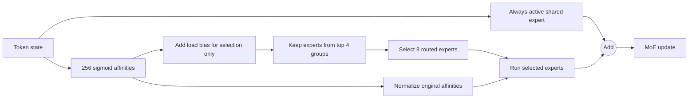

# Real MoE architectures: what actually differs

MoE is not one architecture. "The router picks experts" leaves unanswered:

- Which sublayers are sparse?
- How many routed and shared experts exist?
- How many are active per token?
- Is routing top-1, top-2, or fine-grained top-k?
- Are selected scores normalized?
- Is expert capacity fixed or dropless?
- How is load balanced?
- What does the published parameter count include?

This chapter compares only facts disclosed by model authors and original
papers. Missing information stays missing.

## Architecture matrix

| Architecture | Model shape | Sparse placement | Routed experts / active | Shared experts |
|---|---|---|---:|---:|
| GShard | Encoder-decoder | Every other FFN | Configurable, top-2 | None reported |
| Switch | T5-derived encoder-decoder | Sparse FFN layers | Configurable, top-1 | None reported |
| Mixtral 8x7B | Decoder-only | Every FFN | 8 / 2 | 0 |
| DeepSeekMoE 16B | Decoder-only | All FFNs except first | 64 / 6 | 2 always active |
| DeepSeek-V3 | Decoder-only | All FFNs except first 3 | 256 / 8 | 1 always active |
| Qwen1.5-MoE-A2.7B | Decoder-only | MoE FFNs | 60 / 4 | Width equivalent to 4 |
| Qwen3 MoE | Decoder-only | Fine-grained MoE FFNs | 128 / 8 | 0 |
| DBRX | Decoder-only | MoE FFNs | 16 / 4 | No separate shared expert reported |
| OLMoE-1B-7B | Decoder-only | 64 experts in each MoE layer | 64 / 8 | 0 |

The table does not imply the experts have equal widths. DeepSeekMoE, Qwen, DBRX,
and OLMoE all emphasize finer-grained experts relative to an 8-expert/top-2
baseline.

## Reported model sizes

| Named release | Total parameters | Active parameters | Source wording |
|---|---:|---:|---|
| Mixtral 8x7B | 47B | 13B | Per token |
| DeepSeekMoE 16B | 16.4B | 2.8B | Approximate |
| DeepSeek-V3 | 671B | 37B | Per token |
| Qwen1.5-MoE-A2.7B | 14.3B | 2.7B | 2.0B active non-embedding |
| Qwen3-30B-A3B | 30.5B | 3.3B | Owner model card |
| Qwen3-235B-A22B | 235B | 22B | Technical report |
| DBRX | 132B | 36B | Per input/token in release |
| OLMoE-1B-7B | 6.9B | 1.3B | Rounded in model name |

Do not recompute a cross-model ranking from these numbers without harmonizing
counting conventions. Embeddings, LM heads, shared experts, and router
parameters may be counted differently. Active parameters also do not capture
communication, total-weight memory, or kernel efficiency.

## GShard: group-level top-2 at massive translation scale

GShard sparsifies an encoder-decoder Transformer for multilingual translation.
Its paper replaces every other FFN in encoder and decoder with an MoE layer and
uses group-level top-2 routing
([Sections 2.1-2.2](https://arxiv.org/abs/2006.16668)).

Distinctive mechanics:

- tokens are split into local routing groups;
- each group gets a fraction of every expert's fixed capacity;
- the first selected expert is used if capacity permits;
- the second expert is dispatched probabilistically in proportion to its gate;
- overflow receives no MoE update and passes through the residual path;
- an auxiliary loss discourages concentrated expert usage;
- XLA/GShard annotations express partitioning and AllToAll performs resharding.

The paper reports scaling a model beyond 600B parameters on 2,048 TPU v3 cores,
trained in four days. This is a system-and-model result for translation, not a
decoder-only chat checkpoint.

## Switch: simplify to one selected expert

Switch Transformer simplifies token-choice routing to top-1
([paper](https://arxiv.org/abs/2101.03961)). Its selected gate remains a
probability multiplier, giving the chosen router score a differentiable path.

Distinctive mechanics:

- T5-derived encoder-decoder models;
- one selected expert per token;
- fixed expert capacity `tokens / experts * capacity_factor`;
- overflow bypass through the residual connection;
- auxiliary loss $\alpha E\sum_i f_iP_i$;
- router softmax computed in float32 in the paper's pseudocode;
- reported experiments up to trillion-parameter scale.

Top-1 reduces expert FFN and communication work compared with top-2, but offers
one expert transformation per routed token and still needs a router, capacity,
and balance strategy.

## Mixtral 8x7B: every FFN becomes 8-way top-2

Mixtral is a decoder-only model. Every FFN sub-block is replaced by 8 SwiGLU
experts; every token selects 2 independently at every layer. Selected outputs
are softmax-weighted and added
([Sections 2-2.1](https://arxiv.org/abs/2401.04088)).

$$
y = \sum_{i=1}^{8}
\operatorname{softmax}(\operatorname{Top2}(xW_g))_i
\operatorname{SwiGLU}_i(x).
$$

The paper reports 47B total, 13B active, and a fully dense 32K context. It does
not describe always-active shared experts. Its authors' routing analysis finds
little obvious topic specialization and more syntax-aligned patterns.

The released Mistral implementation is the shortest real code trail in this
chapter:

1. [`gate(inputs)`](https://github.com/mistralai/mistral-inference/blob/9eaeb91c17450e09021b6065a1d5cc69876507c8/src/mistral_inference/moe.py#L24-L26)
2. [`topk` then selected softmax](https://github.com/mistralai/mistral-inference/blob/9eaeb91c17450e09021b6065a1d5cc69876507c8/src/mistral_inference/moe.py#L25-L27)
3. [expert loop and weighted accumulation](https://github.com/mistralai/mistral-inference/blob/9eaeb91c17450e09021b6065a1d5cc69876507c8/src/mistral_inference/moe.py#L28-L32)

That file is readable inference code, not the unreleased full pretraining stack.

## DeepSeekMoE: fine-grained routed experts plus shared experts

DeepSeekMoE proposes two linked changes
([paper](https://arxiv.org/abs/2401.06066)):

### Fine-grained segmentation

Split each conventional expert into $m$ smaller experts and activate $m$ times
as many, holding total expert parameters and selected expert compute roughly
constant. This creates more possible expert combinations.

### Shared expert isolation

Reserve some experts as always active so they can capture common patterns while
routed experts specialize.

For DeepSeekMoE 16B, the paper reports:

- 28 layers, model width 2,048;
- first FFN dense, remaining FFNs MoE;
- 2 shared experts;
- 64 routed experts, 6 active per token;
- each expert one quarter of a standard FFN's intermediate width;
- approximately 16.4B total and 2.8B active parameters.

The paper's ablations support these choices in its tested setups. OLMoE later
reports a different result for shared experts in its controlled setup. Treat
this as an empirical design space, not a contradiction that can be resolved by
architecture alone.

## DeepSeek-V3: finer scale, sigmoid routing, bias balance

DeepSeek-V3 retains the DeepSeekMoE pattern at much larger scale but changes
router and balancing details
([technical report](https://arxiv.org/abs/2412.19437)).

Reported configuration:

- 671B total and 37B active parameters;
- first 3 FFNs dense;
- later MoE layers: 1 shared expert plus 256 routed experts;
- 8 routed experts active per token;
- each expert intermediate width 2,048;
- sigmoid affinity scores, normalized over selected experts;
- 8 expert groups with at most 4 groups/nodes selected;
- main batch-level balance through per-expert selection bias;
- a complementary, very small sequence-wise auxiliary balance loss;
- no token dropping during reported training or inference.



The released inference code makes the selection/combine separation concrete:

- [router scores, bias, group mask, top-k, original-score weights](https://github.com/deepseek-ai/DeepSeek-V3/blob/9b4e9788e4a3a731f7567338ed15d3ec549ce03b/inference/model.py#L535-L598);
- [routed and shared expert sum](https://github.com/deepseek-ai/DeepSeek-V3/blob/9b4e9788e4a3a731f7567338ed15d3ec549ce03b/inference/model.py#L636-L693);
- [owner-published 671B configuration](https://github.com/deepseek-ai/DeepSeek-V3/blob/9b4e9788e4a3a731f7567338ed15d3ec549ce03b/inference/configs/config_671B.json).

## Qwen: shared experts in 1.5, none in Qwen3

"Qwen MoE" needs a version number.

### Qwen1.5-MoE-A2.7B

The Qwen Team reports
([release](https://qwenlm.github.io/blog/qwen-moe/)):

- 14.3B total and 2.7B active parameters;
- 60 routed experts with 4 active;
- shared capacity described as 4 always-active experts;
- fine-grained experts;
- upcycling from Qwen-1.8B with randomized initialization changes.

The owner-published
[`config.json`](https://huggingface.co/Qwen/Qwen1.5-MoE-A2.7B/blob/1a758c50ecb6350748b9ce0a99d2352fd9fc11c9/config.json)
represents one shared-expert module with intermediate width 5,632 versus 1,408
for one routed expert - equivalent to four routed-expert widths. That reconciles
the release's conceptual "4 shared experts" with code that displays one larger
shared module.

### Qwen3 MoE

The Qwen3 technical report says both MoE releases use:

- 128 total experts, 8 active per token;
- fine-grained segmentation;
- **no shared experts**;
- global-batch load-balancing loss;
- the Qwen3 base block's GQA, SwiGLU, RoPE, pre-RMSNorm, and QK-Norm.

Qwen3-30B-A3B has 48 layers with 32 query and 4 KV heads. The owner model card
reports 30.5B total and 3.3B active parameters
([config](https://huggingface.co/Qwen/Qwen3-30B-A3B/blob/ad44e777bcd18fa416d9da3bd8f70d33ebb85d39/config.json),
[model card](https://huggingface.co/Qwen/Qwen3-30B-A3B)).
Qwen3-235B-A22B reports 235B total and 22B active
([technical report](https://arxiv.org/abs/2505.09388)).

The change from shared to no shared experts is direct evidence that family names
do not define one permanent MoE layout.

## DBRX: 16 fine-grained experts, top-4

Databricks reports DBRX as a 132B-total, 36B-active decoder-only model with:

- 16 experts, 4 selected per token;
- fine-grained expert design;
- 40 layers;
- RoPE, GLU, and GQA;
- 32K context;
- 12T pretraining tokens.

Source: [Databricks model-owner release](https://www.databricks.com/blog/introducing-dbrx-new-state-art-open-llm).

The release contrasts 16-choose-4 with Mixtral's 8-choose-2 and reports more
possible expert combinations. It does not describe a separate always-active
shared expert.

For a readable inference path, Hugging Face's official-library implementation
shows expert GLUs, a linear router, softmax top-4 selection, optional selected
weight normalization, and weighted accumulation
([source](https://github.com/huggingface/transformers/blob/63f32a8782cb70da3365acab16f2b67947737985/src/transformers/models/dbrx/modeling_dbrx.py#L264-L369)).
This is an independent library implementation, not proof of Databricks'
pretraining code.

## OLMoE: a fully open dropless study

OLMoE-1B-7B reports
([paper](https://arxiv.org/abs/2409.02060)):

- 6.9B total and 1.3B active parameters;
- 64 experts with 8 active;
- dropless token-choice routing;
- no shared expert;
- training from scratch for 5.1T tokens;
- balance-loss weight 0.01 and router-z-loss weight 0.001 during pretraining;
- intermediate checkpoints, data, code, and logs released.

Its design paper is unusually useful because it publishes controlled studies
of granularity, shared experts, token versus expert choice, sparse upcycling,
load balance, and z-loss. Its final choices are results for OLMoE's budget and
training recipe, not universal optima.

OLMoE's analysis reports:

- routing to top-8 experts begins saturating early in pretraining;
- little strong co-activation among most expert pairs;
- domain and vocabulary specialization in OLMoE;
- much less domain specialization in its Mixtral comparison.

The training path is visible in AllenAI's
[OLMo MoE block](https://github.com/allenai/OLMo/blob/04a2da53db172bd9a0450705592ed50888bdcaa7/olmo/model.py#L674-L740),
which selects dropless `dMoE` when configured. The
[OLMoE artifact repository](https://github.com/allenai/OLMoE/tree/357454f4f647385839c0ff6b99a688dc7cd9c13f)
links weights, data, logs, training, adaptation, and evaluation resources.

## Capacity and balance disclosures

| Architecture | Capacity/drop disclosure | Balance disclosure |
|---|---|---|
| GShard | Fixed group capacity; residual bypass on overflow | Auxiliary loss; probabilistic second route |
| Switch | Fixed capacity; residual bypass on overflow | Switch auxiliary loss |
| Mixtral | Training capacity/drop not specified in paper | Training balance recipe not specified in paper |
| DeepSeek-V3 | Reports no token dropping | Bias-based main balance plus tiny sequence loss |
| Qwen3 | Drop policy not specified in report | Global-batch balance loss |
| DBRX | Release illustrates fixed-capacity issues but does not fully publish training router recipe | Not fully disclosed in release |
| OLMoE | Dropless | Load-balance loss plus router z-loss in pretraining |

Do not fill disclosure gaps from a third-party serving implementation. Inference
code can reproduce checkpoint behavior without exposing the original training
capacity or balancing system.

## What not to conclude

### "More experts means better"

Expert width, active count, training compute, data, balance, kernels, and total
model allocation all change the result. OLMoE reports diminishing granularity
returns in its tested range.

### "Shared experts are proven necessary" or "proven harmful"

DeepSeekMoE reports benefits in its ablations; OLMoE reports a slight regression
in its setup; Qwen changed designs between releases. The correct claim is
conditional.

### "Top-1 is inferior to top-2"

Top-1 and top-2 trade compute, communication, weighting, and redundancy. Switch
was designed around top-1; model quality cannot be isolated from its full
training system by counting `k`.

### "An expert ID has the same role everywhere"

Expert IDs are layer- and checkpoint-local indexes. Mixtral and OLMoE's routing
analyses show that specialization itself varies.

### "Open weights reveal the training system"

Mixtral and DBRX disclose architectures and weights but not the same level of
data/code/log detail as OLMoE. Transparency has multiple independent axes.

## A comparison worksheet

For any new MoE release, fill this out before repeating claims:

```text
Named checkpoint and revision:
Model-owner paper/card:
Decoder-only or encoder-decoder:
Total / active parameter definition:
Sparse layer placement:
Routed experts / active top-k:
Shared experts and width:
Router score function and normalization:
Capacity and overflow policy:
Balance and stability losses:
Expert-parallel topology:
Model-owner training code available?:
Inference code available?:
Data and data recipe available?:
Measured hardware/runtime/batch/context:
Unknowns that must remain unknown:
```

Next: [prompting and experts](06-prompting-and-experts.md).
