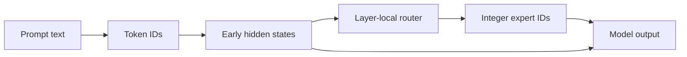

# Prompting an MoE: what you can and cannot control

The most persistent MoE myth is that a user can address internal experts like
named agents:

```text
Use the math expert, then ask the writing expert to polish the answer.
```

For the standard released architectures in this book, that text does **not**
invoke a public expert-selection command. It is ordinary prompt content. The
learned router still chooses integer expert IDs from token hidden states at
every MoE layer.

## The evidence chain

### Published fact: routing is per token and layer

Mixtral states that, for every token at every layer, a router selects two of
eight experts and combines their outputs
([paper](https://arxiv.org/abs/2401.04088)). The chosen pair can differ across
tokens and layers.

### Released-code fact: the router consumes a hidden-state tensor

Mistral's code calls `self.gate(inputs)`, takes top-k integer indexes, and
dispatches those token states
([source](https://github.com/mistralai/mistral-inference/blob/9eaeb91c17450e09021b6065a1d5cc69876507c8/src/mistral_inference/moe.py#L16-L32)).
DeepSeek-V3 similarly computes scores from `x`, returns weights plus indexes,
then runs indexed experts
([router](https://github.com/deepseek-ai/DeepSeek-V3/blob/9b4e9788e4a3a731f7567338ed15d3ec549ce03b/inference/model.py#L535-L598),
[experts](https://github.com/deepseek-ai/DeepSeek-V3/blob/9b4e9788e4a3a731f7567338ed15d3ec549ce03b/inference/model.py#L636-L693)).

### Published fact: expert semantics are not universal

- Mixtral reports no obvious expert assignment by tested topic and stronger
  syntactic patterns
  ([Section 5](https://arxiv.org/abs/2401.04088)).
- OLMoE reports stronger domain and vocabulary specialization in its own model,
  and little domain specialization in its Mixtral comparison
  ([Sections 5.3-5.4](https://arxiv.org/abs/2409.02060)).

Neither paper publishes a cross-model directory such as `expert 3 = algebra`.

### Interface fact: ordinary generation takes tokens, not expert IDs

The compared model-owner inference interfaces accept token IDs, positions,
caches, and generation settings. Internal expert indexes are produced inside
the model. Unless a runtime adds a nonstandard expert-mask/control interface,
the user cannot supply them directly.

## Claim-status table

| Claim | Status | Precise interpretation |
|---|---|---|
| A prompt changes the router input. | **Inference** | Different tokens/context change hidden states, and hidden states feed routers. |
| A prompt can indirectly change selected experts. | **Inference** | Likely and measurable, but the direction is model/layer/token dependent. |
| Writing "use expert 7" forces expert 7. | **Unsupported** | No such text-to-index command exists in the cited architectures. |
| Experts always correspond to human domains. | **False as a general claim** | Published routing analyses differ across checkpoints. |
| Prompting can guarantee a particular route. | **Unsupported** | Ordinary text interfaces expose no route constraint. |
| A model owner can force/mask routes in code. | **Code fact** | Expert indexes and masks are explicit tensors in open implementations. |
| Better prompts can improve an MoE's answers. | **Ordinary model behavior** | Better context/instructions can help any instruction-following model; this is not expert addressing. |

The word **inference** matters. The architecture makes indirect influence
plausible, but does not promise a stable, monotonic prompt-to-expert mapping.

## Why the prompt can influence routing indirectly

At layer $l$, token position $t$ has contextual state $h_{t,l}$. A linear router
computes something like:

$$
z_{t,l} = W_{r,l}h_{t,l}.
$$

Changing the prompt can change:

- token IDs and token boundaries;
- neighboring context;
- position indexes;
- attention results in preceding layers;
- therefore $h_{t,l}$ and router scores.



This path is indirect. A sentence containing the word "mathematics" might
alter routing because it changes tokens/context; it does not carry an
architectural command named `math_expert`.

## Why indirect influence is not control

### Routing is layer-local

Even if a token selects expert 4 in layer 3, it may select different IDs in
later layers. There is no single prompt-wide expert state.

### IDs are arbitrary indexes

Permuting expert indexes and permuting their corresponding weights leaves the
model function unchanged. The number itself has no intrinsic semantics.

### Tokenization matters

Paraphrases can split into different subwords and positions. A route associated
with one tokenization does not define a phrase-level API.

### Boundaries can be fragile

Top-k is discrete. A small hidden-state change can swap the `k`-th and
`(k+1)`-th experts. Conversely, a large prompt rewrite may leave some routes
unchanged.

### Specialization may be syntactic or lexical

Mixtral's analysis highlights syntax-aligned behavior. OLMoE finds both domain
and vocabulary specialization. "Expertise" need not match the task categories
a user has in mind.

### Post-training can change behavior without a new expert map

Instruction tuning teaches response behavior across the full network. It does
not automatically expose router labels or stable expert roles to the user.

## Thinking mode is not an expert selector

Qwen3 exposes thinking and non-thinking behavior plus a thinking-budget
mechanism in its post-trained interface
([technical report](https://arxiv.org/abs/2505.09388)). The same report
describes its MoE topology separately: 128 experts, top-8, no shared experts,
global-batch balancing.

The report does not define thinking mode as "activate more experts" or "select
the reasoning experts." Treat reasoning budget and MoE routing as separate
controls unless a model owner explicitly connects them.

Likewise, an API's `reasoning_effort`, temperature, maximum output tokens, or
tool-choice setting should not be described as an expert-routing parameter
without documentation and evidence.

## Prompt for the task, not for an imagined router

Useful prompt techniques remain useful:

### Supply the needed evidence

Put relevant source text, retrieved passages, schemas, examples, and constraints
in context. The model cannot reliably infer information you did not provide.

### State the operation and success criteria

```text
Given the attached incident log, identify the first causal failure.
Return: timestamp, exact error, affected service, and evidence lines.
Do not infer a cause that is not supported by the log.
```

This is better than "use your debugging expert" because it specifies observable
work.

### Decompose externally when verification matters

For a complex task, request or orchestrate inspect -> calculate -> verify ->
format stages. Tool calls and checks create evidence. A hidden expert label
would not provide verification even if one existed.

### Use examples for output contracts

Few-shot examples can clarify format and boundary cases. They change the
context the full model processes; they do not reserve a specific expert.

### Use retrieval and tools for changing facts

Prompt wording cannot make internal parameters current. Retrieve the latest
source or call the relevant tool.

### Evaluate outcomes

Measure correctness, calibration, latency, and cost on a representative set.
Do not use a guessed routing story as a substitute for an eval.

## Observe routing in an open checkpoint

Hugging Face's Mixtral implementation can return captured router logits
([router capture and output](https://github.com/huggingface/transformers/blob/63f32a8782cb70da3365acab16f2b67947737985/src/transformers/models/mixtral/modeling_mixtral.py#L400-L409),
[forward interface](https://github.com/huggingface/transformers/blob/63f32a8782cb70da3365acab16f2b67947737985/src/transformers/models/mixtral/modeling_mixtral.py#L603-L679)).
The exact return contract can vary by `transformers` version; pin and inspect
the version used in an experiment.

```python
import torch
from transformers import AutoModelForCausalLM, AutoTokenizer

model_id = "mistralai/Mixtral-8x7B-v0.1"
tokenizer = AutoTokenizer.from_pretrained(model_id)
model = AutoModelForCausalLM.from_pretrained(
    model_id,
    torch_dtype="auto",
    device_map="auto",
)

prompts = [
    "Prove that the square root of 2 is irrational.",
    "Give a contradiction proof for irrationality of sqrt(2).",
]
batch = tokenizer(prompts, return_tensors="pt", padding=True)
batch = {name: value.to(model.device) for name, value in batch.items()}

with torch.inference_mode():
    outputs = model(
        **batch,
        output_router_logits=True,
        use_cache=False,
        return_dict=True,
    )

valid_tokens = batch["attention_mask"].reshape(-1).bool()
for layer_id, layer_logits in enumerate(outputs.router_logits):
    logits = layer_logits[valid_tokens]
    expert_ids = logits.float().softmax(-1).topk(k=2, dim=-1).indices
    counts = torch.bincount(expert_ids.reshape(-1), minlength=8)
    print(layer_id, counts.tolist())
```

This checkpoint is large and needs substantial memory or a suitable sharded/
quantized setup. The snippet is an instrumentation pattern, not a claim that it
fits an ordinary laptop.

## Design a valid prompt-routing experiment

### Question

Does a controlled prompt change alter aggregate expert routing in this
checkpoint?

### Independent variable

Change one feature at a time:

- paraphrase while holding task and answer constant;
- switch domain while holding grammar/length similar;
- change syntax while holding topic similar;
- add task instructions without changing source content.

### Controls

- pin model revision, tokenizer, runtime, precision, and code;
- disable sampling by measuring prompt forward passes only;
- use identical padding/packing;
- distinguish input token identity from context effects;
- report routes per layer rather than collapsing all layers;
- repeat over a dataset, not one prompt.

### Measurements

- expert-count distribution and divergence between prompt sets;
- top-k Jaccard overlap for alignable token positions;
- router entropy and top-k margin;
- output quality and latency;
- confidence intervals across examples.

### What the result means

- A route difference shows correlation with the prompt manipulation.
- It does not prove an expert's semantic function.
- A quality difference does not prove routing caused it; all hidden states and
  attention computations also changed.
- A stable aggregate pattern does not create a supported user control unless
  the runtime guarantees it.

## Three levels of actual control

### User level: text and documented generation controls

You can control prompt content, available context, tool results, output schema,
sampling, and documented model modes. Expert routes remain internal.

### Research/runtime level: observe or intervene in code

With model weights and implementation, you can:

- capture router logits and IDs;
- mask experts;
- override top-k indexes;
- ablate or duplicate experts;
- change top-k or route weights;
- measure route sensitivity.

These interventions can push the checkpoint off its trained distribution and
degrade quality. They are model modifications, not prompt engineering.

### Training level: learn a controllable router

A model builder can train control tokens, task-aware gates, expert masks, or
separate routers. Only an explicitly designed and evaluated interface should be
advertised as expert control.

## A falsification checklist for expert-prompt claims

When someone claims "this phrase activates the coding expert," ask:

1. Which checkpoint revision and layer?
2. Which integer expert IDs?
3. Is evidence from router logits or only output quality?
4. Is the effect larger than tokenization, length, and syntax controls?
5. Does it replicate over a held-out dataset?
6. Is the route stable across layers and model revisions?
7. Does forcing the claimed expert improve the task under an intervention?
8. Is the interface documented by the model owner?

Without those answers, the claim is a story, not an engineering control.

## Bottom line

Prompting can influence an MoE because prompts influence the hidden states that
routers score. In the standard architectures reviewed here, it cannot directly
address, name, or guarantee internal experts.

Use good prompts to specify the task. Use instrumentation to study routing. Use
code or training changes if you need actual expert control. Keep those three
activities distinct.

Next: [build a tiny MoE](07-build-a-tiny-moe.md).
