# Lab: build a tiny MoE in PyTorch

This lab implements a complete, readable, dropless top-k MoE layer:

- SwiGLU experts;
- a learned linear router;
- top-k selection and normalized combine weights;
- dispatch and scatter-add combine;
- load-balancing and router z-losses;
- routing telemetry;
- forward/backward invariants.

It is intentionally a single-process teaching implementation. Production MoE
systems use grouped kernels, fused dispatch, and expert-parallel collectives.

## The contract

Input and output both have shape `(batch, sequence, d_model)`. For every token:

1. the router scores `n_experts`;
2. top-k chooses integer expert IDs;
3. the token is processed by those `k` experts;
4. normalized router weights scale the expert outputs;
5. scatter-add returns one update per original token.

```mermaid
flowchart LR
    input[/"x: batch by sequence by d_model"/]
    flatten[Flatten token positions]
    router["Router: T by E logits"]
    topk["Top-k IDs and weights: T by K"]
    dispatch[Gather token rows per expert]
    experts[SwiGLU expert FFNs]
    weight[Scale expert outputs]
    scatter[Scatter-add by token ID]
    reshape[Restore batch and sequence]
    output[/MoE output/]

    input --> flatten
    flatten --> router
    router --> topk
    topk --> dispatch
    flatten --> dispatch
    dispatch --> experts
    experts --> weight
    topk --> weight
    weight --> scatter
    scatter --> reshape
    reshape --> output
```



## Full implementation

```python
from __future__ import annotations

import torch
import torch.nn.functional as F
from torch import nn


class SwiGLUExpert(nn.Module):
    def __init__(self, d_model: int, d_hidden: int):
        super().__init__()
        self.gate = nn.Linear(d_model, d_hidden, bias=False)
        self.up = nn.Linear(d_model, d_hidden, bias=False)
        self.down = nn.Linear(d_hidden, d_model, bias=False)

    def forward(self, x: torch.Tensor) -> torch.Tensor:
        return self.down(F.silu(self.gate(x)) * self.up(x))


class TinyMoE(nn.Module):
    """Readable dropless token-choice MoE; not a performance implementation."""

    def __init__(
        self,
        d_model: int,
        d_hidden: int,
        n_experts: int,
        top_k: int,
    ):
        super().__init__()
        if not 1 <= top_k <= n_experts:
            raise ValueError("top_k must be in [1, n_experts]")

        self.d_model = d_model
        self.n_experts = n_experts
        self.top_k = top_k
        self.router = nn.Linear(d_model, n_experts, bias=False)
        self.experts = nn.ModuleList(
            SwiGLUExpert(d_model, d_hidden) for _ in range(n_experts)
        )

    def forward(
        self,
        x: torch.Tensor,
    ) -> tuple[
        torch.Tensor,
        torch.Tensor,
        torch.Tensor,
        dict[str, torch.Tensor],
    ]:
        if x.ndim != 3 or x.shape[-1] != self.d_model:
            raise ValueError("x must have shape (batch, sequence, d_model)")

        batch, sequence, d_model = x.shape
        flat = x.reshape(batch * sequence, d_model)             # (T, D)

        # Router math in float32 is more stable than lower-precision softmax.
        router_logits = self.router(flat).float()               # (T, E)
        probabilities = F.softmax(router_logits, dim=-1)        # (T, E)
        weights, expert_ids = probabilities.topk(
            self.top_k,
            dim=-1,
        )                                                       # both (T, K)
        weights = weights / weights.sum(dim=-1, keepdim=True)
        weights = weights.to(flat.dtype)

        output = torch.zeros_like(flat)                         # (T, D)

        # Each selected (token, slot) pair contributes one expert output.
        # Production runtimes replace this Python loop with grouped kernels.
        for expert_id, expert in enumerate(self.experts):
            token_index, selected_slot = torch.where(expert_ids == expert_id)
            if token_index.numel() == 0:
                continue

            expert_output = expert(flat[token_index])           # (N_i, D)
            combine_weight = weights[token_index, selected_slot, None]
            output.index_add_(
                0,
                token_index,
                expert_output * combine_weight,
            )

        # Switch-style top-k generalization: f_i is the fraction of all T*K
        # assignments; P_i is mean soft probability across T tokens.
        counts = torch.bincount(
            expert_ids.reshape(-1),
            minlength=self.n_experts,
        )
        assignment_fraction = counts.float() / expert_ids.numel()
        mean_probability = probabilities.mean(dim=0)
        balance_loss = self.n_experts * torch.sum(
            assignment_fraction * mean_probability
        )

        # ST-MoE router z-loss controls large log-partition values.
        router_z_loss = torch.logsumexp(
            router_logits,
            dim=-1,
        ).square().mean()

        entropy = -(
            probabilities * probabilities.clamp_min(1e-9).log()
        ).sum(dim=-1).mean()
        stats = {
            "expert_counts": counts.detach(),
            "mean_router_probability": mean_probability.detach(),
            "router_entropy": entropy.detach(),
            "expert_ids": expert_ids.detach(),
            "combine_weights": weights.detach(),
        }

        return (
            output.view(batch, sequence, d_model),
            balance_loss,
            router_z_loss,
            stats,
        )
```

The routing/combine structure follows the published top-k formulation used by
models such as Mixtral
([paper](https://arxiv.org/abs/2401.04088),
[released code](https://github.com/mistralai/mistral-inference/blob/9eaeb91c17450e09021b6065a1d5cc69876507c8/src/mistral_inference/moe.py#L16-L32)).
The balance-loss form follows Switch's $E\sum_i f_iP_i$ idea with an explicitly
documented top-k normalization
([Switch](https://arxiv.org/abs/2101.03961)). The z-loss comes from
[ST-MoE](https://arxiv.org/abs/2202.08906).

## Smoke test and backward pass

```python
torch.manual_seed(23)

model = TinyMoE(
    d_model=32,
    d_hidden=64,
    n_experts=4,
    top_k=2,
)
x = torch.randn(3, 7, 32)
target = torch.randn_like(x)

y, balance_loss, z_loss, stats = model(x)
main_loss = F.mse_loss(y, target)
loss = main_loss + 0.01 * balance_loss + 0.001 * z_loss
loss.backward()

assert y.shape == x.shape
assert torch.isfinite(loss)
assert int(stats["expert_counts"].sum()) == 3 * 7 * 2
assert torch.allclose(
    stats["combine_weights"].sum(dim=-1),
    torch.ones(3 * 7),
)
assert model.router.weight.grad is not None
assert torch.isfinite(model.router.weight.grad).all()

print("counts:", stats["expert_counts"].tolist())
print("main:", float(main_loss))
print("balance:", float(balance_loss))
print("z:", float(z_loss))
```

Why `T * k` counts? Every token selects `k` experts. If the sum is smaller, a
route was lost; if larger, a route was duplicated.

## Trace one token by hand

Add this after the forward pass:

```python
token = 0
print("selected IDs:", stats["expert_ids"][token].tolist())
print("weights:", stats["combine_weights"][token].tolist())
```

Then verify directly:

```python
flat = x.reshape(-1, x.shape[-1])
token_state = flat[token : token + 1]
direct = torch.zeros_like(token_state)

for slot in range(model.top_k):
    expert_id = int(stats["expert_ids"][token, slot])
    weight = stats["combine_weights"][token, slot]
    selected_expert = model.experts[expert_id]
    direct += weight * selected_expert(token_state)

assert torch.allclose(direct[0], y.reshape(-1, y.shape[-1])[token])
```

This test catches the most dangerous dispatch bug: correct shapes with expert
results restored to the wrong token.

## Read the loss values correctly

With uniform hard assignment fractions and uniform mean probabilities:

$$
E\sum_i f_iP_i
= E \cdot E \cdot \frac{1}{E}\frac{1}{E}
= 1.
$$

So the balance loss's useful target is near 1, not 0. Its coefficient controls
the gradient contribution; its constant offset does not affect gradients.

The z-loss is not expected to be near 1. It depends on router logit scale and
the number of experts. Compare it across consistent configurations.

## Train on a synthetic conditional task

This experiment gives the model two different target transformations based on
the sign of the first input feature. It does not force an expert assignment.
Specialization, if observed, emerges from optimization.

```python
torch.manual_seed(29)

d_model = 16
model = TinyMoE(
    d_model=d_model,
    d_hidden=32,
    n_experts=4,
    top_k=2,
)
optimizer = torch.optim.AdamW(model.parameters(), lr=3e-3)

positive_map = torch.randn(d_model, d_model) / d_model**0.5
negative_map = torch.randn(d_model, d_model) / d_model**0.5

for step in range(500):
    x = torch.randn(32, 8, d_model)
    positive_target = torch.tanh(x @ positive_map)
    negative_target = torch.sin(x @ negative_map)
    target = torch.where(x[..., :1] >= 0, positive_target, negative_target)

    y, balance, z_loss, stats = model(x)
    task_loss = F.mse_loss(y, target)
    loss = task_loss + 0.01 * balance + 0.001 * z_loss

    optimizer.zero_grad(set_to_none=True)
    loss.backward()
    torch.nn.utils.clip_grad_norm_(model.parameters(), 1.0)
    optimizer.step()

    if step % 100 == 0:
        print(
            step,
            f"task={task_loss.item():.4f}",
            f"balance={balance.item():.3f}",
            stats["expert_counts"].tolist(),
        )
```

After training, measure routes separately for positive- and negative-domain
tokens. Do not label an expert from one anecdotal batch.

```python
with torch.inference_mode():
    x = torch.randn(256, 1, d_model)
    _, _, _, stats = model(x)
    ids = stats["expert_ids"][:, 0]
    positive = x[:, 0, 0] >= 0

    for name, mask in (("positive", positive), ("negative", ~positive)):
        counts = torch.bincount(ids[mask].reshape(-1), minlength=4)
        print(name, counts.tolist())
```

Interpretation rules:

- different distributions show route association with the synthetic domain;
- they do not prove one expert alone implements that transformation;
- experts can co-operate because top-k is 2;
- balance loss can limit extreme specialization;
- a different seed can produce permuted expert IDs.

## Ablation 1: remove balancing

Set the balance coefficient to zero. Run several seeds and inspect:

- assignment counts;
- task loss;
- experts that receive no routes;
- worst/mean expert load;
- router entropy.

Collapse is not guaranteed in every tiny run. The experiment asks whether risk
and variance increase, not whether one seed reproduces a paper figure.

## Ablation 2: top-1 versus top-2

Change `top_k=1`. In this implementation, selected weights are re-normalized and
therefore become exactly one. The main loss then has no smooth gradient through
the combine weight away from top-1 selection boundaries; the balance/z losses
still train the router.

Switch retains the selected top-1 probability rather than re-normalizing it to
one. To emulate that design, skip the selected-weight normalization for
`top_k=1`. Compare router gradient norms and task loss. This demonstrates why
"top-1" is not a complete router specification.

## Add a capacity limit

The current layer is dropless: every selected assignment runs. To simulate
fixed capacity:

1. compute
   $C=\lceil\text{capacity factor}\cdot Tk/E\rceil$;
2. order selected assignments for each expert;
3. keep only the first `C` assignments;
4. either drop the remainder or reroute them;
5. record overflow separately from unused capacity.

Start with a mask builder:

```python
import math


def first_within_capacity(
    expert_ids: torch.Tensor,
    n_experts: int,
    capacity_factor: float,
) -> tuple[torch.Tensor, int]:
    """Return a (T, K) keep mask for a simple stable first-come policy."""
    capacity = math.ceil(
        capacity_factor * expert_ids.numel() / n_experts
    )
    keep = torch.zeros_like(expert_ids, dtype=torch.bool)
    used = torch.zeros(n_experts, dtype=torch.long, device=expert_ids.device)

    for token in range(expert_ids.shape[0]):
        for slot in range(expert_ids.shape[1]):
            expert = int(expert_ids[token, slot])
            if used[expert] < capacity:
                keep[token, slot] = True
                used[expert] += 1

    return keep, capacity
```

This Python loop is deliberately simple and creates position-dependent
first-come behavior. A production policy needs vectorization and an explicit
fairness/order design. If all selected assignments for a token are dropped,
returning zero from the MoE branch lets the surrounding residual connection
carry the token forward, as described by GShard and Switch.

## Add a shared expert

DeepSeekMoE-style shared experts run for every token and add to routed output:

```python
class TinyMoEWithShared(TinyMoE):
    def __init__(self, *args, d_hidden_shared: int, **kwargs):
        super().__init__(*args, **kwargs)
        self.shared_expert = SwiGLUExpert(self.d_model, d_hidden_shared)

    def forward(self, x: torch.Tensor):
        routed, balance, z_loss, stats = super().forward(x)
        shared = self.shared_expert(x)
        return routed + shared, balance, z_loss, stats
```

For a fair dense/routed/shared comparison, match total parameters and active
FFN work as closely as possible. Adding a shared expert without shrinking other
experts changes the budget.

## Put the MoE into a decoder block

Replace only the dense FFN branch:

```python
class MoEDecoderBlock(nn.Module):
    def __init__(self, d_model: int, attention: nn.Module, moe: TinyMoE):
        super().__init__()
        self.attention_norm = nn.RMSNorm(d_model)
        self.attention = attention
        self.moe_norm = nn.RMSNorm(d_model)
        self.moe = moe

    def forward(self, x: torch.Tensor):
        x = x + self.attention(self.attention_norm(x))
        moe_update, balance, z_loss, stats = self.moe(self.moe_norm(x))
        return x + moe_update, balance, z_loss, stats
```

The router sees the contextual post-attention state after normalization. This
is why routes can depend on the prompt context, not only the current token ID.

## From local loop to expert parallelism

The local implementation performs:

```text
where -> gather -> expert -> index_add
```

A distributed implementation performs:

```text
sort by owner -> exchange counts -> all-to-all dispatch
-> grouped local experts -> reverse all-to-all -> scatter-add
```

PyTorch torchtitan's
[MoE lifecycle](https://github.com/pytorch/torchtitan/blob/51c197c86d7c703da96f666d5a7dbd5432b4afbf/torchtitan/models/common/moe.py#L112-L152)
and
[AllToAllTokenDispatcher](https://github.com/pytorch/torchtitan/blob/51c197c86d7c703da96f666d5a7dbd5432b4afbf/torchtitan/models/common/token_dispatcher.py#L239-L665)
are the next code trail. Preserve the same mathematical output while changing
data movement.

## Required correctness tests

Before optimizing, add tests for:

1. output shape equals input shape;
2. exactly `T*k` assignments in dropless mode;
3. combine weights sum to one per token;
4. direct one-token computation equals dispatch/combine output;
5. all router/expert gradients are finite;
6. empty experts do not crash;
7. identical weights plus a forced route match a dense expert;
8. permutation then inverse permutation restores token order;
9. capacity overflow count matches a hand-built example;
10. checkpoint/resume preserves all router and balance state.

## Performance warning

This lab loops over experts and creates many small gathers. It is expected to be
slow. Do not benchmark it against a dense fused FFN and conclude that the MoE
architecture is inherently slower. First replace the Python expert loop with a
grouped implementation, then measure realistic batch and device layouts.

## Lab extensions

1. Implement sigmoid top-k and selection-only expert bias like DeepSeek-V3.
2. Add group-limited routing and verify no token touches more than `G_active`
   groups.
3. Track expert co-activation and router saturation across checkpoints using
   OLMoE's definitions.
4. Add expert dropout or router jitter and measure assignment turnover.
5. Compare shared versus routed-only experts at matched parameter/FLOP budgets.
6. Replace selected top-k normalization with the exact weighting rules of a
   named released architecture.
7. Build a two-process all-to-all version and verify bitwise token-index
   reconstruction before optimizing kernels.

Return to [real architectures](05-real-architectures.md) and identify which
changes are needed to approximate each named design.
