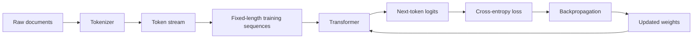
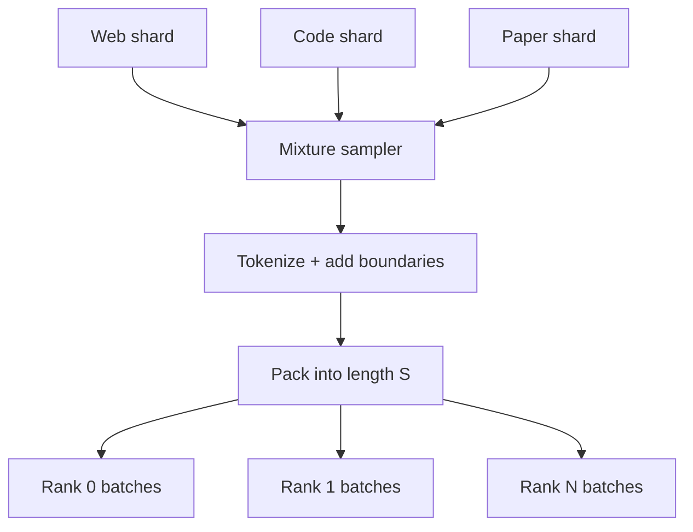

# Pretraining: Learning by Predicting the Next Token

Pretraining turns a sequence of tokens into millions or trillions of small prediction problems. The model is not given a database of facts or a hand-written grammar. It repeatedly sees a prefix and is optimized to assign more probability to the token that actually followed it.

> **Evidence key**
>
> - **Established:** follows from the objective or implementation.
> - **Empirical:** observed in a cited experiment; not a theorem.
> - **Practice:** a useful engineering heuristic that must be validated for a new run.

## The beginner's picture

Suppose the tokenizer converts:

```text
LLMs learn patterns
↓
[LL, Ms, learn, patterns]
↓
[411, 92, 8041, 1993]
```

A causal language model receives the tokens up to a position and predicts the next one:

| Input prefix | Training target |
|---|---|
| `[LL]` | `Ms` |
| `[LL, Ms]` | `learn` |
| `[LL, Ms, learn]` | `patterns` |



The same forward pass predicts every next token in a sequence in parallel during training. Generation is different: at inference time, a decoder usually produces one new token, appends it, and repeats.

## The objective

For tokens `x_1 ... x_T`, an autoregressive model factorizes the sequence probability as:

$$
p(x_1, \ldots, x_T) = \prod_{t=1}^{T} p(x_t \mid x_{<t})
$$

Training minimizes negative log-likelihood, usually implemented as token-level cross-entropy:

$$
\mathcal{L} = -\frac{1}{N}\sum_{i=1}^{N}
\log p_\theta(x_i \mid x_{<i})
$$

**Established:** this objective rewards probability assigned to the observed target. It does not directly say that a sentence is true, safe, helpful, or logically sound. Those properties may correlate with patterns in the data and can be shaped later, but they are not separate terms unless the training system adds them.

### Shifted labels

If a sequence is `[10, 20, 30, 40]`, the model inputs and targets are:

```text
input:  [10, 20, 30]
target: [20, 30, 40]
```

The causal attention mask prevents position `t` from reading future positions. Padding, document separators, and ignored labels need additional masks.

## A minimal training step

This is intentionally schematic PyTorch, not a production trainer:

```python
tokens = next(batch_iterator).to(device)  # [batch, sequence]
inputs = tokens[:, :-1]
targets = tokens[:, 1:]

with autocast_for_training():
    logits = model(inputs)                 # [batch, sequence-1, vocab]
    loss = cross_entropy(
        logits.reshape(-1, logits.size(-1)),
        targets.reshape(-1),
    )

optimizer.zero_grad(set_to_none=True)
loss.backward()
clip_grad_norm_(model.parameters(), max_norm=1.0)
optimizer.step()
scheduler.step()
```

Production code adds distributed collectives, gradient accumulation, mixed-precision scaling, activation checkpointing, fault recovery, metrics, and asynchronous checkpoint writes.

## From documents to sequences

Pretraining examples rarely correspond one-to-one with source documents. A data loader commonly:

1. reads a document and records its provenance;
2. tokenizes it with a fixed tokenizer version;
3. inserts an end-of-document token;
4. packs token streams into fixed-length sequences;
5. samples sources according to a declared mixture;
6. emits deterministic shards for each worker.



### Packing choices matter

- **Document boundaries:** Without an end marker, unrelated documents look contiguous.
- **Cross-document attention:** Some pipelines allow it inside a packed sequence; others use block masks. This is a design choice, not an invariant.
- **Padding:** Padding labels must be ignored or the model learns to predict padding.
- **Duplication:** Repeated records receive repeated gradient weight.
- **Source mixture:** Sampling weights determine the effective token distribution, even if raw byte counts are unchanged.

**Practice:** log tokens seen per source after sampling, not only files present before sampling.

## Loss, perplexity, and what they do not tell you

Perplexity is `exp(mean cross-entropy)` when the same tokenization and evaluation protocol are used.

**Established:** lower held-out loss means the model assigns higher probability to that held-out token stream.

**Caution:** perplexities from different tokenizers, normalization rules, or datasets are not directly comparable. A lower language-modeling loss also does not guarantee better safety, factuality, instruction following, or tool use.

## Dense and mixture-of-experts models

A sparse mixture-of-experts (MoE) transformer can use the same next-token objective. The difference is inside some layers: a learned router sends each token representation to a small subset of feed-forward experts. Auxiliary router losses may encourage balanced use.

**Established:** ordinary text prompting changes token representations and can indirectly change routing.

**Caution:** a user prompt does not expose a portable control such as “send this to expert 17.” Expert identities are learned, layer-local, and generally not stable semantic modules. Prompt for the task and evaluate the result; do not claim that prompt wording directly selects an expert.

## Failure modes visible during pretraining

| Symptom | Possible causes | First checks |
|---|---|---|
| Loss spike | bad batch, overflow, learning-rate jump, worker fault | batch IDs, gradient norm, finite values |
| Loss plateaus early | insufficient learning rate, data bug, capacity limit | tiny-set overfit, tokenizer and labels |
| Train improves, validation worsens | overfitting or domain mismatch | deduplication, split construction |
| Throughput falls | input stalls or collective imbalance | data wait time, per-rank step time |
| One source dominates | sampling or shard accounting error | post-sampling token counters |

## Source-code trail

Read these in order:

1. [nanoGPT `model.py`](https://github.com/karpathy/nanoGPT/blob/master/model.py) — compact GPT forward pass and shifted-token loss.
2. [nanoGPT `train.py`](https://github.com/karpathy/nanoGPT/blob/master/train.py) — a readable training loop, gradient accumulation, scheduling, evaluation, and DDP.
3. [LitGPT pretraining recipe](https://github.com/Lightning-AI/litgpt/blob/main/litgpt/pretrain.py) — a larger but approachable training recipe.
4. [TorchTitan `train.py`](https://github.com/pytorch/torchtitan/blob/main/torchtitan/train.py) — PyTorch-native large-scale orchestration.
5. [OLMo-core official scripts](https://github.com/allenai/OLMo-core/tree/main/src/scripts/official) — released model configurations tied to open training artifacts.

Repository links follow moving default branches. Pin a commit hash before reproducing an experiment.

## Exercises

1. For a 9-token sequence, count the next-token targets before and after adding one beginning token.
2. Implement shifted labels for a batch shaped `[2, 8]`; verify that no target can see itself through the attention mask.
3. Train a tiny model on ten lines until it overfits. If it cannot, identify the pipeline bug before scaling.
4. Compare validation loss with and without document separators. State what the experiment can and cannot establish.
5. Explain why a next-token objective can learn arithmetic patterns without containing an explicit “arithmetic loss.”

## Primary sources

- [Language Models are Few-Shot Learners](https://arxiv.org/abs/2005.14165)
- [nanoGPT](https://github.com/karpathy/nanoGPT)
- [LitGPT](https://github.com/Lightning-AI/litgpt)
- [TorchTitan](https://github.com/pytorch/torchtitan)
- [OLMo: Accelerating the Science of Language Models](https://arxiv.org/abs/2402.00838)
