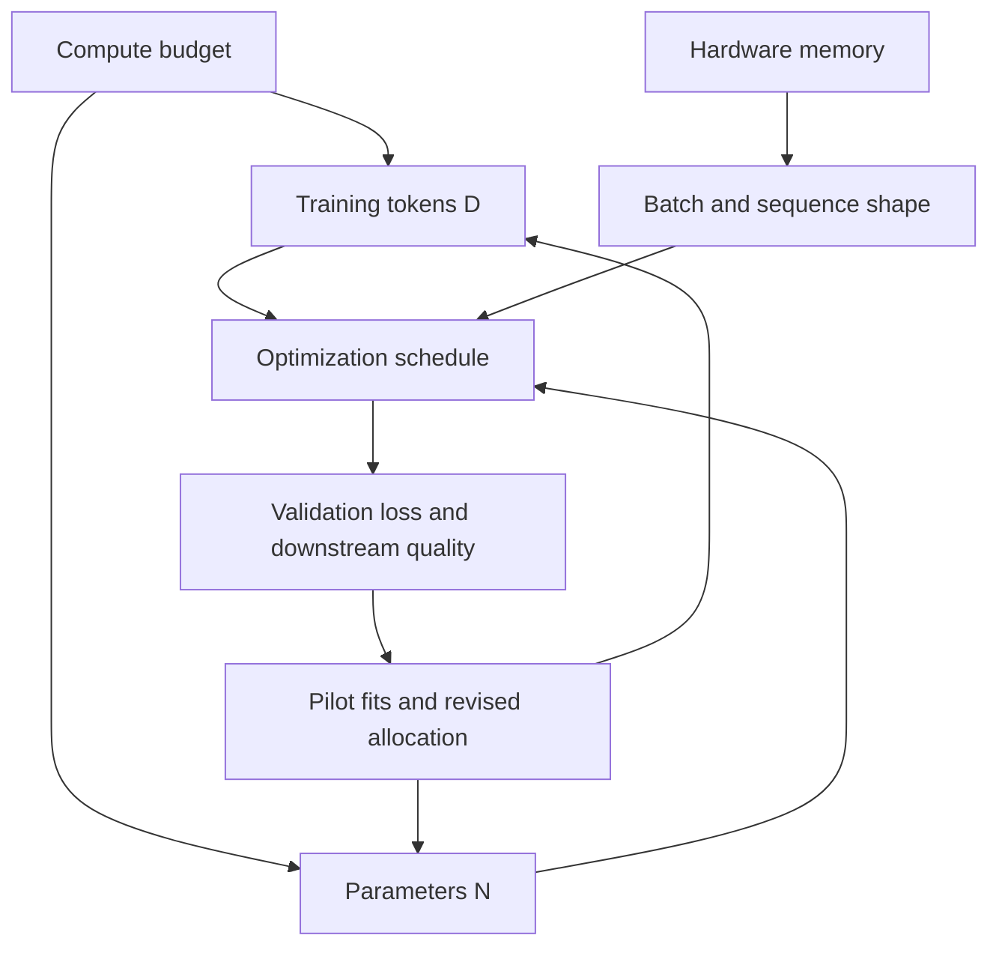

# Optimization and Scaling: Turning Compute into Learning

The pretraining objective says what to minimize. Optimization decides how to move billions of parameters toward a lower loss without numerical failure, while scaling studies decide how to spend a fixed compute budget.

> **Evidence key:** **Established** means mathematical or implementation fact; **Empirical** means measured in cited work; **Practice** means a default to test, not a law.

## Four coupled budgets



You cannot choose model size, token count, sequence length, batch size, precision, and parallelism independently. Increasing one often consumes memory or time needed by another.

## Gradient descent at LLM scale

Let `g_t` be the gradient at step `t`. Adam keeps moving estimates of the gradient and squared gradient:

$$
m_t = \beta_1 m_{t-1} + (1-\beta_1) g_t
$$

$$
v_t = \beta_2 v_{t-1} + (1-\beta_2) g_t^2
$$

AdamW applies an adaptive update and decoupled weight decay:

$$
\theta_{t+1} = \theta_t - \eta\,\widehat{u}_t
- \eta\lambda\theta_t
$$

Here `eta` is the learning rate, `lambda` is the decay coefficient, and
`u_hat` is the bias-corrected Adam direction derived from `m_t` and `v_t`.

**Established:** AdamW's decay term is not the same operation as adding an L2 penalty inside Adam's adaptive gradient. The distinction is the subject of the [AdamW paper](https://arxiv.org/abs/1711.05101).

### Common stabilizers

- **Warmup:** increase the learning rate gradually at the start.
- **Decay:** reduce it later with cosine, linear, or warmup-stable-decay schedules.
- **Gradient clipping:** cap a norm before the optimizer step.
- **Mixed precision:** use lower-precision matrix operations while retaining selected state at safer precision.
- **Loss scaling:** protect small gradients in some FP16 setups.
- **Gradient accumulation:** add microbatch gradients before one optimizer update.

**Practice:** values copied from another model are hypotheses. Batch size, optimizer betas, clipping threshold, and schedule should be tested through smaller runs with the same architecture and data regime.

## Tokens, batches, and steps

For data-parallel training:

$$
T_{step} = B_{micro} \times N_{devices} \times N_{accum} \times S
$$

If sequence lengths vary, measure non-padding tokens rather than multiplying maxima.

```python
def effective_tokens(microbatch, devices, accumulation, seq_len):
    return microbatch * devices * accumulation * seq_len

tokens = effective_tokens(
    microbatch=2,
    devices=64,
    accumulation=8,
    seq_len=4096,
)
print(tokens)  # 4,194,304 maximum tokens per optimizer step
```

Changing global batch changes the number of optimizer updates for a fixed token budget. Learning-rate scaling rules are empirical and can fail outside their tested regime.

## Scaling laws are measurements, not destiny

[Kaplan et al.](https://arxiv.org/abs/2001.08361) measured approximate power-law relationships between loss, model size, data, and compute over their experimental range. [Hoffmann et al.](https://arxiv.org/abs/2203.15556) fit a different allocation and showed that, under their assumptions and experiments, many then-large models used too few training tokens.

**Empirical:** smooth fitted trends can make small pilot runs useful for estimating larger runs.

**Caution:** a fitted exponent is conditional on architecture, tokenizer, data quality, optimizer, target loss distribution, and compute accounting. “Chinchilla optimal” is not a timeless token-to-parameter constant.

### Dense-transformer compute estimate

A frequently used planning approximation is:

$$
\operatorname{training\ FLOPs} \approx 6ND
$$

where `N` is non-embedding parameter count and `D` is training tokens.

**Practice:** treat `6ND` as a first estimate for dense autoregressive transformers, then use measured profiler FLOPs. Sparse MoE, attention variants, recomputation, embeddings, sequence length, and hardware utilization change real cost.

## A defensible scaling workflow

1. Freeze a representative tokenizer, data mixture, architecture family, and evaluation set.
2. Run several smaller sizes over several token budgets.
3. Record actual accelerator-hours, tokens, FLOPs, memory, and failure rate.
4. Fit loss against compute with uncertainty, not only a best-fit line.
5. Check downstream tasks and data slices, not just aggregate validation loss.
6. reserve budget for failed runs, ablations, checkpoint conversion, and evaluation.

```python
# Pseudocode: a pilot matrix, not a production launcher.
pilots = []
for params in [100e6, 300e6, 1e9]:
    for tokens in [5e9, 15e9, 45e9]:
        run = train_and_measure(params=params, tokens=tokens)
        pilots.append({
            "params": params,
            "tokens": tokens,
            "flops": run.measured_flops,
            "val_loss": run.val_loss,
            "seed": run.seed,
        })

fit = fit_power_law_with_uncertainty(pilots)
candidate = choose_under_budget(fit, accelerator_hours=budget)
```

## Data quality changes the frontier

Two runs with equal token counts are not equal if one contains more duplicates, broken text, benchmark contamination, or low-information pages. Source mixture and curriculum can also change which capabilities emerge.

**Empirical:** OLMo releases make configurations, checkpoints, and logs available, which lets researchers inspect training trajectories rather than infer them from a final checkpoint.

**Practice:** report both raw corpus size and effective sampled tokens per source.

## Numerical health dashboard

Track at least:

| Metric | Why it matters |
|---|---|
| train and validation loss | learning and generalization trend |
| gradient norm before clipping | instability and silent over-clipping |
| learning rate | schedule correctness |
| finite-value checks | overflow or invalid batches |
| tokens/second and model FLOP utilization | efficiency |
| data-loader wait | input bottlenecks |
| per-source tokens | mixture correctness |
| per-rank step-time distribution | stragglers |

An aggregate loss can look normal while one source, rank, or parameter group is broken.

## Source-code trail

1. [nanoGPT learning-rate schedule](https://github.com/karpathy/nanoGPT/blob/master/train.py) — search for `get_lr`, optimizer creation, clipping, and accumulation.
2. [LitGPT configuration hub](https://github.com/Lightning-AI/litgpt/tree/main/config_hub) — concrete recipe parameters across model families.
3. [OLMo-core official training scripts](https://github.com/allenai/OLMo-core/tree/main/src/scripts/official) — released schedules and optimizer settings.
4. [TorchTitan metrics](https://github.com/pytorch/torchtitan/tree/main/torchtitan/components) — optimizer, scheduler, metrics, and checkpoint components.
5. [TorchAO](https://github.com/pytorch/ao) — low-precision training and optimizer implementations.

## Exercises

1. Compute tokens per optimizer step for 128 devices, microbatch 1, sequence length 8192, and accumulation 4.
2. Hold total tokens fixed and double global batch. What happens to the number of optimizer steps?
3. Design a 12-run pilot matrix for two model sizes, three token budgets, and two seeds.
4. List three reasons a `6ND` estimate can disagree with profiler output.
5. Inspect an OLMo official script and record which choices are facts about that run versus recommendations for your run.

## Primary sources

- [Scaling Laws for Neural Language Models](https://arxiv.org/abs/2001.08361)
- [Training Compute-Optimal Large Language Models](https://arxiv.org/abs/2203.15556)
- [Decoupled Weight Decay Regularization](https://arxiv.org/abs/1711.05101)
- [OLMo: Accelerating the Science of Language Models](https://arxiv.org/abs/2402.00838)
- [TorchTitan](https://github.com/pytorch/torchtitan)
