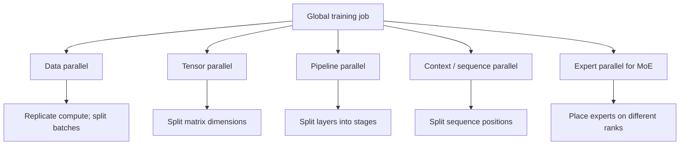
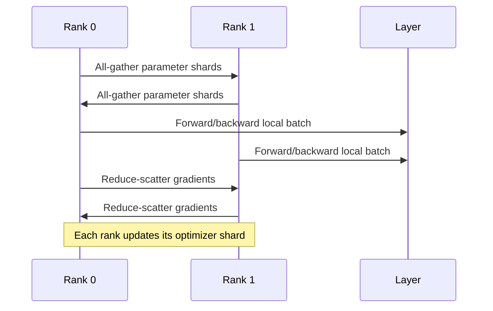
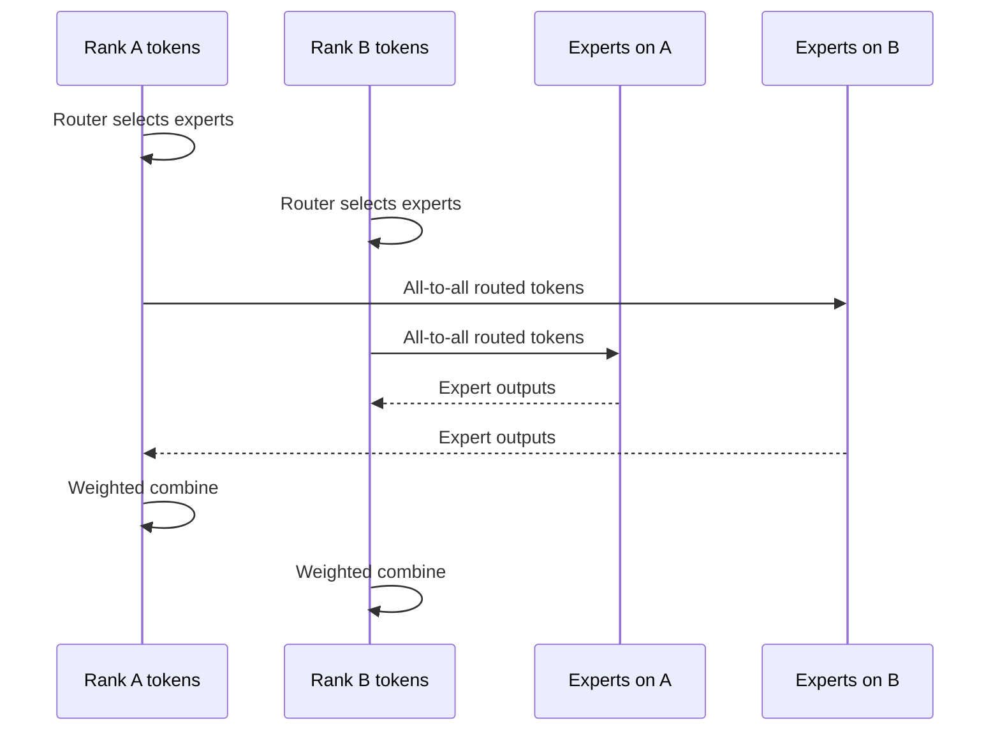

# Distributed Training: One Model, Many Accelerators

A single accelerator may not hold the model, optimizer state, activations, and batch. Distributed training splits different dimensions of that work across devices, then communicates enough information to preserve the intended computation.

> **Evidence key:** **Established** describes the computation; **Empirical** reports cited measurements; **Practice** is topology-dependent guidance.

## The dimensions of parallelism



These techniques compose. A “3D” configuration often means data, tensor, and pipeline parallelism; modern stacks can add context and expert dimensions.

## Data parallelism

Each rank processes different examples with the same logical parameters. Gradients are reduced so every replica applies a consistent update.

**Established:** classic distributed data parallelism replicates parameters, gradients, and optimizer state on every data-parallel rank. Communication is dominated by gradient collectives.

### FSDP and ZeRO

Fully sharded data parallelism and ZeRO-family methods partition some or all of:

- optimizer state;
- gradients;
- parameters.

Parameters can be gathered just before use and released or resharded afterward.



**Caution:** “ZeRO stage” names come from a particular system. Compare what is sharded and when, not labels alone.

## Tensor parallelism

Tensor parallelism divides individual matrix operations. For a linear layer `Y = XW`, ranks can split columns or rows of `W`, compute partial results, and combine them with collectives.

**Established:** tensor parallelism reduces per-device parameter and compute load but introduces communication inside layers. It benefits from fast links such as NVLink/NVSwitch more than slow inter-node networks.

## Pipeline parallelism

Pipeline parallelism assigns groups of layers to stages. Microbatches flow through stages like an assembly line.

This simplified fill-drain schedule makes the backward dependency explicit: a stage can backpropagate a microbatch only after the next stage has produced its input gradient.

```text
time →     1      2      3      4      5      6      7      8
stage 0   F(m0)  F(m1)  F(m2)                       B(m2)  B(m1)  B(m0)
stage 1          F(m0)  F(m1)  F(m2)  B(m2)  B(m1)  B(m0)
```

Empty slots are pipeline bubbles. More microbatches can reduce the bubble fraction but increase activation lifetimes and scheduling complexity.

## Context and sequence parallelism

Long sequences create large activation and attention workloads. Context parallelism partitions positions across ranks and exchanges the information needed for attention. “Sequence parallel” can also refer to partitioning selected non-attention operations; read each framework's definition.

## Expert parallelism

In sparse MoE layers, experts are placed across ranks. The router produces token-to-expert assignments, then an all-to-all exchange sends token representations to the owning ranks and returns expert outputs.



Load imbalance can leave some ranks waiting. Capacity policies, auxiliary losses, token dropping, replication, and routing algorithms trade quality, memory, and communication.

## Activation checkpointing is not a saved checkpoint

- **Activation checkpointing (recomputation):** discard selected forward activations and recompute them during backward to save memory.
- **Training checkpoint:** persist model and run state to storage so a job can resume.

They solve different problems.

**Established:** activation recomputation exchanges additional compute for lower activation memory. RNG handling matters for operations such as dropout; see [PyTorch activation checkpointing](https://docs.pytorch.org/docs/stable/checkpoint.html).

## Choosing a topology

```python
# Pseudocode only. Real mesh APIs differ.
world = 256
mesh = {
    "data": 8,
    "tensor": 8,
    "pipeline": 2,
    "context": 2,
}
assert product(mesh.values()) == world

# Keep high-frequency tensor collectives on the fastest links.
place_dimension("tensor", within_node=True)
place_dimension("pipeline", across_selected_nodes=True)
```

**Practice:**

1. Start with the smallest number of parallel dimensions that fits.
2. Put the most frequent, latency-sensitive collectives on the fastest links.
3. Measure achieved throughput and per-rank idle time.
4. Verify numerical convergence against a smaller reference configuration.
5. Test restart and resharding before a long run.

## Communication vocabulary

| Collective | Intuition | Common use |
|---|---|---|
| all-reduce | sum/aggregate then share with all | replicated gradient sync |
| all-gather | collect shards into a full value | parameter materialization |
| reduce-scatter | aggregate then leave each rank a shard | sharded gradients |
| all-to-all | every rank sends distinct pieces to every rank | expert routing |
| point-to-point | send between selected ranks | pipeline stages |

## Source-code trail

1. [TorchTitan Llama parallelization](https://github.com/pytorch/torchtitan/blob/main/torchtitan/models/llama3/parallelize.py) — composable data, tensor, context, activation-checkpoint, and compile setup.
2. [TorchTitan pipeline helpers](https://github.com/pytorch/torchtitan/blob/main/torchtitan/distributed/pipeline_parallel.py) — stage construction and schedules.
3. [Megatron-LM](https://github.com/NVIDIA/Megatron-LM) — production implementations of tensor, pipeline, context, data, and expert parallelism.
4. [Megatron Core parallelism guide](https://github.com/NVIDIA/Megatron-LM/tree/main/docs) — concepts tied to current code.
5. [PyTorch distributed checkpoint](https://docs.pytorch.org/docs/stable/distributed.checkpoint.html) — sharded save/load and resharding interfaces.

## Exercises

1. Draw the parameter, gradient, and optimizer-state placement for DDP and fully sharded data parallelism.
2. For 64 GPUs, propose a mesh that uses tensor parallel 8 and pipeline parallel 2. What is the remaining data-parallel degree?
3. Explain why expert parallelism commonly needs all-to-all rather than all-reduce.
4. Measure a toy model with and without activation checkpointing; report memory and step-time differences.
5. List the correctness checks needed before accepting that two parallel layouts are equivalent.

## Primary sources

- [ZeRO: Memory Optimizations Toward Training Trillion Parameter Models](https://arxiv.org/abs/1910.02054)
- [Megatron-LM: Training Multi-Billion Parameter Language Models Using Model Parallelism](https://arxiv.org/abs/1909.08053)
- [TorchTitan](https://github.com/pytorch/torchtitan)
- [Megatron-LM and Megatron Core](https://github.com/NVIDIA/Megatron-LM)
- [PyTorch Distributed Checkpoint](https://docs.pytorch.org/docs/stable/distributed.checkpoint.html)
