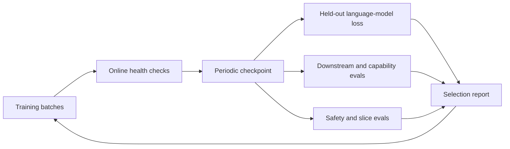
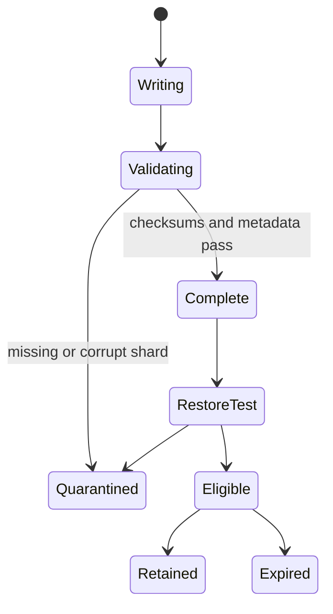

# Evaluation and Checkpoints: Knowing Whether a Run Is Good

A final loss number is not a training record. A credible run preserves enough state to resume, enough metadata to reproduce, and enough evaluation detail to explain what improved, regressed, or leaked.

> **Evidence key:** **Established** is a metric or state definition; **Empirical** is a cited finding; **Practice** is a recommended operating procedure.

## Three evaluation loops



1. **Online health:** loss, gradients, throughput, finite values, source mix, hardware failures.
2. **Development evaluation:** frequent held-out loss and a small stable capability suite.
3. **Release evaluation:** broader, slower, versioned tests with contamination and safety analysis.

## What a resumable checkpoint contains

At minimum:

- model parameters and buffers;
- optimizer state;
- scheduler state and current step;
- mixed-precision scaler state where applicable;
- random-number-generator states;
- data-loader position or sampler state;
- distributed topology and shard metadata;
- tokenizer and model configuration;
- code revision and dependency/container identity;
- data manifest or immutable fingerprints.

```python
# Illustrative manifest. Store tensors in an appropriate checkpoint format.
manifest = {
    "format_version": 1,
    "global_step": 120_000,
    "tokens_seen": 503_316_480_000,
    "git_commit": "FULL_COMMIT_HASH",
    "tokenizer_digest": "sha256:...",
    "data_manifest_digest": "sha256:...",
    "world_size": 256,
    "parallel_mesh": {"dp": 8, "tp": 8, "pp": 2, "cp": 2},
    "rng_state_present": True,
    "dataloader_state_present": True,
}
```

**Established:** inference requires compatible weights, architecture configuration and implementation, plus the matching tokenizer or input processor. An exact training resume additionally needs optimizer and scheduler state, random-number-generator state, data position, and other run metadata.

## Checkpoint lifecycle



**Practice:** write to a temporary location, verify every shard and manifest, then atomically publish a “complete” marker. Regularly launch a real restore test; a directory existing is not proof it can resume.

Distributed checkpoint systems can reshard when loading into a different topology. That flexibility does not remove the need to record the original topology and test numerical continuity.

## Validation loss

Use a frozen, documented split that does not overlap training records after normalization and deduplication.

Report:

- tokenizer and exact dataset revision;
- loss aggregation method;
- number of evaluated tokens;
- document-boundary and padding policy;
- whether samples were seen in training;
- confidence or variance across slices where meaningful.

**Caution:** choosing the checkpoint with the lowest value on a repeatedly inspected test set turns that test set into development data. Maintain a separate final set.

## Downstream evaluation

A benchmark result is a pipeline result:

$$
score = f(model, checkpoint, tokenizer, prompt, decoding, harness, data_revision)
$$

Change any input and the score may change.

```yaml
# Conceptual reproducibility record
model_revision: checkpoint-120000
tokenizer_revision: sha256:...
task: example_task
task_revision: immutable_dataset_revision
prompt_template_revision: git_commit
num_fewshot: 5
decoding:
  temperature: 0
  max_new_tokens: 256
seeds: [11, 29, 47]
```

The [Language Model Evaluation Harness](https://github.com/EleutherAI/lm-evaluation-harness) uses versionable task configurations and supports logged samples. Inspect the rendered prompt, not only the task name.

## Contamination

Benchmark contamination can occur through exact duplicates, near duplicates, solutions, paraphrases, or generated derivatives in training data.

**Practice:**

1. normalize and search for exact matches;
2. use near-duplicate and substring checks;
3. search for answer explanations, not only questions;
4. document detector thresholds and false positives;
5. add time-split or newly authored tests;
6. report suspected contamination rather than silently removing inconvenient items.

Contamination analysis reduces uncertainty; it rarely proves that no semantic leakage exists.

## Selecting checkpoints

Do not collapse every goal into one number. A selection table can expose tradeoffs:

| Checkpoint | held-out loss | code | math | factuality | safety | inference cost |
|---|---:|---:|---:|---:|---:|---:|
| A | ... | ... | ... | ... | ... | ... |
| B | ... | ... | ... | ... | ... | ... |

**Practice:** define selection criteria before running the final evaluation. If weights are averaged or “souped,” record the exact input checkpoints and coefficients.

## Source-code trail

1. [TorchTitan checkpoint component](https://github.com/pytorch/torchtitan/blob/main/torchtitan/components/checkpoint.py) — distributed save/load in a training system.
2. [PyTorch Distributed Checkpoint](https://docs.pytorch.org/docs/stable/distributed.checkpoint.html) — sharded state and resharding.
3. [OLMo checkpoints and training artifacts](https://github.com/allenai/OLMo-core) — official scripts and checkpoint references.
4. [lm-evaluation-harness task guide](https://github.com/EleutherAI/lm-evaluation-harness/blob/main/docs/task_guide.md) — versionable task definitions.
5. [OpenAI Evals](https://github.com/openai/evals) — another open evaluation framework and registry.

## Exercises

1. Remove RNG and sampler state from a toy checkpoint, resume twice, and explain the divergence.
2. Write a checkpoint manifest schema with required checksums and an atomic completion marker.
3. Render the exact prompt for one `lm-eval` task and identify every choice that affects the score.
4. Design an exact-match and near-duplicate contamination audit for a five-question benchmark.
5. Create a checkpoint selection rubric that cannot be gamed by improving one aggregate metric while harming a critical slice.

## Primary sources

- [Language Model Evaluation Harness](https://github.com/EleutherAI/lm-evaluation-harness)
- [OLMo: Accelerating the Science of Language Models](https://arxiv.org/abs/2402.00838)
- [PyTorch Distributed Checkpoint](https://docs.pytorch.org/docs/stable/distributed.checkpoint.html)
- [OpenAI Evals](https://github.com/openai/evals)
- [PALOMA: A Benchmark for Language Model Fit](https://arxiv.org/abs/2312.10523)
