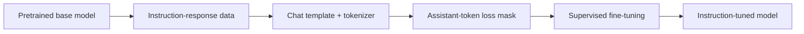
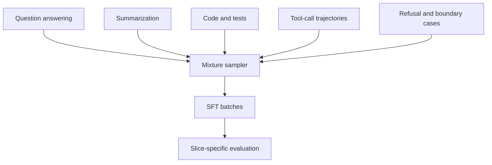

# Supervised Fine-Tuning and Instruction Tuning

A pretrained base model predicts plausible continuations. Supervised fine-tuning (SFT) teaches it to produce selected responses in selected interaction formats. The optimization still looks like next-token prediction; what changes is the data, the masking, and the behavioral target.

> **Evidence key:** **Established** is implied by the objective or code; **Empirical** is a cited result; **Practice** is an engineering heuristic to validate.

## From continuation to response



A raw base-model record might be a document. An SFT record is often a conversation:

```json
{
  "messages": [
    {"role": "system", "content": "Answer with evidence."},
    {"role": "user", "content": "Why does ice float?"},
    {"role": "assistant", "content": "Solid water is less dense than liquid water..."}
  ]
}
```

The chat template converts these roles into the exact control-token sequence expected by a model family. A template is part of the model interface, not cosmetic punctuation.

## The SFT loss

Let `m_t` be 1 for tokens included in the loss and 0 for ignored tokens:

$$
\mathcal{L}_{SFT}
= -\frac{\sum_t m_t \log p_\theta(y_t \mid x,y_{<t})}
{\sum_t m_t}
$$

Many instruction-tuning setups compute loss only on assistant/completion tokens. Others train on the full serialized conversation.

**Established:** completion-only masking prevents prompt tokens from directly contributing to the cross-entropy loss. The prompt still conditions every assistant-token prediction.

```python
# Simplified masking logic; real templates identify role boundaries.
labels = input_ids.clone()
labels[assistant_mask == 0] = -100  # PyTorch cross-entropy ignore index
loss = model(input_ids=input_ids, labels=labels).loss
```

**Caution:** a one-token boundary error can train the model on user text, hide part of the desired answer, or expose tool results as targets. Decode and inspect examples after templating.

## Instruction tuning as task mixture

[FLAN](https://arxiv.org/abs/2109.01652) provided empirical evidence that fine-tuning on many tasks expressed as instructions improved zero-shot performance on held-out task types in its experimental setting.

**Empirical, not universal:** task diversity, model scale, templates, and the underlying model affected the reported gains. Adding more examples of one narrow format is not the same as adding task diversity.



## Data quality beats format volume

A useful SFT example should have:

- a clear, realistic input;
- a response that actually satisfies it;
- correct facts or executable behavior;
- an explicit policy for uncertainty and refusal;
- provenance and rights metadata;
- a known generation or authoring process;
- a stable template and tokenizer revision.

Near-duplicate synthetic responses can make a dataset look large while narrowing its effective diversity.

**Practice:** evaluate source slices independently. A global average can hide that code improves while multilingual or safety behavior regresses.

## Tool-use records

Tool-capable SFT data needs the full interaction contract:

```json
{
  "messages": [
    {"role": "user", "content": "What is 37 times 19?"},
    {
      "role": "assistant",
      "tool_calls": [
        {"name": "multiply", "arguments": {"a": 37, "b": 19}}
      ]
    },
    {"role": "tool", "name": "multiply", "content": "703"},
    {"role": "assistant", "content": "37 × 19 is 703."}
  ],
  "tools": [
    {
      "name": "multiply",
      "parameters": {
        "type": "object",
        "properties": {
          "a": {"type": "integer"},
          "b": {"type": "integer"}
        },
        "required": ["a", "b"]
      }
    }
  ]
}
```

**Established:** the model emits a request; an application executes the tool. Training a tool-call syntax does not grant permissions or implement the tool.

## Full fine-tuning and adapters

- **Full fine-tuning:** update all selected model weights.
- **LoRA/adapters:** train small low-rank or adapter parameters while keeping most base weights frozen.
- **QLoRA-style setup:** keep a quantized frozen base for memory efficiency while training adapters.

Adapters reduce trainable state and can make experimentation cheaper. They do not automatically match full fine-tuning, remove data-quality requirements, or guarantee faster serving.

## A small TRL example

This shape assumes a conversational dataset whose rows contain role-tagged messages and a model chat template that emits an assistant-token mask. `assistant_only_loss=True` is valid only when that template can identify assistant tokens; otherwise choose a compatible template or loss mode.

```python
from datasets import load_dataset
from trl import SFTConfig, SFTTrainer

dataset = load_dataset("your_org/your_conversational_dataset", split="train")

trainer = SFTTrainer(
    model="your-base-model",
    train_dataset=dataset,
    args=SFTConfig(
        assistant_only_loss=True,
        output_dir="runs/sft-v1",
    ),
)
trainer.train()
```

Pin model, dataset, tokenizer, TRL, Transformers, and template revisions in a real experiment. Validate that a rendered sample carries the intended assistant mask before training. The example intentionally does not claim universal hyperparameters.

## Evaluation

Evaluate at least:

1. task correctness with deterministic graders where possible;
2. exact chat-template behavior;
3. refusal versus over-refusal slices;
4. tool selection and argument validity;
5. multi-turn consistency;
6. base-capability regression;
7. memorization and privacy probes.

SFT loss is useful for debugging but is not a complete measure of assistant quality.

## Source-code trail

1. [TRL `SFTTrainer` guide](https://github.com/huggingface/trl/blob/main/docs/source/sft_trainer.md) — data formats, completion masking, and tool-calling records.
2. [TRL `sft_trainer.py`](https://github.com/huggingface/trl/blob/main/trl/trainer/sft_trainer.py) — preprocessing and trainer implementation.
3. [TRL dataset formats](https://github.com/huggingface/trl/blob/main/docs/source/dataset_formats.md) — conversational and prompt-completion contracts.
4. [LitGPT fine-tuning recipes](https://github.com/Lightning-AI/litgpt/tree/main/litgpt/finetune) — readable full, LoRA, and adapter recipes.

## Exercises

1. Serialize one conversation with two different chat templates and compare token IDs.
2. Visualize the assistant-token loss mask for a multi-turn conversation with a tool result.
3. Construct a mixture where no source exceeds 30% of sampled tokens; verify it after batching.
4. Write five tests that distinguish correct refusal from over-refusal.
5. Train a tiny model with prompt-inclusive and completion-only loss. State what the result does not generalize to.

## Primary sources

- [Finetuned Language Models Are Zero-Shot Learners](https://arxiv.org/abs/2109.01652)
- [Training Language Models to Follow Instructions with Human Feedback](https://arxiv.org/abs/2203.02155)
- [TRL](https://github.com/huggingface/trl)
- [LoRA: Low-Rank Adaptation of Large Language Models](https://arxiv.org/abs/2106.09685)
- [QLoRA: Efficient Finetuning of Quantized LLMs](https://arxiv.org/abs/2305.14314)
