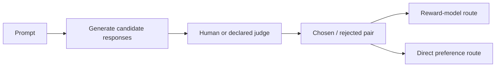
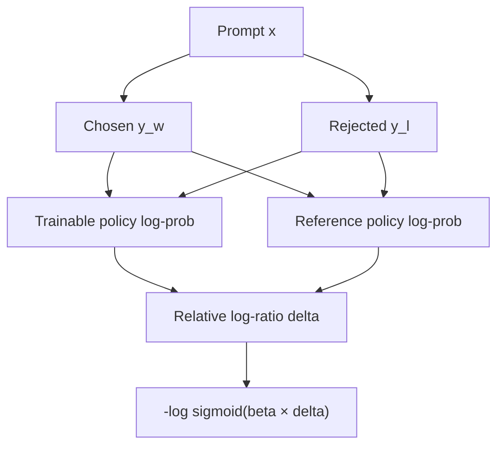

# Preference Optimization: Learning from Comparisons

Supervised data says “produce this response.” Preference data says “for this prompt, response A is preferred to response B.” That weaker label can express qualities with many valid answers, but it also imports the raters' assumptions and the data-collection process.

> **Evidence key:** **Established** follows from an objective; **Empirical** is reported by cited work; **Practice** is an operating recommendation.

## The preference record

```json
{
  "prompt": "Explain photosynthesis to a ten-year-old.",
  "chosen": "Plants use light energy to turn water and carbon dioxide...",
  "rejected": "Photosynthesis is when plants eat sunlight."
}
```



The label is meaningful only with a rubric. “Preferred” might mean more correct, safer, shorter, more persuasive, or merely better formatted.

## Pairwise reward modeling

A scalar reward model `r(x, y)` can be fit with a Bradley–Terry-style probability:

$$
P(y_w \succ y_l \mid x)
= \sigma\!\left(r(x,y_w)-r(x,y_l)\right)
$$

The pairwise loss penalizes the reward model when it does not give the chosen response a higher score.

**Established:** pairwise labels identify relative preference under the collected comparisons. They do not establish an absolute, context-free utility scale.

## Direct Preference Optimization

[DPO](https://arxiv.org/abs/2305.18290) derives a classification-style objective from a KL-regularized reward-maximization formulation. Define:

$$
\Delta =
\left[\log\pi_\theta(y_w\mid x)-\log\pi_{ref}(y_w\mid x)\right]
-\left[\log\pi_\theta(y_l\mid x)-\log\pi_{ref}(y_l\mid x)\right]
$$

Then the common DPO loss is:

$$
\mathcal{L}_{DPO} = -\log\sigma(\beta\Delta)
$$

- `pi` is the trainable policy.
- `pi_ref` is a frozen reference policy.
- `beta` controls the strength of the relative log-ratio margin under the paper's parameterization.



**Empirical:** the DPO paper reported competitive or better results than the studied PPO-based pipeline on its evaluated sentiment, summarization, and dialogue settings.

**Caution:** that is not a theorem that DPO always beats RLHF. Results depend on the base model, pairs, reference, implementation, hyperparameters, and evaluation.

## What can go wrong

### Label ambiguity

Raters can disagree because the rubric is underspecified. Track agreement and retain the reason for a preference when possible.

### Position and style bias

Length, formatting, confidence, or candidate order can influence judgments. Randomize position and add targeted counterexamples.

### Off-support comparisons

Pairs far from what the policy can generate may provide an awkward learning signal. Online collection can refresh candidate distributions but costs more and creates feedback-loop risks.

### Likelihood displacement

The pairwise margin can improve while both chosen and rejected response likelihoods move unexpectedly. Log chosen likelihood, rejected likelihood, margin, and KL-like drift separately.

### Reward-model overoptimization

When an optimizer exploits a learned judge, measured reward can rise while actual quality falls. Maintain held-out human evaluation and adversarial slices.

## SFT, DPO, or online RL?

| Need | Likely starting point | Why |
|---|---|---|
| teach a new output format | SFT | direct target is available |
| choose among many acceptable styles | preference optimization | relative judgments are natural |
| optimize a verifiable interactive outcome | online RL or search | reward depends on sampled behavior |
| repair missing domain knowledge | retrieval or continued training | preference labels may not add the facts |

This table is a decision aid, not a universal rule.

## Minimal TRL shape

```python
from datasets import load_dataset
from trl import DPOConfig, DPOTrainer

pairs = load_dataset("your_org/versioned_preferences", split="train")

trainer = DPOTrainer(
    model="your-sft-checkpoint",
    train_dataset=pairs,
    args=DPOConfig(
        output_dir="runs/dpo-v1",
        beta=0.1,  # experiment setting, not a recommendation
    ),
)
trainer.train()
```

In current TRL, omitting `ref_model` uses the trainer's documented default reference-model behavior. If you need an explicit reference, instantiate a compatible `PreTrainedModel` and pass that object rather than a model-name string. Check current library signatures and pin a commit; trainer APIs evolve.

## Evaluation design

Use:

- blinded pairwise human comparisons with order randomization;
- deterministic task graders where a ground truth exists;
- length- and style-matched slices;
- win, loss, and tie reporting;
- confidence intervals across prompts;
- safety and over-refusal slices;
- base-capability regression;
- judge-model calibration against human labels.

**Practice:** keep the training judge and final judge distinct when possible.

## Source-code trail

1. [TRL DPO guide](https://github.com/huggingface/trl/blob/main/docs/source/dpo_trainer.md) — objective variants, formats, and configuration.
2. [TRL `dpo_trainer.py`](https://github.com/huggingface/trl/blob/main/trl/trainer/dpo_trainer.py) — log-probability and loss implementation.
3. [TRL dataset formats](https://github.com/huggingface/trl/blob/main/docs/source/dataset_formats.md) — explicit and implicit preference schemas.
4. [DPO paper](https://arxiv.org/abs/2305.18290) — derivation and original experiments.

## Exercises

1. Write a rubric that separates factuality, safety, relevance, and style. Label when no candidate wins.
2. Compute `delta` for chosen and rejected log-probabilities under a policy and reference.
3. Build a test where a verbose but wrong response competes with a terse correct response.
4. Plot chosen likelihood, rejected likelihood, pairwise accuracy, and response length during a toy DPO run.
5. Explain why a high judge-model win rate is insufficient if the same judge generated the training labels.

## Primary sources

- [Direct Preference Optimization](https://arxiv.org/abs/2305.18290)
- [Training Language Models to Follow Instructions with Human Feedback](https://arxiv.org/abs/2203.02155)
- [TRL](https://github.com/huggingface/trl)
- [Proximal Policy Optimization Algorithms](https://arxiv.org/abs/1707.06347)
