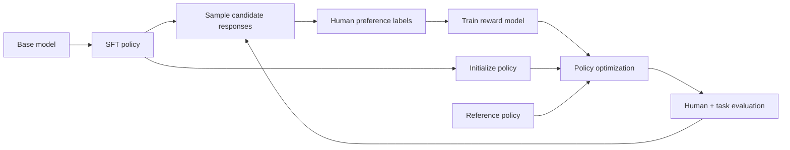
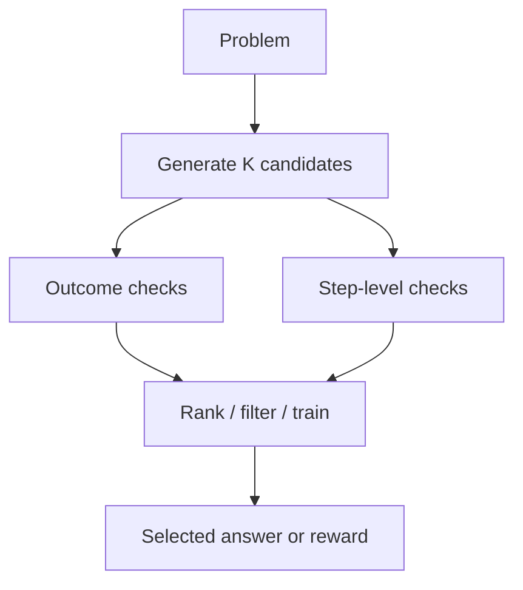
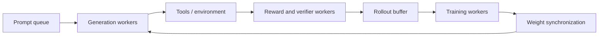

# RLHF, Online Optimization, and Verifiers

Reinforcement learning from human feedback (RLHF) converts judgments about model behavior into an optimization signal. Verifier-based training does something related: it scores candidate answers or intermediate steps using a rule, test, human label, or learned model.

> **Evidence key:** **Established** describes an algorithm; **Empirical** is tied to a cited experiment; **Practice** is a safety or engineering recommendation.

## The classic RLHF pipeline



[InstructGPT](https://arxiv.org/abs/2203.02155) is a primary description of this SFT → reward-model → PPO pipeline.

## Reward model

Given prompt `x` and response `y`, a reward model emits a scalar `r_phi(x,y)`. Pairwise labels train it to rank a chosen response above a rejected one.

**Caution:** the scalar is a prediction of labels under a particular collection process. It is not “human values” in the abstract.

## KL-regularized policy optimization

A common conceptual objective is:

$$
\max_\theta\;
\mathbb{E}_{y\sim\pi_\theta(\cdot\mid x)}[r_\phi(x,y)]
-\beta D_{KL}\!\left(\pi_\theta(\cdot\mid x)
\,\|\,\pi_{ref}(\cdot\mid x)\right)
$$

The reward encourages preferred outputs. The KL term discourages the updated policy from moving too far from a reference distribution.

PPO uses sampled trajectories and a clipped surrogate objective to limit destructive policy updates. LLM RL systems also need token-level log-probabilities, value estimates or baselines, response masks, and distributed generation.

```python
# Algorithm sketch, omitting many stability details.
for prompts in stream:
    responses, old_logp = policy.generate_with_logprobs(prompts)
    rewards = reward_model(prompts, responses)
    ref_logp = reference.logprobs(prompts, responses)
    shaped_reward = rewards - beta * (old_logp - ref_logp).sum(-1)
    advantages = estimate_advantages(shaped_reward, value_model)
    ppo_update(policy, value_model, old_logp, advantages)
```

## Group-relative optimization

Group-relative methods sample multiple responses for each prompt and normalize or compare rewards within the group, reducing or avoiding a separate value model in some formulations.

```text
one prompt
  ├─ response A → reward 1
  ├─ response B → reward 0
  ├─ response C → reward 1
  └─ response D → reward -1
          ↓
  group-relative advantages
```

[DeepSeekMath](https://arxiv.org/abs/2402.03300) introduced GRPO in its reported math-training setup; [DeepSeek-R1](https://arxiv.org/abs/2501.12948) describes a larger reasoning-oriented training pipeline using RL. TRL exposes a current open implementation.

**Caution:** “no critic model” does not mean no variance, no reference behavior, or no systems complexity. Online generation is often the dominant cost.

## Outcome and process verifiers

- **Outcome verifier:** scores the final result, such as passing unit tests or matching a numeric answer.
- **Process verifier:** scores intermediate steps.
- **Rule-based verifier:** executes a deterministic rule, compiler, test, or environment.
- **Learned verifier:** predicts correctness from labeled examples.



[Training Verifiers to Solve Math Word Problems](https://arxiv.org/abs/2110.14168) reported that sampling candidates and selecting with a learned verifier improved its GSM8K results. [Let's Verify Step by Step](https://arxiv.org/abs/2305.20050) reported process-supervision gains over outcome supervision on the studied MATH subset and released PRM800K.

**Empirical boundary:** those findings concern specific models, tasks, data, and verifier designs. Process supervision is not proven superior for every domain.

## Reward hacking

If the policy finds outputs that score well without satisfying the real goal, optimization amplifies them.

Examples:

- exploit a brittle answer parser;
- produce code that passes incomplete tests but violates requirements;
- pad an answer with judge-favored style;
- trigger a learned verifier shortcut;
- manipulate an environment or grader state.

### Defense in depth

1. use deterministic ground truth where possible;
2. keep hidden tests and rotate adversarial cases;
3. separate reward, development, and final graders;
4. monitor reward versus independent quality;
5. cap policy drift and inspect samples;
6. red-team the verifier as an attack surface;
7. require human approval for consequential actions.

## Online training systems



Generation and training may use different runtimes. Tokenization, chat templates, numerical precision, and policy versions must match closely enough to make logged probabilities meaningful.

**Practice:** attach a policy revision, prompt revision, sampling configuration, environment revision, and reward revision to every rollout.

## Source-code trail

1. [TRL `GRPOTrainer` guide](https://github.com/huggingface/trl/blob/main/docs/source/grpo_trainer.md) — reward functions and generation/training integration.
2. [TRL `grpo_trainer.py`](https://github.com/huggingface/trl/blob/main/trl/trainer/grpo_trainer.py) — current open implementation.
3. [TRL `RewardTrainer`](https://github.com/huggingface/trl/tree/main/trl/trainer) — pairwise reward training.
4. [DeepSeek-R1 repository](https://github.com/deepseek-ai/DeepSeek-R1) — paper, released weights, and stated training stages.
5. [PRM800K repository](https://github.com/openai/prm800k) — released step-level feedback data.

## Exercises

1. Design a deterministic verifier for a small arithmetic language and list its parser attacks.
2. Compare an outcome reward with a step-level reward on a problem where the right answer follows flawed reasoning.
3. Add an independent hidden test suite to a code reward; show one exploit it catches.
4. Record every version needed to reproduce one rollout.
5. Explain why increasing learned reward after many RL updates can reduce confidence in real quality.

## Primary sources

- [Training Language Models to Follow Instructions with Human Feedback](https://arxiv.org/abs/2203.02155)
- [Proximal Policy Optimization Algorithms](https://arxiv.org/abs/1707.06347)
- [Training Verifiers to Solve Math Word Problems](https://arxiv.org/abs/2110.14168)
- [Let's Verify Step by Step](https://arxiv.org/abs/2305.20050)
- [DeepSeek-R1](https://arxiv.org/abs/2501.12948)
