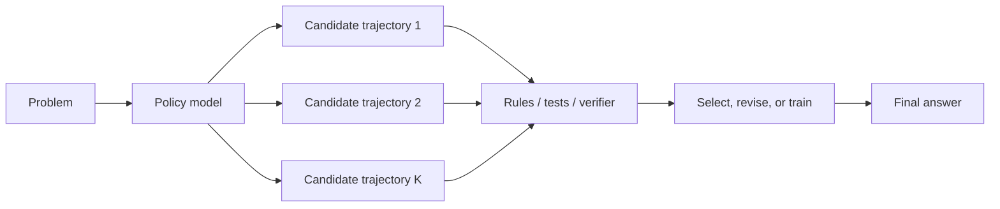
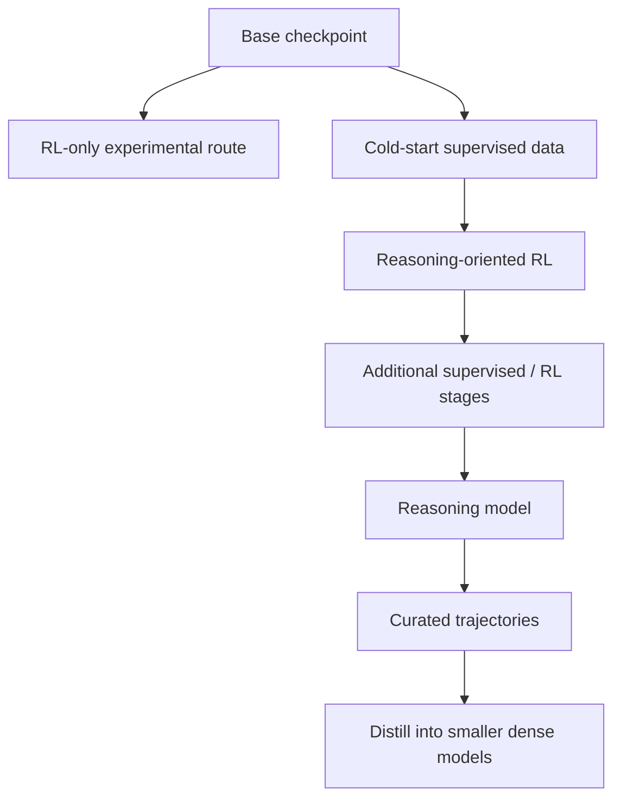

# Reasoning Models: Training and Spending Compute on Hard Problems

“Reasoning model” is a product and research label, not one universal architecture. In practice it often describes a language model post-trained to generate and evaluate longer solution trajectories, use tools or verifiers, and spend more inference compute on difficult tasks.

> **Evidence key:** **Established** is algorithmic; **Empirical** belongs to a named study; **Practice** is a deployment recommendation.

## A systems view



Several levers can contribute:

- supervised examples containing worked solutions;
- reinforcement learning against outcome or process signals;
- sampling multiple candidates;
- search, revision, or verifier selection;
- distillation from a stronger model;
- tools such as code execution;
- a larger token or time budget at inference.

No single lever is required by the label.

## Test-time compute

For a fixed checkpoint, a system can spend more compute by:

- generating a longer trajectory;
- sampling `K` independent candidates;
- branching and searching;
- running a verifier;
- executing tools;
- revising after feedback.

**Established:** more candidates or longer trajectories cost more tokens or computation.

**Empirical:** [self-consistency](https://arxiv.org/abs/2203.11171) improved accuracy on the paper's studied arithmetic and commonsense benchmarks by sampling diverse reasoning paths and aggregating answers.

**Caution:** more compute can repeat the same mistake, increase latency, or give an unreliable judge more opportunities to select confidently wrong output. Measure the accuracy–cost curve.

## One publicly documented training example: DeepSeek-R1

The [DeepSeek-R1 paper](https://arxiv.org/abs/2501.12948) and [official repository](https://github.com/deepseek-ai/DeepSeek-R1) describe:

1. an R1-Zero variant trained with large-scale RL without preliminary SFT;
2. observed problems including readability and language mixing;
3. an R1 pipeline with cold-start data and multi-stage training;
4. distilled dense checkpoints trained from curated outputs.

**Empirical boundary:** these are reported results and ablations for that project. The release includes model weights and the paper, but not every component needed to independently reproduce the frontier training run.



## Distillation

A student model is trained on outputs or distributions produced by a teacher. For reasoning tasks, the data may contain problems, solutions, tool traces, and checked final answers.

**Established:** distillation transfers behavior through training examples or soft targets; it does not copy the teacher's weights or guarantee the same capabilities.

**Practice:** verify teacher outputs before training. Distillation can faithfully copy systematic errors.

## What a visible rationale means

A generated explanation is text produced by the model. It can be useful as:

- a scratchpad that improves task performance in some settings;
- an artifact that a verifier can check;
- a communication aid for users;
- a source of candidate intermediate steps.

It is not guaranteed to be a faithful transcript of the model's internal computation.

[Measuring Faithfulness in Chain-of-Thought Reasoning](https://www.anthropic.com/research/measuring-faithfulness-in-chain-of-thought-reasoning) and later [reasoning-model faithfulness experiments](https://www.anthropic.com/research/reasoning-models-dont-say-think) report cases where stated reasoning did not faithfully disclose causal influences on answers.

**Caution:** do not equate a fluent rationale with proof, truth, or privileged access to hidden reasoning. Validate the answer and externally checkable steps.

## Prompting boundaries

Prompting can provide a task, constraints, examples, tools, and an output contract. Some models also expose provider-specific controls for inference effort.

Prompting cannot:

- retroactively train the weights;
- guarantee a true answer;
- reveal an authoritative hidden chain of thought;
- directly address a named MoE expert in a portable way.

In an MoE model, text changes hidden representations and may influence learned router decisions indirectly. There is normally no user-level semantic map from “expert number” to skill.

## Verification-first inference

```python
def solve_with_checks(problem, model, verifier, attempts=4):
    candidates = [
        model.generate(problem, seed=seed)
        for seed in range(attempts)
    ]
    checked = [
        (candidate, verifier(problem, candidate))
        for candidate in candidates
    ]
    valid = [item for item in checked if item[1].hard_constraints_pass]
    if not valid:
        return {"status": "unverified", "candidates": checked}
    return max(valid, key=lambda item: item[1].score)
```

For code, use tests and static checks. For math, parse the final answer and, where feasible, use symbolic or numeric verification. For factual research, require cited evidence and inspect source support.

## Evaluate the whole curve

Report:

- accuracy at each token or time budget;
- pass@1 and pass@k where appropriate;
- verifier-selected versus oracle-selected accuracy;
- unverified and abstained rates;
- latency and cost percentiles;
- answer length;
- faithfulness tests only under a declared definition.

Do not compare a one-sample baseline with an expensive multi-sample system without reporting the compute difference.

## Source-code trail

1. [DeepSeek-R1](https://github.com/deepseek-ai/DeepSeek-R1) — official paper and released checkpoints.
2. [TRL `GRPOTrainer`](https://github.com/huggingface/trl/blob/main/trl/trainer/grpo_trainer.py) — an open online-optimization implementation.
3. [PRM800K](https://github.com/openai/prm800k) — process-supervision dataset and artifacts.
4. [lm-evaluation-harness](https://github.com/EleutherAI/lm-evaluation-harness) — reproducible task and sampling evaluation.

## Exercises

1. Plot accuracy, latency, and tokens for 1, 2, 4, and 8 sampled candidates on a small task.
2. Build a final-answer verifier that rejects malformed outputs instead of guessing how to parse them.
3. Find a case where a correct answer has a flawed rationale and another where a wrong answer has plausible prose.
4. Write a distillation filter that records why each teacher example was accepted.
5. Explain why “use expert 7” is not a sound general prompting technique for an MoE model.

## Primary sources

- [DeepSeek-R1](https://arxiv.org/abs/2501.12948)
- [Chain-of-Thought Prompting Elicits Reasoning in Large Language Models](https://arxiv.org/abs/2201.11903)
- [Self-Consistency Improves Chain of Thought Reasoning](https://arxiv.org/abs/2203.11171)
- [Let's Verify Step by Step](https://arxiv.org/abs/2305.20050)
- [Measuring Faithfulness in Chain-of-Thought Reasoning](https://www.anthropic.com/research/measuring-faithfulness-in-chain-of-thought-reasoning)
