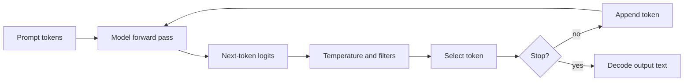
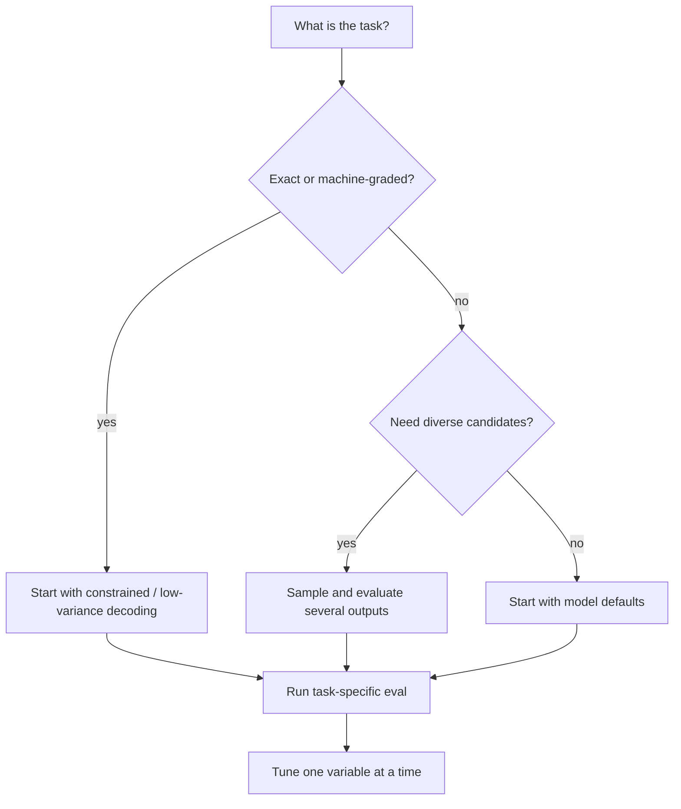

# Decoding: Turning Logits into Text

An autoregressive model returns scores for possible next tokens. Decoding is the policy that converts those scores into one token, then repeats. It can make the same checkpoint look deterministic, creative, repetitive, terse, or expensive.

> **Evidence key:** **Established** follows from the sampling rule; **Empirical** is tied to a study; **Practice** is a task-dependent default.

## One token at a time



Given logits `z_i` and temperature `T > 0`:

$$
p_i = \frac{\exp(z_i/T)}{\sum_j \exp(z_j/T)}
$$

- Lower `T` sharpens the distribution.
- Higher `T` flattens it.
- Greedy decoding selects the largest logit rather than sampling.

**Established:** temperature changes the sampling distribution; it does not add knowledge or reasoning capability.

## Main decoding policies

| Policy | Operation | Typical tradeoff |
|---|---|---|
| greedy | choose highest-probability token | repeatable path, can be myopic |
| temperature sampling | sample from rescaled distribution | diversity versus variance |
| top-k | retain only the `k` highest-probability tokens | fixed candidate count |
| top-p / nucleus | retain the smallest set whose cumulative probability reaches `p` | adaptive candidate count |
| beam search | retain several high-scoring partial sequences | useful for constrained sequence tasks; can favor bland text |
| constrained decoding | mask tokens that violate a grammar/schema | valid structure, not necessarily correct meaning |

[The Curious Case of Neural Text Degeneration](https://arxiv.org/abs/1904.09751) introduced nucleus sampling and reported improvements over the studied likelihood-maximizing decoders for open-ended generation.

**Empirical boundary:** that result does not establish top-p as best for code, extraction, translation, or every modern model.

## Top-k and top-p together

```python
def sample_next(logits, temperature=1.0, top_k=None, top_p=None):
    scores = logits / temperature

    if top_k is not None:
        cutoff = kth_largest(scores, top_k)
        scores[scores < cutoff] = float("-inf")

    if top_p is not None:
        scores = mask_after_cumulative_probability(scores, top_p)

    probabilities = softmax(scores)
    return multinomial(probabilities)
```

Real implementations must handle batch shapes, numerical stability, random generators, token bans, and model-specific end tokens.

## Stops and length

Generation usually stops when:

- the model emits an end-of-sequence token;
- a declared stop token or sequence appears;
- a maximum output budget is reached;
- a grammar reaches an accepting state;
- the application cancels the request.

**Caution:** string stop sequences can cross token boundaries. Prefer token-aware stopping when the runtime supports it.

Length penalties, minimum lengths, repetition penalties, presence/frequency penalties, and no-repeat n-grams all change the target distribution. Record them in evaluations.

## Reproducibility

A seed controls a pseudo-random stream, but bit-for-bit repeatability can still be affected by:

- runtime and kernel versions;
- parallel reduction order;
- batching and request scheduling;
- floating-point precision;
- tokenizer revision;
- model revision;
- nondeterministic accelerator operations.

**Practice:** call a run “reproducible” only after testing the deployed stack. “Temperature 0” is not a cross-platform proof of identical text.

## Choosing settings by task



Examples:

- **Structured extraction:** schema-constrained decoding plus semantic validation.
- **Code:** low-variance single samples or multiple samples checked by tests.
- **Creative writing:** sampling with diversity judged by humans and safety filters.
- **Classification:** compare label-token probabilities or use a constrained label set.
- **Reasoning:** evaluate accuracy against token and latency budgets; do not assume higher temperature helps.

Provider model cards may recommend defaults. Treat those as model-specific, versioned guidance.

## Log probabilities

Log probabilities can support ranking, perplexity, uncertainty studies, and debugging. They are not automatically calibrated probabilities of factual correctness. Tokenization also changes the units being scored.

For sequence `y`:

$$
\log p(y\mid x) = \sum_t \log p(y_t\mid x,y_{<t})
$$

Comparing raw sums favors shorter sequences; length-normalized scores introduce a different bias. State which one you use.

## Source-code trail

1. [nanoGPT `sample.py`](https://github.com/karpathy/nanoGPT/blob/master/sample.py) — compact temperature and top-k sampling.
2. [Transformers generation utilities](https://github.com/huggingface/transformers/blob/main/src/transformers/generation/utils.py) — production generation orchestration.
3. [Transformers logit processors](https://github.com/huggingface/transformers/blob/main/src/transformers/generation/logits_process.py) — filters, penalties, and constraints.
4. [vLLM sampling parameters](https://github.com/vllm-project/vllm/blob/main/vllm/sampling_params.py) — serving-time decoding contract.

## Exercises

1. Apply temperatures 0.5, 1, and 2 to logits `[4, 2, 1]`; compare probabilities.
2. Implement top-p selection and test a distribution where two tokens exceed the threshold together.
3. Evaluate one model on exact extraction with greedy, top-p, and schema-constrained decoding.
4. Demonstrate a stop string that spans more than one token.
5. Write the complete inference fingerprint needed to reproduce one output.

## Primary sources

- [The Curious Case of Neural Text Degeneration](https://arxiv.org/abs/1904.09751)
- [Transformers](https://github.com/huggingface/transformers)
- [nanoGPT](https://github.com/karpathy/nanoGPT)
- [vLLM](https://github.com/vllm-project/vllm)
