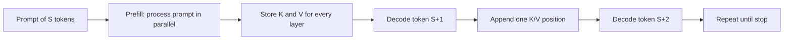
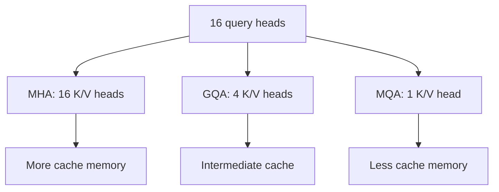
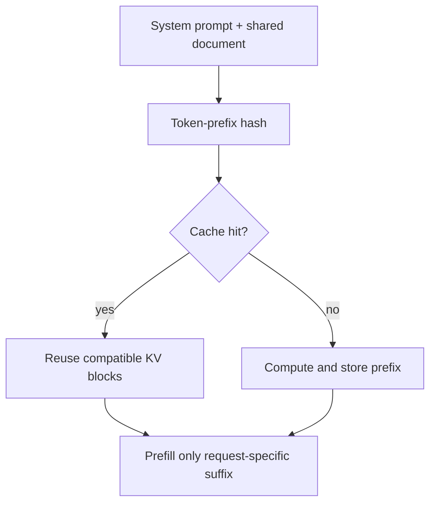

# KV Cache, Prefill, and Attention at Inference

Autoregressive decoding would be wasteful if every new token recomputed keys and values for the entire prefix. A KV cache stores those intermediate tensors so each decode step can reuse them.

> **Evidence key:** **Established** follows from attention shapes; **Empirical** belongs to cited systems; **Practice** is deployment guidance.

## Prefill versus decode



- **Prefill** processes the prompt and creates its cache. It is often compute-intensive.
- **Decode** generates one token per active sequence per iteration. It is often limited by memory movement and cache capacity.

This distinction drives serving metrics: time to first token is strongly affected by prefill, while inter-token latency reflects decode.

## What is cached

For each attention layer and previous position, cache the projected key and value tensors. Queries are needed only for the current computation and are not retained in the standard cache.

For a conventional cache:

$$
M_{KV} = B \times L \times S \times 2 \times H_{KV}
\times d_h \times b
$$

The factor 2 is for keys and values. Allocator metadata, padding, block rounding, speculative branches, beam hypotheses, and replicas add overhead.

```python
def kv_cache_bytes(batch, layers, sequence, kv_heads, head_dim, dtype_bytes):
    return (
        batch
        * layers
        * sequence
        * 2
        * kv_heads
        * head_dim
        * dtype_bytes
    )
```

Example: batch 8, 32 layers, 8192 positions, 8 KV heads, head dimension 128, BF16 takes about 8 GiB before allocator overhead.

## MHA, MQA, and GQA

| Attention form | Query heads | KV heads | Cache implication |
|---|---:|---:|---|
| multi-head attention (MHA) | many | same number | largest conventional cache |
| multi-query attention (MQA) | many | 1 | much smaller KV cache |
| grouped-query attention (GQA) | many | between 1 and query-head count | quality/efficiency compromise |

[GQA](https://arxiv.org/abs/2305.13245) reported that its uptrained grouped-query models approached multi-head quality with speed comparable to multi-query attention in the studied setup.

**Empirical boundary:** exact quality and speed depend on architecture, kernels, hardware, and serving workload.



## Attention work during decode

At each layer, a new query attends over cached keys for all prior positions, then combines cached values. The cache removes repeated K/V projection for old tokens, but attention over the growing history still has work proportional to context length for standard full attention.

## FlashAttention is a different optimization

[FlashAttention](https://arxiv.org/abs/2205.14135) tiles exact attention to reduce expensive reads and writes between memory levels.

**Established distinctions:**

- KV caching reuses past keys and values across autoregressive steps.
- FlashAttention changes how attention is computed within a pass.
- FlashAttention does not make the persistent decode KV cache disappear.
- An implementation may use both.

## Prefix caching

If requests share an identical token prefix, a server can reuse its computed KV blocks.



A safe cache key needs more than text. It can depend on:

- model and adapter revision;
- tokenizer and exact token IDs;
- positional treatment;
- attention and cache dtype;
- multimodal inputs;
- tenant isolation policy;
- model configuration that changes hidden states.

**Caution:** cross-tenant prefix caching can create privacy and timing risks. Apply explicit isolation rules.

## Cache eviction and paging

Request lengths are dynamic. Contiguous allocation can waste memory through fragmentation and reserved-but-unused space. [PagedAttention](https://arxiv.org/abs/2309.06180) applies block-based management so logical sequences can use non-contiguous cache blocks. SGLang's [RadixAttention](https://arxiv.org/abs/2312.07104) organizes reusable prefixes in a radix structure.

These are systems techniques, not model-training objectives.

## Cache correctness tests

1. Compare cached and no-cache logits for the same sequence.
2. Test positions around block boundaries.
3. Test truncation, sliding windows, and rope-scaling configurations.
4. Test beam or speculative branch copy-on-write.
5. Test prefix reuse across adapters and tenants.
6. Confirm eviction never returns stale blocks.

## Source-code trail

1. [Transformers cache utilities](https://github.com/huggingface/transformers/blob/main/src/transformers/cache_utils.py) — cache classes and update semantics.
2. [vLLM attention code](https://github.com/vllm-project/vllm/tree/main/vllm/v1/attention) — current attention backends and operations.
3. [vLLM cache interfaces](https://github.com/vllm-project/vllm/tree/main/vllm/v1/core) — current scheduler/cache management area.
4. [SGLang radix cache](https://github.com/sgl-project/sglang/tree/main/python/sglang/srt/mem_cache) — prefix-cache data structures.
5. [FlashAttention](https://github.com/Dao-AILab/flash-attention) — official kernels and tests.

## Exercises

1. Calculate KV memory for MHA and GQA with the same layer count and sequence length.
2. Verify the roughly 8 GiB example with the formula and convert bytes using powers of 1024.
3. Implement a toy prefix-cache key that includes model, adapter, token IDs, and tenant.
4. Explain why cached K/V tensors from one model revision cannot be reused by another.
5. Benchmark prefill and decode separately for short and long prompts.

## Primary sources

- [GQA: Training Generalized Multi-Query Transformer Models](https://arxiv.org/abs/2305.13245)
- [FlashAttention](https://arxiv.org/abs/2205.14135)
- [Efficient Memory Management with PagedAttention](https://arxiv.org/abs/2309.06180)
- [SGLang](https://arxiv.org/abs/2312.07104)
