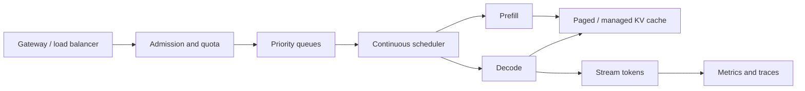

# Serving and Batching: From One Demo to Many Users

An inference server must schedule requests with different prompt lengths, output lengths, priorities, and deadlines while a finite KV cache grows and shrinks. Maximum tokens per second is only one of several goals.

> **Evidence key:** **Established** is a metric/system property; **Empirical** cites measured work; **Practice** is workload-specific advice.

## The request lifecycle



## Metrics that must be separated

| Metric | Meaning |
|---|---|
| time to first token (TTFT) | request arrival to first streamed token |
| inter-token latency (ITL) | delay between output tokens |
| time per output token (TPOT) | aggregate decode-time measure |
| end-to-end latency | arrival to completed response |
| throughput | tokens or requests completed per time |
| goodput | work meeting declared service objectives |
| queue time | time waiting before execution |

Report distributions such as p50, p95, and p99. An average can hide severe tail latency.

## Static versus continuous batching

Static batching waits for a group, pads it, and runs the group together. Requests that finish early leave wasted slots.

Continuous batching can insert and remove requests at iteration boundaries:

```text
decode step 1: [A, B, C]
decode step 2: [A, B, C]   C finishes
decode step 3: [A, B, D]   D joins
decode step 4: [A, D, E]   B finishes, E joins
```

**Established:** dynamic membership improves opportunities to keep hardware occupied. Scheduler overhead, cache pressure, and latency policies still determine actual gains.

## Chunked prefill

A very long prompt can monopolize a batch and delay decode tokens. Chunked prefill divides it into smaller units that can be scheduled alongside decode work.

```mermaid
gantt
    title Conceptual mixed scheduling
    dateFormat X
    axisFormat %s
    section Long request
    Prefill chunk 1 :0, 2
    Prefill chunk 2 :3, 5
    section Active decodes
    Decode batch :2, 3
    Decode batch :5, 6
```



**Practice:** tune chunk size against TTFT, ITL, kernel efficiency, and cache occupancy on the real prompt-length distribution.

## KV-cache-aware scheduling

[PagedAttention](https://arxiv.org/abs/2309.06180) was designed to reduce KV-cache fragmentation and enable flexible sharing. [SGLang](https://arxiv.org/abs/2312.07104) introduced RadixAttention for prefix reuse in structured programs.

**Empirical:** both papers report throughput gains over their selected baselines and workloads.

**Caution:** paper speedups are not portable constants. Compare current versions on the target model, hardware, quantization, sequence distribution, and service objective.

## Admission and backpressure

Accepting every request can make all requests miss their deadlines. An admission controller can estimate:

- prompt tokens;
- requested maximum output;
- available cache blocks;
- queue age and priority;
- per-tenant quota;
- model/adapter placement;
- predicted prefill and decode work.

```python
def admit(request, state):
    estimated_kv = estimate_cache_blocks(
        prompt_tokens=request.prompt_tokens,
        max_new_tokens=request.max_new_tokens,
        model=state.model,
    )
    if estimated_kv > state.freeable_blocks:
        return "queue_or_reject"
    if request.tenant_tokens_today > request.tenant_quota:
        return "rate_limit"
    return "admit"
```

Never trust a client-supplied token count; tokenize or validate server-side.

## Parallel serving

- **Tensor parallelism:** split each model layer across devices.
- **Pipeline parallelism:** place layer stages on different devices.
- **Data parallel replicas:** route independent requests to replicas.
- **Expert parallelism:** distribute MoE experts.
- **Disaggregated prefill/decode:** specialize pools and transfer KV state.

Choose based on model fit, link topology, traffic, and latency objectives. More devices can increase communication and lower utilization for small batches.

## Prefix caching and tenancy

Shared system prompts and RAG prefixes can produce high cache reuse. Track:

- hit rate by token, not only by request;
- cache bytes and eviction reason;
- saved prefill time;
- cross-tenant isolation;
- stale-key and adapter-key correctness.

Do not log sensitive prompt text merely to debug cache hits. Prefer hashes and access-controlled sampling.

## Production benchmark

Build a trace-driven load test that includes:

1. the real prompt-length distribution;
2. the real output-length distribution;
3. burstiness and cancellation;
4. streaming clients;
5. multiple priorities and tenants;
6. warm and cold prefix-cache states;
7. failures and retries;
8. quality checks for the exact served model.

Throughput at infinite latency is not a useful interactive-service benchmark.

## Source-code trail

1. [vLLM](https://github.com/vllm-project/vllm) — continuous batching, paged KV cache, prefix caching, quantization, and distributed serving.
2. [vLLM optimization guide](https://github.com/vllm-project/vllm/blob/main/docs/configuration/optimization.md) — chunked prefill and runtime controls.
3. [SGLang runtime](https://github.com/sgl-project/sglang/tree/main/python/sglang/srt) — scheduler, cache, and server runtime.
4. [SGLang server arguments](https://github.com/sgl-project/sglang/blob/main/docs/advanced_features/server_arguments.md) — current knobs; pin a revision.
5. [llama.cpp server](https://github.com/ggml-org/llama.cpp/blob/master/tools/server/README.md) — local and edge-oriented HTTP serving.

## Exercises

1. Create a load trace with short chats, long RAG prompts, and cancellations; report TTFT and ITL percentiles.
2. Show a case where higher throughput causes worse goodput.
3. Implement a cache-block admission estimate and test adversarial `max_new_tokens`.
4. Compare cold and warm prefix-cache behavior without logging raw prompts.
5. Draw the communication path for tensor-parallel prefill across two nodes and identify the slow link.

## Primary sources

- [Efficient Memory Management with PagedAttention](https://arxiv.org/abs/2309.06180)
- [SGLang](https://arxiv.org/abs/2312.07104)
- [vLLM](https://github.com/vllm-project/vllm)
- [SGLang repository](https://github.com/sgl-project/sglang)

