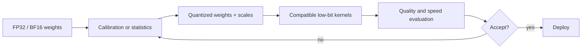
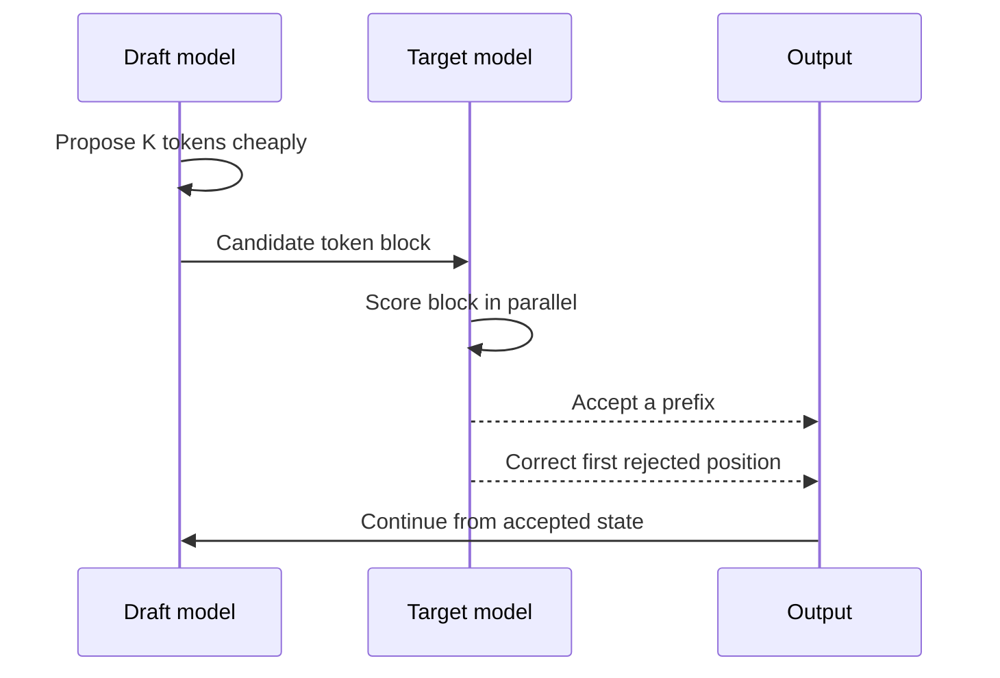

# Quantization and Speculative Decoding

Quantization reduces numerical precision. Speculative decoding uses a cheaper proposer to guess tokens that a target model verifies in parallel. Both can accelerate inference, but through different mechanisms and with different correctness conditions.

> **Evidence key:** **Established** follows from the algorithm; **Empirical** belongs to cited measurements; **Practice** is hardware- and model-specific advice.

## Quantization in one equation

A simple affine quantizer approximates a real value `x` with an integer `q`:

$$
q = \operatorname{clamp}\!\left(\operatorname{round}(x/s)+z, q_{\min}, q_{\max}\right)
$$

and reconstructs:

$$
\hat{x} = s(q-z)
$$

Here `s` is the positive scale, `z` is the integer zero point, and `[q_{\min}, q_{\max}]` is the representable integer range. Scales can be per tensor, row, channel, or group. Smaller groups can track local ranges better but add metadata and kernel complexity.



## What can be quantized

| Form | Weights | Activations | Typical goal |
|---|---|---|---|
| weight-only | low bit | higher precision | reduce model memory and bandwidth |
| W8A8 | 8-bit | 8-bit | accelerate matrix multiplication |
| KV-cache quantization | unchanged or separate | cached K/V lower precision | fit longer/larger batches |
| quantization-aware training (QAT) | simulated low precision during training | possibly simulated | adapt weights to quantization error |

Post-training quantization (PTQ) modifies a trained checkpoint using little or no additional gradient training. QAT trains while modeling quantization effects.

## Representative methods

- [GPTQ](https://arxiv.org/abs/2210.17323): layer-wise post-training weight quantization using approximate second-order information.
- [AWQ](https://arxiv.org/abs/2306.00978): activation-aware scaling that protects salient weight channels in the reported approach.
- [SmoothQuant](https://arxiv.org/abs/2211.10438): shifts quantization difficulty from activations toward weights through an equivalent transformation for W8A8.
- [TorchAO](https://github.com/pytorch/ao): PyTorch-native implementations spanning PTQ, QAT, and lower-precision training.
- [llama.cpp](https://github.com/ggml-org/llama.cpp): GGUF-based local inference with multiple block quantization formats.

**Empirical boundary:** accuracy and speed claims in these projects depend on a specific checkpoint, calibration data, kernel, batch shape, and hardware.

## Quantization evaluation

Do not stop at file size or perplexity. Check:

- held-out perplexity with an identical tokenizer;
- downstream task and safety slices;
- long-context behavior;
- tool-call and structured-output validity;
- prefill and decode latency separately;
- memory at realistic concurrency;
- supported kernel path rather than silent dequantization;
- numerical failures in rare layers or experts.

**Practice:** compare against the exact higher-precision checkpoint, not a different model release.

## A TorchAO-shaped example

```python
from torchao.quantization import Int4WeightOnlyConfig, quantize_

# API shape is versioned; pin torchao and verify supported hardware.
quantize_(
    model,
    Int4WeightOnlyConfig(group_size=32),
)
```

The line is short because the difficult work lives in tensor selection, calibration, packing, kernels, and evaluation.

## Speculative decoding



The draft may be a smaller model, an n-gram predictor, extra draft heads, or another cheap proposal mechanism.

[Speculative Decoding](https://arxiv.org/abs/2211.17192) gives an acceptance/correction procedure that can preserve the target model's sampling distribution while verifying several proposed tokens in parallel.

**Established:** distribution preservation depends on implementing the acceptance rule correctly. Simply keeping draft tokens that “look likely” is a heuristic and can change outputs.

## Why speedup varies

Approximate useful speedup depends on:

- draft cost;
- target verification cost;
- accepted tokens per target step;
- proposal length;
- batch and sequence shape;
- cache movement;
- synchronization and kernel overhead.

```python
while not stopped:
    proposals, draft_probs = draft.propose(prefix, k=K)
    target_probs = target.score_block(prefix, proposals)
    accepted, correction = exact_accept_reject(
        proposals,
        draft_probs,
        target_probs,
        rng,
    )
    prefix.extend(accepted)
    if correction is not None:
        prefix.append(correction)
```

**Practice:** log acceptance length and end-to-end latency. High acceptance alone can still lose if the drafter is expensive.

## Combining both

A quantized draft can make speculation cheaper, while the target remains at higher precision. A quantized target can also be used, but then it is the quantized model's distribution that exact speculative decoding must preserve.

Validate:

1. tokenizer identity;
2. compatible vocabulary and special tokens;
3. target-only baseline equality under the chosen sampling test;
4. draft and target KV-cache correctness;
5. quality of the quantized target;
6. real speedup at service concurrency.

## Source-code trail

1. [TorchAO](https://github.com/pytorch/ao) — current quantization APIs and kernels.
2. [llama.cpp quantize tool](https://github.com/ggml-org/llama.cpp/blob/master/tools/quantize/README.md) — GGUF conversion, formats, and importance matrices.
3. [vLLM quantization code](https://github.com/vllm-project/vllm/tree/main/vllm/model_executor/layers/quantization) — serving integrations.
4. [vLLM speculative decoding](https://github.com/vllm-project/vllm/tree/main/vllm/v1/spec_decode) — draft and verification implementations.
5. [SGLang speculative algorithms](https://github.com/sgl-project/sglang/tree/main/python/sglang/srt/speculative) — serving-oriented implementations.

## Exercises

1. Quantize a vector with one global scale and per-group scales; compare reconstruction error.
2. Measure file size, memory, TTFT, ITL, and two quality tasks for one quantized checkpoint.
3. Simulate draft acceptance rates of 25%, 50%, and 90% with fixed draft overhead.
4. Explain which model's distribution is preserved when the target itself is quantized.
5. Find and test a special-token mismatch between two otherwise compatible tokenizers.

## Primary sources

- [GPTQ](https://arxiv.org/abs/2210.17323)
- [AWQ](https://arxiv.org/abs/2306.00978)
- [SmoothQuant](https://arxiv.org/abs/2211.10438)
- [Fast Inference via Speculative Decoding](https://arxiv.org/abs/2211.17192)
- [TorchAO](https://github.com/pytorch/ao)
