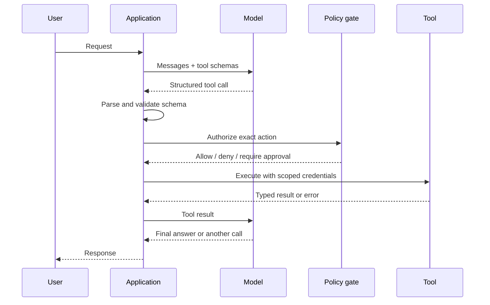
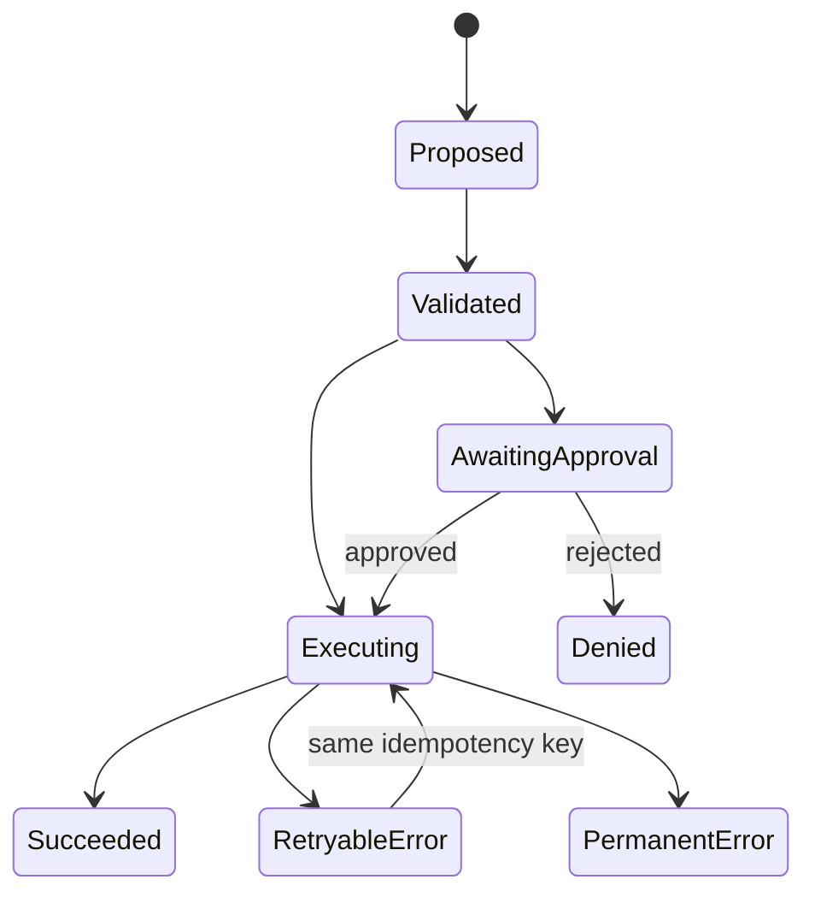

# Structured Output and Tool Use

Structured output constrains the shape of model text. Tool use lets a model request an operation with typed arguments. In both cases, the application remains responsible for validation, authorization, execution, and error handling.

> **Evidence key:** **Established** is an interface property; **Empirical** comes from cited work; **Practice** is a production safeguard.

## Text JSON versus constrained JSON

```text
"Please return JSON"
    ≠
decoder constrained to a declared JSON Schema
    ≠
semantically correct object
```

Three layers are needed:

1. **Syntactic validity:** parsable JSON.
2. **Schema validity:** correct fields, types, and allowed values.
3. **Semantic validity:** values make sense and are authorized.

```json
{
  "type": "object",
  "properties": {
    "category": {
      "type": "string",
      "enum": ["billing", "technical", "account"]
    },
    "confidence": {
      "type": "number",
      "minimum": 0,
      "maximum": 1
    }
  },
  "required": ["category", "confidence"],
  "additionalProperties": false
}
```

Schema-constrained decoding can guarantee supported structural constraints. It cannot guarantee that `confidence` is calibrated or that `category` is correct.

## The tool-use loop



**Established:** for client-executed tools, the model proposes a call; application code executes it. Official [Anthropic](https://platform.claude.com/docs/en/agents-and-tools/tool-use/how-tool-use-works), [OpenAI](https://developers.openai.com/api/docs/guides/function-calling), and [Gemini](https://ai.google.dev/gemini-api/docs/function-calling) documentation all describe this core separation, though wire formats differ.

## Design a tool schema

```json
{
  "name": "create_refund",
  "description": "Create a refund for one captured charge after policy approval.",
  "parameters": {
    "type": "object",
    "properties": {
      "charge_id": {
        "type": "string",
        "description": "Opaque charge ID returned by lookup_charge"
      },
      "amount_minor": {
        "type": "integer",
        "minimum": 1,
        "description": "Refund amount in the charge currency's minor unit"
      },
      "idempotency_key": {
        "type": "string",
        "description": "Stable key for this intended refund"
      }
    },
    "required": ["charge_id", "amount_minor", "idempotency_key"],
    "additionalProperties": false
  }
}
```

Prefer opaque IDs over free-form names. Encode units. Make destructive operations explicit. Avoid one giant `run_anything` tool.

## The policy gate

```python
def execute_tool(call, user, request_context):
    args = schema_validate(call.name, call.arguments)
    decision = policy.authorize(
        principal=user.id,
        action=call.name,
        resource=args.get("charge_id"),
        context=request_context,
    )
    if decision.requires_human:
        return pending_approval(decision.summary)
    if not decision.allowed:
        return typed_error("not_authorized")
    tool = tools[call.name]
    return tool(**args, credentials=decision.scoped_credentials)
```

Authorization must use trusted identity and system state, not a user-supplied claim or model-generated role.

## Idempotency and retries

Models, networks, and clients retry. A write tool should carry a stable idempotency key, but the key alone prevents nothing: the receiving system must atomically record and enforce deduplication within a defined scope and retention window. Replays should return the original result or a typed conflict instead of performing the write again.



Return typed errors such as `not_found`, `not_authorized`, `conflict`, and `retryable`. Do not expose secrets or internal stack traces to the model.

## Parallel and sequential calls

Independent reads can run in parallel. Dependent or side-effecting calls often require sequence and fresh authorization.

**Practice:**

- parallelize two weather lookups;
- sequence “find charge” before “refund charge”;
- re-check state immediately before a write;
- serialize conflicting writes;
- cap tool calls, wall time, and spend.

## Tool descriptions are part of the interface

**Empirical:** [Toolformer](https://arxiv.org/abs/2302.04761)
demonstrated, in its experimental setting, that a language model could be
trained to decide when and how to call APIs.

For prompted tool use, names, descriptions, schemas, and examples shape selection. Test:

- when the tool should be called;
- when it should not;
- missing required inputs;
- ambiguous tool overlap;
- failures and timeouts;
- adversarial content in results.

## Source-code and API trail

- [OpenAI Structured Outputs](https://developers.openai.com/api/docs/guides/structured-outputs)
- [OpenAI Function Calling](https://developers.openai.com/api/docs/guides/function-calling)
- [Anthropic Structured Outputs](https://platform.claude.com/docs/en/build-with-claude/structured-outputs)
- [Anthropic Tool Use](https://platform.claude.com/docs/en/agents-and-tools/tool-use/how-tool-use-works)
- [Gemini Function Calling](https://ai.google.dev/gemini-api/docs/function-calling)

Pin SDK and API versions. Do not copy a provider-specific field into another provider's request without reading its official contract.

## Exercises

1. Add semantic checks to the refund schema so an amount cannot exceed the captured balance.
2. Design an idempotency key that remains stable across a network retry but changes for a new user intent.
3. Build a fake tool that returns a prompt injection in its data; show which application controls still prevent writes.
4. Split an overpowered shell tool into three least-privilege tools.
5. Test the same classification task with prompt-only JSON and constrained schema output.

## Primary sources

- [Toolformer](https://arxiv.org/abs/2302.04761)
- [OpenAI Function Calling](https://developers.openai.com/api/docs/guides/function-calling)
- [Anthropic Tool Use](https://platform.claude.com/docs/en/agents-and-tools/tool-use/how-tool-use-works)
- [Gemini Function Calling](https://ai.google.dev/gemini-api/docs/function-calling)
