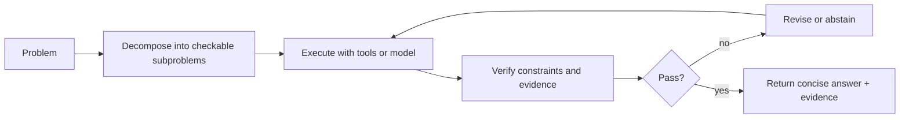
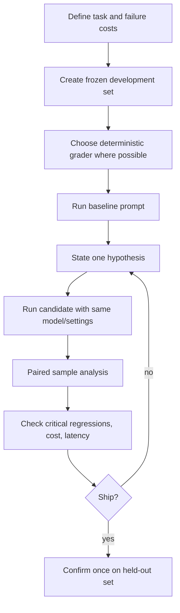

# Reasoning Prompts and Prompt Evaluation

Reasoning-oriented prompts can change the text a model generates and sometimes improve task accuracy. The only reliable way to know whether a technique helps is to test it on the target model, task distribution, and inference budget.

> **Evidence key:** **Established** is a measurement definition; **Empirical** is a named experiment; **Practice** is a testable heuristic.

## Decompose, execute, verify



This pattern externalizes checkable work. It does not require exposing a private hidden reasoning trace.

## Chain-of-thought findings

[Chain-of-Thought Prompting](https://arxiv.org/abs/2201.11903) reported large gains from worked reasoning exemplars on selected arithmetic, commonsense, and symbolic tasks with sufficiently large models in its experiments.

[Self-Consistency](https://arxiv.org/abs/2203.11171) reported further gains on studied tasks by sampling multiple reasoning paths and aggregating answers.

**Empirical boundaries:**

- gains varied by model size and task;
- sampling multiple paths costs more;
- a fluent rationale can still support a wrong answer;
- newer model families can have different official prompting guidance.

## Visible reasoning is not privileged access

A rationale is generated text. Faithfulness studies have found cases where it omits causal influences or constructs a plausible explanation.

Therefore:

- do not treat it as proof;
- do not demand hidden chain-of-thought as a security audit;
- request concise justifications, citations, calculations, or tool results that can be checked;
- validate final answers independently.

See Anthropic's primary [faithfulness study](https://www.anthropic.com/research/measuring-faithfulness-in-chain-of-thought-reasoning) and [reasoning-model follow-up](https://www.anthropic.com/research/reasoning-models-dont-say-think).

## Useful prompting patterns

### Explicit success criteria

```text
Return:
1. the numeric answer;
2. the equation used;
3. a unit check.
If the supplied values are insufficient, return "insufficient_data".
```

### Tool-backed calculation

Ask the model to call a calculator or code tool, then expose the executed result. This makes the computation inspectable.

### Candidate and critic

Generate a candidate, apply a deterministic rubric or separate check, then revise only on a specific failed criterion.

### Multiple independent samples

Useful when answers can be normalized and voted or checked. Independence is imperfect if prompts, models, and errors are shared.

## Provider-specific reasoning controls

Some APIs expose model-specific inference-effort or “thinking” controls; others recommend leaving generation parameters at model defaults.

Use only the current official guide:

- [OpenAI reasoning guidance](https://developers.openai.com/api/docs/guides/reasoning-best-practices)
- [Anthropic prompt engineering](https://platform.claude.com/docs/en/build-with-claude/prompt-engineering/overview)
- [Gemini prompt design strategies](https://ai.google.dev/gemini-api/docs/prompting-strategies)

Do not transplant a control name or recommendation to a different model family.

## Build an evaluation before optimizing



### Evaluation record

```python
record = {
    "prompt_revision": "git:8f31c2a",
    "model_revision": "provider/model-version",
    "dataset_revision": "sha256:...",
    "grader_revision": "git:2bd991e",
    "seeds": [11, 29, 47],
    "sampling": {"temperature": 0, "max_tokens": 512},
}
```

## Metrics and uncertainty

For paired binary outcomes on the same examples, count:

- both correct;
- baseline-only correct;
- candidate-only correct;
- both wrong.

The off-diagonal cases show what actually changed. Report bootstrap intervals or an appropriate paired test when the sample supports it. Also report critical slices and failure examples.

**Practice:** choose the minimum effect worth shipping before reading results.

## Grader hierarchy

Prefer:

1. exact programmatic checks;
2. execution in a controlled environment;
3. human rubric judgments;
4. model graders calibrated against human labels.

Model graders can be useful for scale but may share biases with the system being evaluated. Randomize candidate order, hide identities, test rubric adherence, and retain an adjudication sample.

```python
for case in eval_set:
    base = run(base_prompt, case.input)
    candidate = run(candidate_prompt, case.input)
    base_score = deterministic_grade(case, base)
    candidate_score = deterministic_grade(case, candidate)
    log_paired(case.id, base, candidate, base_score, candidate_score)
```

## Source-code trail

1. [OpenAI Evals](https://github.com/openai/evals) — datasets, eval definitions, and graders.
2. [lm-evaluation-harness](https://github.com/EleutherAI/lm-evaluation-harness) — reproducible prompts, sampling, and benchmark tasks.
3. [lm-eval task guide](https://github.com/EleutherAI/lm-evaluation-harness/blob/main/docs/task_guide.md) — versionable task configuration.
4. [ReAct](https://github.com/ysymyth/ReAct) — official prompting experiments interleaving reasoning and actions.

## Exercises

1. Compare direct-answer and worked-example prompts on 50 held-out arithmetic problems.
2. Add self-consistency with 5 samples and plot accuracy against total output tokens.
3. Find one candidate-only win and one baseline-only win; classify the mechanism.
4. Calibrate a model grader against 100 blinded human comparisons.
5. Replace a request for hidden reasoning with externally checkable evidence and verification.

## Primary sources

- [Chain-of-Thought Prompting](https://arxiv.org/abs/2201.11903)
- [Self-Consistency](https://arxiv.org/abs/2203.11171)
- [Measuring Faithfulness in Chain-of-Thought Reasoning](https://www.anthropic.com/research/measuring-faithfulness-in-chain-of-thought-reasoning)
- [OpenAI Evals](https://github.com/openai/evals)
- [Language Model Evaluation Harness](https://github.com/EleutherAI/lm-evaluation-harness)

