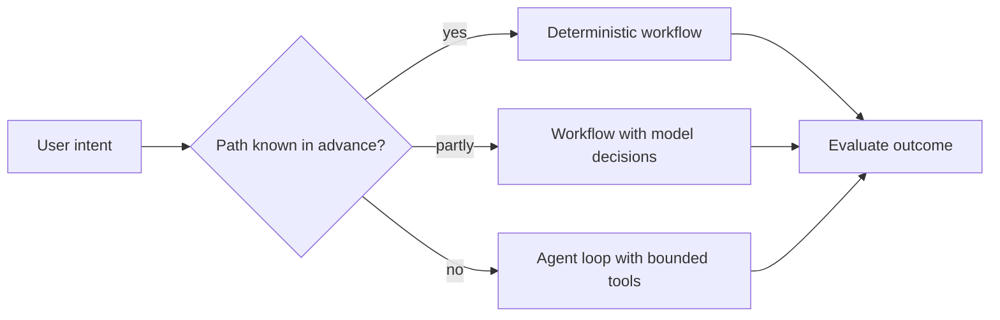
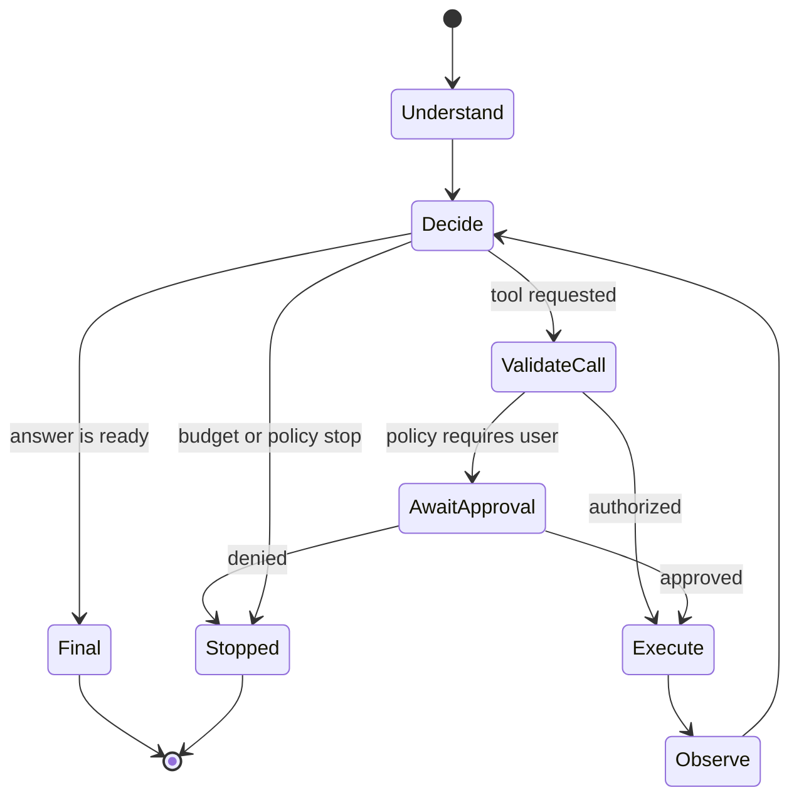

# The Agent Loop: Model, Tools, State, and Stop Conditions

An LLM agent is not a different species of model. It is a system in which a model repeatedly chooses among messages and tool requests, observes results, updates state, and continues until a stopping condition is met.

> **Evidence key:** **Established** is a system contract; **Empirical** belongs to cited experiments; **Practice** is a design recommendation.

## Workflow or agent?

- **Workflow:** application code chooses a mostly fixed path.
- **Agent:** the model chooses important next steps dynamically from available actions.



Agents trade predictability, latency, and cost for flexibility. Use that trade only when the task needs it.

## The minimal loop



The model never replaces the executor or policy gate.

```python
def run_agent(task, model, tools, policy, budget):
    state = new_state(task)
    while budget.can_continue(state):
        decision = model.next_action(state.model_view())

        if decision.type == "final":
            return validate_final(decision.output, state)

        call = schema_validate(decision.tool_call, tools.schemas)
        auth = policy.authorize(call, state.trusted_principal)
        if auth.requires_approval:
            auth = request_human_approval(auth.summary)
        if not auth.allowed:
            state.observe(tool_error("not_authorized"))
            continue

        result = tools.execute(
            call,
            credentials=auth.scoped_credentials,
            idempotency_key=state.idempotency_key(call),
        )
        state.observe(sanitize_tool_result(result))

    return stopped("budget_exhausted", state.safe_summary())
```

## ReAct as a research pattern

[ReAct](https://arxiv.org/abs/2210.03629) interleaves language-model reasoning traces with environment actions. The paper reported gains over selected baselines on its studied question-answering, fact-verification, and interactive environments.

```text
Observation: the requested record is not in local context
Action: search_records({"account_id": "acct_..."})
Observation: one matching record, status=pending
Action: ...
```

**Empirical boundary:** ReAct's results do not prove that free-form thought/action text is the best production protocol. Typed tool calls and hidden application state are usually safer than parsing ad hoc strings.

## State has trust levels

Separate:

- **trusted control state:** principal, policies, budgets, approvals;
- **conversation state:** user and assistant messages;
- **tool state:** results, errors, external revisions;
- **working artifacts:** plans, files, code, tables;
- **untrusted content:** web pages, emails, retrieved documents.

Only application code should update trusted control state.

## Stop conditions

Every loop needs:

- maximum model turns;
- maximum tool calls;
- token and monetary budgets;
- wall-clock deadline;
- repeated-action or no-progress detector;
- explicit success predicate;
- unrecoverable error state;
- user cancellation;
- policy denial.

“Continue until done” is not an operational stop condition.

## Recovery

Classify failures:

| Failure | Response |
|---|---|
| transient timeout | bounded retry with backoff and same idempotency key |
| invalid arguments | return typed validation error for correction |
| missing user preference | ask the user |
| authorization denied | do not rephrase to bypass policy |
| tool unavailable | use an approved alternative or stop |
| partial write | reconcile authoritative state before retry |
| repeated no progress | stop with evidence and trace ID |

**Practice:** make tool errors informative enough for recovery but strip secrets and stack traces.

## Ground truth from the environment

An agent should check the system it changes. Examples:

- run tests after editing code;
- read the created calendar event;
- query transaction status after a write;
- render a document after generation;
- verify cited source spans.

Self-reported success is not outcome evidence.

## Evaluation

Evaluate both:

- **end state:** did the database, files, or environment reach the required state?
- **process constraints:** were forbidden tools avoided, approvals obtained, budgets respected, and secrets protected?

[tau-bench](https://arxiv.org/abs/2406.12045) emphasizes final database state and repeated-trial reliability for tool-agent-user interaction.

Report success across multiple trials; a stochastic system that succeeds once and fails seven times is not reliable.

## Source-code trail

1. [ReAct repository](https://github.com/ysymyth/ReAct) — original prompting experiments.
2. [Anthropic tool-use loop](https://platform.claude.com/docs/en/agents-and-tools/tool-use/how-tool-use-works) — current client/server execution contract.
3. [OpenAI practical guide to agents](https://openai.com/business/guides-and-resources/a-practical-guide-to-building-ai-agents/) — official architecture and guardrail guidance.
4. [tau-bench](https://github.com/sierra-research/tau-bench) — tool-agent-user evaluation with state checks.
5. [Toolformer paper](https://arxiv.org/abs/2302.04761) — primary description of learned API-call insertion; no unofficial implementation is used as evidence here.

## Exercises

1. Implement a three-tool loop with a hard call budget and typed errors.
2. Create a repeated-action detector that ignores legitimate paginated reads.
3. Define an end-state grader for “change an address, but do not submit the order.”
4. Inject malicious instructions into a tool result and prove the policy gate still denies a write.
5. Compare a fixed workflow and agent loop on the same task distribution, including cost and failure rate.

## Primary sources

- [ReAct](https://arxiv.org/abs/2210.03629)
- [Toolformer](https://arxiv.org/abs/2302.04761)
- [tau-bench](https://arxiv.org/abs/2406.12045)
- [Building Effective Agents](https://www.anthropic.com/engineering/building-effective-agents)
