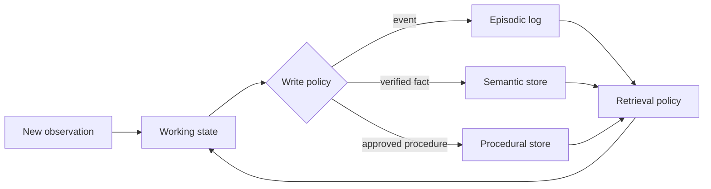
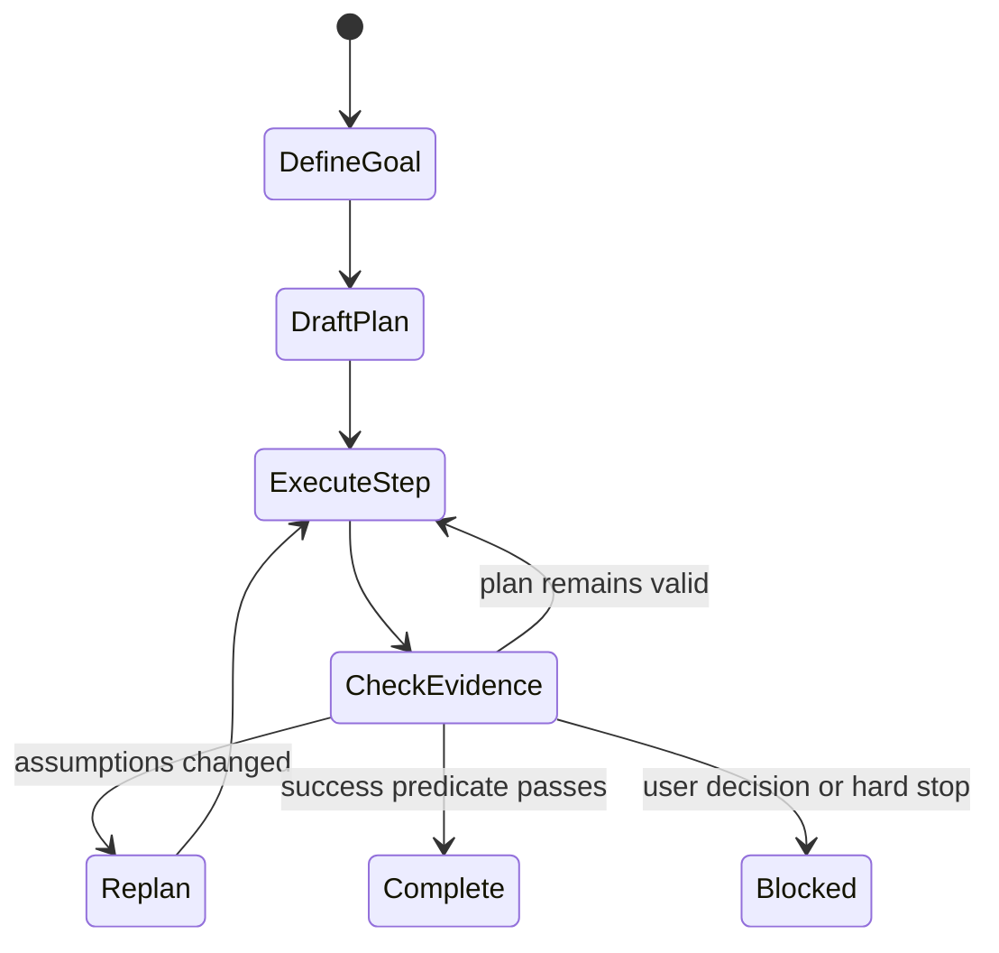
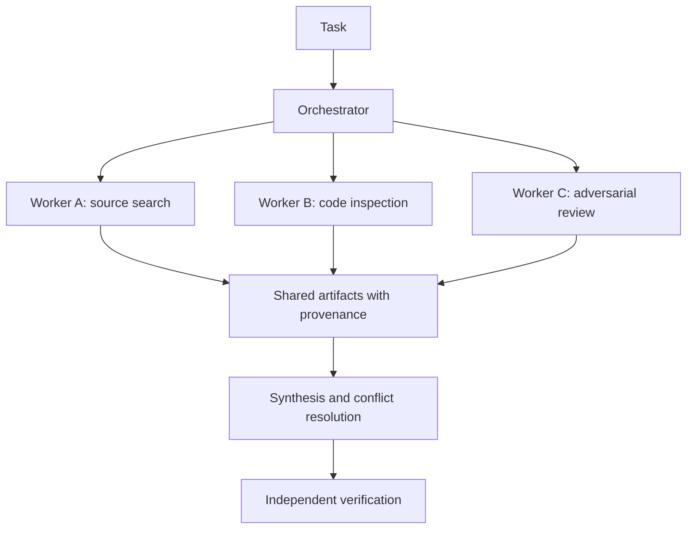

# Memory, Planning, and Multi-Agent Systems

Long-running agents need external state because model context is finite and a model call is not a durable database. Planning organizes future work. Multi-agent systems allocate some work to separate model loops. Each adds failure modes as well as capability.

> **Evidence key:** **Established** is an architecture property; **Empirical** belongs to cited systems; **Practice** is a task-dependent heuristic.

## Four useful memory categories

| Memory | Contents | Example backing store |
|---|---|---|
| working | current task state and active constraints | context plus structured state |
| episodic | timestamped events and outcomes | append-only event log |
| semantic | extracted facts with provenance | database or retrieval index |
| procedural | reusable instructions or skills | versioned code and documents |



These names are design vocabulary, not claims that software memory is biologically equivalent to human memory.

## Memory writes need policy

Before writing, decide:

- Is the statement verified or merely user/model-supplied?
- What is its provenance and timestamp?
- Which principal can read or delete it?
- When does it expire?
- Does it conflict with an authoritative record?
- Can untrusted content turn into instructions?

```python
def propose_memory(item, source, principal):
    record = {
        "value": item,
        "source": source.id,
        "observed_at": now(),
        "trust": source.trust_level,
        "principal": principal.id,
    }
    if source.trust_level == "untrusted":
        record["kind"] = "unverified_observation"
    return memory_policy.validate_and_store(record)
```

Memory poisoning is persistent prompt injection: malicious content becomes more dangerous if retrieved in later tasks as trusted guidance.

## Retrieval and forgetting

Retrieve by a combination of:

- relevance to the current task;
- recency;
- declared importance;
- access control;
- source trust;
- diversity;
- token budget.

Summaries are lossy. Keep links to raw evidence and version the summarizer. Deletion must remove both source records and derived indexes where required.

[Generative Agents](https://arxiv.org/abs/2304.03442) reported an architecture combining an experience stream, retrieval, reflection, and planning in a simulated environment. [MemGPT](https://arxiv.org/abs/2310.08560) explored OS-inspired movement between context and external memory.

**Empirical boundary:** these prototypes demonstrate patterns under their evaluations; they do not establish a universal optimal memory architecture.

## Plan, act, replan



A useful plan records dependencies and evidence, not just aspirations:

```yaml
goal: publish a verified report
steps:
  - id: collect
    depends_on: []
    done_when: source ledger contains at least one primary source per claim
  - id: draft
    depends_on: [collect]
    done_when: markdown passes structure checks
  - id: verify
    depends_on: [draft]
    done_when: links and cited claims are checked
```

Replan when observations invalidate assumptions. Do not rewrite a plan after every harmless variation.

## Multi-agent patterns



Patterns include:

- orchestrator and parallel workers;
- pipeline of specialized stages;
- generator and evaluator;
- independent attempts plus voting;
- peer conversation.

Multiple agents are useful when work is genuinely parallel, benefits from independent context, or requires distinct tools and permissions.

They are a poor fit when tasks share tightly coupled state, require constant coordination, or can be solved by one deterministic workflow.

## Cost and coordination

Anthropic's official [multi-agent research system report](https://www.anthropic.com/engineering/multi-agent-research-system) describes an orchestrator-worker architecture and reports strong gains on its internal breadth-first research evaluation, along with much higher token use and coordination challenges.

**Empirical boundary:** those numbers concern one system and evaluation. Multi-agent is not inherently better than giving one agent more time, tools, or context.

Track:

- duplicated work;
- uncovered scope;
- handoff information loss;
- conflicting conclusions;
- worker failures and stragglers;
- total and critical-path tokens;
- end-state quality versus a single-agent baseline.

## Handoffs

A good worker assignment contains:

- bounded objective;
- inputs and trust labels;
- available tools and permissions;
- required output schema;
- completion test;
- source and artifact requirements;
- budget and deadline.

Workers should return artifacts or stable references, not only compressed prose, when fidelity matters.

## Current code trails

1. [Generative Agents](https://github.com/joonspk-research/generative_agents) — memory stream, reflection, and planning prototype.
2. [Letta](https://github.com/letta-ai/letta) — current open successor ecosystem to MemGPT.
3. [CAMEL](https://github.com/camel-ai/camel) — open role-playing and multi-agent research framework.
4. [AutoGen](https://github.com/microsoft/autogen) — influential multi-agent framework; its official repository currently states maintenance mode, so new projects should read its migration notice.
5. [Anthropic multi-agent research system](https://www.anthropic.com/engineering/multi-agent-research-system) — primary production report.

## Exercises

1. Design a memory schema that separates verified facts from untrusted observations.
2. Delete one source record and trace every derived embedding, summary, and cache that must be invalidated.
3. Run a research task with one agent and three independent workers; compare coverage, cost, and duplicated claims.
4. Create a handoff schema that preserves exact source URLs and quoted evidence locations.
5. Inject a false persistent memory and show how provenance-aware retrieval prevents it from overriding authoritative state.

## Primary sources

- [Generative Agents](https://arxiv.org/abs/2304.03442)
- [MemGPT](https://arxiv.org/abs/2310.08560)
- [CAMEL](https://arxiv.org/abs/2303.17760)
- [AutoGen](https://arxiv.org/abs/2308.08155)
- [How We Built Our Multi-Agent Research System](https://www.anthropic.com/engineering/multi-agent-research-system)

