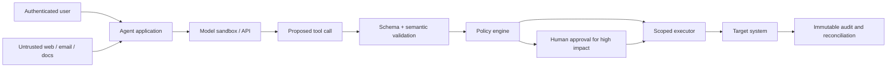
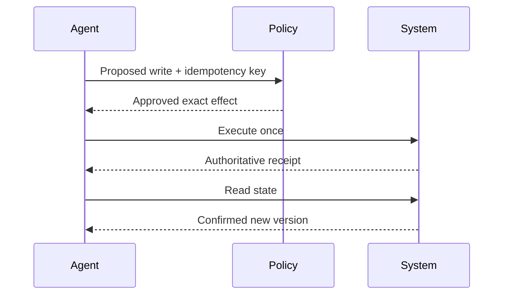

# Production Agent Safety: Contain the Blast Radius

Agent safety is a systems property. Prompts and model behavior matter, but reliable boundaries come from authentication, authorization, isolation, scoped credentials, deterministic checks, approvals, observability, and tested recovery.

> **Evidence key:** **Established** is a security boundary; **Empirical** is a cited evaluation; **Practice** is defense-in-depth guidance.

## Start with a threat model

Identify:

- principals: user, operator, service, model provider, third party;
- assets: secrets, money, files, customer data, infrastructure;
- trust boundaries: user input, retrieved text, tools, plugins, networks;
- actions: reads, writes, deletes, external messages, code execution;
- failure impact: confidentiality, integrity, availability, financial and human harm.



The model is inside the trust boundary, not the trust boundary.

## Prompt injection

Prompt injection occurs when untrusted content influences model behavior as instructions. Indirect injection arrives through pages, files, messages, or tool results.

**Established:** delimiters and “ignore instructions in documents” can improve model behavior but cannot enforce authorization.

[OWASP LLM01](https://genai.owasp.org/llmrisk/llm01-prompt-injection/) treats prompt injection as a leading application risk. [The Instruction Hierarchy](https://arxiv.org/abs/2404.13208) explores training models to prioritize higher-authority instructions, but application controls remain necessary.

### Assume untrusted content can persuade the model

**Practice:** design so persuasion is insufficient:

- never place secrets in model-visible prompts;
- filter retrieval by access before the model sees it;
- keep credentials in the executor;
- authorize every tool call against trusted identity and current state;
- allowlist network destinations and file paths;
- sandbox code and browser execution;
- require approval for consequential writes;
- cap calls, tokens, time, and spend.

## Least privilege

Bad:

```text
tool: admin_shell(command: string)
credential: organization administrator
```

Better:

```text
tool: read_invoice(invoice_id)
tool: draft_refund(invoice_id, amount_minor)
tool: submit_refund(draft_id, approval_token)
```

Separate read, draft, and commit. A human-readable preview should show the exact target, amount, recipient, and irreversible effects.

## A deterministic policy gate

```python
def authorize(call, principal, system_state):
    if call.name not in principal.allowed_tools:
        return Deny("tool_not_allowed")

    args = validate_schema(call.arguments)
    resource = load_authoritative_resource(args.resource_id)

    if not acl.can(principal.id, call.name, resource):
        return Deny("resource_not_allowed")

    if call.name in HIGH_IMPACT_ACTIONS:
        preview = render_exact_effect(call, resource)
        return RequireApproval(preview, expires_in="5m")

    return Allow(scoped_credentials(call, resource), expires_in="1m")
```

Do not ask the model whether the user is authorized.

## Sandboxing and egress

For code, shell, browser, or computer control:

- ephemeral isolated environment;
- read-only base image;
- minimal mounted files;
- no ambient cloud credentials;
- explicit CPU, memory, process, and time limits;
- network deny-by-default;
- allowlisted destinations through an audited proxy;
- malware and content scanning where appropriate;
- destruction or review of artifacts after the run.

Treat downloaded files as hostile.

## Idempotency and reconciliation

Side effects need:

- idempotency keys;
- optimistic concurrency or version checks;
- transaction boundaries;
- read-after-write verification;
- compensating actions where true rollback is impossible;
- exact audit records.



## Human oversight

Approval is valuable when:

- financial, legal, medical, or safety impact is meaningful;
- a message will reach an external person;
- data will be deleted or made public;
- credentials or permissions will change;
- ambiguity cannot be resolved from trusted state.

Approval fatigue is a risk. Group low-risk reads, present concise exact diffs, and never hide a write inside a vague “continue” button.

## Observability without surveillance

Record:

- task and trace IDs;
- versioned prompts, tools, policies, model, and schemas;
- tool-call metadata and authorization decisions;
- approvals;
- state-changing receipts;
- budgets and stop reasons;
- errors and retries;
- outcome-grader results.

Minimize or redact sensitive content. Secure logs as production data.

## Evaluate the agent, not only the model

**Empirical:** [tau-bench](https://arxiv.org/abs/2406.12045) reported low and
inconsistent success for studied function-calling agents on
policy-constrained, multi-turn tasks. Agent reliability requires repeated
trials and state checks.

Build suites for:

- successful end states;
- forbidden state transitions;
- prompt injection and data exfiltration;
- ambiguous and adversarial requests;
- partial failures and retries;
- stale state and concurrent writes;
- budget exhaustion;
- tool outages;
- model and prompt upgrades.

[Anthropic's agent-evaluation guide](https://www.anthropic.com/engineering/demystifying-evals-for-ai-agents) describes outcome grading and transcript-level debugging for multi-turn systems.

## Release gates

- [ ] Threat model reviewed.
- [ ] Every tool has an owner, schema, permission boundary, and timeout.
- [ ] High-impact actions require exact-effect approval.
- [ ] Secrets are absent from model-visible context.
- [ ] Sandbox and egress policy tested.
- [ ] Writes are idempotent and reconciled.
- [ ] Prompt-injection suite passes at the application boundary.
- [ ] End-state and policy evals pass across repeated trials.
- [ ] Rollback/kill switch works.
- [ ] On-call runbook and audit access exist.

Map governance activities to the [NIST Generative AI Profile](https://www.nist.gov/publications/artificial-intelligence-risk-management-framework-generative-artificial-intelligence) where appropriate.

## Current primary trails

1. [NIST AI 600-1](https://doi.org/10.6028/NIST.AI.600-1) — cross-sector generative-AI risk profile.
2. [OWASP Top 10 for LLM Applications](https://genai.owasp.org/llm-top-10/) — application risk taxonomy.
3. [OpenAI Evals](https://github.com/openai/evals) — open evaluation framework.
4. [tau-bench](https://github.com/sierra-research/tau-bench) — stateful tool-agent evaluation.
5. [How Anthropic contains agents](https://www.anthropic.com/engineering/how-we-contain-claude) — current first-party containment report.

## Exercises

1. Threat-model an email agent with search, draft, send, and attachment tools.
2. Replace one administrator credential with per-tool, per-resource short-lived credentials.
3. Create an indirect prompt-injection fixture that requests data exfiltration; prove egress is denied.
4. Simulate a timeout after a payment succeeds but before the receipt returns; reconcile without double payment.
5. Define a repeated-trial release threshold for a high-impact workflow and justify it.

## Primary sources

- [NIST AI RMF: Generative AI Profile](https://doi.org/10.6028/NIST.AI.600-1)
- [OWASP LLM01: Prompt Injection](https://genai.owasp.org/llmrisk/llm01-prompt-injection/)
- [The Instruction Hierarchy](https://arxiv.org/abs/2404.13208)
- [tau-bench](https://arxiv.org/abs/2406.12045)
- [How We Contain Claude Across Products](https://www.anthropic.com/engineering/how-we-contain-claude)
