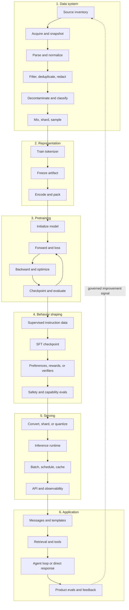
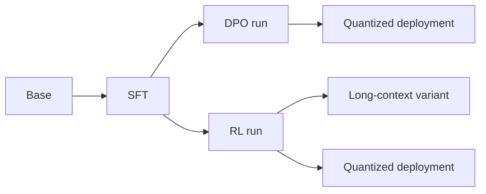

# The complete pipeline

**Level:** Foundation → Architect · **Time:** 60 minutes

An LLM release is the output of a versioned supply chain. You should be able to point from a generated token back to the serving configuration, checkpoint, training run, batch, tokenized record, processed document, and source policy that made it possible.

<figure markdown>
  { loading=lazy }
  <figcaption>An advanced visual summary. The diagram below separates the lifecycle into the exact stages and contracts used throughout this chapter.</figcaption>
</figure>

## The lifecycle at one glance



The arrows are contracts. Most costly failures occur when one stage silently violates the next stage's assumptions.

## Stage 1: source and curate

The durable artifact is not “a pile of JSON.” It is a manifest connecting each record to source, snapshot, transformations, policy, and version. A robust pipeline keeps raw acquisition separate from derived training shards so a policy change can be replayed.

Key outputs:

- source register and terms review;
- immutable or content-addressed raw snapshot references;
- parser and language/content classifiers;
- exact and near-duplicate clusters;
- sensitive-data and opt-out/takedown actions;
- evaluation decontamination decisions;
- mixture weights and sampling unit;
- quality statistics by slice, not only global totals.

## Stage 2: create the token protocol

Train candidate tokenizers on a documented sample, measure representation across the target mixture, then freeze vocabulary, merges/scores, normalization, and special IDs. Encode, concatenate, and pack documents with explicit boundary tokens and loss masks.

Packing can put several documents into one sequence. Decide whether attention may cross document boundaries and whether separator tokens contribute to loss. These are model-semantic choices, not storage details.

## Stage 3: pretrain

For decoder-only next-token prediction, each packed token sequence supplies shifted targets. A distributed run repeats:

```text
load -> forward -> loss -> backward -> reduce/partition gradients
     -> clip -> optimizer -> schedule -> metrics -> checkpoint
```

The exact global token batch is part of the optimization configuration. Parallelism changes where tensors live and communicate; it should preserve the intended model update within accepted numeric differences.

## Stage 4: shape behavior

Pretraining teaches broad sequence completion. Instruction data teaches an interaction format and desired responses. Preference objectives or reinforcement learning change relative behavior under chosen feedback. Safety work spans data, objectives, red teaming, policies, serving controls, and incident response; it is not one final filter.

Keep a **checkpoint graph** rather than overwriting “the model”:



Each edge should name its input data, code revision, configuration, and evaluations.

## Stage 5: turn weights into a service

Checkpoint conversion and quantization can change numerical behavior. Serving must manage:

- model shards and tensor/expert placement;
- request admission and fairness;
- prefill versus decode scheduling;
- KV-cache allocation and eviction;
- continuous batching;
- sampling and structured output;
- timeouts, cancellation, and backpressure;
- latency, throughput, memory, errors, and quality canaries.

Optimize **time to first token**, **inter-token latency**, **end-to-end latency**, and **tokens per second** separately. One number hides trade-offs.

## Stage 6: build the application contract

Applications decide what the model actually sees. Serialize trusted instructions, user data, retrieved documents, tool schemas, and observations with explicit precedence and boundaries. Validate model-proposed tool arguments before execution. Preserve provenance between generated claims and retrieved evidence where the product promises citations.

## A traceability record

```yaml
release: example-1b-instruct-v1
base_checkpoint: sha256:...
tokenizer: sha256:...
pretraining_run:
  code_commit: abc123
  config: configs/example-1b.yaml
  data_manifest: sha256:...
post_training:
  sft_manifest: sha256:...
  preference_manifest: sha256:...
evaluation:
  harness_commit: def456
  raw_results: evals/example-1b-v1/
serving:
  runtime_image: sha256:...
  quantization_recipe: none
```

This is illustrative. A real release also needs licenses, risk analysis, people and approval records, known limitations, hardware/software environment, and incident/takedown routes.

## System-level failure exercise

For each symptom, name at least three possible stages:

- multilingual requests cost twice as many tokens;
- a benchmark jumps after a corpus refresh;
- training loss spikes after resuming;
- one MoE device is saturated while others idle;
- citations look plausible but do not support answers;
- the same checkpoint behaves differently in two deployments.

The point is not to guess. It is to instrument the boundaries so the responsible stage can be identified.
