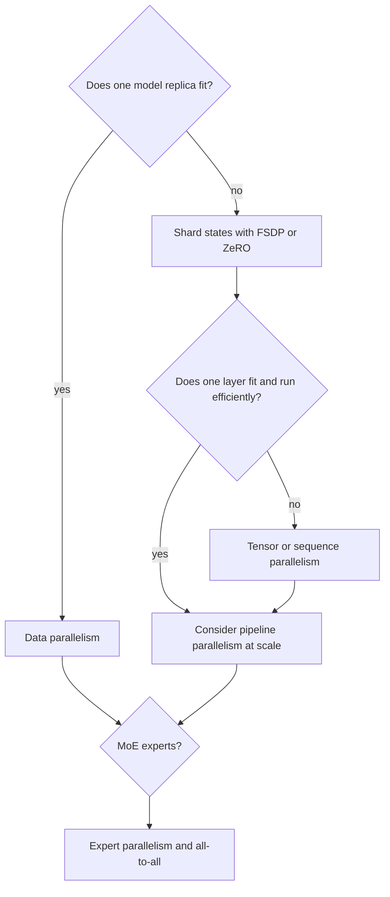

# Plan data and compute

**Level:** Engineer → Research · **Time:** 55 minutes

A training plan is a coupled budget across tokens, model operations, device memory, communication, storage, reliability, and evaluation. A single “GPU count” is not a plan.

## Token budget and mixture

Define the number of tokens **consumed by training**, then derive sampling weights from the intended mixture. If sources are sampled with replacement, a small high-weight source may repeat for many effective epochs while a large low-weight source is barely seen.

For source \(i\) with available tokens \(N_i\), mixture probability \(p_i\), and total consumed tokens \(N\), an approximate expected pass count is:

\[
\text{expected passes}_i\approx\frac{p_iN}{N_i}
\]

This simplification assumes token-level sampling and ignores packing, filters, and sampling implementation. Report the actual sampler contract.

## A first compute estimate

A commonly used back-of-the-envelope estimate for dense Transformer training is proportional to parameter count times training tokens:

\[
\text{training FLOPs}\approx6PN
\]

Here \(P\) is an appropriate active non-embedding parameter approximation and \(N\) is training tokens. The factor is a heuristic, not a hardware forecast: attention at long sequence length, embeddings, sparse routing, activation recomputation, optimizer, and implementation details matter.

Convert required operations to time only after applying an evidence-based model FLOP utilization:

\[
\text{time}\approx\frac{\text{required FLOPs}}{\text{devices}\times\text{peak FLOP/s}\times\text{utilization}}
\]

Peak vendor throughput is not sustained training throughput.

## Memory ledger

Budget separately:

| Category | Scales with | Possible controls |
|---|---|---|
| Weights | total resident parameters | sharding, lower precision, offload |
| Gradients | trainable parameters | sharding, lower precision |
| Optimizer states | parameters and optimizer | sharding, lower-state optimizers, offload |
| Activations | batch, sequence, width, layers | checkpointing, sequence parallelism |
| Attention temporaries | sequence and kernel | memory-efficient kernels |
| Communication buffers | parallel topology | bucket sizing, overlap, implementation |
| Fragmentation/runtime | allocator and workload | headroom, profiling |

Do not allocate 100% of nominal memory on paper. Recovery, evaluation, compilation, and occasional shape tails need headroom.

## Parallelism selection

Real meshes compose dimensions. The best topology depends on intra-node bandwidth, inter-node fabric, layer shapes, batch, sequence, experts, framework, and failure domain. Benchmark the intended configuration.

## Storage and network

Plan for:

- raw and processed data snapshots;
- tokenizer and manifests;
- training shards and indices;
- complete and lightweight checkpoints;
- optimizer state and RNG/data-loader state;
- logs and raw evaluation outputs;
- checkpoint upload bandwidth and retention;
- restoration drills, not only backups.

A checkpoint cadence is a reliability/economics decision. Lost compute from a failure grows with the interval; checkpoint overhead grows as the interval shrinks.

## Pilot ladder

1. **Unit:** shapes, masks, losses, serialization.
2. **One batch:** overfit and verify loss decreases.
3. **One device:** measure memory, throughput, data correctness.
4. **One node:** validate distributed equivalence and checkpoint resume.
5. **Few nodes:** measure communication, failure recovery, stragglers.
6. **Short scaled run:** validate slopes, stability, evaluations, and operations.
7. **Full run:** only after exit criteria are met.

Each rung should have explicit pass/fail thresholds.

## Training readiness review

- immutable configs and code revision captured;
- source and processed-data manifests signed off;
- tokenizer checksum and test vectors recorded;
- sample batches decoded and manually inspected;
- evaluation contamination and prompt versions documented;
- memory and throughput measured on target hardware;
- loss scale, gradient norm, and update norm dashboards tested;
- checkpoint resume including data position demonstrated;
- stop conditions, escalation, and ownership defined;
- cost and capacity buffer approved.

