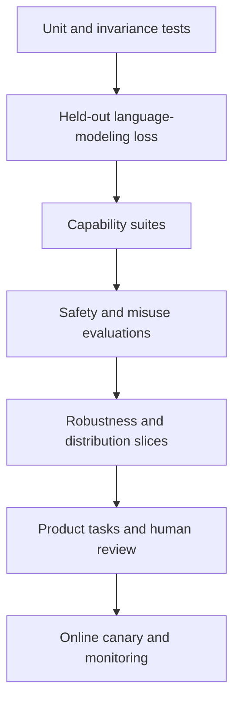

# Train, evaluate, and release

**Level:** Engineer · **Time:** 50 minutes

The finish line is not “loss stopped.” A trustworthy release connects training health, capability evidence, limitations, artifacts, licenses, and deployment behavior.

## During training

Monitor at several layers:

| Layer | Signals |
|---|---|
| Data | shard errors, source mix, token counts, sequence lengths, duplication |
| Numerics | loss, gradient norm, update norm, overflow, non-finite values |
| Model | validation loss by slice, router load, dropped tokens, activation statistics |
| System | tokens/s, utilization, memory, communication, data stalls, stragglers |
| Reliability | checkpoint duration, failed workers, retries, recovery point |

Global averages can hide one language, source, expert, rank, or node failing.

## Evaluate in layers

Record exact prompts, chat template, few-shot examples, decoding, parser, harness revision, model precision, and sample count. Benchmark names without these details are incomplete evidence.

## Contamination and memorization

Decontamination is not one string match. Use several methods appropriate to the benchmark:

- exact and normalized overlap;
- n-gram or suffix-array matching;
- near-duplicate/minhash search;
- source/date exclusion;
- canary or held-out private tests where lawful;
- sensitivity analysis that removes suspected items.

A non-match is not proof of no exposure; transformed, translated, or synthetic variants can evade matching. Report the method's detection limits.

## Checkpoint selection

Avoid selecting a checkpoint on the same metric later reported as unbiased evidence. Define selection rules in advance or use separate development and final sets. Preserve intermediate checkpoints when feasible; they help study learning dynamics and diagnose regressions.

## Release bundle

| Artifact | Minimum useful contents |
|---|---|
| Model card | intended use, architecture, training stages, limits, evaluations |
| Weights | format, precision, sharding, checksums, license |
| Tokenizer | complete versioned protocol and template |
| Code | model, training, conversion, inference, evaluation revisions |
| Data card | sources, processing, mixture, governance, exclusions |
| Config/logs | exact run config, curves, hardware/software context |
| Checkpoints | intermediate/final states and lineage where available |
| Safety report | evaluations, mitigations, residual risks, reporting path |
| Reproduction guide | commands, resource estimate, known deviations |

Publishing all rows is a high openness standard. If a row cannot be published, name the gap rather than letting “open model” imply it exists.

## Model conversion acceptance test

When moving between training and serving formats:

1. compare parameter names, shapes, and counts;
2. hash or sample-check tensors;
3. run fixed-token forward passes in both runtimes;
4. compare logits within a dtype-appropriate tolerance;
5. test cached and uncached decoding;
6. run task and safety smoke evaluations;
7. benchmark target hardware;
8. document expected numeric differences.

Quantization needs quality evaluation by slice, not only average perplexity.

## Deployment gates

- artifact and license approval;
- threat model and abuse cases;
- access, rate, and resource controls;
- tool sandbox and output validation if applicable;
- privacy, retention, and logging policy;
- rollback and model-version pinning;
- quality/safety canaries and incident ownership;
- clear user-facing limitation and provenance behavior.

## Release exercise

Choose an open checkpoint. Build a component ledger with evidence links for weights, architecture, pretraining code, exact data, data processing, tokenizer, optimizer state, intermediate checkpoints, logs, post-training, and evaluation. Mark each **available**, **partially documented**, **not published**, or **unknown**. Do not collapse the result into one adjective.

