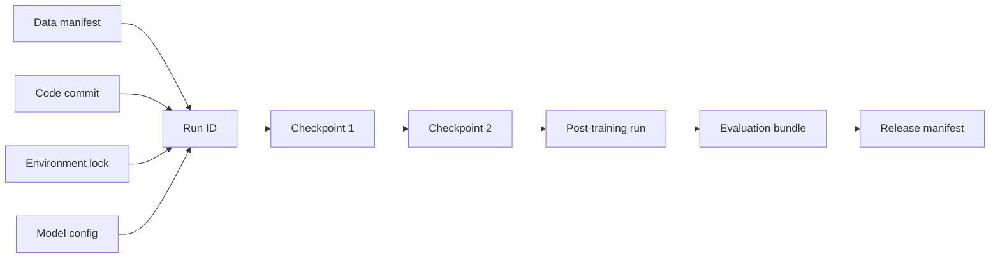

# Reproducibility blueprint

**Level:** Research · **Time:** 45 minutes

Reproducibility exists on a ladder. State which rung you are claiming.

## The ladder

1. **Inspectable:** architecture, code, and artifacts can be studied.
2. **Runnable:** inference or training code executes in a documented environment.
3. **Repeatable:** the original team can recreate the result from preserved state.
4. **Reproducible:** an independent team can produce materially consistent results from published materials.
5. **Replicable finding:** independent implementations and data support the scientific conclusion.

Bitwise-identical weights are not always feasible or necessary for a scientific reproduction, but unexplained configuration gaps make even material consistency hard.

## Repository blueprint

```text
project/
├── README.md
├── LICENSES/
├── environment/
│   ├── container.lock
│   └── hardware.md
├── data/
│   ├── sources.yaml
│   ├── processing.yaml
│   ├── mixture.yaml
│   ├── manifests/
│   └── README.md
├── tokenizer/
│   ├── config.json
│   ├── artifact files
│   └── tests.jsonl
├── model/
│   ├── config.yaml
│   └── parameter-count.py
├── training/
│   ├── run.yaml
│   ├── launch.py
│   └── resume-test.md
├── checkpoints/
│   └── manifest.json
├── post_training/
├── evaluations/
│   ├── harness.lock
│   ├── prompts/
│   └── raw_results/
└── reports/
    ├── model-card.md
    ├── data-card.md
    └── safety-report.md
```

## Manifest everything that can drift

Use content hashes for immutable files and version identifiers for external systems. A data manifest should include record/shard checksums and transformation versions. A checkpoint manifest should include model, optimizer, scheduler, RNG, data progress, and parent lineage.



## Determinism budget

Decide the required tolerance:

- tokenizer: normally exact IDs;
- data pipeline: exact retained records and order when claimed;
- single-step model test: tight dtype-appropriate numeric tolerance;
- distributed training: trajectory or final-metric tolerance if reductions are nondeterministic;
- evaluation: exact examples and parsing, confidence intervals for sampled outputs or human judgments.

Record every permitted deviation.

## Minimal independent reproduction report

```yaml
claim: "configuration X improves held-out loss over baseline Y"
original_reference: paper-or-report
reproducer: independent-team
code_revision: ...
data_manifest: ...
hardware: ...
deviations:
  - smaller token budget
  - different accelerator generation
result:
  point_estimate: ...
  uncertainty: ...
  training_curves: ...
interpretation: supported | mixed | not_supported
artifacts: ...
```

## Case-study projects

- [OLMo 3](https://allenai.org/blog/olmo3) publishes a staged model flow and describes an open data curriculum; official training scripts live in [OLMo-core](https://github.com/allenai/OLMo-core). Verify the precise artifact and license needed for each stage.
- [Pythia](https://github.com/EleutherAI/pythia) was designed for learning-dynamics research with many intermediate checkpoints, controlled data order, code, and reconstruction instructions.
- [BLOOM](https://huggingface.co/bigscience/bloom) documents a multilingual collaborative training run, data cards, training code trails, and intermediate artifacts under its stated license.

These projects optimize different notions of openness and reproducibility. Study their artifact graphs rather than ranking them with a single label.

## Final audit

Hand the repository to someone who did not build it. Can they answer:

1. exactly what to run;
2. exactly what data and tokenizer are consumed;
3. what resources are required;
4. how a resumed run preserves state;
5. how the result is evaluated;
6. which differences are expected;
7. which artifacts and rights are unavailable?

If not, the missing answer is part of the engineering backlog.

